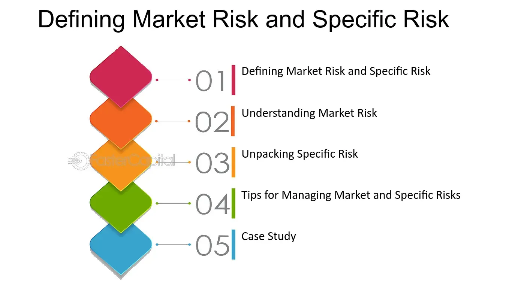

## Table of Contents

## What is market risk?

Market risk is the chance that the value of your investments can go down because of things happening in the overall market. This can include events like economic downturns, political changes, or natural disasters that affect many companies and industries at the same time. When the market goes down, the prices of stocks, bonds, and other investments can drop, which means you might lose money.

There are different types of market risk, but one common type is called systematic risk. This is the risk that affects the entire market and cannot be avoided by diversifying your investments. For example, if there's a global financial crisis, it's likely that most investments will be affected, no matter how well you've spread them out. Understanding market risk is important because it helps you make better decisions about where to put your money and how much risk you're willing to take.

## What is specific risk?

Specific risk, also known as unsystematic risk, is the risk that affects only a single company or a small group of companies. It comes from things that are unique to that company or industry, like a new competitor entering the market, a product recall, or a change in management. These events can cause the stock price of the affected company to go up or down, but they don't usually impact the overall market.

You can reduce specific risk by diversifying your investments. This means spreading your money across different companies and industries. If one company does poorly, the impact on your overall portfolio will be smaller because other investments might be doing well. Unlike market risk, which you can't avoid, specific risk can be managed through careful investment choices.

## How do market risk and specific risk differ?

Market risk and specific risk are two types of risks that can affect your investments, but they are different in important ways. Market risk, also called systematic risk, is the risk that comes from things happening in the whole market or economy. This could be things like a recession, a big political change, or a natural disaster. When these things happen, they can cause the prices of many different investments to go down at the same time. You can't get rid of market risk completely, no matter how you spread out your investments.

On the other hand, specific risk, also known as unsystematic risk, is the risk that only affects a single company or a small group of companies. This could be because of something like a new competitor, a product problem, or a change in the company's leadership. When these things happen, they usually only affect the stock price of the company involved and don't change the overall market. The good news is that you can lower specific risk by diversifying your investments, which means putting your money into different companies and industries.

## Can you provide examples of market risk?

Market risk can come from many different places. One example is when the whole economy goes into a recession. During a recession, people lose their jobs, and they don't spend as much money. This can make the prices of stocks and other investments go down because companies are not making as much money. Another example is when there's a big change in interest rates. If the government raises interest rates, it can make it more expensive for companies to borrow money. This can slow down the economy and cause investment prices to drop.

Another kind of market risk happens when there's a big political change or event. For example, if a country votes to leave a big economic union like the European Union, it can cause a lot of uncertainty. People might not know what will happen to trade and laws, so they might sell their investments, which can make prices go down. Natural disasters can also cause market risk. If a hurricane or earthquake hits a big area, it can damage businesses and slow down the economy. This can lead to lower stock prices and other investment losses.

## Can you provide examples of specific risk?

Specific risk can happen when something bad happens to just one company. For example, if a car company finds out that some of their cars have a dangerous problem, they might have to call back all those cars. This can cost them a lot of money and make people not want to buy their cars anymore. Their stock price could go down because of this, but it wouldn't affect other companies that make different things.

Another example of specific risk is when a company loses its CEO suddenly. If the CEO was really good at their job and helped the company grow, people might worry about what will happen next. They might sell their shares in the company, which can make the stock price go down. But again, this problem is just for that one company and doesn't affect the whole market.

## How can an investor measure market risk?

An investor can measure market risk by using something called beta. Beta is a number that shows how much a stock or a portfolio moves compared to the whole market. If a stock has a beta of 1, it means it moves the same way as the market. If the beta is more than 1, like 1.5, the stock will go up or down more than the market. If the beta is less than 1, like 0.5, the stock will move less than the market. This helps investors see how sensitive their investments are to market changes.

Another way to measure market risk is by looking at the volatility of the market. Volatility means how much the prices of investments go up and down. You can use something called the standard deviation to measure this. A higher standard deviation means the market is moving a lot, which means more risk. By looking at the standard deviation of the market or a specific investment, investors can get a sense of how much risk they are taking on. Both beta and standard deviation give investors tools to understand and manage market risk.

## How can an investor measure specific risk?

To measure specific risk, investors often look at how much a single stock or a small group of stocks moves compared to the overall market. One way to do this is by using something called the standard deviation of the stock's returns. Standard deviation tells you how much the stock's price goes up and down. If a stock has a high standard deviation, it means it's moving a lot and has more specific risk. By comparing the standard deviation of a stock to the market's standard deviation, investors can see how much extra risk they're taking on with that stock.

Another way to measure specific risk is by using a tool called the alpha. Alpha measures how well a stock is doing compared to what you would expect based on the market's performance. If a stock has a positive alpha, it means it's doing better than expected, which could mean it has less specific risk. If a stock has a negative alpha, it's doing worse than expected, which could mean it has more specific risk. By looking at alpha, investors can get a better idea of the specific risks tied to a particular stock.

## What strategies can be used to mitigate market risk?

One way to lower market risk is by spreading your money across different types of investments. This is called diversification. If you put all your money in one type of investment, like stocks, and the stock market goes down, you could lose a lot. But if you also put money in bonds, real estate, or cash, those other investments might not go down as much or might even go up. This can help balance out your losses and protect your money from big swings in the market.

Another strategy is to use something called hedging. Hedging is like buying insurance for your investments. You can use financial tools like options or futures to protect against big drops in the market. For example, if you think the market might go down, you can buy a put option that lets you sell your stocks at a set price, even if the market price falls lower. This can help limit your losses if the market does go down. Hedging can be a bit complicated, but it's a way to manage market risk if you know how to use it right.

## What strategies can be used to mitigate specific risk?

One way to lower specific risk is by spreading your money across different companies and industries. This is called diversification. If you only invest in one company and something bad happens to it, you could lose a lot of money. But if you invest in many different companies, the bad news for one company won't hurt your whole investment. For example, if you have money in both a tech company and a food company, and the tech company has a problem, your food company investment might still do well. This helps balance out your risks.

Another strategy is to do a lot of research before you invest in a company. By understanding the company's business, its competition, and any possible problems it might face, you can make better choices. If you know about a company's risks, you can decide if it's worth investing in or if you should look for a safer option. Keeping up with news and changes in the company can also help you react quickly if something goes wrong. This way, you can sell your investment before it loses too much value.

## How do market risk and specific risk impact portfolio diversification?

Market risk and specific risk both play a big role in how you should spread out your investments, which is called portfolio diversification. Market risk, or systematic risk, is the kind of risk that affects the whole market. No matter how much you diversify, you can't get rid of market risk completely. But by investing in different types of assets, like stocks, bonds, and real estate, you can lower the impact of market risk on your portfolio. If the stock market goes down, your bonds or real estate might not go down as much, which can help protect your money.

Specific risk, or unsystematic risk, is the kind of risk that only affects one company or a small group of companies. This is the type of risk that you can lower a lot by diversifying your portfolio. If you spread your money across many different companies and industries, a problem with one company won't hurt your whole investment. For example, if you have money in both a car company and a food company, and the car company has a big problem, your food company investment might still be doing well. This way, you can protect your portfolio from the ups and downs of any single company.

## What role do market and specific risks play in asset pricing models like CAPM?

Market risk and specific risk are important parts of asset pricing models like the Capital Asset Pricing Model (CAPM). CAPM helps investors figure out what return they should expect from an investment based on its risk. In CAPM, market risk is the main focus because it's the risk that you can't get rid of by spreading out your investments. This kind of risk is measured by something called beta, which shows how much an investment moves with the market. If a stock has a high beta, it means it's more sensitive to market changes, so investors will want a higher return to take on that extra risk.

Specific risk, on the other hand, is the risk that only affects a single company or a small group of companies. In CAPM, specific risk is not as important because it can be reduced by diversifying your investments. The model assumes that investors can spread their money across many different stocks to lower the impact of specific risk. So, when using CAPM, the expected return of an investment is mostly based on its market risk, not its specific risk. This helps investors make better decisions about which investments to choose based on the risks they are willing to take.

## How do advanced financial instruments like derivatives help in managing market and specific risks?

Advanced financial instruments like derivatives can help manage market risk by allowing investors to hedge against big changes in the market. A common type of derivative used for this is an option. For example, if an investor thinks the stock market might go down, they can buy a put option. This gives them the right to sell a stock at a set price, even if the market price drops lower. By doing this, they can limit their losses if the market does go down. Another type of derivative is a futures contract, which can be used to lock in prices for commodities or other assets, helping investors protect themselves from market swings.

Derivatives can also help manage specific risk by allowing investors to protect against problems that might affect just one company or industry. For example, if an investor owns a lot of stock in a car company and is worried about a possible recall, they can buy a put option on that company's stock. This would let them sell the stock at a set price if the recall happens and the stock price drops. By using derivatives in this way, investors can reduce the impact of specific risks on their portfolios. While derivatives can be complex, they offer powerful tools for managing both market and specific risks.

## References & Further Reading

[1]: [Lopez de Prado, M. (2018). "Advances in Financial Machine Learning."](https://www.amazon.com/Advances-Financial-Machine-Learning-Marcos/dp/1119482089) Wiley.

[2]: [Markowitz, H. (1952). "Portfolio Selection."](https://onlinelibrary.wiley.com/doi/abs/10.1111/j.1540-6261.1952.tb01525.x) The Journal of Finance, 7(1), 77-91.

[3]: Chan, E. P. (2009). [Quantitative Trading: How to Build Your Own Algorithmic Trading Business.](https://github.com/ftvision/quant_trading_echan_book) Wiley.

[4]: [Cartea, Á., Jaimungal, S., & Penalva, J. (2015). "Algorithmic and High-Frequency Trading."](https://assets.cambridge.org/97811070/91146/frontmatter/9781107091146_frontmatter.pdf) Cambridge University Press.

[5]: [Hull, J. (2017). "Options, Futures, and Other Derivatives."](https://books.google.com/books/about/Options_Futures_and_Other_Derivatives.html?id=yfr0DQAAQBAJ) Pearson.

[6]: [Narang, R. K. (2009). "Inside the Black Box: The Simple Truth About Quantitative Trading."](https://onlinelibrary.wiley.com/doi/book/10.1002/9781118267738) Wiley.

[7]: Aronson, D. R. (2006). [Evidence-Based Technical Analysis: Applying the Scientific Method and Statistical Inference to Trading Signals.](https://onlinelibrary.wiley.com/doi/book/10.1002/9781118268315) Wiley.