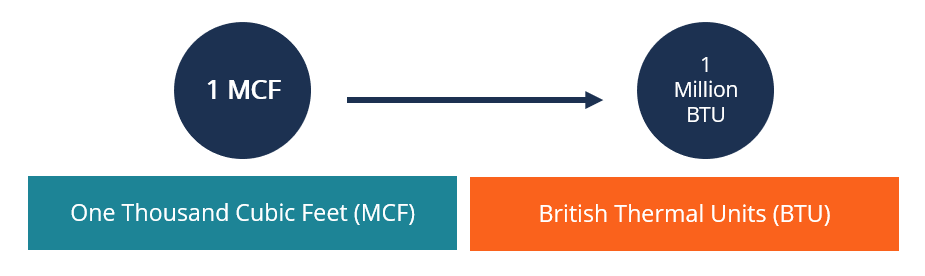

## Table of Contents

## What is MCF in natural gas measurement?

MCF stands for "thousand cubic feet" and is a unit used to measure the volume of natural gas. It is a common way to express the amount of gas that is produced, sold, or consumed. For example, if a household uses 2 MCF of natural gas in a month, it means they used 2,000 cubic feet of gas.

Using MCF helps make large numbers easier to understand and work with. Instead of dealing with thousands of cubic feet, people in the gas industry can simply talk about MCFs. This unit is especially useful in contracts, billing, and reports where the volume of natural gas needs to be clearly communicated.

## What is MCM in natural gas measurement?

MCM stands for "thousand cubic meters" and is another unit used to measure the volume of natural gas. It is similar to MCF but uses the metric system instead. One MCM is equal to 1,000 cubic meters of natural gas. This unit is often used in countries that use the metric system, making it easier for them to understand and work with gas volumes.

Using MCM helps to simplify large numbers when talking about natural gas. For example, if a factory uses 5 MCM of gas in a month, it means they used 5,000 cubic meters. This unit is helpful in contracts, reports, and when discussing the amount of gas that is produced, bought, or sold. It makes it easier to communicate clearly about gas volumes.

## How are MCF and MCM units defined?

MCF stands for "thousand cubic feet." It is a way to measure how much natural gas there is. One MCF is the same as 1,000 cubic feet of gas. People in the gas business use MCF because it makes big numbers easier to talk about. For example, if someone says they used 3 MCF of gas, it means they used 3,000 cubic feet.

MCM stands for "thousand cubic meters." It is another way to measure the [volume](/wiki/volume-trading-strategy) of natural gas, but it uses the metric system. One MCM equals 1,000 cubic meters of gas. This unit is helpful in places that use the metric system. It makes it simple to understand and work with gas amounts. For instance, if a report says a company used 4 MCM of gas, it means they used 4,000 cubic meters.

## What is the conversion factor between MCF and MCM?

To convert MCF to MCM, you need to know how many cubic feet are in a cubic meter. One cubic meter is equal to about 35.315 cubic feet. So, to find out how many MCM are in one MCF, you divide 1,000 cubic feet by 35.315 cubic feet per cubic meter. This gives you about 0.0283 MCM per MCF.

To convert MCM to MCF, you do the opposite. You multiply the number of MCM by 35.315 to get the number of cubic feet, and then divide by 1,000 to get MCF. For example, 1 MCM is equal to 35,315 cubic feet, which is about 35.315 MCF. These conversion factors help people in the gas industry to switch between these units easily.

## Why are MCF and MCM important in the natural gas industry?

MCF and MCM are important in the natural gas industry because they help people talk about big amounts of gas in a simpler way. Instead of saying thousands or millions of cubic feet or cubic meters, they can just say MCF or MCM. This makes it easier for everyone to understand how much gas is being produced, bought, sold, or used. It's like using a nickname for a big number, making it easier to work with and talk about.

These units are used a lot in contracts, bills, and reports. When companies agree to buy or sell gas, they use MCF or MCM to make sure everyone knows exactly how much gas is involved. Also, when people get their gas bills, seeing the amount in MCF or MCM helps them understand their usage better. Reports about gas production or consumption often use these units too, making the information clear and easy to compare.

## In what contexts is MCF typically used?

MCF is often used in the United States where people measure things in feet instead of meters. It's a common way to talk about how much natural gas is produced from wells, how much is sold to customers, and how much is used by homes and businesses. When a gas company makes a deal to sell gas, they might say they are selling 100 MCF, which means 100,000 cubic feet of gas. This helps everyone understand the amount of gas without using big, hard-to-understand numbers.

MCF is also used in billing and reporting. When people get their gas bills, they might see their usage in MCF. This makes it easier for them to see how much gas they used in a month or a year. Reports about how much gas is produced in different areas or how much is used by different industries often use MCF too. This helps make the information clear and easy to compare, whether it's for a small home or a big factory.

## In what contexts is MCM typically used?

MCM is often used in countries that use the metric system, like Europe and many other places around the world. It helps people talk about how much natural gas is being produced, bought, or used without using big, hard-to-understand numbers. For example, if a country produces 50 MCM of gas each day, it means they produce 50,000 cubic meters. This makes it easier for everyone to understand the amount of gas involved in contracts, sales, and reports.

MCM is also used in billing and reports. When people get their gas bills in countries using the metric system, they might see their usage in MCM. This helps them see how much gas they used in a month or a year in a simple way. Reports about gas production or how much gas different industries use often use MCM too. This makes the information clear and easy to compare, whether it's for a small home or a big factory.

## How do MCF and MCM affect billing and pricing in the natural gas market?

MCF and MCM help make gas bills and pricing easier to understand. When gas companies send out bills, they use MCF or MCM to show how much gas someone used. This makes it simple for people to see if they used more or less gas than before. It's also easier for companies to set prices based on these units. For example, they might charge a certain amount for each MCF or MCM of gas. This way, everyone knows exactly how much they are paying for the gas they use.

In the natural gas market, MCF and MCM are important for setting prices between buyers and sellers. When gas companies make deals to buy or sell gas, they use these units to agree on how much gas is involved. This helps keep things clear and fair. For example, if a company agrees to buy 100 MCF of gas, they know exactly how much they are getting and can plan their costs. Using MCF or MCM makes it easier to compare prices and understand how much gas costs, no matter where you are or what unit you use.

## What are the common measurement errors associated with MCF and MCM?

When people measure natural gas using MCF and MCM, they can sometimes make mistakes. One common error is not reading the gas meters correctly. Gas meters measure how much gas is used, and if someone reads the numbers wrong, the MCF or MCM numbers will be off. Another mistake can happen when converting between MCF and MCM. If the wrong conversion [factor](/wiki/factor-investing) is used, like using 35 instead of 35.315, the numbers will not be right. These errors can lead to bills that are too high or too low, causing problems for both the gas company and the customers.

Another type of error comes from equipment issues. Sometimes, the gas meters or other tools used to measure gas can break or not work properly. If a meter is not working right, it might show more or less gas than is actually being used. This can make the MCF or MCM numbers wrong. Also, if the gas is not measured at the right temperature and pressure, the numbers can be off. Natural gas changes volume with temperature and pressure, so if these are not taken into account, the MCF or MCM measurements will be incorrect. Keeping equipment in good shape and using the right conditions for measuring can help avoid these errors.

## How can one ensure accurate measurement when using MCF and MCM?

To make sure MCF and MCM measurements are right, it's important to read the gas meters carefully. If you're the one reading the meter, take your time and double-check the numbers. Gas companies should also check their meters often to make sure they're working correctly. If a meter is broken or not working right, it can show the wrong amount of gas, which means the MCF or MCM numbers will be off. Using the right conversion factor is also key. Remember, one cubic meter is about 35.315 cubic feet, so when you change MCF to MCM or the other way around, use that number to get the right answer.

Another way to keep measurements accurate is to make sure the gas is measured at the right temperature and pressure. Gas changes its size with temperature and pressure, so if you don't take these into account, your MCF or MCM numbers won't be correct. Gas companies should use tools that can adjust for these changes. Also, keeping the measuring equipment in good shape is really important. Regular checks and maintenance can stop small problems from turning into big ones that mess up the MCF and MCM numbers. By doing these things, you can help make sure the measurements are as accurate as possible.

## What are the international standards for using MCF and MCM in natural gas measurement?

When it comes to measuring natural gas with MCF and MCM, there are international standards that help everyone use the same rules. These standards make sure that no matter where you are in the world, you can trust the numbers you see. Groups like the International Organization for Standardization (ISO) and the American Gas Association (AGA) set these rules. They tell people how to read gas meters the right way, how to change MCF to MCM and back, and how to keep the measuring equipment working well. Following these standards helps gas companies and customers know they're getting accurate information.

These standards also talk about how to deal with things like temperature and pressure, which can change how much gas you think you have. They say you should measure gas at a standard temperature and pressure so everyone's numbers match up. This is important because gas can get bigger or smaller depending on these conditions. By using these international rules, gas companies around the world can talk to each other easily and make sure their MCF and MCM numbers are right. This helps keep the natural gas market fair and clear for everyone.

## How do advancements in technology impact the use of MCF and MCM in natural gas measurement?

New technology is making it easier to measure natural gas in MCF and MCM. Smart meters are a big help. They can send gas usage numbers right to the gas company without anyone having to read the meter by hand. This makes the MCF and MCM numbers more accurate because there's less chance of making a mistake when reading the meter. Also, new tools can check the temperature and pressure of the gas better. This means the MCF and MCM numbers can be adjusted to be right even when the weather changes or the gas is under different pressures.

These new technologies also help with keeping the equipment working well. Sensors can watch the meters all the time and let people know if something is wrong. This way, the gas company can fix problems before they mess up the MCF and MCM numbers. Plus, computers can do the math to change MCF to MCM and back really fast and without mistakes. This makes it easier for gas companies to keep track of how much gas they're selling and for customers to understand their bills. With all these improvements, using MCF and MCM to measure natural gas is getting more accurate and easier for everyone.

## References & Further Reading

[1]: ["Natural Gas Industry: Production, Consumption, Reserves, Prices, and Trade."](https://www.eia.gov/naturalgas/data.php) U.S. Energy Information Administration.

[2]: Zówczak, W. (2020). ["Natural Gas Measurement Technology."](https://www.sciencedirect.com/science/article/pii/S235285402030067X) in Journal of Natural Gas Science and Engineering.

[3]: Katz, E. Y. (2019). ["Trading and Exchanges: Market Microstructure for Practitioners"](https://academic.oup.com/book/52292) by Larry Harris.

[4]: ["Handbook of Natural Gas Transmission and Processing."](https://www.sciencedirect.com/book/9780750677769/handbook-of-natural-gas-transmission-and-processing) by Saeid Mokhatab et al.

[5]: Aldridge, I. (2013). ["High-Frequency Trading: A Practical Guide to Algorithmic Strategies and Trading Systems."](https://books.google.com/books/about/High_Frequency_Trading.html?id=6l0DDQAAQBAJ) 

[6]: ["International Energy Agency – Natural Gas Information."](https://www.iea.org/data-and-statistics/data-product/natural-gas-information) International Energy Agency.