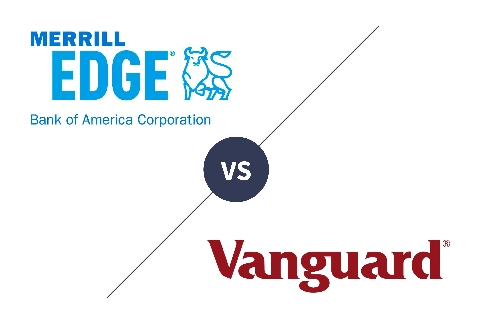

The world of investment presents a myriad of opportunities, with platforms like Merrill Edge and Vanguard offering tailored solutions to meet diverse investor needs. These platforms, renowned for their brokerage services, provide distinct features and cater to varying levels of expertise and preferences among investors. The significance of understanding the differences between Merrill Edge and Vanguard cannot be overstated, particularly for investors considering algorithmic trading as part of their strategy. Both platforms possess unique characteristics that can impact an investor's decision-making process, from usability and trade experience to costs and technological capabilities.

This article aims to offer a detailed comparison of Merrill Edge and Vanguard, focusing on elements critical to algorithmic trading, such as their user interface, trading experience, costs, research tools, and mobile capabilities. By highlighting these aspects, investors will be better equipped to align their platform choice with their trading preferences and strategies, ensuring an optimized investment experience.

## Table of Contents

## Background of Merrill Edge and Vanguard

Merrill Edge was launched in 2010 as part of a strategic initiative by Bank of America to expand its financial services and enhance its digital offerings. As an online brokerage platform, Merrill Edge is seamlessly integrated with Bank of America's banking services, providing clients with a unified financial experience. This integration allows users to easily manage their investments alongside their banking products, streamlining financial operations for account holders. 

Vanguard was established in 1983 and has since built a reputation as a leader in mutual funds and low-cost investment products. Unlike Merrill Edge's focus on integration with a broader suite of banking services, Vanguard has carved out a niche by serving buy-and-hold investors, who prioritize long-term growth and cost efficiency. Vanguard's investment philosophy centers on maximizing investor returns by minimizing investment costs, which is evident in its offering of low-expense ratio funds and ETFs.

While both Merrill Edge and Vanguard target a similar demographic, namely individual investors seeking to manage their portfolios with or without guidance, the platforms offer distinct experiences and tools tailored to different investment strategies. Merrill Edge caters more to investors who appreciate advanced trading technologies and real-time market engagement, thanks to its comprehensive suite of tools. In contrast, Vanguard is more suited for those committed to passive investment strategies, valuing the steady accumulation of wealth over time through minimal expenditures on fees and fund management costs.

## Usability and User Experience

Merrill Edge provides a streamlined user interface that significantly enhances the trading experience, particularly for users who are existing Bank of America customers. This integration allows for seamless transitions between banking and investment accounts, uncomplicated fund transfers, and one-stop financial management. The platform's intuitive design supports swift navigation and efficient execution of trades, which makes it ideal for active traders seeking an expedient setup process. Its tools are directly accessible and easy to understand, which helps beginners and experienced traders alike effectively manage their portfolios.

In contrast, Vanguard's onboarding procedure tends to be more time-consuming. This approach primarily benefits those interested in comprehensive portfolio management and long-term investment strategies, providing thorough guidance and support in setting up investment accounts. Although this detailed process ensures a deep understanding of investment options, it may come across as cumbersome for users eager to start trading quickly or those who prefer a more straightforward setup.

While both platforms cater to different investor needs, Merrill Edge stands out for its user-friendly interface tailored for active market participants. The platform's focus on delivering efficient tools aligns with the preferences of traders who prioritize speed and ease of use, enabling swift adaptation to market changes. Consequently, for investors aiming for a smoother and more dynamic trading experience, Merrill Edge offers a significant edge over Vanguard.

## Trading Experience

Merrill Edge boasts a powerful trading platform known as MarketPro, designed to cater to the needs of active traders seeking real-time data and robust trading functionalities. MarketPro delivers real-time streaming quotes, giving traders the advantage of accessing instantaneous market updates vital for time-sensitive trading strategies. The platform supports multiple order capabilities, allowing for complex and strategic order placements which are essential for capturing market opportunities swiftly.

In contrast, Vanguard's trading platform offers a more straightforward approach, which aligns with its focus on long-term investment strategies rather than active, high-frequency trading. Vanguard provides delayed quotes, which, while adequate for buy-and-hold investors, may not meet the demands of active traders who require immediate data for decision-making. The platform's simplicity facilitates ease of use for investors primarily concerned with wealth accumulation over extended periods, rather than exploiting short-term market movements.

For investors interested in algorithmic or active trading strategies, Merrill Edge presents a more comprehensive suite of tools. The combination of MarketPro’s advanced functionalities and real-time data equips traders with the necessary technology to pursue algorithm-based strategies effectively. This includes the capability to implement [quantitative trading](/wiki/quantitative-trading) strategies which depend on real-time data input to execute trades based on predefined algorithms, thus adjusting to market conditions dynamically for optimized trade outcomes. Maverick investors with a propensity for active market engagement will find Merrill Edge's offerings superior in fulfilling these needs.

## Costs and Fees

Both Merrill Edge and Vanguard offer commission-free trading for stocks and exchange-traded funds (ETFs), a feature that has become standard in the brokerage industry. This benefit allows investors to execute trades without incurring additional costs, supporting more frequent trading strategies or cost-effective portfolio management.

In terms of options trading, Merrill Edge proves to be more cost-effective with a charge of $0.65 per options contract. In contrast, Vanguard imposes a higher fee of $1 per options contract. This difference makes Merrill Edge a more attractive choice for investors pursuing options trading, particularly those who engage in high-frequency trading or seek to minimize transaction costs.

While Merrill Edge offers competitive pricing for options traders, Vanguard places a strong emphasis on providing low-cost investment funds, such as mutual funds and ETFs. Vanguard has long been recognized for its cost-efficient investment products, which often feature some of the lowest management expense ratios (MERs) in the industry. This focus benefits passive investors who prioritize accumulating assets over the long term while minimizing overall investment costs.

In summary, the cost structures of Merrill Edge and Vanguard reflect their core focuses: Merrill Edge on active and options trading with competitive contract fees, and Vanguard on cost-efficient fund options appealing to passive investors. The choice between these platforms should consider the investor’s trading preferences and strategies.

## Research and Educational Resources

Merrill Edge and Vanguard both provide a wealth of research and educational resources for their users, catering to different types of investors. Merrill Edge stands out for its proprietary research tools, which are integrated into its platform to assist investors in making informed decisions. The platform offers a comprehensive range of market analysis tools, expert insights, and in-depth research reports that cover various asset classes and securities. These resources are designed to be accessible for all levels of investors, from beginners to experienced traders, ensuring that users can find the information they need to support their trading strategies.

In contrast, Vanguard places a greater emphasis on educational content aimed at long-term investment planning and retirement preparation. Vanguard's resources include comprehensive guides on retirement planning, investment strategies, and fund selection. The platform is particularly beneficial for investors who prioritize low-cost funds and long-term, buy-and-hold strategies. Vanguard’s educational approach aligns with its reputation for serving buy-and-hold investors who are less focused on short-term market movements.

For those seeking detailed market analysis and the latest trading insights, Merrill Edge offers a superior experience. Its proprietary research tools provide real-time data, market forecasts, and expert analysis, which are particularly beneficial for active traders and those interested in [algorithmic trading](/wiki/algorithmic-trading). The ability to access actionable insights directly from the trading platform enhances the user experience and aids in quick decision-making.

In summary, while both Merrill Edge and Vanguard provide valuable resources, the choice between them depends on the investor's focus. Merrill Edge is advantageous for those who need advanced market analysis and comprehensive educational content, whereas Vanguard's resources are optimal for investors interested in long-term financial planning and retirement strategies.

## Trading Technology

Merrill Edge, integrated with Bank of America's advanced financial services, leverages sophisticated technology to enhance trading efficiency, particularly through its smart order routing system. This system is designed to automatically route orders to different market centers for execution, optimizing various factors such as speed and price improvement. The goal of this technology is to reduce latency and improve execution quality, thereby offering a competitive advantage to investors who require precise and swift trade execution.

Smart order routing at Merrill Edge is engineered to ensure that trades are filled at the best possible prices, while minimizing slippage and capturing price improvements when market conditions allow. This system can adaptively select execution venues based on real-time analysis of [liquidity](/wiki/liquidity-risk-premium) and potential price impacts, thus integrating multiple data streams and endpoints to enhance decision-making.

Vanguard, on the other hand, is characterized by its basic trading technology, primarily focusing on delivering stable and reliable order executions without the same level of algorithmic complexity or agility. While suitable for long-term investors who prioritize holding strategy over frequent trading, Vanguard's platform does not emphasize the high-speed, technologically driven executions that active traders might seek.

For traders who prioritize speed and advanced technology in their trading strategies, Merrill Edge represents a more compelling choice due to its integration of smart order routing technology and the capability to handle complex trade orders efficiently. This capability is particularly advantageous for investors engaged in algorithmic trading or those who wish to capitalize on market fluctuations with minimal delay.

In conclusion, while both Merrill Edge and Vanguard have their strengths, the robustness of Merrill Edge’s trading technology makes it the preferred platform for technology-driven and speed-sensitive trading strategies. Investors should carefully consider how these technological differences align with their personal trading needs and objectives.

## Mobile Platform Capabilities

Merrill Edge's mobile platform stands out for its comprehensive functionality and user-centric design, mirroring much of the desktop platform's capabilities. This robust app supports a wide range of features, including real-time stock quotes, customizable watchlists, and interactive charts. The integration with Bank of America's services further enhances its utility, providing easy access to banking and investment accounts within a single interface. Such integration is particularly advantageous for investors seeking to trade while managing their broader financial portfolio on the go. The app also allows users to execute trades quickly, manage their portfolios efficiently, and access the same advanced research and educational resources provided on the desktop platform. These features make the Merrill Edge mobile app an optimal choice for active traders who require full-featured, flexible trading capabilities when away from their computers.

On the other hand, Vanguard's mobile application offers a more basic feature set, primarily geared towards investors with a long-term, hands-off strategy. While the app is perfectly adequate for managing existing investments and tracking fund performance, it lacks the real-time data and advanced trading features necessary for active management. Users can perform essential tasks like checking account balances, scheduling transfers, and monitoring investment performance but may find the app's limitations a constraint if they require more dynamic trading functionalities.

Overall, for those investors who prioritize the ability to manage investments closely and require a mobile app that offers extensive trading tools and flexibility, Merrill Edge provides a more favorable option. Its robust mobile technology supports on-the-go trading and allows users to maintain engagement with the markets anytime, anywhere.

## Conclusion

Merrill Edge and Vanguard each cater to specific investor strategies, reflecting their distinct offerings and target demographics. Merrill Edge stands out for active or algorithmic traders, thanks to its comprehensive set of tools, robust trading technology, and user-friendly platform. Its integration with Bank of America services enhances convenience for users, and the relatively lower costs for options trading ($0.65 per contract) make it a compelling choice for those engaged in frequent trades. 

On the other hand, Vanguard is celebrated for its commitment to buy-and-hold investors who prioritize cost efficiency. Known for its range of low-cost funds and strong focus on retirement and long-term investment planning, Vanguard offers an appealing solution for individuals who prefer a more passive investment strategy. The platform's basic trading tools and educational resources align well with this investment philosophy, although they may not support the needs of more active traders.

Investors must therefore carefully evaluate their personal trading preferences and financial goals when choosing between these platforms. While Merrill Edge offers an attractive option for those seeking advanced trading functionalities and active portfolio management, Vanguard remains a reliable choice for cost-conscious investors dedicated to long-term wealth accumulation.

## References & Further Reading

[1]: ["Quantitative Trading: How to Build Your Own Algorithmic Trading Business"](https://www.amazon.com/Quantitative-Trading-Build-Algorithmic-Business/dp/0470284889) by Ernest P. Chan

[2]: ["Machine Learning for Algorithmic Trading"](https://github.com/stefan-jansen/machine-learning-for-trading) by Stefan Jansen

[3]: ["Advances in Financial Machine Learning"](https://www.amazon.com/Advances-Financial-Machine-Learning-Marcos/dp/1119482089) by Marcos Lopez de Prado

[4]: Bergstra, J., Bardenet, R., Bengio, Y., & Kégl, B. (2011). ["Algorithms for Hyper-Parameter Optimization."](https://dl.acm.org/doi/10.5555/2986459.2986743) Advances in Neural Information Processing Systems 24.

[5]: ["Evidence-Based Technical Analysis: Applying the Scientific Method and Statistical Inference to Trading Signals"](https://www.amazon.com/Evidence-Based-Technical-Analysis-Scientific-Statistical/dp/0470008741) by David Aronson