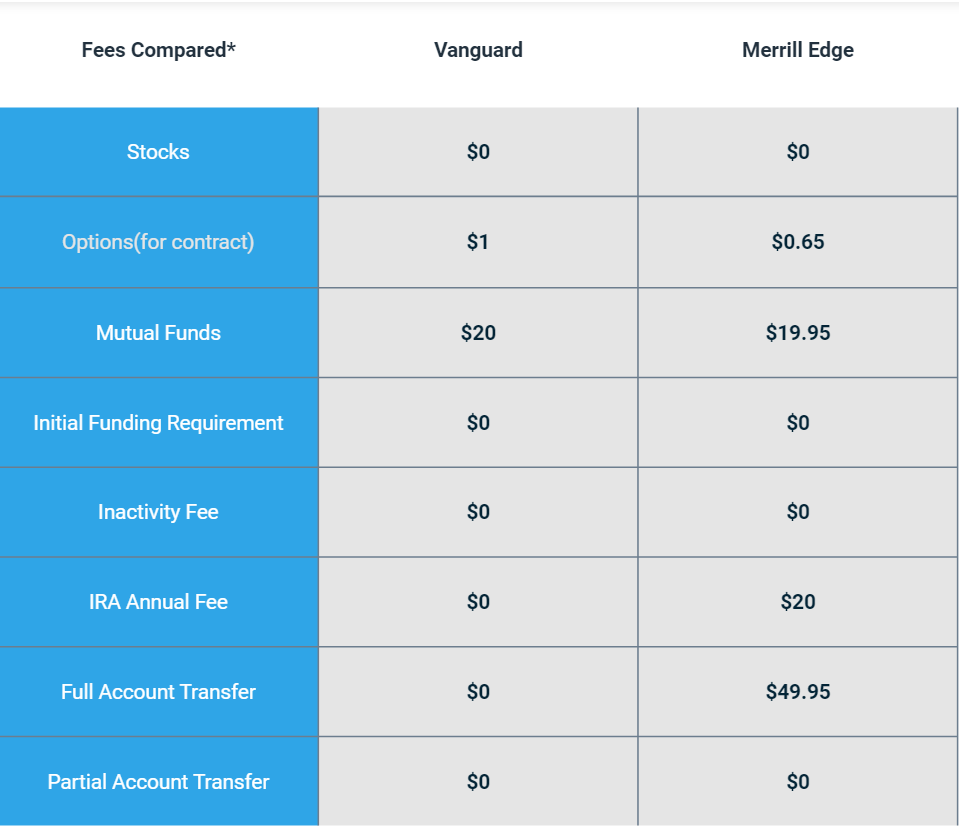

## Table of Contents

## What are Merrill Edge and Vanguard?

Merrill Edge is a service offered by Bank of America. It helps people invest their money. With Merrill Edge, you can buy and sell stocks, bonds, and other investments. They also give advice on how to invest your money. It's good for people who want to manage their own investments or get help from experts.

Vanguard is a company that also helps people invest. They are known for their low-cost investment options, like mutual funds and ETFs. Vanguard focuses on long-term investing and saving for the future. They are popular with people who want to save for retirement or other long-term goals. Vanguard's fees are usually lower than many other companies, which can help you keep more of your money.

## What types of investment accounts do Merrill Edge and Vanguard offer?

Merrill Edge offers different types of investment accounts to help people save and invest. They have individual and joint brokerage accounts where you can buy and sell stocks, bonds, and other investments. They also offer retirement accounts like Traditional IRAs and Roth IRAs, which help you save for retirement with tax benefits. If you have a business, Merrill Edge provides SEP IRAs and SIMPLE IRAs for self-employed people and small businesses. They also have education savings accounts like 529 plans to help save for college.

Vanguard offers a variety of investment accounts too. They have individual and joint brokerage accounts where you can invest in stocks, bonds, mutual funds, and ETFs. For retirement, Vanguard offers Traditional IRAs, Roth IRAs, and rollover IRAs if you want to move money from an old employer's retirement plan. They also haveSEP IRAs and SIMPLE IRAs for small business owners and self-employed individuals. Vanguard provides 529 plans for education savings and UGMA/UTMA accounts for saving and investing on behalf of a minor.

## How do the fee structures of Merrill Edge and Vanguard compare?

Merrill Edge has a fee structure that depends on what you do with your account. They charge $0 for trading stocks and ETFs, which is good if you like to buy and sell often. But, if you need help from a financial advisor, you might have to pay a fee. This fee can be a percentage of the money you invest or a flat fee, depending on what kind of advice you need. Also, if you don't keep a certain amount of money in your account, you might have to pay a fee every year. This fee is called an account maintenance fee, and it can be around $50 if your balance is less than $20,000.

Vanguard's fee structure is different because they focus on keeping costs low. They also charge $0 for trading stocks and ETFs, so it's easy to buy and sell without worrying about trading fees. Vanguard is known for its low-cost mutual funds and ETFs, which have very low expense ratios. This means you pay less over time to own these investments. Vanguard doesn't charge an account maintenance fee if you sign up for electronic statements. But, if you want paper statements, you might have to pay a small fee each year. Overall, Vanguard's fees are usually lower than Merrill Edge's, especially for long-term investments.

## What is the minimum investment required to open an account with Merrill Edge and Vanguard?

To open an account with Merrill Edge, you don't need to start with a lot of money. They let you open a brokerage account with no minimum investment. This means you can start investing even if you only have a little money. But, if you want to use some of their other services, like working with a financial advisor, you might need to have more money in your account. For example, to get help from an advisor, you might need at least $20,000.

Vanguard also makes it easy to start investing. They let you open a brokerage account with no minimum investment too. So, you can begin with whatever amount you have. But, if you want to invest in some of their mutual funds, you might need a bit more money. For example, some of their mutual funds have a minimum investment of $3,000. But, if you sign up for their automatic investment plan, you can start with less, sometimes as low as $50 a month.

## How do the investment options differ between Merrill Edge and Vanguard?

Merrill Edge offers a wide range of investment options. You can buy and sell stocks, bonds, mutual funds, ETFs, and even options. They also have a selection of no-transaction-fee mutual funds, which means you don't pay a fee when you buy or sell them. If you want help [picking](/wiki/asset-class-picking) investments, Merrill Edge has financial advisors who can give you advice. They also offer access to research and tools that can help you make smart investment choices. This makes Merrill Edge a good choice if you like having a lot of different investments to choose from and want some guidance.

Vanguard focuses on low-cost investments and long-term saving. They offer stocks, bonds, mutual funds, and ETFs, just like Merrill Edge. But Vanguard is famous for their index funds and ETFs, which usually have very low fees. These are good for people who want to save money over many years without paying high costs. Vanguard also has target-date funds, which are designed to help you save for retirement by automatically adjusting your investments as you get closer to your goal date. If you're looking for simple, low-cost ways to invest for the long term, Vanguard is a great option.

## What are the customer service options available at Merrill Edge and Vanguard?

Merrill Edge offers several ways to get help from customer service. You can call them on the phone and talk to someone who can answer your questions. They also have a live chat feature on their website, so you can type your questions and get answers quickly. If you prefer, you can visit a Bank of America branch where Merrill Edge representatives can help you in person. They also have online resources and tools that you can use anytime you need help with your account or investments.

Vanguard also provides different customer service options. You can call them and speak to a representative who can help with your account or investments. They have an online chat feature as well, which is good if you want quick answers without using the phone. Vanguard offers support through email too, so you can write to them and get a response. They have a lot of online resources and educational materials that you can use to learn more about investing on your own time.

## How do the educational resources provided by Merrill Edge and Vanguard compare?

Merrill Edge has a lot of educational resources to help you learn about investing. They have articles, videos, and webinars that explain different investments like stocks, bonds, and mutual funds. They also have tools and calculators that can help you plan your investments and see how they might grow over time. If you want to learn more about specific topics, you can take online courses through Merrill Edge. They also offer in-person workshops at Bank of America branches, which is good if you like learning with other people.

Vanguard also provides many educational resources, but they focus a lot on long-term investing and saving for the future. They have articles, videos, and podcasts that explain how to invest for retirement and other long-term goals. Vanguard's website has a lot of tools and calculators too, which can help you figure out how much you need to save and how to invest your money wisely. They offer online courses and webinars as well, which are great if you want to learn more about investing at your own pace. Both Merrill Edge and Vanguard have good educational resources, but Vanguard's might be more helpful if you're focused on long-term goals like retirement.

## What are the mobile and online platform experiences like for Merrill Edge and Vanguard?

Merrill Edge has a good mobile app and online platform. The app is easy to use and you can do a lot of things on it, like check your account, buy and sell investments, and even get help from a financial advisor if you need it. The online platform is also easy to use and has a lot of tools and information to help you make smart investment choices. If you like to use your phone or computer to manage your money, Merrill Edge makes it simple and quick.

Vanguard's mobile app and online platform are also user-friendly. The app lets you see your account, make trades, and get information about your investments. It's good for people who want to manage their money on the go. The online platform has a lot of tools and resources that can help you plan your investments and learn more about saving for the future. Both the app and the website are designed to be easy to use, especially if you're saving for long-term goals like retirement.

## How do the tax-advantaged accounts and strategies offered by Merrill Edge and Vanguard compare?

Merrill Edge offers several tax-advantaged accounts to help you save money on taxes while investing. They have Traditional IRAs and Roth IRAs for retirement, which let you save money with different tax benefits. Traditional IRAs let you save money before you pay taxes on it, while Roth IRAs let you save after you've paid taxes, but you won't pay taxes when you take the money out in retirement. Merrill Edge also offers SEP IRAs and SIMPLE IRAs for small business owners and self-employed people, which can help them save for retirement with tax advantages. For education savings, they have 529 plans that let you save money for college without paying taxes on the earnings if used for education.

Vanguard also offers a variety of tax-advantaged accounts, focusing on long-term saving and low costs. They provide Traditional IRAs, Roth IRAs, and rollover IRAs for retirement, which work similarly to Merrill Edge's options but often have lower fees. Vanguard's SEP IRAs and SIMPLE IRAs are good for self-employed people and small businesses, helping them save for retirement with tax benefits. They also offer 529 plans for education savings, which let you save money without paying taxes on the earnings if used for education. Vanguard's focus on low-cost investments can help you keep more of your money over time, making it a good choice for tax-advantaged saving.

## What are the performance histories of the funds offered by Merrill Edge and Vanguard?

Merrill Edge offers a wide range of funds, including mutual funds and ETFs. The performance of these funds can vary a lot because they invest in different things. Some of their funds have done well over the years, giving investors good returns. But, some funds might not do as well, especially if they invest in riskier things. It's important to look at the past performance of the funds you're thinking about, but remember that past results don't guarantee what will happen in the future. Merrill Edge also has tools and resources to help you pick funds that might do well based on your goals.

Vanguard is known for its low-cost index funds and ETFs, which often have strong performance histories. Many of their funds track broad market indexes, like the S&P 500, and have given investors steady returns over the long term. Because Vanguard's fees are usually low, more of your money stays invested, which can help your investments grow over time. Just like with Merrill Edge, it's good to check the past performance of Vanguard's funds, but remember that future results can be different. Vanguard's focus on long-term investing means their funds are often a good choice for people saving for retirement or other long-term goals.

## How do the retirement planning tools and services differ between Merrill Edge and Vanguard?

Merrill Edge has a lot of tools and services to help you plan for retirement. They have online calculators that can show you how much you need to save and how your investments might grow over time. If you want more help, you can talk to a financial advisor who can give you personalized advice. They can help you pick the right investments for your retirement goals and make sure you're on track. Merrill Edge also has educational resources like articles and webinars that can teach you about saving for retirement. If you like having a lot of help and guidance, Merrill Edge is a good choice.

Vanguard focuses on long-term investing and has tools to help you plan for retirement too. They have calculators and planning tools on their website that can help you figure out how much to save and what investments to choose. Vanguard's target-date funds are popular for retirement planning because they automatically adjust your investments as you get closer to retiring. They also have a lot of educational resources, like articles and online courses, to help you learn about saving for the future. If you want low-cost options and a simple way to invest for the long term, Vanguard's tools and services can be very helpful.

## What advanced trading features and tools are available at Merrill Edge and Vanguard for expert investors?

Merrill Edge has many advanced trading features and tools for expert investors. They offer real-time quotes and market data, which can help you make quick decisions. You can use their advanced charting tools to look at how investments have done in the past and see trends. Merrill Edge also lets you set up different types of orders, like limit orders and stop orders, so you can buy and sell investments at the right time. If you like to trade options, Merrill Edge has an options trading platform with tools to help you pick the right options and manage your risks. They also have a lot of research and analysis from experts that can give you ideas on what to invest in.

Vanguard has some advanced trading features too, but they are more focused on long-term investing. They offer real-time quotes and basic charting tools to help you see how investments are doing. Vanguard lets you set up different types of orders, like limit and stop orders, so you can control when you buy and sell. They don't have as many advanced options trading tools as Merrill Edge, but you can still trade options if you want to. Vanguard's website has a lot of research and educational resources that can help you make smart investment choices. If you're an expert investor looking for low-cost investments and long-term strategies, Vanguard's tools can still be useful.

## References & Further Reading

[1]: ["Quantitative Trading: How to Build Your Own Algorithmic Trading Business"](https://www.amazon.com/Quantitative-Trading-Build-Algorithmic-Business/dp/0470284889) by Ernest P. Chan

[2]: ["Machine Learning for Algorithmic Trading"](https://github.com/stefan-jansen/machine-learning-for-trading) by Stefan Jansen

[3]: ["Advances in Financial Machine Learning"](https://www.amazon.com/Advances-Financial-Machine-Learning-Marcos/dp/1119482089) by Marcos Lopez de Prado

[4]: Bergstra, J., Bardenet, R., Bengio, Y., & Kégl, B. (2011). ["Algorithms for Hyper-Parameter Optimization."](https://dl.acm.org/doi/10.5555/2986459.2986743) Advances in Neural Information Processing Systems 24.

[5]: ["Evidence-Based Technical Analysis: Applying the Scientific Method and Statistical Inference to Trading Signals"](https://www.amazon.com/Evidence-Based-Technical-Analysis-Scientific-Statistical/dp/0470008741) by David Aronson