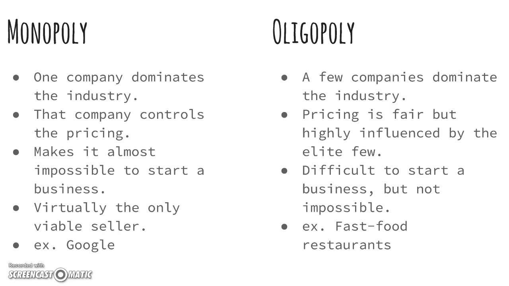

The global financial markets are intricate systems where various structures and technologies interplay to form the foundational framework. Among these structures, monopoly and oligopoly are pivotal in shaping market dynamics. A monopoly exists when a single company dominates the market, limiting competition and controlling prices due to the lack of substitutes. Conversely, an oligopoly features a few dominant firms that hold significant market power, often leading to strategic interactions, where these firms may engage in tacit or explicit collusion.

Algorithmic trading, commonly known as algo trading, has emerged as a powerful force in modern financial markets, utilizing computer programs to conduct trades with exceptional speed and precision. This technology allows traders to analyze market structures, assess depth, and exploit inefficiencies. The interaction between market structures such as monopolies and oligopolies with algorithmic trading is crucial for understanding market behavior and dynamics.



This article investigates the characteristics of monopoly and oligopoly market structures and their connection to algorithmic trading. It also highlights the importance of legal considerations and examines examples and future trends that shape these interactions. By exploring these aspects, investors and traders can gain insight into how these market structures influence algorithmic trading and impact the broader financial landscape.

## Table of Contents

## Understanding Monopoly and Oligopoly Market Structures

A monopoly is a market structure where a single company dominates the marketplace, effectively restricting competition. This dominance can occur in various forms, such as control over resources, technological superiority, or legal rights like patents. The primary feature of a monopoly is the absence of viable substitutes for the product or service offered, granting the monopolist significant pricing power. The monopolist can dictate the market price for its product, as consumers have limited alternatives, often resulting in higher prices and reduced consumer surplus. A common example of a monopoly can be a public utility company providing water or electricity in a specific region.

Mathematically, the monopolist maximizes profit where marginal cost (MC) equals marginal revenue (MR), not where price equals marginal cost as in perfect competition. This is typically represented as:

$$

MR = MC 
$$

Where $MR$ is the change in revenue from selling one more unit and $MC$ is the cost of producing that additional unit.

Oligopoly, in contrast, is a market structure characterized by a small number of large firms that have significant market power. Unlike a monopoly, an oligopoly has multiple players who are acutely aware of each other's actions and strategies. This awareness often leads to tacit or explicit collusion, where firms may coordinate their actions to control market prices and maximize joint profits, a practice known as oligopolistic competition. Significant barriers to entry exist, including high startup costs and complex technology, which prevent new firms from entering the market easily.

In an oligopoly, the market dynamics are highly interdependent, where the actions of each firm can directly affect the others. Firms in an oligopoly may engage in non-price competition, using advertising, product differentiation, and other strategies to gain market share. Game theory, particularly the Nash Equilibrium, is often used to analyze competitive strategies in such markets. A Nash Equilibrium occurs when each player's strategy is optimal, given the strategies of other players, often resulting in outcomes where no player can benefit by unilaterally changing their strategy.

Both monopolistic and oligopolistic markets are known for their high barriers to entry, which can include economies of scale, access to technology, and regulatory constraints. These barriers significantly affect competition and pricing strategies. While monopolies can freely set the price due to a lack of competitors, oligopolies operate with the anticipation of the potential reactions from other market players, often leading to strategic pricing and collaboration.

## Algorithmic Trading in Financial Markets

Algorithmic trading employs computer algorithms to execute trades with speed and precision, significantly transforming the landscape of financial markets. These algorithms focus on analyzing market structures to develop strategies that reduce transaction costs and enhance profitability.

In financial markets where monopolies or oligopolies prevail, [algorithmic trading](/wiki/algorithmic-trading) can identify and exploit market inefficiencies, leading to potential advantages over competitors. By rapidly processing large volumes of data, these algorithms can react almost instantaneously to changes, whether it's a sudden price shift due to an oligopolistic firm’s strategic move or a new market entry by a monopolistic player.

The effectiveness of algorithmic trading hinges on its ability to assess various market parameters such as market depth, [liquidity](/wiki/liquidity-risk-premium), and [order book](/wiki/order-book-trading-strategies) data. Market depth reflects the number of open buy and sell orders for a security, offering insights into the potential price impact of large trades. Liquidity, the ease with which an asset can be bought or sold without affecting its price, is crucial for traders looking to execute large-[volume](/wiki/volume-trading-strategy) trades efficiently. 

Order book data, which provides real-time insight into supply and demand dynamics, allows algorithms to predict price movements and identify trade opportunities. For instance, an algorithm might use time-series analysis of order flow to forecast short-term price changes, optimizing the timing of trade execution.

These capabilities are often enhanced through the integration of advanced statistical models and [machine learning](/wiki/machine-learning) techniques, allowing for continuous learning and adaptation to evolving market conditions. An example of a simple algorithm in Python might involve using a moving average crossover strategy to generate buy/sell signals:

```python
import pandas as pd

def moving_average_crossover(prices, short_window=40, long_window=100):
    signals = pd.DataFrame(index=prices.index)
    signals['signal'] = 0.0
    signals['short_mavg'] = prices['Close'].rolling(window=short_window, min_periods=1).mean()
    signals['long_mavg'] = prices['Close'].rolling(window=long_window, min_periods=1).mean()

    # Generate buy/sell signals
    signals['signal'][short_window:] = np.where(signals['short_mavg'][short_window:] > signals['long_mavg'][short_window:], 1.0, 0.0)   
    signals['positions'] = signals['signal'].diff()

    return signals

# Example usage
# prices = pd.read_csv('historical_stock_prices.csv', index_col='Date', parse_dates=True)
# signals = moving_average_crossover(prices)
# signals.plot(y=['short_mavg', 'long_mavg'])
```

By leveraging such algorithms, traders gain a deeper understanding of market dynamics, improving their ability to execute trades at optimal times. This strategic use of algorithmic trading not only boosts trading efficiency but also contributes to the overall liquidity and efficiency of financial markets.

## Impact of Market Structures on Algorithmic Trading

The effect of market structures on algorithmic trading is a critical area of analysis, as the characteristics of monopolistic and oligopolistic markets significantly influence trading strategies and market efficiency. In monopolistic markets, where a single entity dominates, the limited competition results in fewer price fluctuations. This stability can cause reduced liquidity and [volatility](/wiki/volatility-trading-strategies) since trading volumes may be concentrated. Algorithmic traders operating in such environments might need to adjust their strategies to account for the potentially static nature of price movements. The reduced frequency of price changes due to a lack of competitive forces means that trading algorithms must be adept at identifying and exploiting any inefficiencies that arise within the market.

Conversely, oligopolistic markets, composed of a few significant players, are characterized by their potential for sharp price movements. These can occur due to collective strategies or collusions among the dominant firms. In these markets, algorithmic traders must be vigilant, as price changes can be abrupt and substantial, influenced by strategic interactions and reactions among the leading firms. The ability of these algorithms to predict and respond to market behavior is crucial in such settings. Algorithms that can interpret signals from price changes and swiftly adapt are advantageous, enabling traders to capitalize on the dynamic and occasionally volatile conditions of oligopolistic environments.

Moreover, the interplay between market structures and algorithmic trading practices has far-reaching implications for overall market stability and efficiency. In monopolistic markets, the absence of competition can lead to inefficiencies that well-designed algorithms might exploit, potentially providing balance and liquidity where it is lacking. Meanwhile, in oligopolies, the adaptive nature of algorithms may either stabilize or exacerbate market fluctuations, depending on how they react to the collaborative or competitive actions of the dominant firms. For instance, algorithmic trading can enhance efficiency by reducing transaction costs and providing liquidity through strategic order placements. However, concerns arise when these strategies contribute to market volatility, particularly in oligopolistic conditions where few entities exert significant market influence.

Thus, the success of algorithmic trading in these distinct market structures relies on a deep understanding of the strategic behavior and interactions among market participants. Through leveraging data analytics and high-frequency trade execution, algorithmic trading has the potential to both mitigate risks associated with these market structures and exploit opportunities, ultimately shaping the landscape of modern financial markets.

## Legal and Regulatory Aspects

Both monopolies and oligopolies are key focus areas of antitrust laws globally, which are designed to promote competitive markets and prevent anti-competitive conduct. These laws restrict practices such as price-fixing, market division, and other forms of collusion that can lead to consumer harm. For instance, the Sherman Act in the United States and the Competition Act in the European Union comprise a range of measures to oversee and control behaviors that could threaten competitive market dynamics.

These regulations also extend to algorithmic trading, which has been transforming financial markets with its potential to execute trades at lightning speeds. The critical concern is ensuring that algorithmic trading doesn't become a tool for stock market manipulation or abuse. Instances of "quote stuffing," a tactic where traders flood the market with orders to create confusion or instability, have led regulators to impose stringent rules ensuring transparency and fair trading environments. Algorithmic trading firms and traders must comply with these rules to prevent market manipulation and to maintain integrity within the financial system.

Regulatory bodies such as the U.S. Securities and Exchange Commission (SEC) and the European Securities and Markets Authority (ESMA) continually adapt their regulatory frameworks to align with the fast-evolving nature of technology in trading. These adaptations focus on monitoring trading behaviors and identifying potentially manipulative activities. This includes the implementation of circuit breakers and scrutinizing the role of trading algorithms in shaping market liquidity and volatility.

Understanding and adhering to these legal frameworks is crucial for market participants, including algorithmic traders, to function responsibly and effectively. Violations of these laws can lead to significant penalties, including fines and restrictions. Such legal compliance is not merely a box-ticking exercise but a fundamental component in fostering trust and integrity in financial markets. Engaging with legal experts and staying informed about the latest regulatory developments are crucial steps for those involved in monopoly, oligopoly, and algorithmic trading landscapes.

## Examples of Monopolies, Oligopolies, and Algo Trading

Monopolies and oligopolies are distinct market structures with profound implications for industries and trading dynamics.

In the telecommunications sector, regional monopolies often arise due to the high infrastructure costs and regulatory barriers that limit competition. Companies may have exclusive rights to provide certain services within defined areas, restricting entry for new players. This control enables them to set prices with minimal competitive pressure.

The technology industry frequently displays traits of an oligopoly, with leading firms such as Apple, Amazon, Google, and Microsoft holding substantial market power. These giants engage in strategic alliances, pricing strategies, and cross-licensing agreements that can limit competition and innovation from smaller firms. Their substantial resources further enable them to influence industry standards and consumer choices.

Algorithmic trading represents another domain marked by technological prowess, with firms like Virtu Financial leveraging sophisticated algorithms for high-frequency trading ([HFT](/wiki/high-frequency-trading-strategies)). These companies use complex code and data analytics to execute trades at lightning speed, often making profits from tiny pricing differentials. The speed and scale at which algos operate can lead to significant shifts in market dynamics, particularly in volatile trading environments. 

Pharmaceuticals frequently exhibit monopolistic tendencies, primarily through patent protections. A company holding a patent can exclude others from manufacturing or selling the patented drug, thus maintaining a monopoly on particular treatments. This exclusivity allows patent holders to set prices substantially above marginal cost, reflecting the significant expenditure involved in drug development but also leading to debates on affordability and access.

The airline industry epitomizes an oligopolistic market, dominated by a few major carriers that operate within extensive but defined routes. Airlines often engage in strategic pricing and capacity decisions, including alliances and code-sharing agreements, to maintain their competitive positions. These practices can result in reduced competition on certain routes and higher ticket prices for consumers.

Understanding the examples of monopolies and oligopolies across various sectors, alongside the innovative nature of algorithmic trading, provides insight into the complex dynamics of modern financial markets and their influence on consumer choice, pricing, and competition.

## Future Trends in Market Structures and Algorithmic Trading

Technological advancements are poised to significantly transform market structures and algorithmic trading. The integration of [artificial intelligence](/wiki/ai-artificial-intelligence) (AI) and machine learning into trading strategies is expected to enhance decision-making and predictive capabilities. AI algorithms can analyze vast datasets at unprecedented speeds, identifying patterns and trends that human traders might overlook. Machine learning models, in particular, can adapt and improve over time by learning from new data, enabling more accurate forecasts of market movements. This evolution in technology empowers traders to craft highly sophisticated strategies that capitalize on minute market inefficiencies.

Blockchain technology presents another avenue for change, potentially increasing market transparency and reshaping trading dynamics. By offering a decentralized and immutable ledger, blockchain can reduce the risk of fraud and errors, ensuring more secure and efficient transaction processing. This transparency could alter the competitive landscape, as market participants gain better visibility into trade flows and asset histories. Smart contracts, powered by blockchain, could automate and streamline trading processes, reducing the need for intermediaries and facilitating faster transaction execution.

Real-time analytics are becoming increasingly important for traders aiming to respond promptly to market shifts. These analytics provide immediate insights into price changes, trading volumes, and market sentiment, enabling rapid adjustment of trading strategies. The use of advanced data visualization tools and dashboards can help traders interpret complex data quickly, offering a competitive edge in fast-moving markets.

Regulatory technology, or RegTech, is expected to play a crucial role in future market structures and algorithmic trading. As financial markets become more complex, ensuring compliance with regulations is paramount. RegTech solutions utilize technology such as AI to automate compliance processes, monitor trading activity, and detect potential violations. This innovation can drastically reduce the burden of regulatory compliance and enhance market integrity.

Overall, the integration of AI, blockchain, real-time analytics, and RegTech will likely create more efficient, transparent, and adaptable market environments. Traders and financial institutions that embrace these innovations will be better positioned to navigate and thrive in the evolving financial landscape.

## Conclusion

The intricate relationship between market structures and algorithmic trading plays a crucial role in defining the dynamics of contemporary financial markets. By recognizing the subtle distinctions between monopolies and oligopolies and understanding algorithmic trading, market participants can gain significant competitive advantages. The dominance of limited firms in these market structures—either through monopolistic control or oligopolistic collaboration—creates distinct environments where algorithmic trading strategies can flourish.

Investors and traders need to remain both agile and well-informed to successfully navigate this complex and continually evolving landscape. Adapting to shifts in market operations and regulatory changes demands continual learning and strategic adjustments. Those who can analyze market structures effectively and implement sophisticated trading algorithms are better positioned to capture opportunities and manage risks adeptly.

Utilizing these insights, market participants can achieve optimization in their trading strategies. By strategically applying knowledge of market dynamics and technological advancements in algorithmic trading, they can enhance decision-making processes and improve overall financial outcomes. This capacity to leverage market structures and algorithms not only ensures competitiveness but also fosters improved market efficiency and stability, benefiting the broader financial ecosystem.

## References & Further Reading

[1]: Porter, M. E. (1979). ["How Competitive Forces Shape Strategy."](https://hbr.org/1979/03/how-competitive-forces-shape-strategy) Harvard Business Review.

[2]: Lipsey, R. G., & Lancaster, K. (1956). ["The General Theory of Second Best."](https://www.researchgate.net/publication/261833990_The_General_Theory_of_Second_Best) The Review of Economic Studies, 24(1), 11-32.

[3]: [The Economist.](https://www.economist.com/) Various Articles on Monopoly and Oligopoly Markets.

[4]: Lopez de Prado, M. (2018). ["Advances in Financial Machine Learning."](https://www.amazon.com/Advances-Financial-Machine-Learning-Marcos/dp/1119482089) John Wiley & Sons.

[5]: Chan, E. (2009). ["Quantitative Trading: How to Build Your Own Algorithmic Trading Business."](https://github.com/ftvision/quant_trading_echan_book) John Wiley & Sons.

[6]: Jansen, S. (2020). ["Machine Learning for Algorithmic Trading."](https://github.com/stefan-jansen/machine-learning-for-trading) Packt Publishing.

[7]: Shapiro, C. (1989). ["The Theory of Business Strategy."](https://www.jstor.org/stable/2555656) RAND Journal of Economics, 20(1), 125-137.

[8]: Kehoe, T. J. (2004). ["An Evaluation of the Performance of Applied General Equilibrium Models of the Impact of NAFTA."](http://users.econ.umn.edu/~tkehoe/papers/NAFTAevaluation.pdf) In Proceedings of the Conference on the Impact of Trade Agreements.