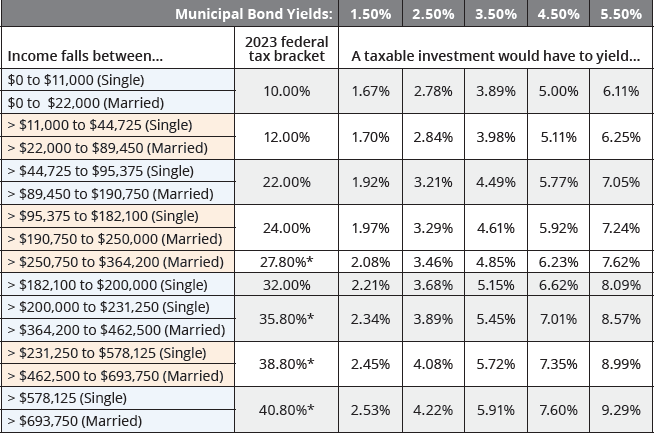

## Table of Contents

## What are municipal bonds?

Municipal bonds, often called "munis," are loans that people give to local governments or their projects. When you buy a municipal bond, you are lending money to a city, town, or state. They use this money to build things like schools, roads, and hospitals. In return, the local government promises to pay you back the money you lent them, plus some extra money called interest, over a certain period of time.

These bonds are popular because they are seen as safe investments. This is because local governments have the power to collect taxes, which they can use to pay back the bondholders. Also, the interest you earn from municipal bonds is often not taxed by the federal government, and sometimes not by state governments either. This makes them even more attractive to people looking to invest their money and keep more of their earnings.

## What are taxable bonds?

Taxable bonds are a type of bond where the interest you earn is taxed by the government. This is different from some other bonds, like municipal bonds, where the interest might not be taxed. When you buy a taxable bond, you are lending money to the issuer, which could be a company or the government. In return, they promise to pay you back the money you lent them, plus interest. But, you have to pay taxes on that interest.

These bonds are often issued by companies or the federal government. The interest rates on taxable bonds can be higher than on tax-exempt bonds because investors need to be compensated for the taxes they will have to pay. People might choose to invest in taxable bonds if they are looking for a higher return on their investment, even after paying taxes. It's important to consider your own tax situation when deciding if taxable bonds are right for you.

## How do municipal bonds differ from taxable bonds in terms of taxation?

Municipal bonds and taxable bonds differ mainly in how the interest you earn is taxed. When you invest in municipal bonds, the interest you get is usually not taxed by the federal government. Sometimes, it's also not taxed by your state if you live in the state that issued the bond. This makes municipal bonds very attractive to people who want to keep more of their earnings without paying a lot in taxes.

On the other hand, the interest you earn from taxable bonds is taxed by the government. These bonds are often issued by companies or the federal government. Because you have to pay taxes on the interest, taxable bonds usually offer higher interest rates to make up for it. People might choose taxable bonds if they want a higher return on their investment, even after paying taxes. It's important to think about your own tax situation when deciding between these two types of bonds.

## What are the typical interest rates for municipal bonds compared to taxable bonds?

Municipal bonds usually have lower interest rates compared to taxable bonds. This is because the interest you earn from municipal bonds is often not taxed by the federal government, and sometimes not by the state government either. Because you don't have to pay as much in taxes, the interest rates can be lower and still be attractive to investors. For example, if a municipal bond offers a 3% interest rate, you get to keep all of that 3%.

On the other hand, taxable bonds need to offer higher interest rates to attract investors because the interest you earn is taxed. If you invest in a taxable bond with a 5% interest rate, you might have to pay taxes on that interest, so you end up keeping less than the full 5%. Because of this, taxable bonds often have to offer higher interest rates, like 4% or 5%, to make up for the taxes you have to pay.

## Who are the typical investors in municipal bonds versus taxable bonds?

People who invest in municipal bonds are often looking for a safe place to put their money where they won't have to pay a lot in taxes. These investors might be in higher tax brackets, so they like the tax-free interest that comes with municipal bonds. They could be retirees who want a steady income without worrying about taxes eating into their earnings. Also, people who live in the state where the bond is issued might choose municipal bonds because they don't have to pay state taxes on the interest either.

On the other hand, people who invest in taxable bonds might be okay with paying taxes on their earnings because they're looking for a higher return on their investment. These investors might be younger or in a lower tax bracket, so the higher interest rates of taxable bonds are more attractive to them, even after taxes. They could be looking to grow their money faster and are willing to take on a bit more risk for the potential of higher rewards.

## What are the credit risks associated with municipal bonds and taxable bonds?

Municipal bonds are generally seen as safe investments because they are backed by the power of local governments to collect taxes. This means that if a city or state runs into money troubles, they can raise taxes to pay back the bondholders. However, there is still some risk. If a city or state has big financial problems and can't pay its debts, it might default on its bonds. This doesn't happen often, but when it does, it can be a big problem for investors.

Taxable bonds can have more credit risk, especially if they are issued by companies instead of the government. If a company runs into financial trouble and can't pay its debts, it might default on its bonds. This can happen more often than with municipal bonds because companies don't have the same power to raise money through taxes. Investors in taxable bonds need to look carefully at the credit rating of the company to understand the risk they are taking.

Both types of bonds have credit risks, but the risks are different. With municipal bonds, the risk is lower because of the tax power of governments. With taxable bonds, especially corporate bonds, the risk can be higher because companies might not be able to pay back their debts if they face financial difficulties.

## How do the maturity periods of municipal bonds compare to those of taxable bonds?

Municipal bonds and taxable bonds can have different maturity periods, which is the time it takes for the bond to be paid back in full. Municipal bonds often have long maturity periods. They can last anywhere from a few years to 30 years or even longer. This is because the projects they fund, like building schools or roads, take a long time to complete and start earning money. Investors who buy these bonds are usually okay with waiting a long time to get their money back because they know the bond is safe.

Taxable bonds, on the other hand, can have a wide range of maturity periods too. They can be short-term, lasting just a few months to a few years, or they can be long-term, lasting up to 30 years or more. The maturity period often depends on who is issuing the bond. For example, corporate bonds might have shorter maturities because companies might need the money back sooner to reinvest in their business. Government bonds, like those issued by the U.S. Treasury, can have longer maturities because they are seen as very safe investments.

## What are the liquidity differences between municipal bonds and taxable bonds?

Municipal bonds can be less liquid than taxable bonds. This means it might be harder to sell them quickly if you need your money back. Because municipal bonds are often issued by smaller local governments, there might not be as many people wanting to buy them. If you want to sell your municipal bond before it matures, you might have to wait longer to find a buyer, or you might have to sell it for less money than you wanted.

Taxable bonds, especially those issued by big companies or the government, are usually more liquid. This means it's easier to sell them quickly if you need to. There are often more people interested in buying these bonds, so you can find a buyer faster. This is especially true for U.S. Treasury bonds, which are very popular and easy to buy and sell. Because of this, investors who might need their money back sooner often choose taxable bonds over municipal bonds.

## How do municipal bonds and taxable bonds impact portfolio diversification?

Adding municipal bonds to your investment mix can help spread out your risk. Since they are usually safe and the interest is often not taxed, they can balance out riskier parts of your portfolio. If you have a lot of stocks or other investments that can go up and down a lot, municipal bonds can help keep your overall investment safer. They are good for people who want to keep their money growing without taking big risks.

Taxable bonds also help with spreading out your investments, but in a different way. They often come with higher interest rates, which can help grow your money faster. But because the interest is taxed, they might be better for people who don't mind paying taxes on their earnings. Adding taxable bonds to your portfolio can give you more variety and might help you earn more money, but they can be riskier than municipal bonds. So, it's important to think about your own goals and how much risk you're okay with when choosing between them.

## What are the tax advantages of investing in municipal bonds for different income levels?

Investing in municipal bonds can be really helpful for people in different income levels because of the tax benefits. If you make a lot of money and are in a high tax bracket, municipal bonds are great for you. The interest you earn from these bonds is usually not taxed by the federal government, and sometimes not by your state either. This means you get to keep more of the money you earn from your investment, which can be a big deal if you're paying a lot in taxes. So, if you're in a high tax bracket, municipal bonds can help you save on taxes and still get a good return on your money.

For people who don't make as much money and are in a lower tax bracket, the tax benefits of municipal bonds might not be as important. If you're not paying a lot in taxes anyway, the fact that the interest from municipal bonds is not taxed might not make a big difference to you. You might be better off looking at other investments that could give you a higher return, even if you have to pay taxes on that return. So, while municipal bonds can still be a safe place to put your money, the tax benefits might not be as big a deal for you if you're in a lower tax bracket.

## How do market conditions affect the yields of municipal bonds versus taxable bonds?

Market conditions can change the yields, or the interest rates, of both municipal bonds and taxable bonds. When the economy is doing well and people feel confident, they might want to invest in riskier things like stocks. This can make bond prices go down because fewer people want to buy them, which means the yields go up. On the other hand, if the economy is not doing so well and people are scared, they might want to buy more bonds because they are safer. This can make bond prices go up and yields go down. These changes can happen to both municipal bonds and taxable bonds, but the effects can be different because of how they are taxed and who wants to buy them.

Municipal bonds are often seen as safer investments because they are backed by local governments. When the market is shaky, people might buy more municipal bonds to feel safer, which can push their yields down. But because the interest from these bonds is not taxed, the yields don't have to be as high to attract investors. Taxable bonds, on the other hand, have to offer higher yields to make up for the taxes people have to pay on the interest. So, when the market changes, the yields on taxable bonds might go up or down more than municipal bonds because they need to stay attractive to investors who are looking for a good return after taxes.

## What are advanced strategies for trading municipal bonds versus taxable bonds?

When trading municipal bonds, one advanced strategy is to focus on bonds that are about to be upgraded or downgraded in their credit ratings. If you think a bond is going to be upgraded soon, you might buy it before the upgrade happens. This is because when a bond gets a better rating, its price usually goes up. On the other hand, if you think a bond is going to be downgraded, you might sell it before the downgrade happens because the price will likely go down. Another strategy is to use a bond ladder, where you buy municipal bonds that mature at different times. This can help you get a steady income and also let you take advantage of changes in interest rates over time.

For taxable bonds, one advanced strategy is to trade based on interest rate predictions. If you think interest rates are going to go down, you might buy longer-term bonds because their prices go up when rates fall. If you think rates are going to go up, you might sell your bonds or buy shorter-term ones because their prices don't drop as much. Another strategy is to use bond swaps, where you sell one bond and buy another to take advantage of changes in the market. For example, if you think a company's financial situation is going to get better, you might swap out of a bond from a stable company into one from that company to get a higher yield.

Both types of bonds can also be used in more complex strategies like hedging. For municipal bonds, you might use them to offset risks in other parts of your portfolio because they are seen as safe. For taxable bonds, you might use them to hedge against inflation or changes in the economy. Understanding these strategies and how they work with the different characteristics of municipal and taxable bonds can help you make smarter trading decisions.

## What is the understanding of Municipal Bonds?

Municipal bonds, known as "munis," are debt obligations issued by local governments or their agencies to finance public projects such as highways, schools, and bridges. These bonds play a critical role in community development by providing necessary funds for infrastructure and public services.

One of the primary benefits of municipal bonds is their tax-exempt status. Interest earned from most municipal bonds is exempt from federal income tax, and in many cases, state and local taxes as well, particularly if the investor resides in the state where the bond is issued. This tax advantage makes munis particularly appealing to investors in higher tax brackets, as they can effectively increase the after-tax yield of the investment. The formula for calculating the tax-equivalent yield is:

$$
\text{Tax-Equivalent Yield} = \frac{\text{Municipal Bond Yield}}{1 - \text{Tax Rate}}
$$

For example, consider an investor in the 35% federal tax bracket. A municipal bond offering a 3% yield would have a tax-equivalent yield of approximately 4.62%, calculated as follows:

$$
\text{Tax-Equivalent Yield} = \frac{0.03}{1 - 0.35} = 0.0462 \text{ or } 4.62\%
$$

Apart from tax benefits, municipal bonds generally have lower risk levels than corporate bonds. They are often considered safe investments because they are backed by the taxing power of the issuing municipality or, in the case of revenue bonds, by the revenue generated by the financed project. However, risk does exist, as financial distress within a municipality could impact its ability to meet repayment obligations.

Investors should evaluate the attractiveness of municipal bonds in the context of their tax situation, financial goals, and risk tolerance. High-net-worth individuals, particularly those in high tax brackets, are likely to gain the most benefit from tax exemptions. Additionally, risk-averse investors may favor munis due to their perceived safety relative to corporate bonds.

Understanding these factors is essential for investors aiming to maximize returns while minimizing tax liabilities. While munis offer unique advantages, it is crucial for investors to stay informed about the creditworthiness of the issuing municipalities and prevailing economic conditions that could affect bond performance.

## What is an overview of taxable bonds?

Taxable bonds encompass a broad category of debt instruments, including corporate bonds and U.S. Treasury bonds. These bonds serve as crucial components of the financial markets, providing [liquidity](/wiki/liquidity-risk-premium) and investment opportunities with potentially attractive returns. One of the defining characteristics of taxable bonds is their appeal to investors seeking higher yields. Unlike municipal bonds, whose interest may be exempt from federal (and sometimes state and local) taxes, the interest income from taxable bonds is subject to taxation at an investor's regular income tax rate.

One of the primary features of taxable bonds is their higher yield potential compared to tax-exempt bonds. This is particularly appealing in a low-interest-rate environment or to investors in lower tax brackets who are less impacted by the taxation of interest income. Corporate bonds, for example, often offer higher yields due to their inherent credit risk, whereas U.S. Treasury bonds, perceived as lower-risk, offer varying yields depending on their maturity. 

Another important aspect of taxable bonds is the standardized risk evaluation provided by credit ratings from agencies like Standard & Poor's, Moody's, and Fitch. These ratings assess the creditworthiness of an issuer and the likelihood of default, enabling investors to make informed decisions. For instance, a corporate bond rated 'AAA' is considered high quality with minimal risk of default, whereas a 'BB' rating might indicate higher risk and thus, a potentially higher yield to compensate investors for this risk.

For investors in lower tax brackets, taxable bonds can be an integral part of their investment strategy. The reason is straightforward: the impact of taxes on net yields is less significant for these individuals, allowing them to benefit more fully from the higher pre-tax yields offered by taxable bonds. To illustrate this, consider the after-tax yield $Y_a$ which can be calculated using:

$$
Y_a = Y_t \times (1 - T)
$$

where $Y_t$ is the taxable yield and $T$ is the tax rate. Investors with lower tax rates will see less erosion of returns through taxation compared to those in higher tax brackets.

In terms of fitting within a broader investment strategy, taxable bonds provide diversification across different risk profiles and maturities. They offer the potential for income generation and capital preservation, particularly when aligned with an investor's risk tolerance and financial goals. For instance, investors seeking to balance income with stability might include a mix of U.S. Treasury bonds for security, alongside higher-yield corporate bonds that contribute to potentially greater returns.

In conclusion, taxable bonds such as corporate and U.S. Treasury bonds play a pivotal role in a diversified investment strategy, particularly for those in lower tax brackets who can take advantage of their higher yields. The choice among these bonds should be made after careful consideration of their yield, credit risk, and alignment with broader financial objectives.

## What are the differences between Municipal Bonds and Taxable Bonds: A Comparative Analysis?

When comparing municipal bonds and taxable bonds, a critical [factor](/wiki/factor-investing) for investors is understanding the tax-equivalent yield, which allows for a direct comparison of returns by accounting for tax disparities. The tax-equivalent yield (TEY) formula for municipal bonds can be expressed as:

$$
TEY = \frac{\text{Municipal Bond Yield}}{1 - \text{Tax Rate}}
$$

This formula calculates the pretax yield a taxable bond must offer to match a tax-free municipal bond, taking into account the investor's tax bracket.

### Impact of Tax Brackets

The choice between municipal bonds and taxable bonds is significantly influenced by an investor’s tax bracket. Investors in higher tax brackets generally benefit more from the tax-exempt status of municipal bonds. For example, if a municipal bond offers a yield of 3% and an investor is in a 30% tax bracket, the TEY is approximately 4.29%. Therefore, a taxable bond must yield more than 4.29% to be a better option for this investor.

Conversely, investors in lower tax brackets might find higher yields in taxable bonds more favorable. A taxable bond yielding 4% would only need a TEY below 4% to be attractive to someone with a low tax rate, as tax savings from municipal bonds are minimal for them.

### Comparative Performance

Municipal bonds often outperform taxable bonds for high-income investors, especially during stable or declining [interest rate](/wiki/interest-rate-trading-strategies) environments, due to their tax exemption on federal (and often state) income taxes. However, certain scenarios can lead taxable bonds to outperform.

#### Cases for Taxable Bonds

1. **Higher Yield Environments**: When interest rates increase, taxable bonds may offer higher absolute yields that can outweigh their taxable nature.
2. **Lower Tax Brackets**: For investors with minimal tax liability, municipal bonds' tax advantages are less impactful.
3. **Risk Preferences**: Corporate and government taxable bonds may offer different risk profiles that align better with an investor's strategy. Investment-grade corporate bonds may attract investors seeking higher returns, even with tax considerations.

#### Cases for Municipal Bonds

1. **High Tax Brackets**: Tax savings become substantial, often making munis more beneficial.
2. **State Taxes**: Residents of states with high income taxes might benefit from locally issued municipal bonds that are exempt from both federal and state taxes.
3. **Safety and Stability**: During volatile market periods, municipal bonds’ stable cash flows and safety appeal to risk-averse investors.

Municipal and taxable bonds each have merits based on individual tax situations and market conditions. Understanding these dynamics enables investors to make informed choices that align with financial objectives and prevailing economic contexts.

## Which bonds suit you in terms of investment strategies?

When considering investment strategies involving municipal and taxable bonds, it is essential to evaluate various factors to balance risk and return effectively. Both municipal bonds and taxable bonds have their distinct advantages and can play specific roles within an investor's portfolio.

### Strategic Considerations

1. **Tax Considerations**: Investors should first determine their tax bracket to assess the relative advantages of municipal versus taxable bonds. Municipal bonds offer tax-free interest income at the federal level, and often at state and local levels as well, making them attractive to individuals in higher tax brackets. Conversely, taxable bonds might provide higher pre-tax yields, which can be advantageous to investors in lower tax brackets.

   For example, to evaluate the tax-equivalent yield of a municipal bond, investors can use the formula:
$$
   \text{Tax-Equivalent Yield} = \frac{\text{Tax-Free Municipal Bond Yield}}{1 - \text{Tax Rate}}

$$
   This formula helps compare the expected earnings from municipal bonds against taxable bonds.

2. **Risk Assessment**: It's crucial to understand the credit risk and interest rate risk associated with each bond type. Municipal bonds often have lower default rates compared to corporate bonds but may be subject to other risks such as fiscal mismanagement of the issuing municipality. Taxable bonds, such as corporate bonds, may offer higher yields but also come with higher credit risk.

3. **Portfolio Diversification**: Diversification is key in managing risk across a bond portfolio. Combining municipal and taxable bonds can help achieve a balance between steady income streams and higher yield opportunities. Investors might consider allocating municipal bonds for tax efficiency and stability, while using taxable bonds for capital appreciation and potential yield enhancement.

4. **Interest Rate Environment**: The current and expected future interest rate environment can significantly affect bond strategy. In a rising interest rate environment, short-duration and higher-yielding taxable bonds might be preferable to mitigate interest rate risk.

### Leveraging Algorithmic Trading

Algorithmic trading has become an invaluable tool for enhancing investment strategies in bond markets. These automated trading systems utilize complex algorithms to execute trades based on predefined criteria, which can be particularly beneficial in bond investing for several reasons:

- **Liquidity Enhancement**: Algorithms can facilitate trades with high speed and efficiency, providing better liquidity management and reducing transaction costs.

- **Pricing Efficiency**: By analyzing large sets of market data in real-time, these algorithms help investors identify mispriced bonds quickly, allowing them to capitalize on arbitrage opportunities.

- **Risk Management**: Algorithms can help manage risk by adjusting portfolio allocations dynamically based on changes in market conditions, interest rates, and economic indicators.

```python
# Example of a simple algorithm to determine bond allocation based on expected tax benefit and yield
def ideal_bond_allocation(muni_yield, taxable_yield, tax_rate):
    tax_equivalent_yield = muni_yield / (1 - tax_rate)
    if tax_equivalent_yield > taxable_yield:
        return "Allocate more to municipal bonds for tax efficiency"
    else:
        return "Allocate more to taxable bonds for higher yield potential"

# These values are illustrative
muni_yield = 0.03  # 3% municipal bond yield
taxable_yield = 0.05  # 5% taxable bond yield
tax_rate = 0.35  # 35% tax bracket

allocation_suggestion = ideal_bond_allocation(muni_yield, taxable_yield, tax_rate)
print(allocation_suggestion)
```

Ultimately, selecting the appropriate mix between municipal and taxable bonds requires careful evaluation of tax implications, risk tolerance, and market conditions. Incorporating algorithmic trading can significantly enhance the decision-making process, leading to a well-optimized bond investment strategy.

## References & Further Reading

[1]: Mork, P. (2011). ["Municipal Bonds: Understanding Credit Exposure"](https://www.sec.gov/investor/alerts/municipalbondsbulletin.pdf) Lambert Academic Publishing.

[2]: Harris, L. (2003). ["Trading and Exchanges: Market Microstructure for Practitioners"](https://academic.oup.com/book/52292) Oxford University Press.

[3]: Fabozzi, F. J. (2012). ["Bond Markets, Analysis, and Strategies"](https://mitpress.mit.edu/9780262046275/bond-markets-analysis-and-strategies/) Pearson.

[4]: Treynor, J. L. (2009). ["The Economics of the Municipal Bond Market"](https://www.academia.edu/15615379/Jack_Treynors_Market_Value_Time_and_Risk_) Risk Books.

[5]: ["The Handbook of Municipal Bonds"](https://www.amazon.com/Handbook-Municipal-Bonds-Sylvan-Feldstein/dp/0470108754) by Sylvan G. Feldstein and Frank J. Fabozzi

[6]: Johnson, J. A. (2010). ["Algorithmic Trading & DMA: An Introduction to Direct Access Trading Strategies."](https://archive.org/details/algorithmictradi0000john) 4Myeloma Press.

[7]: P. Levine, "Municipal bond liquidity after the crisis," Journal of Financial Economics, vol. 122, issue 3, pp. 571-590, June 2016.