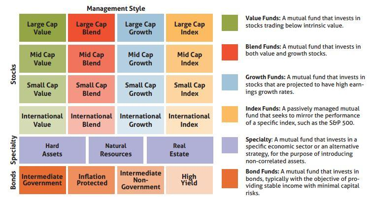

## Table of Contents

## What are mutual fund style indices?

Mutual fund style indices are tools used to classify and evaluate mutual funds based on their investment style. They help investors understand how a fund invests its money, whether it focuses on growth, value, or a blend of both, and whether it invests in large, medium, or small companies. This classification makes it easier for investors to compare funds and see how well they are doing compared to others with a similar style.

These indices are often created by financial companies like Morningstar or Lipper. They group funds into categories like large-cap growth, mid-cap value, or small-cap blend. By using these indices, investors can see if a fund is performing better or worse than its peers. This can help them make smarter choices about where to put their money, based on their own investment goals and how much risk they are willing to take.

## How do mutual fund style indices differ from other types of indices?

Mutual fund style indices are different from other types of indices because they focus on the investment style of mutual funds, like whether they invest in growth or value stocks, and the size of the companies they invest in. Other indices, like the S&P 500 or Dow Jones, are broader and track the performance of a large group of stocks or bonds, without focusing on specific investment styles. These broader indices give a general view of the market, while mutual fund style indices help investors see how funds with similar strategies are doing.

Another difference is that mutual fund style indices are used to compare mutual funds against each other within the same category. For example, a large-cap growth fund would be compared to other large-cap growth funds. In contrast, other indices might be used to compare the overall performance of the market or a specific sector, like technology or healthcare. This makes mutual fund style indices more useful for investors who want to understand how well a fund is doing compared to similar funds, rather than the market as a whole.

## What are the main categories of mutual fund style indices?

Mutual fund style indices are divided into different categories based on the size of the companies they invest in and their investment approach. The size categories are large-cap, mid-cap, and small-cap. Large-cap funds invest in big companies, mid-cap funds in medium-sized companies, and small-cap funds in smaller companies. The investment approach can be growth, value, or a blend. Growth funds focus on companies expected to grow quickly, value funds look for companies that seem underpriced, and blend funds mix both strategies.

These categories help investors pick funds that match their goals and how much risk they want to take. For example, someone looking for steady growth might choose a large-cap growth fund, while someone willing to take more risk might go for a small-cap value fund. By using these categories, investors can easily compare funds and see which ones are doing well in their chosen style. This makes it simpler to make smart investment choices.

## How are mutual fund style indices constructed?

Mutual fund style indices are made by grouping mutual funds based on the types of stocks they invest in. They look at two main things: the size of the companies, called market capitalization, and the way the fund invests, which could be growth, value, or a mix of both. For example, a fund might focus on big companies expected to grow quickly, which would put it in the large-cap growth category. Companies are sorted into large-cap, mid-cap, or small-cap based on how much they are worth. Funds are then labeled as growth if they invest in companies expected to grow fast, value if they invest in companies that seem underpriced, or blend if they do a bit of both.

To build these indices, companies like Morningstar or Lipper gather data on lots of mutual funds. They look at what stocks each fund owns and how those stocks are doing. Then, they put each fund into the right category based on its investments. This helps investors see how well a fund is doing compared to other funds that invest in a similar way. For example, if you want to know if a large-cap growth fund is doing well, you can compare it to other funds in the same large-cap growth index. This makes it easier to pick funds that fit your investment goals and how much risk you're okay with taking.

## What are the key factors to consider when comparing mutual fund style indices?

When comparing mutual fund style indices, it's important to look at how well the funds in each index have done over time. This means checking their returns to see if they've made money and how steady those returns have been. Another thing to consider is how much risk the funds take. Some indices might include funds that go up and down a lot, while others might have funds that are more stable. You should also look at the costs of the funds in the index, like fees and expenses, because these can eat into your returns.

It's also helpful to think about how the funds in the index are spread out. A good index should have a mix of different types of investments so it's not too focused on just one thing. This can help lower the risk. Lastly, consider how the index matches your own investment goals. If you want to grow your money over a long time, you might pick an index with funds that focus on growth. But if you're looking for steady income, you might choose one with funds that focus on value.

## How do growth, value, and blend style indices differ?

Growth, value, and blend style indices are different ways to group mutual funds based on how they invest. Growth style indices include funds that focus on companies expected to grow quickly. These funds look for businesses that might not pay big dividends now but are expected to increase in value over time. On the other hand, value style indices are made up of funds that invest in companies that seem underpriced. These funds look for stocks that they think are a good deal, hoping they will go up in value as the market realizes their true worth.

Blend style indices are a mix of both growth and value strategies. Funds in these indices invest in a combination of companies expected to grow and those that are seen as undervalued. This approach tries to balance the potential for quick growth with the stability of value investing. By understanding these differences, investors can pick the style that best fits their goals, whether they want to grow their money fast, find good deals, or have a bit of both.

## What are the performance metrics used to evaluate mutual fund style indices?

When looking at how well mutual fund style indices are doing, people often check the returns over different times like one year, three years, or five years. They want to see if the funds in the index have made money and how steady those gains have been. Another important thing is the risk, which is usually measured by something called standard deviation. This tells you how much the returns of the funds go up and down. If the standard deviation is high, it means the funds can be more unpredictable, which might be okay for some investors but not for others.

Another performance metric is the Sharpe ratio, which looks at how much return you get for the risk you take. A higher Sharpe ratio means the fund is doing a good job of making money without taking too much risk. People also look at the alpha, which shows if a fund is doing better than you would expect just from the general market movement. A positive alpha means the fund is beating the market. Lastly, the beta tells you how much the fund moves with the market. A beta of more than 1 means the fund goes up and down more than the market, while a beta less than 1 means it's less affected by market swings.

## How do market capitalization categories affect mutual fund style indices?

Market capitalization categories help split mutual fund style indices into groups based on the size of the companies they invest in. There are three main categories: large-cap, mid-cap, and small-cap. Large-cap funds invest in big companies, usually worth over $10 billion. Mid-cap funds focus on medium-sized companies, often between $2 billion and $10 billion. Small-cap funds look at smaller companies, typically under $2 billion. By using these categories, mutual fund style indices make it easier for investors to compare funds that invest in similar-sized companies.

These categories affect how mutual fund style indices work because they help show how well funds are doing compared to others that invest in similar-sized companies. For example, a large-cap growth fund is compared to other large-cap growth funds, not to small-cap value funds. This makes it clearer to see if a fund is doing well in its own category. It also helps investors pick funds that match their goals and how much risk they want to take. Someone looking for steady growth might choose a large-cap fund, while someone willing to take more risk might go for a small-cap fund.

## What are the advantages and disadvantages of using mutual fund style indices for investment decisions?

Using mutual fund style indices can help investors make smart choices. They group funds by how they invest, like focusing on big or small companies, and whether they look for growth or value. This makes it easier to compare funds and see how they are doing compared to others with a similar style. It also helps investors pick funds that match what they want to achieve with their money. For example, if you want your money to grow over a long time, you might look at a growth index. If you want to find good deals, you might check out a value index. This can save time and help you make better decisions.

But there are also some downsides to using mutual fund style indices. They can be too simple and might not show everything you need to know about a fund. For instance, they might not tell you about the costs of the fund, which can eat into your returns. They also might not show how the fund handles risk or how it performs in different market conditions. Plus, just because a fund is in a certain index doesn't mean it will always do well. So, while mutual fund style indices can be a helpful tool, they shouldn't be the only thing you look at when deciding where to invest your money.

## How do mutual fund style indices correlate with broader market indices?

Mutual fund style indices and broader market indices both show how investments are doing, but they look at different things. Broader market indices, like the S&P 500 or the Dow Jones, track the overall performance of the stock market. They include a wide range of companies and give a general idea of how the market is doing. Mutual fund style indices, on the other hand, focus on specific types of mutual funds. They group funds by how they invest, like focusing on big or small companies, or looking for growth or value. This helps investors compare funds that are similar to each other.

The correlation between mutual fund style indices and broader market indices can vary. Sometimes, they move together because the overall market affects all types of investments. For example, if the S&P 500 goes up, many mutual funds might also go up, especially if they invest in the same kinds of companies. But sometimes, mutual fund style indices can act differently. A small-cap value fund might not follow the S&P 500 closely because it invests in smaller companies that might not be in the broader index. So, while there can be a connection, it's important to look at both types of indices to get a full picture of how your investments are doing.

## What advanced statistical methods can be used to analyze mutual fund style indices?

Advanced statistical methods can help us understand mutual fund style indices better. One method is regression analysis, which looks at how different things affect the returns of funds in an index. For example, we can see how much the size of the companies a fund invests in or the fund's focus on growth or value impacts its performance. Another method is cluster analysis, which groups funds based on how similar they are. This can help find patterns and see if funds in the same style index really act alike. We can also use factor analysis to find out what hidden factors, like market trends or economic conditions, might be driving the performance of funds in an index.

Another useful method is time series analysis, which looks at how the performance of funds in an index changes over time. This can help us spot trends and predict how funds might do in the future. We can also use Monte Carlo simulations to test different scenarios and see how funds in an index might react to changes in the market or economy. These advanced methods give us a deeper look into mutual fund style indices and can help investors make smarter choices about where to put their money.

## How can investors use mutual fund style indices to optimize their portfolio diversification?

Investors can use mutual fund style indices to optimize their portfolio diversification by choosing funds from different categories. For example, they might pick a mix of large-cap, mid-cap, and small-cap funds, along with a blend of growth and value funds. This way, they spread their money across different types of investments, which can help lower the risk. If one type of fund doesn't do well, the others might still perform okay, balancing out the overall performance of the portfolio.

By looking at mutual fund style indices, investors can also see how well funds are doing compared to others in the same category. This helps them pick the best funds in each style to add to their portfolio. For instance, if a large-cap growth fund is doing better than most others in its index, it might be a good choice to include. This way, investors can make sure their portfolio is not only diversified but also filled with funds that are performing well in their respective categories.

## References & Further Reading

Bogle, J. C. (1999). *Common Sense on Mutual Funds: New Imperatives for the Intelligent Investor*. This book by John Bogle, the founder of Vanguard Group, provides insights into mutual fund investing, emphasizing low-cost index funds and the importance of a long-term investment strategy. It serves as a foundational reference for understanding mutual fund mechanisms and their benefits.

Malkiel, B. G. (2003). *A Random Walk Down Wall Street: The Time-tested Strategy for Successful Investing*. Burton Malkiel's book offers a comprehensive guide to various investment strategies, including index funds and their effectiveness compared to actively managed funds. The work supports the efficient market hypothesis and suggests a diversified portfolio to mitigate risk.

Narang, R. K. (2013). *Inside the Black Box: A Simple Guide to Quantitative and High-Frequency Trading*. This book by Rishi K. Narang provides a detailed overview of algorithmic and high-frequency trading. It demystifies complex quantitative strategies, making them accessible to investors interested in modern trading techniques.

Chan, E. P. (2009). *Quantitative Trading: How to Build Your Own Algorithmic Trading Business*. Ernie Chan’s book functions as a detailed manual for developing [quantitative trading](/wiki/quantitative-trading) strategies. It emphasizes practical implementation, discussing mathematical models and programming, predominantly in Python, for building an efficient trading system.

Investopedia and QuantConnect are recommended online platforms offering extensive educational materials on mutual funds and [algorithmic trading](/wiki/algorithmic-trading). Investopedia provides a broad range of articles and tutorials catering to different investment levels, while QuantConnect offers a hands-on approach with algorithmic trading tutorials, data resources, and a community of algorithm developers.

