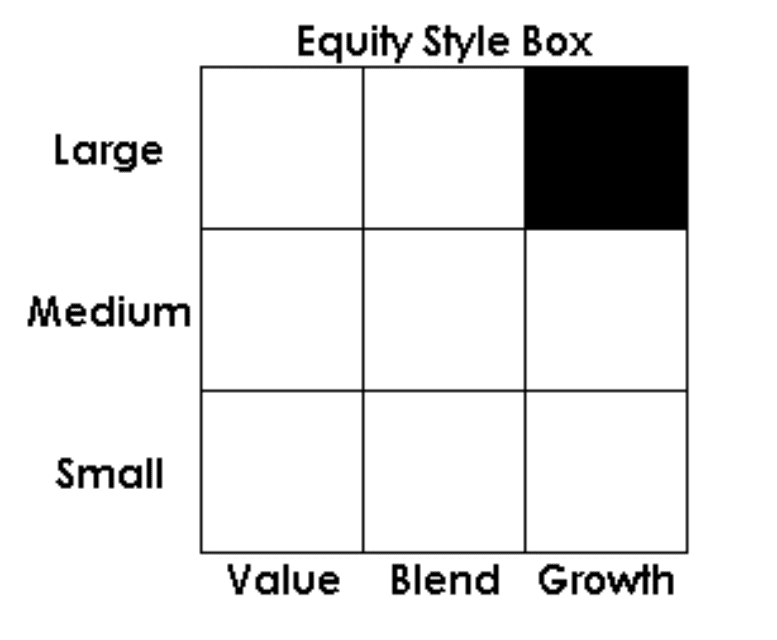

The financial landscape is undergoing a rapid transformation as novel and innovative investment strategies continue to emerge. At the forefront of this evolution is the integration of traditional investment instruments, such as mutual funds and index funds, with cutting-edge approaches like algorithmic trading. This convergence brings together the long-standing stability and diversification offered by mutual and index funds with the precision and speed characteristic of algorithmic trading systems.

This article examines how these distinct strategies can be combined to maximize investment returns while managing risk more effectively. By merging the conventional, human-driven insights of mutual fund strategies with the computational power and efficiency of algorithms, investors can significantly enhance portfolio performance. The strategic use of algorithmic trading can bring about advantages like rapid analysis and execution, which are crucial in today's fast-paced markets.



Moreover, understanding these strategies individually and their potential synergies is vital for adapting to the ever-changing investment environment. As technological advancements continue to reshape global markets, the ability to seamlessly integrate and leverage both traditional and modern investment techniques becomes paramount. Investors equipped with this knowledge are better positioned to navigate the complexities of the financial markets and achieve their investment objectives.

## Table of Contents

## Understanding Mutual Funds and Index Funds

Mutual funds are investment vehicles that pool capital from multiple investors to purchase a diversified portfolio of stocks, bonds, or other securities. These funds are managed by professional portfolio managers and are designed to offer diversified exposure to various asset classes, thereby reducing individual investment risk. The primary benefit of mutual funds is their ability to provide investors access to a diversified portfolio with a single investment, which can lead to lower risk due to the spreading of investment exposure across various assets.

In financial markets, index funds are a popular subset of mutual funds. They are specifically constructed to replicate the performance of a specific market index, such as the S&P 500. The goal of an index fund is not to outperform the market but to match the returns of the represented index. This approach inherently offers diversification across the many securities that constitute the index. Index funds tend to have lower management fees compared to actively managed mutual funds because index funds follow a passive investment strategy, which does not require extensive research and active trading.

Both mutual funds and index funds provide significant benefits to long-term investors, particularly those who seek stability and reduced risk. Diversification is one of the critical advantages of these funds, as it helps mitigate the risk that is inherent in investing in individual securities. By holding a large number of different investments, either through a mutual fund or an index fund, the impact of any single security's poor performance on the overall portfolio is minimized.

Cost efficiency is another attractive feature of index funds. They generally have lower expense ratios compared to actively managed funds, making them an affordable choice for investors. For instance, the expense ratio for index funds can range from 0.05% to 0.15%, while actively managed mutual funds can have expense ratios of 0.5% to 1.5% or higher. This cost advantage, combined with broad market exposure, makes index funds suitable for a wide range of investors, from beginners to those seeking to complement their existing portfolios with low-cost, diversified options.

Additionally, the professional management of mutual funds provides an extra layer of expertise, which can be valuable, especially in navigating complex and volatile market conditions. Fund managers employ various strategies, taking into account macroeconomic factors, sector trends, and company-specific information to make informed investment decisions on behalf of the shareholders. This professional oversight is particularly beneficial for investors who lack the time or resources to manage their own investment portfolios.

Thus, mutual funds and index funds both serve as effective investment strategies for achieving diversification, risk management, and cost-efficiency. Their structured design and professional management facilitate investors in aligning their financial goals with the dynamics of the broader financial markets.

## Investment Strategies for Mutual Funds

Mutual funds are investment vehicles that pool resources from multiple investors to invest in a diversified portfolio of securities. They offer two main management strategies: active management and passive management.

Active management involves portfolio managers selecting stocks, bonds, or other assets to outperform a benchmark index. These managers use research, forecasts, and their expertise to make informed investment decisions, aiming to generate higher returns than the market. The primary advantage of active management is the potential for higher returns; however, this approach typically incurs higher fees due to management and transaction costs. Additionally, active management requires accurate predictions about market movements, increasing the risk of underperformance if those predictions are incorrect.

Contrastingly, passive management seeks to mirror the performance of a specific index, such as the S&P 500, by holding a similar portfolio of assets. This strategy is often referred to as index investing. Passive management offers lower costs because it involves less frequent trading and does not require extensive market research. While the potential for returns equivalent to the market is significant, this method may underperform during market downturns if the chosen index declines.

Understanding the risk-return trade-off—where higher potential returns are associated with higher levels of risk—is crucial for investors selecting mutual fund strategies. Active management aims for higher returns with an acceptance of increased risk, while passive management provides stability by closely tracking market benchmarks, often at reduced cost and risk.

Diversification is another key principle in mutual fund investment strategies. By investing in a range of asset classes, such as equities, bonds, and commodities, an investor can mitigate risk through the spread of investments. This principle is based on the idea that the unsystematic risk, which is specific to individual stocks or sectors, can be reduced by holding a diversified portfolio.

Investors should align their investment horizon with their financial goals when selecting mutual fund strategies. Long-term investment horizons typically benefit from strategies that have the potential for capital appreciation, such as actively managed funds emphasizing [growth stocks](/wiki/growth-stocks) or sectors. Conversely, short-term investment objectives might demand more conservative approaches, like passively managed index funds, which offer [liquidity](/wiki/liquidity-risk-premium) and reduced [volatility](/wiki/volatility-trading-strategies).

In summary, selecting the right mutual fund strategy depends on an investor's risk tolerance, financial objectives, cost sensitivity, and investment timeline. Each management approach has its own set of advantages and limitations, highlighting the importance of choosing a strategy that aligns with one's individual financial context.

## Algorithmic Trading: A New Era of Investing

Algorithmic trading represents a transformative development in modern finance, utilizing automated processes to [carry](/wiki/carry-trading) out trades with unprecedented efficiency. By deploying pre-programmed instructions, [algorithmic trading](/wiki/algorithmic-trading) executes transactions at remarkable speeds and with high precision, surpassing the capabilities of traditional methods. This enhanced performance is largely attributable to its ability to process vast quantities of data and execute trades within fractions of a second.

Algorithmic trading strategies are diverse, with trend-following and [arbitrage](/wiki/arbitrage) being among the most prevalent. Trend-following strategies are designed to identify and exploit market [momentum](/wiki/momentum), executing trades that align with established movements in market prices. For example, a simple moving average crossover strategy might involve buying a security when a short-term moving average surpasses a long-term moving average, indicating an upward price trend.

Arbitrage strategies, on the other hand, seek to capitalize on price discrepancies across different markets or instruments. These strategies typically involve buying and selling equivalent assets to profit from temporary differences in prices, aiming for risk-free returns. The rapid identification and execution of these opportunities are critical, often achievable only through automated systems.

Programming languages like Python facilitate the development of algorithmic trading systems. Python, with libraries such as NumPy, pandas, and TA-Lib for technical analysis, allows for the construction of sophisticated trading models. Below is an example of a simple trend-following strategy in Python using moving averages:

```python
import pandas as pd
import numpy as np

# Load your data
data = pd.read_csv('stock_data.csv')
data['short_mavg'] = data['Close'].rolling(window=40).mean()
data['long_mavg'] = data['Close'].rolling(window=100).mean()

# Generate signals
data['signal'] = 0
data['signal'][40:] = np.where(data['short_mavg'][40:] > data['long_mavg'][40:], 1, 0)
data['positions'] = data['signal'].diff()

# Output signals
print(data[['Close', 'short_mavg', 'long_mavg', 'signal', 'positions']].tail())
```

This code calculates the short-term and long-term moving averages from historical price data to generate buy or sell signals, thereby automating the decision-making process.

The automation inherent in algorithmic trading significantly reduces human error and emotional bias. Automated systems adhere strictly to predefined rules, ensuring consistency and discipline in trading decisions. This objective approach mitigates the impulsivity and psychological influences that frequently impact human decision-making.

In summary, algorithmic trading not only enhances trade efficiency through speed and accuracy but also provides robust frameworks for executing complex strategies. By minimizing human intervention, it offers consistent results, establishing itself as a crucial component in the evolution of contemporary investment practices.

## Integrating Mutual Funds with Algo Trading

Integrating mutual funds with algorithmic trading enhances fund management through increased efficiency and strategic precision. By employing algorithmic trading, mutual funds can leverage technology to perform rapid analysis and execute trades swiftly. This capability ensures that portfolio adjustments are timely, maintaining an alignment with the overarching investment strategy.

Algorithmic trading systems can significantly reduce transaction costs. Traditional fund management often involves manual processes that can be slower and more costly. Algorithms, however, can analyze vast amounts of data to determine optimal trading times and conditions. This not only minimizes transaction fees but also enhances the cost-efficiency of mutual fund operations.

Moreover, algorithmic strategies diversify and reinforce portfolio resilience. Algorithms can assess and respond to real-time market changes, allowing for diversification beyond traditional methods. For instance, using trend-following algorithms helps capture opportunities across different market conditions. By swiftly reallocating assets based on predictive analytics, mutual funds can achieve a more balanced and resilient portfolio.

The synergy between human expertise and computational power forms the backbone of this integration. While algorithms offer speed and precision, human oversight remains essential for strategic decision-making and risk management. Portfolio managers can focus on high-level strategy and leverage the computational efficiency of algorithms for execution. Python, for example, can be used to automate simple trading strategies, such as mean reversion or momentum-based tactics, with libraries like Python's `pandas` and `numpy` handling data analysis and manipulation:

```python
import pandas as pd
import numpy as np

def moving_average_strategy(data, short_window, long_window):
    signals = pd.DataFrame(index=data.index)
    signals['signal'] = 0.0

    # Create short and long simple moving averages
    signals['short_mavg'] = data['price'].rolling(window=short_window, min_periods=1, center=False).mean()
    signals['long_mavg'] = data['price'].rolling(window=long_window, min_periods=1, center=False).mean()

    # Generate signals
    signals['signal'][short_window:] = np.where(signals['short_mavg'][short_window:] > signals['long_mavg'][short_window:], 1.0, 0.0)

    # Create trading orders
    signals['positions'] = signals['signal'].diff()

    return signals
```

In this Python code example, the moving average strategy uses two different timeframes to generate buy and sell signals, allowing mutual funds to automate certain aspects of trading. By combining such algorithmic approaches with human expertise, mutual funds can achieve a greater scale of efficiency and strategic adaptation in an ever-evolving financial landscape.

## Challenges and Considerations

Algorithmic trading, while offering significant advantages in terms of speed and efficiency, is not without its challenges and considerations. One of the primary risks associated with algorithmic trading is the potential for system failures. These failures can be attributed to hardware malfunctions, connectivity issues, or software bugs, leading to erroneous trades or missed market opportunities. For instance, a malfunctioning algorithm might execute trades at incorrect prices or excessive volumes, resulting in unintended financial losses.

Moreover, algorithmic trading is heavily reliant on technological infrastructure, necessitating a robust and resilient system to handle the high volumes and complexity of data. This reliance makes algorithmic trading susceptible to disruptions in technology, such as software outages or cyberattacks. Effective data management practices are crucial to ensure data accuracy and seamless operations. Investors need to invest in reliable and secure systems to mitigate these risks.

High-frequency trading, a subset of algorithmic trading, intensifies the competitive pressures associated with speed and execution. Firms engaged in high-frequency trading leverage their technological resources to execute trades in fractions of a second, necessitating sophisticated algorithms and cutting-edge hardware. This race for speed often leads to significant investments in low-latency technologies, such as direct market access and co-location services, which can pose a barrier for smaller firms lacking the financial capacity to compete effectively.

Regulatory compliance is another critical consideration for algorithmic traders. Financial markets are subject to evolving regulatory frameworks designed to ensure fair and transparent trading practices. These regulations often require firms to maintain detailed records of their trading algorithms and execution strategies. Adhering to these mandates requires algorithmic traders to implement rigorous compliance procedures and regularly update their systems to align with regulatory changes. Non-compliance can result in legal repercussions and financial penalties, undermining trading integrity and investor confidence.

Investors participating in algorithmic trading must remain informed about these risks and adaptable to changing market conditions and regulatory requirements. This involves continuous education and staying abreast of technological advancements and regulatory updates. By understanding and addressing these challenges, investors can enhance the robustness and sustainability of their algorithmic trading strategies, ensuring that they can effectively capitalize on the opportunities offered by this powerful investment approach.

## Conclusion

The integration of mutual funds, index funds, and algorithmic trading presents investors with a multitude of opportunities for enhancing portfolio performance. A thorough understanding of the complexities inherent in each strategy is vital for their successful implementation. Mutual and index funds offer passive and active management approaches, providing both diversification and risk management benefits. On the other hand, algorithmic trading introduces speed and precision to trade execution, utilizing data-driven insights and computational strength.

Technological advancements are significantly reshaping the investment landscape, highlighting the importance of adaptability among investors and fund managers. The convergence of traditional investment paradigms with modern algorithmic techniques not only amplifies potential returns but also strengthens the resilience of investment portfolios. By leveraging the greatest strengths of each approach—such as the cost-efficiency and broad market exposure of index funds, coupled with the precision and scalability of algorithmic trading—investors can foster synergies that enhance their strategic outlook.

To fully benefit from these integrated approaches, investors must remain committed to continuous learning and adaptation. The dynamic nature of financial markets necessitates a proactive stance in acquiring new knowledge and skills, ensuring that portfolios are continually optimized. Engaging with educational resources and staying updated with technological innovations can empower investors to make informed decisions, turning complex strategies into actionable insights for sustained growth.

## References & Further Reading

Bogle, J. C. (1999). *Common Sense on Mutual Funds: New Imperatives for the Intelligent Investor*. This book by John Bogle, the founder of Vanguard Group, provides insights into mutual fund investing, emphasizing low-cost index funds and the importance of a long-term investment strategy. It serves as a foundational reference for understanding mutual fund mechanisms and their benefits.

Malkiel, B. G. (2003). *A Random Walk Down Wall Street: The Time-tested Strategy for Successful Investing*. Burton Malkiel's book offers a comprehensive guide to various investment strategies, including index funds and their effectiveness compared to actively managed funds. The work supports the efficient market hypothesis and suggests a diversified portfolio to mitigate risk.

Narang, R. K. (2013). *Inside the Black Box: A Simple Guide to Quantitative and High-Frequency Trading*. This book by Rishi K. Narang provides a detailed overview of algorithmic and high-frequency trading. It demystifies complex quantitative strategies, making them accessible to investors interested in modern trading techniques.

Chan, E. P. (2009). *Quantitative Trading: How to Build Your Own Algorithmic Trading Business*. Ernie Chan’s book functions as a detailed manual for developing [quantitative trading](/wiki/quantitative-trading) strategies. It emphasizes practical implementation, discussing mathematical models and programming, predominantly in Python, for building an efficient trading system.

Investopedia and QuantConnect are recommended online platforms offering extensive educational materials on mutual funds and algorithmic trading. Investopedia provides a broad range of articles and tutorials catering to different investment levels, while QuantConnect offers a hands-on approach with algorithmic trading tutorials, data resources, and a community of algorithm developers.