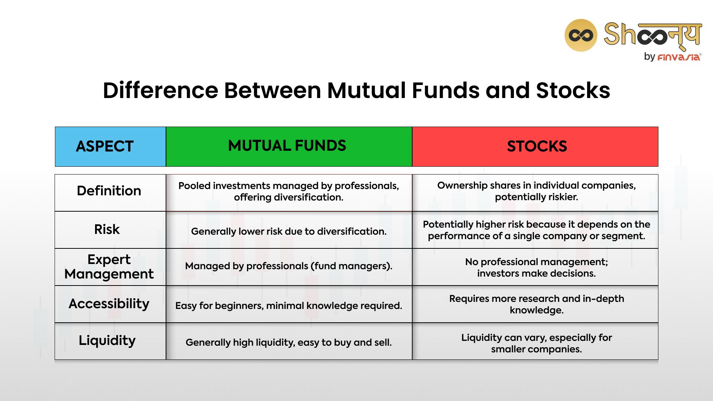

## Table of Contents

## What are mutual funds and how do they work?

Mutual funds are a type of investment where many people pool their money together to buy a variety of stocks, bonds, or other assets. This makes it easier for someone who doesn't have a lot of money to invest in a diverse range of investments. A professional manager runs the mutual fund, making decisions about which stocks or bonds to buy and sell, based on the fund's goals.

When you invest in a mutual fund, you buy shares of the fund. The price of each share, known as the net asset value (NAV), changes daily based on the value of the investments the fund holds. If the value of the stocks or bonds in the fund goes up, the NAV goes up, and your investment grows. If the value goes down, so does the NAV, and your investment loses value. Mutual funds can be a good way to grow your money over time, but they also come with risks, so it's important to choose funds that match your investment goals and risk tolerance.

## What are individual stocks and how do they work?

Individual stocks are pieces of ownership in a company. When you buy a stock, you become a part-owner of that company. The price of a stock goes up and down based on how well the company is doing and what people think about its future. If the company does well, the stock price usually goes up, and you can make money by selling your stock for more than you paid for it. But if the company does poorly, the stock price can go down, and you might lose money.

You can buy and sell stocks through a brokerage account, which you can set up online or through a financial institution. When you want to buy a stock, you place an order through your brokerage, and if someone is willing to sell at your price, the trade happens. You can hold onto the stock for as long as you want, hoping its value will increase. Stocks can be risky because their prices can be unpredictable, but they also offer the potential for high returns if you choose the right ones.

## What are the main differences between mutual funds and individual stocks?

Mutual funds and individual stocks are both ways to invest your money, but they work differently. Mutual funds are like a basket where many people put their money together to buy a mix of stocks, bonds, or other investments. A professional manager decides what to buy and sell. When you invest in a mutual fund, you buy shares of the whole basket, not just one company. This makes it easier to spread your risk because you're not betting all your money on one company.

Individual stocks, on the other hand, are pieces of ownership in a single company. When you buy a stock, you're betting that the company will do well and its stock price will go up. You can buy and sell stocks whenever you want through a brokerage account. Stocks can be riskier than mutual funds because if the company does poorly, you could lose a lot of money. But if you pick a good company, you might make more money than you would with a mutual fund.

The main difference between the two is how they let you invest. Mutual funds give you a way to own a little bit of many companies without having to pick them yourself, while individual stocks let you choose exactly which companies you want to invest in. This means mutual funds can be a simpler, less risky way to invest, while individual stocks can offer bigger rewards but also bigger risks.

## How does the level of risk compare between mutual funds and individual stocks?

Mutual funds are generally considered less risky than individual stocks. This is because mutual funds spread your money across many different companies or assets. If one company does badly, it won't hurt your whole investment as much because you own a piece of many companies. It's like not putting all your eggs in one basket. Also, a professional manager picks the investments, which can help lower the risk if they do a good job.

Individual stocks can be riskier because you're betting on just one company. If that company does well, you can make a lot of money. But if it does poorly, you could lose a lot too. It's like putting all your eggs in one basket. Picking the right stocks takes a lot of research and can be hard, so it's riskier than letting a mutual fund manager pick a mix of investments for you.

In the end, mutual funds offer a safer way to invest because they spread the risk, while individual stocks can offer bigger rewards but also come with bigger risks. It all depends on how much risk you're willing to take and how much time you want to spend [picking](/wiki/asset-class-picking) investments.

## What are the potential returns from investing in mutual funds versus individual stocks?

When you invest in mutual funds, you can expect steady but usually smaller returns compared to individual stocks. This is because mutual funds spread your money across many different investments, which makes them safer but also means they don't grow as fast as a single stock might. Over time, mutual funds can give you good returns, especially if you choose funds that match your goals and are managed well. But you won't see the big, quick gains that you might get from a single stock that does really well.

On the other hand, investing in individual stocks can lead to bigger returns if you pick the right companies. If a company you invest in does really well, its stock price can go up a lot, and you can make a lot of money. But it's also riskier because if the company does badly, you could lose a lot. So, while individual stocks can offer the chance for big rewards, they can also lead to big losses if things don't go as planned.

In the end, the choice between mutual funds and individual stocks depends on how much risk you're willing to take and what kind of returns you're looking for. Mutual funds are a safer bet with steady growth, while individual stocks can be a rollercoaster ride with the potential for big wins or big losses.

## How does the cost of investing in mutual funds compare to investing in individual stocks?

When you invest in mutual funds, you usually have to pay fees. These fees can include an expense ratio, which is a percentage of your investment that goes to the fund manager and other costs of running the fund. Some mutual funds also charge a sales load, which is a fee you pay when you buy or sell shares. These costs can add up over time and eat into your returns. So, even though mutual funds are a simple way to invest, the fees can make them more expensive than you might think.

Investing in individual stocks can be cheaper because you don't have to pay those ongoing fees that mutual funds charge. You might have to pay a small fee to your brokerage when you buy or sell a stock, but that's usually it. However, picking and managing your own stocks takes more time and effort. You need to do your own research and keep an eye on how your stocks are doing. So, while individual stocks can be less costly in terms of fees, they might cost you more in time and effort.

## What level of diversification can be achieved with mutual funds versus individual stocks?

Mutual funds offer a high level of diversification because they pool money from many investors to buy a wide range of stocks, bonds, or other assets. When you invest in a mutual fund, you own a small piece of all the investments the fund holds. This means your money is spread out across many different companies or types of investments, which can help lower your risk. Instead of betting on just one company, you're betting on a whole bunch of them. This makes it easier to protect your money if one or two investments don't do well.

On the other hand, individual stocks offer less diversification because you're buying shares in just one company at a time. If you want to diversify with individual stocks, you need to buy stocks from many different companies. This can be harder and take more time because you have to pick each stock yourself. If you only buy a few stocks, your money is tied to how those specific companies do, which can be riskier. So, while you can diversify with individual stocks, it takes more work and you might not get as much diversification as you would with a mutual fund.

## How does the management of investments differ between mutual funds and individual stocks?

When you invest in mutual funds, a professional manager takes care of your money. They decide which stocks, bonds, or other investments to buy and sell. This manager follows the goals of the fund, like trying to grow your money or keep it safe. You don't have to do anything except choose the fund and how much to invest. The manager does all the work, which can be good if you don't want to spend time picking investments yourself. But you have to pay them fees for managing your money, which can lower your returns.

With individual stocks, you are the one who manages your investments. You decide which companies to buy and sell. This means you need to do a lot of research to pick the right stocks and keep an eye on how they're doing. It can be more work, but it also gives you more control over your money. You don't have to pay a manager, so your costs can be lower. But if you don't pick good stocks, you could lose money. So, managing individual stocks takes more time and effort, but it can be rewarding if you do it well.

## What are the tax implications of investing in mutual funds compared to individual stocks?

When you invest in mutual funds, you have to think about taxes. Mutual funds can create what's called capital gains distributions. This happens when the fund manager sells investments that have gone up in value. You have to pay taxes on these gains, even if you didn't sell any of your own shares. Also, if you sell your mutual fund shares for more than you paid, you'll have to pay capital gains tax on that profit. The tax rate depends on how long you held the shares. If you held them for more than a year, you get a lower tax rate. But if you held them for less than a year, you pay a higher rate.

With individual stocks, you only pay taxes when you sell your shares for a profit. If you sell a stock for more than you paid, you have to pay capital gains tax on that profit. Just like with mutual funds, the tax rate depends on how long you held the stock. If you held it for more than a year, you pay a lower tax rate. If you held it for less than a year, you pay a higher rate. But with individual stocks, you don't have to worry about capital gains distributions like you do with mutual funds. This means you have more control over when you pay taxes.

## How does liquidity differ between mutual funds and individual stocks?

Liquidity means how easy it is to buy or sell an investment. With individual stocks, you can usually buy or sell them quickly during trading hours. If you want to sell a stock, you can do it right away through your brokerage account. This makes individual stocks very liquid. But sometimes, if you own a stock that's not very popular, it might take a bit longer to find someone to buy it from you.

Mutual funds are a bit different. You can't buy or sell them whenever you want like stocks. Instead, you can only buy or sell mutual fund shares at the end of each trading day. This is because the price of a mutual fund, called the net asset value (NAV), is calculated once a day after the market closes. So, if you want to sell your mutual fund shares, you have to wait until the end of the day to get your money. This makes mutual funds less liquid than individual stocks.

## What are the considerations for long-term versus short-term investment strategies in mutual funds and individual stocks?

When thinking about long-term investment strategies, mutual funds are often a good choice. They are designed to grow your money over many years. Because they spread your money across many different investments, they are less risky than betting on just one company. This makes them a safer way to save for things like retirement or buying a house. You can pick mutual funds that match your goals, like ones that focus on growth or ones that are more about keeping your money safe. Over time, mutual funds can give you steady returns, but you need to be patient because they usually don't make big, quick gains.

For short-term investment strategies, individual stocks can be more exciting but also riskier. If you pick the right stock, you might see your money grow quickly. But if you pick the wrong one, you could lose a lot. Stocks are good for short-term goals if you're willing to take the risk and you know what you're doing. You need to keep an eye on the market and be ready to buy and sell at the right times. Mutual funds can also be used for short-term goals, but they might not give you the quick gains you're looking for. So, for short-term investing, individual stocks can offer big rewards but also big risks, while mutual funds are safer but might not grow as fast.

## How do expert investors typically allocate their portfolios between mutual funds and individual stocks?

Expert investors often use a mix of mutual funds and individual stocks in their portfolios. They might put more of their money into mutual funds because they offer a safe way to grow money over time. Mutual funds spread the risk across many different investments, which is good for long-term goals like saving for retirement. Experts might choose different types of mutual funds, like ones that focus on growth or ones that are more about keeping their money safe. This helps them match their investments to their goals and how much risk they want to take.

For the part of their portfolio that's in individual stocks, expert investors might pick stocks they think will do well. They do a lot of research to find companies that have good chances of growing. They might use individual stocks for both short-term and long-term goals. For short-term goals, they might try to find stocks that can grow quickly, but they know this is riskier. For long-term goals, they might pick solid companies that they believe will do well over many years. By balancing mutual funds and individual stocks, expert investors can try to get the best of both worlds: the safety and steady growth of mutual funds, and the potential for big gains from individual stocks.

## References & Further Reading

- Sharpe, W. F. (1966). "Mutual Fund Performance." The Journal of Business. This paper provides a foundational analysis of mutual fund performance, exploring the risk-adjusted returns of mutual funds compared to benchmarks. It remains a key resource for understanding the evaluation of mutual funds.

- Lo, A. W., & MacKinlay, A. C. (1997). "Stock Market Prices Do Not Follow Random Walks: Evidence from a Simple Specification Test." This study challenges the Efficient Market Hypothesis by presenting evidence that stock prices do not follow a purely random walk, suggesting potential predictability in price movements.

- Scopino, G. "Algo Bots and the Law: Technology, Automation, and the Regulation of Futures and Other Financial Instruments." This work examines the implications of algorithmic trading, focusing on its legal and regulatory aspects, crucial for understanding the complexities of modern financial markets.

- Investopedia guides on investing, mutual funds, trading, and financial literacy. Investopedia offers comprehensive resources on various investment topics, helping individuals enhance their understanding of financial concepts and strategies.

These references provide foundational knowledge and critical insights into mutual funds, stock market behaviors, and the dynamics of [algorithmic trading](/wiki/algorithmic-trading), serving as valuable resources for investors seeking to deepen their understanding of different investment avenues.

