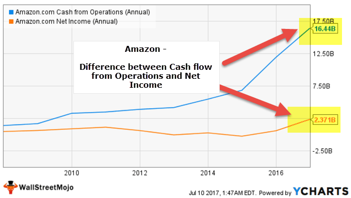

## Table of Contents

## What is operating cash flow?

Operating cash flow is the money a business makes from its regular operations. It shows how much cash is coming in and going out from the day-to-day activities like selling products or services, paying employees, and buying supplies. It's important because it tells you if a business can make enough money to keep running smoothly without needing to borrow money or sell assets.

You can find the operating cash flow on a company's cash flow statement. It's calculated by starting with the net income, then adding back non-cash expenses like depreciation, and making adjustments for changes in working capital, like accounts receivable and inventory. A positive operating cash flow means the company is generating enough cash to cover its operating expenses, which is a good sign of financial health.

## What is net income?

Net income is the money a business has left after it pays all its expenses. It's what you get when you take the total revenue, which is all the money coming in from sales and other sources, and subtract all the costs, like the cost of goods sold, operating expenses, taxes, and interest on loans. If a business makes more money than it spends, it has a positive net income, which is also called profit. If it spends more than it makes, it has a negative net income, or a loss.

You can find the net income at the bottom of a company's income statement. It's an important number because it shows how well a business is doing financially. Investors and business owners look at net income to see if the company is making money and to make decisions about the future. A high net income means the business is doing well, while a low or negative net income might mean the business needs to make changes to become profitable.

## How are operating cash flow and net income calculated?

Operating cash flow is calculated by starting with the net income and then making some adjustments. You add back any non-cash expenses like depreciation, which is the cost of using up assets over time. Then, you adjust for changes in working capital, which includes things like accounts receivable, inventory, and accounts payable. If accounts receivable go up, you subtract that increase because it means less cash is coming in. If inventory goes down, you add that decrease because it means more cash is available. The goal is to see how much cash the business is actually generating from its regular operations.

Net income is calculated by taking the total revenue and subtracting all the costs. Revenue is all the money coming into the business from sales and other sources. Costs include the cost of goods sold, which is what it costs to make or buy the products you sell, operating expenses like rent and salaries, taxes, and interest on any loans. If the revenue is more than the costs, the business has a positive net income, which means it made a profit. If the costs are more than the revenue, the business has a negative net income, which means it had a loss. Net income is found at the bottom of the income statement and shows how well the business is doing financially.

## Why is it important to compare operating cash flow and net income?

Comparing operating cash flow and net income helps you understand a business's financial health better. Net income shows if a business made a profit or a loss after all expenses. It's important, but it includes non-cash items like depreciation. Operating cash flow, on the other hand, tells you how much actual cash the business is making from its day-to-day operations. By looking at both, you can see if the business can pay its bills and keep running without needing to borrow money or sell assets.

For example, a business might show a good net income but have a low or negative operating cash flow. This could mean the business is not actually making enough cash to cover its costs, even if it looks profitable on paper. On the other hand, if a business has a high operating cash flow but a lower net income, it might be investing a lot in growth or paying off debts, which can be a good sign for the future. Comparing these two numbers helps investors and business owners make better decisions about the company's financial strategy and future plans.

## What are the key differences between operating cash flow and net income?

Operating cash flow and net income are two important numbers that tell you about a business's financial health, but they show different things. Net income is what's left after you take all the money a business makes and subtract all its costs. This includes things like the cost of making products, rent, salaries, taxes, and interest on loans. Net income tells you if a business made a profit or a loss, but it includes some costs that don't involve actual cash, like depreciation, which is the cost of using up assets over time.

Operating cash flow, on the other hand, tells you how much actual cash a business is making from its day-to-day operations. You start with the net income, add back any non-cash expenses like depreciation, and then adjust for changes in things like inventory and accounts receivable. If inventory goes down, it means more cash is available, so you add that to the operating cash flow. Operating cash flow shows if a business can pay its bills and keep running without needing to borrow money or sell assets.

Comparing these two numbers is important because they give you a fuller picture of a business's financial health. A business might show a good net income but have a low or negative operating cash flow, which means it's not actually making enough cash to cover its costs, even if it looks profitable on paper. On the other hand, a high operating cash flow with a lower net income might mean the business is investing in growth or paying off debts, which can be a good sign for the future.

## How can operating cash flow be higher than net income?

Operating cash flow can be higher than net income because net income includes some costs that don't involve actual cash. For example, depreciation is a cost that's subtracted from revenue to get net income, but it doesn't take any cash out of the business. When you calculate operating cash flow, you add back these non-cash expenses. So, if a business has a lot of depreciation, its operating cash flow will be higher than its net income.

Another reason is changes in working capital. Working capital includes things like inventory and accounts receivable. If a business sells off some inventory, it gets more cash, which increases its operating cash flow. But this sale doesn't affect net income because the cost of the inventory was already accounted for when it was bought. Similarly, if a business collects money it was owed (accounts receivable), that increases its cash flow but doesn't change its net income. So, these changes in working capital can make operating cash flow higher than net income.

## How can net income be higher than operating cash flow?

Net income can be higher than operating cash flow if a business has a lot of non-cash income. For example, if a business gets money from selling an asset like a building, that money is added to net income. But selling an asset doesn't count as part of the day-to-day business, so it's not included in operating cash flow. So, the net income goes up, but the operating cash flow stays the same or goes up by less.

Another reason net income can be higher is because of changes in working capital. If a business buys more inventory, it spends cash, which lowers its operating cash flow. But the cost of buying inventory isn't subtracted from net income right away. Instead, it's counted when the inventory is sold. So, the net income might be higher than the operating cash flow because the business hasn't sold the inventory yet.

## What does a discrepancy between operating cash flow and net income indicate about a company's financial health?

A discrepancy between operating cash flow and net income can tell you a lot about how well a company is doing. If operating cash flow is higher than net income, it might mean the company is doing a good job managing its day-to-day money. They might be selling off inventory or collecting money they were owed, which gives them more cash to use right away. But if net income is higher than operating cash flow, it could mean the company is making money from things that don't involve their regular business, like selling assets. This can be okay, but it's not as good as making money from selling products or services every day.

Understanding these differences helps you see if a company is really healthy. A big difference between the two numbers might mean the company is using accounting tricks to look better than it really is. For example, if net income is high but operating cash flow is low, the company might be making money on paper but not actually having enough cash to pay its bills. On the other hand, if operating cash flow is high and net income is low, the company might be investing a lot in its future, which can be a good sign. So, looking at both numbers together gives you a clearer picture of the company's financial health.

## How do non-cash expenses affect the comparison between operating cash flow and net income?

Non-cash expenses, like depreciation, can make a big difference when you compare operating cash flow and net income. Depreciation is the cost of using up things like buildings or machines over time. When you figure out net income, you subtract depreciation from your revenue, even though it doesn't take any actual money out of your pocket. But when you calculate operating cash flow, you add depreciation back in because it's not real cash going out. So, if a company has a lot of depreciation, its operating cash flow will be higher than its net income.

This difference is important because it shows you how much actual cash a business is making from its day-to-day work. If operating cash flow is a lot higher than net income, it might mean the business is doing well at managing its money and has enough cash to pay its bills. But if net income is higher than operating cash flow, it could mean the business is relying on things like selling assets to make money, which isn't as good as making money from selling products or services every day. So, looking at both numbers helps you understand the real financial health of a company.

## What role do changes in working capital play in the relationship between operating cash flow and net income?

Changes in working capital, like inventory and accounts receivable, can make a big difference when you compare operating cash flow and net income. Working capital is all about the money a business uses for its day-to-day operations. If a business buys more inventory, it spends cash, which makes its operating cash flow go down. But this cost isn't subtracted from net income right away. Instead, it's counted when the inventory is sold. So, if a business has a lot of inventory it hasn't sold yet, its net income might look higher than its operating cash flow.

On the other hand, if a business collects money it was owed or sells off some inventory, it gets more cash, which increases its operating cash flow. But this doesn't change the net income because the cost of the inventory was already accounted for when it was bought. So, if a business is good at managing its working capital, like collecting money quickly or keeping inventory low, its operating cash flow can be higher than its net income. This shows how important it is to look at both numbers to understand a business's real financial health.

## How can investors use the comparison of operating cash flow and net income to make investment decisions?

Investors can use the comparison of operating cash flow and net income to get a better idea of how healthy a company really is. If a company's operating cash flow is higher than its net income, it means the company is making good money from its day-to-day work. This is a good sign because it shows the company can pay its bills and keep running without needing to borrow money or sell things it owns. But if the net income is a lot higher than the operating cash flow, it might mean the company is making money from things that aren't part of its regular business, like selling off assets. This can be okay sometimes, but it's not as good as making money from selling products or services every day.

Looking at both numbers helps investors see if a company is using accounting tricks to look better than it really is. For example, if a company's net income looks high but its operating cash flow is low, it might mean the company is making money on paper but not actually having enough cash to pay its bills. On the other hand, if the operating cash flow is high and the net income is low, it might mean the company is investing a lot in its future, which can be a good sign. By comparing these two numbers, investors can make smarter choices about where to put their money, choosing companies that are not just profitable on paper but also good at managing their cash.

## What are some advanced analytical techniques for comparing operating cash flow and net income in-depth?

One advanced technique for comparing operating cash flow and net income is to use ratio analysis. Investors can look at the cash flow to net income ratio, which is calculated by dividing operating cash flow by net income. If this ratio is more than one, it means the company is making more cash from its operations than its net income shows. This is good because it means the company has enough cash to pay its bills and invest in growth. But if the ratio is less than one, it could mean the company is not making enough cash from its day-to-day work, even if it looks profitable on paper. By looking at this ratio over time, investors can see if the company's cash management is getting better or worse.

Another technique is to use trend analysis. This means looking at how operating cash flow and net income have changed over several years. If operating cash flow is growing faster than net income, it might mean the company is getting better at managing its cash and turning profits into actual money. But if net income is growing faster than operating cash flow, it could mean the company is relying more on non-cash income or other things that aren't part of its regular business. By looking at these trends, investors can see if a company's financial health is improving or if there are warning signs they need to watch out for.

A third technique is to use cash flow quality analysis. This looks at how much of a company's net income comes from actual cash and how much comes from accounting adjustments. High-quality cash flow means most of the net income is coming from real cash from operations, not just from things like selling assets or other non-operating activities. To do this, investors can compare the operating cash flow to net income and also look at other parts of the cash flow statement, like investing and financing activities. If a company has high-quality cash flow, it's a good sign that the company's profits are real and sustainable, which can help investors feel more confident about their investment decisions.

## What is Understanding Operating Cash Flow?

Operating cash flow (OCF) is a key indicator of a company's financial health and its ability to generate cash from its core operational activities. Unlike net income, which is influenced by non-cash items such as depreciation, OCF provides a clearer picture of the actual cash generated by the company. It is calculated by adjusting net income for changes in working capital and non-cash expenses, such as depreciation and amortization.

The formula for operating cash flow is typically expressed as:

$$

\text{OCF} = \text{Net Income} + \text{Non-Cash Expenses} + \Delta \text{Working Capital} 
$$

Where:

- **Net Income**: The profit of the company after all expenses, taxes, and costs are deducted.
- **Non-Cash Expenses**: These include depreciation and amortization, which are accounting measures that spread the cost of an asset over its useful life.
- **$\Delta$ Working Capital**: This term accounts for changes in accounts receivable, accounts payable, inventory levels, and other short-term assets and liabilities. It reflects the net cash used or provided by the company in its day-to-day operations.

OCF is integral in evaluating a company's ability to sustain operations without external financing. A positive OCF indicates that a company has sufficient funds to cover operating expenses and potentially invest in growth opportunities, such as capital expenditures or acquisitions, without needing additional debt or equity financing. Conversely, a negative OCF may suggest [liquidity](/wiki/liquidity-risk-premium) issues, which could necessitate the need for external funding sources to maintain operations.

In financial analysis, OCF is scrutinized alongside net income to assess a company's performance. Discrepancies between net income and OCF could signal potential red flags, such as aggressive revenue recognition or other non-cash accounting adjustments that inflate net income but do not translate into actual cash flow.

The stability and consistency of OCF are also critical indicators of sustainability, offering insights into how effectively a company manages its cash resources. Strong OCF performances may enhance investor confidence, reduce perceived risk, and contribute to higher valuations. Understanding operating cash flow, therefore, is essential for investors and analysts aiming to attain a realistic view of a company's financial strength and operational efficiency.

## What is Net Income and Why is it an Essential Financial Metric?

Net income, often referred to as the 'bottom line,' signifies the residual earnings of a company after all expenses, taxes, and interest have been deducted from total revenue. It is calculated using the formula:

$$
\text{Net Income} = \text{Total Revenue} - (\text{Total Expenses} + \text{Taxes} + \text{Interest})
$$

This metric serves as a fundamental indicator of a company's profitability, providing insights into the efficiency of a company's financial management and its overall capacity to generate profit. However, net income is not immune to the influence of accounting practices, which can obscure a company's true financial performance.

Different accounting methods, such as accrual or cash basis accounting, can significantly affect net income. For instance, through depreciation and amortization, companies can manipulate net income to some extent, portraying either a more favorable or less favorable financial position than what actual cash flows would suggest. These practices highlight the importance of evaluating net income in context, considering both the underlying accounting policies and any potential adjustments that might have been made to the reported figures.

Comparing net income with operating cash flow (OCF) can uncover potential discrepancies in financial health evaluations. While net income includes non-cash expenses and income, OCF focuses exclusively on the actual cash generated by a company’s operations. A significant divergence between net income and OCF can indicate issues such as aggressive revenue recognition or delayed payment of expenses, signaling the need for closer scrutiny.

For a full financial analysis, net income should be viewed in conjunction with OCF. While net income provides a picture of profitability, OCF offers a lens into cash liquidity and operational efficiency. Together, these metrics offer a balanced view of financial performance. For instance, a company with strong net income but weak OCF may face liquidity challenges, while strong OCF with moderate net income may indicate robust operational cash flows despite lower profitability due to high depreciation or amortization charges.

In conclusion, net income is a crucial, albeit complex, metric within financial analysis. Understanding its limitations and enhancing its evaluation by comparing it with OCF leads to a more comprehensive assessment of a company's true financial health.

## References & Further Reading

García, R., & Tsafack, G. (2011). *Dependence Structure and Risk Measurement in Algorithmic Trading*. This study provides an in-depth analysis of how dependence structures among financial variables can impact risk measurement in [algorithmic trading](/wiki/algorithmic-trading). The authors focus on statistical models that identify dependencies, which are critical in mitigating risk through enhanced trading algorithms.

Schroff, G., & Eydeland, A. (2010). *Algorithmic and High-Frequency Trading*. This book offers a comprehensive overview of the principles underlying algorithmic and high-frequency trading. It examines the technological advancements that enable rapid execution and decision-making, discussing how these can be integrated with financial metrics like operating cash flow and net income for robust algorithmic strategies.

Penman, S. (2013). *Financial Statement Analysis and Security Valuation*. This work explores the relationship between financial statements and stock valuation. It provides theoretical frameworks and practical examples on how metrics such as operating cash flow and net income are crucial for evaluating a company’s value, essential reading for integrating these metrics into trading algorithms.

Johnson, B. *Algorithmic Trading and DMA: An Introduction to Direct Access Trading Strategies*. A detailed guide on direct market access and algorithmic trading strategies, this book outlines methods to enhance execution leveraging real-time data and financial metrics. Understanding the synergy between financial statements and trading systems, Johnson's work provides actionable insights for traders aiming to refine their strategies.

These references offer a blend of theoretical and practical perspectives crucial for understanding the integration of operating cash flow and net income with algorithmic trading strategies. They collectively enhance the capability to perform sophisticated financial analysis that can be applied to improve trading decision-making and risk assessment.

