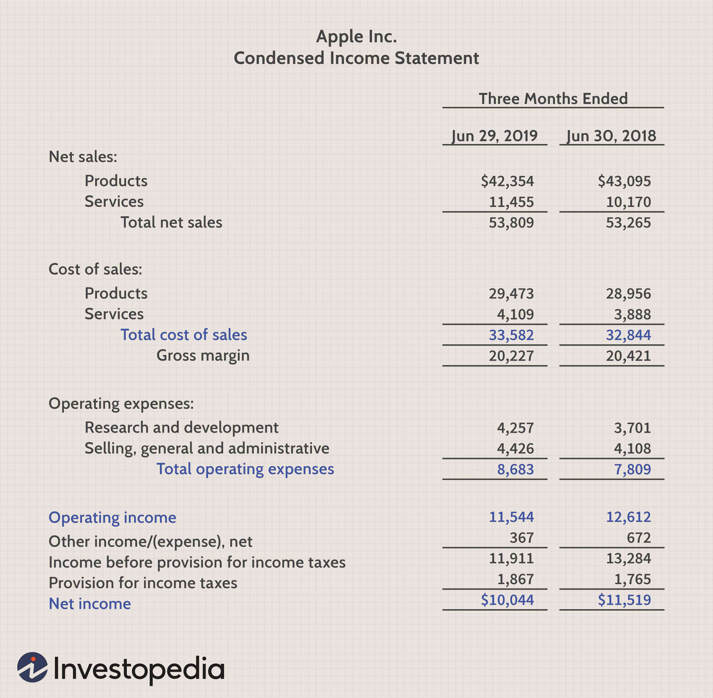

Algorithmic trading, commonly known as algo trading, leverages advanced computational algorithms to execute trading strategies autonomously, processing vast amounts of market data in milliseconds. This capability allows traders to capitalize on market fluctuations and arbitrage opportunities globally, with execution speeds that far surpass those achievable by human traders. Financial metrics such as revenue and operating income are essential for understanding a company's financial health and viability. Revenue, often referred to as the "top line," represents the total income generated from a company's core business activities. In contrast, operating income is the profit realized from these activities after accounting for operating expenses, providing a clear picture of operational efficiency and profitability.

In this article, we aim to explore and compare the roles of revenue and operating income within the framework of algorithmic trading and their implications on financial analysis and decision-making processes. By integrating these financial metrics into trading algorithms, traders can enhance their strategies' predictive accuracy and optimize decision-making in complex financial markets. Understanding the functionality and significance of these metrics not only aids in identifying lucrative trading opportunities but also contributes to the development of more robust and adaptive trading models. As algo trading continues to redefine the financial landscape, the incorporation of comprehensive financial data remains crucial in crafting successful trading strategies.



## Table of Contents

## Understanding Revenue and Operating Income

Revenue and operating income are fundamental financial metrics used to evaluate a company's financial performance. Revenue, often termed the "top line," signifies the total income generated from a company's primary business operations. It is the gross inflow of economic benefits resulting from regular business activities like sales of goods and services. Revenue is calculated as:

$$
\text{Revenue} = \text{Total Sales} - \text{Discounts} - \text{Returns}
$$

This metric serves as an initial indicator of a company’s capability to generate income through its core functions, reflecting customer demand and market effectiveness in the product or service offering.

Operating income, also referred to as operating profit, represents the revenue remaining after deducting operating expenses, which include costs of goods sold, wages, and any other direct expenses related to the primary business operations. It is calculated as follows:

$$
\text{Operating Income} = \text{Revenue} - \text{Operating Expenses}
$$

Operating income hence measures the profitability and efficiency from a company's primary business activities. A positive operating income indicates that a company has successfully managed its operational costs, leading to profitability from its core business activities.

Both revenue and operating income play crucial roles in providing insights into a company's operational health. High revenue may not always translate into high profitability if the operational costs are not managed well. Therefore, examining operating income alongside revenue allows for a more comprehensive understanding of a company’s financial health and operational efficiency.

Analyzing these metrics provides traders with a robust foundation for making informed decisions, particularly in [algorithmic trading](/wiki/algorithmic-trading), where understanding the nuances of a company's financial performance is crucial. By evaluating how effectively a company generates and manages its revenue, traders can identify potential investment opportunities and risks, helping them optimize their trading strategies and maximize returns.

## Relevance of Financial Metrics in Algorithmic Trading

In algorithmic trading, financial metrics serve a pivotal role in structuring potent trading strategies. These numerical insights not only quantify a company's financial performance but also guide algorithms in pinpointing market opportunities. Among these metrics, revenue and operating income are instrumental in evaluating a firm’s operational efficiency and profitability. 

Revenue, often regarded as the "top line," encapsulates the total income from a company’s core business operations. It reflects potential market interest and demand, offering insights into growth trajectories. This metric is a crucial input for trading algorithms aiming to uncover trends indicating robust market performance. For instance, consistent revenue growth may signal an expanding market presence, presenting an attractive opportunity for algorithmic trading strategies.

Operating income, on the other hand, measures the profitability resulting from primary business activities after accounting for operating expenses. It is a critical indicator of how well a company manages its costs in relation to its generated income. A higher operating income typically suggests superior operational efficiency, which can be leveraged by trading algorithms to assess firm competitiveness.

The integration of these metrics within algorithmic trading models is made more sophisticated through enhancements in data analytics and processing capabilities. Algorithms employ these metrics as foundational elements to refine the predictive accuracy of trading models. By analyzing revenue and operating income, algorithms can discern patterns that might not be immediately obvious, facilitating more informed and profitable trading decisions.

Python, a prevalent language in algorithmic trading due to its robust libraries and ease of use, enables traders to craft algorithms that incorporate these financial metrics. A basic implementation might look like:

```python
def evaluate_company(revenue, expenses):
    operating_income = revenue - expenses
    return operating_income

company_data = {
    'company_a': {'revenue': 500000, 'expenses': 300000},
    'company_b': {'revenue': 750000, 'expenses': 600000}
}

for company, data in company_data.items():
    operating_income = evaluate_company(data['revenue'], data['expenses'])
    print(f"{company}'s operating income: {operating_income}")
```

In this code, a simple function calculates the operating income using given revenue and expenses, demonstrating how trading models can utilize these metrics for basic financial assessment. This mechanized analysis allows traders to make swift, data-driven decisions that enhance trading efficacy in the challenging and competitive context of financial markets. By continuously integrating and evaluating these financial indicators, traders can optimize the performance of their algorithmic strategies, thereby maximizing returns.

## Comparing Revenue and Operating Income for Algo Trading

Revenue is a key indicator of a company's ability to generate income through its primary business operations. It reflects market interest and the firm's potential for growth, making it an essential metric for traders seeking high-growth opportunities in algorithmic trading. Revenue, often depicted as the 'top line' on an income statement, offers a snapshot of business performance without accounting for expenses. This focus on gross earnings provides traders with an immediate understanding of a company's market penetration and consumer engagement.

Contrastingly, operating income, or operating profit, emphasizes the effectiveness of cost management and profitability derived strictly from core operations. Unlike revenue, operating income accounts for operating expenses, offering a measure of operational efficiency. This metric is calculated by subtracting operating expenses, depreciation, and amortization from gross revenue. Thus, it provides traders with insights into the company's capability to manage costs and maintain profitability, highlighting operational health beyond initial revenue figures.

In algorithmic trading, integrating both revenue and operating income assists in the identification of undervalued stocks. Revenue signals market competitiveness and expansion potential, while operating income reveals how well resources are managed to sustain long-term profitability. Traders can develop algorithms that leverage these metrics by establishing criteria for price anomalies or growth trajectories. For instance, Python algorithms can be utilized to screen for stocks where the growth rate of operating income outpaces revenue growth, possibly indicating improved operational efficiency and overlooked market value.

```python
import pandas as pd

# Assume df is a DataFrame containing stock financial data with 'Revenue' and 'Operating Income'
df = pd.DataFrame({
    'Company': ['A', 'B', 'C'],
    'Revenue': [1000, 1500, 2000],
    'Operating Income': [200, 250, 300]
})

# Calculate the growth rate of Revenue and Operating Income
df['Revenue Growth'] = df['Revenue'].pct_change()
df['Operating Income Growth'] = df['Operating Income'].pct_change()

# Filter for companies where Operating Income growth outpaces Revenue growth
undervalued_stocks = df[df['Operating Income Growth'] > df['Revenue Growth']]
```

By systematically examining these metrics, traders can refine trading strategies, enhancing their ability to capitalize on growth and efficiency signals. This approach not only aids in identifying undervalued stocks but also fosters strategies that align trades with underlying financial health, thus optimizing decision-making in competitive markets.

## Developing an Algorithmic Strategy Using Financial Metrics

Algorithmic trading leverages precise financial data to formulate and execute trading strategies with efficiency and speed. To effectively utilize revenue and operating income in algorithmic trading, traders need to establish a systematic approach to gather and analyze this financial data. The first step in developing a robust algorithmic strategy is to ensure the accuracy of the financial metrics. This can be achieved by sourcing data from reputable financial information providers and performing periodic audits to verify data integrity.

Once accurate data is secured, traders must focus on identifying trends and anomalies within the revenue and operating income figures of targeted companies. Trends can highlight consistent growth or decline patterns, while anomalies might indicate potential market opportunities or risks. Traders can use statistical methods and [machine learning](/wiki/machine-learning) algorithms to analyze this data. For instance, time-series analysis can be useful to detect patterns or shifts in financial performance over a specific period.

Algorithms are then created to execute trades based on predefined criteria extracted from the analyzed financial data. These criteria may include specific thresholds for revenue and operating income changes or complex patterns identified through advanced data analysis techniques. For example, a trading algorithm might be programmed to initiate a buy order when a company's revenue surpasses its trailing average by a standard deviation, indicating potential upward [momentum](/wiki/momentum).

The efficacy of these algorithms must be tested through back-testing, which involves running the algorithm against historical data to evaluate its performance. Back-testing helps in understanding how the strategy would have performed in past market conditions and uncovers potential weaknesses. Here is a simple Python code example for back-testing:

```python
import pandas as pd
import numpy as np

# Sample data for revenue and operating income
data = {'date': pd.date_range(start='2020-01-01', periods=100, freq='D'),
        'revenue': np.random.normal(loc=100, scale=10, size=100),
        'operating_income': np.random.normal(loc=20, scale=5, size=100)}
df = pd.DataFrame(data)

# Define trading signals based on a moving average of revenue
df['revenue_ma'] = df['revenue'].rolling(window=10).mean()
df['signal'] = np.where(df['revenue'] > df['revenue_ma'], 1, 0)

# Back-testing strategy
initial_capital = 10000
df['strategy_returns'] = df['signal'].shift(1) * df['revenue'].pct_change()
portfolio_value = initial_capital * (1 + df['strategy_returns']).cumprod()

print(f"Final Portfolio Value: {portfolio_value[-1]}")
```

Continuous optimization is essential to enhance the performance of these strategies in evolving market environments. Optimization involves refining the algorithm by adjusting the parameters and incorporating new data points or methodologies. Traders can employ techniques such as genetic algorithms or [reinforcement learning](/wiki/reinforcement-learning) to optimize and improve strategy adaptability.

Finally, given the dynamic nature of financial markets, periodic review and real-time monitoring of the algorithm's performance is crucial. This ensures that the strategy remains aligned with current market conditions and promptly responds to unexpected changes or anomalies in revenue and operating income data. By continuously refining and adapting these strategies, traders can maximize their success in the competitive algorithmic trading landscape.

## Challenges and Considerations

Integrating revenue and operating income into algorithmic trading requires careful consideration to effectively address several significant challenges. A primary concern is ensuring the accuracy of financial data. The data used in algorithms must be reliable, as incorrect or outdated financial statements can lead to faulty decisions, impacting profitability. Traders must implement robust data validation processes, frequently updated data sources, and employ data cleansing techniques to minimize errors. Methods such as cross-validation with independent data sets can enhance data reliability.

Another challenge is the inherent [volatility](/wiki/volatility-trading-strategies) of financial markets. Revenue and operating income, while indicative of a company's financial health, may not immediately reflect sudden market changes such as geopolitical events or regulatory shifts. Algorithms need to incorporate mechanisms to account for volatility and abrupt shifts. This might involve integrating stop-loss orders or volatility filters that temporarily halt trading under extreme market conditions.

Moreover, traders must acknowledge the limitations of relying solely on revenue and operating income. These metrics do not capture qualitative aspects of company performance such as brand value or customer satisfaction, which can also influence stock prices. To enhance strategy robustness, traders should incorporate additional data points such as cash flow statements, market trends, or macroeconomic indicators. 

On an operational level, ongoing monitoring and adjustment of trading strategies are crucial. Algorithms should include adaptive learning capabilities to update based on real-time market data, identifying patterns and anomalies. This might involve machine learning models that continuously improve prediction accuracy based on historic and incoming data.

In conclusion, while revenue and operating income are vital components in algorithmic trading strategies, traders must navigate challenges related to data accuracy and market volatility. Incorporating complementary datasets and ensuring continuous strategy optimization will bolster trading effectiveness in ever-shifting markets.

## Conclusion

Revenue and operating income serve as fundamental indicators of a company's financial condition and are crucial for the development of effective algorithmic trading strategies. By incorporating these financial metrics into their trading algorithms, traders can enhance their decision-making capabilities, ensuring that their strategies are aligned with underlying financial realities rather than purely speculative trends. This application of financial data aids in identifying trading opportunities, evaluating stock performance, and anticipating market movements, which are essential for making informed trading decisions.

In the dynamic environment of financial markets, the integration and continuous refinement of diverse data sources, including revenue and operating income, can significantly bolster the effectiveness of algorithmic trading. Market conditions can change rapidly; therefore, algorithms that utilize comprehensive data inputs are more adaptable and resilient. This flexibility ensures that trading strategies remain relevant and effective amidst fluctuations in the market landscape.

Furthermore, the predictive accuracy of trading models can be substantially improved by embedding financial metrics systematically. For example, trading algorithms can be coded to execute trades based on specific financial criteria or thresholds. Consider a Python code snippet where hypothetical revenue and operating income data are used to signal trading activity:

```python
def evaluate_financials(revenue, operating_income):
    if revenue > 1000000 and operating_income / revenue > 0.2:
        return "Buy"
    elif revenue < 1000000 and operating_income / revenue < 0.1:
        return "Sell"
    else:
        return "Hold"
```

This simple logic helps in automating trading decisions based on financial performance metrics, providing a structured approach to trading. However, aligning financial metrics with market trends requires ongoing monitoring and algorithm enhancement. This dynamic adjustment helps maintain strategy performance even as market conditions evolve.

In conclusion, the strategic use of revenue and operating income in algo trading underscores the importance of grounding trading strategies in reliable financial performance indicators. As markets become increasingly data-driven, the ability to synthesize and act upon diverse financial data will distinguish successful traders in the ever-competitive financial markets.

## References & Further Reading

1. **Financial Analysis Textbooks:**
   - _"Financial Statement Analysis and Security Valuation"_ by Stephen H. Penman provides a comprehensive guide on interpreting financial statements and valuing securities, making it an essential resource for understanding revenue and operating income within a broader financial context.
   - _"Investment Valuation: Tools and Techniques for Determining the Value of Any Asset"_ by Aswath Damodaran is another seminal work offering insight into valuation techniques, critical for algo trading strategies.

2. **Algorithmic Trading Strategy Guides:**
   - _"Algorithmic Trading: Winning Strategies and Their Rationale"_ by Ernest P. Chan explores automated trading systems' quantitative strategies, which can incorporate financial metrics like revenue and operating income.
   - _"Quantitative Trading: How to Build Your Own Algorithmic Trading Business"_ by Ernie Chan provides practical guidance on creating a trading business, emphasizing the integration of quantitative methods.

3. **Notable Finance Publications:**
   - "The Journal of Trading" is a specialized publication focusing on trading strategies, techniques, and technology in trading, offering case studies and insights relevant to algo trading.
   - "The Journal of Financial Markets" examines the interaction of financial markets and trading practices, providing empirical research that can enhance understanding of market dynamics.

4. **Online Resources and Platforms:**
   - Websites such as Investopedia and Seeking Alpha offer accessible explanations and updates on market trends, financial metrics, and trading strategies.
   - Online courses from platforms like Coursera or edX often feature modules on financial analysis and algorithmic trading, providing structured learning paths.

These resources provide a foundational and advanced understanding of financial metrics application in algorithmic trading, assisting traders and analysts in refining their methodologies and enhancing trading performance.

