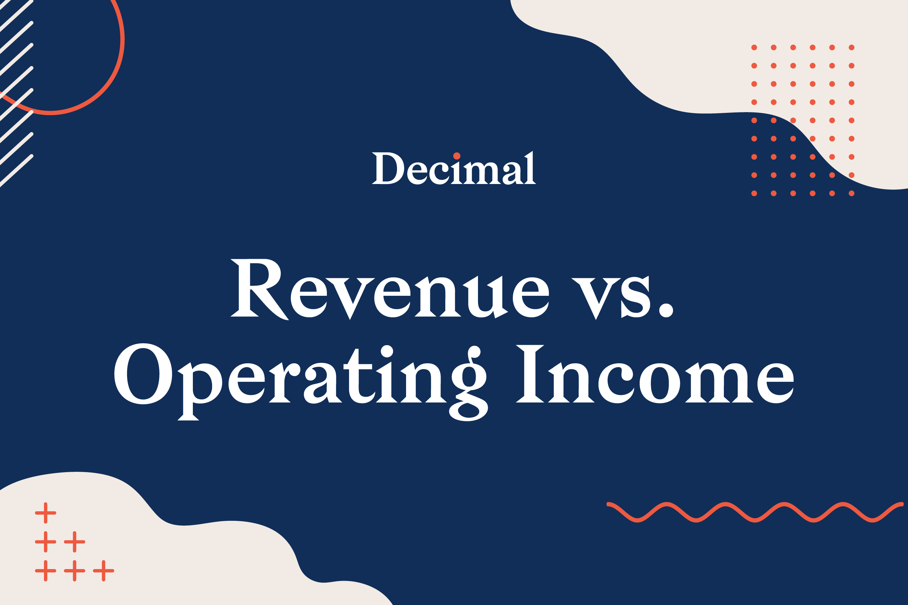

## Table of Contents

## What is operating income?

Operating income is the money a company makes from its main business activities, after paying for the costs of running those activities. It's like figuring out how much profit a business makes from doing what it does best, without counting other income or expenses that aren't related to its main job. For example, if a company sells shoes, operating income would be the profit from selling shoes after paying for things like the cost of making the shoes, paying employees, and renting the store.

To find operating income, you start with the company's total revenue, which is all the money it makes from selling its products or services. Then, you subtract the cost of goods sold, which is what it costs to make or buy the products. After that, you subtract operating expenses, which are the costs of running the business, like salaries, rent, and utilities. What's left is the operating income. This number is important because it shows how well the company is doing at its core business, before considering things like taxes or interest on loans.

## What is revenue?

Revenue is the total amount of money a business earns from selling its products or services. It's like the income a company gets before it has to pay for anything. Imagine you run a lemonade stand; every dollar you get from selling lemonade is part of your revenue. It's the starting point for figuring out if a business is doing well because it shows how much money is coming in.

However, revenue doesn't tell the whole story. It doesn't account for the costs of making or selling those products or services. For example, if you spend money on lemons and sugar for your lemonade, those costs aren't subtracted from your revenue. So, while high revenue is good, a business also needs to look at its expenses to see if it's actually making a profit.

## How are operating income and revenue different?

Revenue is all the money a business makes from selling its products or services. It's like the total income before any costs are taken out. For example, if you sell cookies and you make $100 from selling them, that $100 is your revenue. It's the starting point for figuring out how well a business is doing because it shows how much money is coming in.

Operating income, on the other hand, is what's left after you subtract the costs of running the business from the revenue. It's like figuring out how much profit you make from your main business activities. Using the cookie example, if it costs you $60 to make the cookies and another $20 to run your cookie stand, your operating income would be $100 (revenue) minus $60 (cost of goods sold) minus $20 (operating expenses), which equals $20. Operating income shows how well the business is doing at its core, after paying for the costs of making and selling the product.

So, the main difference is that revenue is the total money coming in, while operating income is what's left after you pay for the costs of running the business. Revenue gives you a broad picture of income, but operating income tells you more about the actual profit from the main business activities.

## Why is it important to compare operating income and revenue?

Comparing operating income and revenue is important because it helps you understand how well a business is doing at its core activities. Revenue tells you how much money is coming in from selling products or services, but it doesn't show you if the business is actually making money after paying for things like making the product or running the business. Operating income, on the other hand, shows you the profit after these costs are taken out. By looking at both, you can see if the business is good at bringing in money and if it's good at keeping that money after paying for the costs.

This comparison also helps in spotting trends and making decisions. If revenue is going up but operating income is staying the same or going down, it might mean that costs are getting too high. This could be a signal to look closer at where the money is being spent and see if there are ways to cut costs or raise prices. On the other hand, if both revenue and operating income are growing, it's a good sign that the business is healthy and doing well at both making money and managing costs. Understanding this relationship helps business owners and investors make better choices about where to focus their efforts and resources.

## How do you calculate operating income from revenue?

To calculate operating income from revenue, you start with the total revenue, which is all the money a business makes from selling its products or services. Then, you subtract the cost of goods sold, which is what it costs to make or buy the products. For example, if you run a lemonade stand and you make $100 from selling lemonade, that's your revenue. If it costs you $40 to buy lemons and sugar, that's your cost of goods sold. So, you subtract $40 from $100, leaving you with $60.

Next, you need to subtract the operating expenses from the amount you have after subtracting the cost of goods sold. Operating expenses are the costs of running the business, like paying for rent, utilities, and salaries. Continuing with the lemonade stand example, if it costs you $20 to rent the stand and pay for other expenses, you subtract that from the $60 you had left after the cost of goods sold. So, $60 minus $20 equals $40. That $40 is your operating income, which shows how much profit you made from your main business activities after paying for all the costs involved.

## What factors can affect the relationship between operating income and revenue?

Several things can change how operating income and revenue are related. One big thing is the cost of goods sold. If it costs more to make or buy what you're selling, then even if you're making more money from sales (revenue), your operating income might not go up as much or could even go down. For example, if a bakery starts using more expensive flour, the cost of goods sold goes up, which can lower the operating income even if the bakery sells more bread.

Another thing that affects this relationship is operating expenses. These are the costs to run the business, like rent, salaries, and utilities. If these costs go up, it can eat into the operating income. Imagine a coffee shop that has to pay more for rent because of a new lease agreement. Even if they sell more coffee and have higher revenue, the higher rent could mean less operating income. So, keeping an eye on these costs is important for understanding how revenue turns into operating income.

## Can operating income be higher than revenue?

No, operating income can't be higher than revenue. Revenue is all the money a business makes from selling its products or services. It's like the total income before any costs are taken out. Operating income, on the other hand, is what's left after you subtract the costs of running the business from the revenue. So, operating income is always going to be less than or equal to revenue because you're taking money away from the total to cover costs.

Think of it like this: if you sell lemonade and make $100, that's your revenue. But to make that lemonade, you spent $40 on lemons and sugar, and another $20 on renting your stand. After you subtract those costs, you're left with $40, which is your operating income. There's no way for the operating income to be more than $100 because you started with $100 and then took money away to pay for things. So, operating income will always be less than or equal to revenue.

## How do businesses use the comparison of operating income and revenue in decision-making?

Businesses look at how operating income and revenue compare to make smart choices. If revenue is going up but operating income isn't, it might mean that the costs of making or selling the product are too high. This can help business owners see if they need to find cheaper ways to make their product or if they should raise prices. By keeping an eye on this, they can figure out if their main business activities are doing well and making money.

For example, if a toy store sees that its revenue is growing because it's selling more toys, but the operating income isn't growing as fast, it might be spending too much on things like rent or employee salaries. The store owner could decide to move to a cheaper location or find ways to cut other costs. By comparing these two numbers, the business can make better decisions about where to spend money and how to keep more of the money they make from sales.

## What are common industry benchmarks for the ratio of operating income to revenue?

The ratio of operating income to revenue, often called the operating margin, can be different depending on the industry. For example, in the tech industry, a good operating margin might be around 20% to 30%. This means that for every dollar of revenue, the company keeps 20 to 30 cents as operating income after paying for the costs of making and selling their products. In retail, the operating margin might be lower, often around 5% to 10%, because retail businesses usually have higher costs for things like inventory and store operations.

These benchmarks help businesses see how well they're doing compared to others in their industry. If a tech company has an operating margin of 15%, it might want to look at ways to cut costs or increase prices to get closer to the industry average. On the other hand, a retail business with an operating margin of 8% might be doing well if the average for its industry is around 6%. By understanding these benchmarks, businesses can make better decisions about how to improve their operations and stay competitive.

## How does the comparison of operating income and revenue vary across different industries?

The way businesses look at operating income and revenue can be different depending on what industry they are in. For example, in the tech industry, companies often have higher operating margins, which means they keep a bigger part of their revenue as operating income after paying for costs. A good operating margin in tech might be around 20% to 30%. This is because tech companies usually don't have as many costs for things like making physical products. On the other hand, in the retail industry, the operating margin is usually lower, often around 5% to 10%. Retail businesses have to spend more on things like buying inventory and running stores, so they don't keep as much of their revenue as operating income.

These differences in operating margins across industries help businesses see how they are doing compared to others in their field. A tech company with an operating margin of 15% might want to find ways to cut costs or increase prices to get closer to the industry average. Meanwhile, a retail business with an operating margin of 8% might be doing well if the average for its industry is around 6%. By understanding these industry benchmarks, businesses can make better decisions about how to improve their operations and stay competitive.

## What are the limitations of using operating income and revenue for financial analysis?

Using operating income and revenue for financial analysis can be helpful, but it has some limits. One big limit is that these numbers don't show the whole picture of a business's money situation. For example, they don't include other important things like taxes, interest on loans, or one-time costs that can affect how much money a business really has. So, if a company has a lot of debt and has to pay a lot of interest, looking at just operating income and revenue might make the business look healthier than it really is.

Another limit is that operating income and revenue can be affected by things outside the business's control, like changes in the economy or new laws. If the economy is doing badly, a company might sell less and have lower revenue, even if it's doing everything right. Also, different industries have different normal levels of operating income and revenue, so comparing companies from different industries using just these numbers can be misleading. It's important to look at other financial measures too, to get a full understanding of how a business is doing.

## How can advanced statistical methods enhance the analysis of operating income and revenue trends?

Advanced statistical methods can make understanding operating income and revenue trends much clearer. For example, using something called time series analysis can help businesses see patterns over time. This means they can predict how their revenue and operating income might change in the future. By looking at past data, businesses can see if there are seasonal patterns, like selling more during holidays, or if there are long-term trends, like steady growth over years. This can help them plan better and make smarter decisions about where to spend money or how to grow.

Another useful method is regression analysis. This helps businesses figure out which things affect their operating income and revenue the most. For example, a company might use regression to see if raising prices or cutting costs has a bigger impact on their operating income. By understanding these relationships, businesses can focus on the things that really make a difference. Using these advanced methods can give a deeper understanding of how different parts of the business work together and help make better financial decisions.

## What is the relationship between revenue and operating income?

Revenue and operating income are fundamental financial metrics used to evaluate a company's financial performance. Revenue, often termed the "top line," signifies the total income generated from a company's primary business operations. It is the gross inflow of economic benefits resulting from regular business activities like sales of goods and services. Revenue is calculated as:

$$
\text{Revenue} = \text{Total Sales} - \text{Discounts} - \text{Returns}
$$

This metric serves as an initial indicator of a company’s capability to generate income through its core functions, reflecting customer demand and market effectiveness in the product or service offering.

Operating income, also referred to as operating profit, represents the revenue remaining after deducting operating expenses, which include costs of goods sold, wages, and any other direct expenses related to the primary business operations. It is calculated as follows:

$$
\text{Operating Income} = \text{Revenue} - \text{Operating Expenses}
$$

Operating income hence measures the profitability and efficiency from a company's primary business activities. A positive operating income indicates that a company has successfully managed its operational costs, leading to profitability from its core business activities.

Both revenue and operating income play crucial roles in providing insights into a company's operational health. High revenue may not always translate into high profitability if the operational costs are not managed well. Therefore, examining operating income alongside revenue allows for a more comprehensive understanding of a company’s financial health and operational efficiency.

Analyzing these metrics provides traders with a robust foundation for making informed decisions, particularly in [algorithmic trading](/wiki/algorithmic-trading), where understanding the nuances of a company's financial performance is crucial. By evaluating how effectively a company generates and manages its revenue, traders can identify potential investment opportunities and risks, helping them optimize their trading strategies and maximize returns.

## References & Further Reading

1. **Financial Analysis Textbooks:**
   - _"Financial Statement Analysis and Security Valuation"_ by Stephen H. Penman provides a comprehensive guide on interpreting financial statements and valuing securities, making it an essential resource for understanding revenue and operating income within a broader financial context.
   - _"Investment Valuation: Tools and Techniques for Determining the Value of Any Asset"_ by Aswath Damodaran is another seminal work offering insight into valuation techniques, critical for algo trading strategies.

2. **Algorithmic Trading Strategy Guides:**
   - _"Algorithmic Trading: Winning Strategies and Their Rationale"_ by Ernest P. Chan explores automated trading systems' quantitative strategies, which can incorporate financial metrics like revenue and operating income.
   - _"Quantitative Trading: How to Build Your Own Algorithmic Trading Business"_ by Ernie Chan provides practical guidance on creating a trading business, emphasizing the integration of quantitative methods.

3. **Notable Finance Publications:**
   - "The Journal of Trading" is a specialized publication focusing on trading strategies, techniques, and technology in trading, offering case studies and insights relevant to algo trading.
   - "The Journal of Financial Markets" examines the interaction of financial markets and trading practices, providing empirical research that can enhance understanding of market dynamics.

4. **Online Resources and Platforms:**
   - Websites such as Investopedia and Seeking Alpha offer accessible explanations and updates on market trends, financial metrics, and trading strategies.
   - Online courses from platforms like Coursera or edX often feature modules on financial analysis and algorithmic trading, providing structured learning paths.

These resources provide a foundational and advanced understanding of financial metrics application in algorithmic trading, assisting traders and analysts in refining their methodologies and enhancing trading performance.

