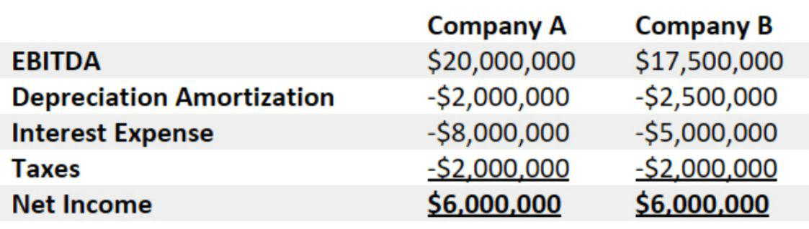

Understanding key financial metrics is essential for traders and investors navigating today's fast-paced financial markets. Among these metrics, Earnings Before Interest, Taxes, Depreciation, and Amortization (EBITDA) and operating margin stand out for their role in offering insights into a company's financial health and operational efficiency. This article explores how these specific metrics can be utilized within the context of algorithmic trading.

Algorithmic trading has significantly transformed the finance industry by allowing for data-driven, systematic trading decisions. This method leverages complex algorithms that utilize various financial data inputs to make trading decisions, often executing trades at speeds and frequencies that are impossible for human traders. A critical component of these algorithms is the integration of key financial metrics, such as EBITDA and operating margin, which provide valuable insights to traders.



EBITDA serves as an indicator of a company’s profitability by focusing on earnings that exclude the impacts of financial and accounting decisions that do not reflect the company's core business performance. It effectively removes non-operational expenses to provide a clearer view of how profitable a company’s core operations are. This can be particularly insightful when comparing companies with different tax environments and capital structures, offering a more standardized metric for assessing operating performance.

Operating margin, on the other hand, demonstrates a company’s efficiency in turning revenue into profit after accounting for variable costs of production. Expressed as a percentage, it highlights the proportion of a company’s revenue that is left as profit after operational expenses. This is vital for understanding operational efficiency and cost management within a company.

Together, EBITDA and operating margin are integrated into algorithmic trading systems to enhance the robustness of trading strategies. These metrics aid in the assessment of the fundamental strength of companies, providing critical data for algorithms that predict market movements and make informed trading decisions. With these tools, algorithmic traders can not only identify undervalued stocks and lucrative market opportunities but can also swiftly adjust their strategies in response to changes in these financial indicators.

The use of mathematical models and computational power in algorithmic trading underscores the necessity for accurate financial information. By systematically integrating financial metrics, algorithmic trading results in strategies that are optimized and effective in capturing the potential for profitability in financial markets. As such, understanding and applying financial metrics like EBITDA and operating margin in algorithmic trading frameworks is crucial for gaining a competitive edge in today's financial environment.

## Table of Contents

## Understanding EBITDA

EBITDA, an acronym for Earnings Before Interest, Taxes, Depreciation, and Amortization, is a financial metric widely used to assess a company's operational profitability. Unlike net income, EBITDA focuses solely on the operational aspects of a business by eliminating the effects of financial and accounting decisions that are subject to variations based on tax environments and accounting methods. The exclusion of interest, taxes, depreciation, and amortization makes EBITDA a useful metric for comparing companies across different industries with varying capital structures and tax regimes.

One of the primary advantages of using EBITDA is its ability to provide a clearer view of a company's core business performance. By stripping out non-operating expenses, EBITDA highlights how effectively a company is managing its operational costs relative to its revenue. This focus allows investors and analysts to better assess the efficiency of a company's operational management without the noise of non-operational financial factors.

EBITDA is often preferred when comparing firms across industries because it normalizes profitability metrics. Industries can differ significantly in terms of capital intensity and tax obligations, which can skew net income comparisons. EBITDA's ability to provide a standard measurement of profitability irrespective of these differences facilitates a more apples-to-apples comparison.

Moreover, EBITDA is instrumental in offering insights into a company's cash flow. While it is not a perfect proxy for cash flow, EBITDA remains a practical measure of the cash-generating ability of a company's operations, excluding the impact of capital investment. This perspective is important for evaluating a company's potential for reinvestment and growth, as it represents the earnings available to reinvest in business expansion, repay debt, or distribute to shareholders.

Additionally, understanding EBITDA can help in evaluating the enterprise value of a company. Enterprise Value to EBITDA (EV/EBITDA) is a common valuation ratio that offers a comparison of a company's value to its operational performance, providing the ability to compare valuation levels across peers and industries.

In summary, EBITDA offers a clear lens into a company's core operating performance by stripping out extraneous financial variables. It is a robust tool for comparing companies with diverse tax burdens and capital structures, and it provides valuable insights into operational cash flow potential, making it an essential metric for investors and analysts alike.

## What is Operating Margin?

Operating margin is a key financial metric that evaluates a company’s ability to convert sales into profit after accounting for its operating expenses. This metric is calculated by dividing operating income by total revenue and is typically expressed as a percentage. The formula is:

$$
\text{Operating Margin} = \left( \frac{\text{Operating Income}}{\text{Total Revenue}} \right) \times 100
$$

Operating income is derived from a company's core business activities, excluding any income generated from additional investments, taxes, and interests. This focus ensures that the metric provides insights strictly into the company's core operational efficiency, offering a clear picture of how well the entity manages its cost structure relative to its revenue generation.

The significance of the operating margin lies in its ability to reflect the firm's efficiency in controlling costs and the effectiveness of its operational strategy. A higher operating margin is generally indicative of robust cost management and superior operational execution, suggesting that the company can effectively manage its expenses in relation to its revenue. This gives a concrete indication of a company's overall health and its ability to generate profits from its core business functions.

Analyzing the trends in operating margin over time can help investors and stakeholders determine whether a company is improving in terms of cost efficiency and operational effectiveness. A rising operating margin signals improvements, whereas a declining trend might indicate potential challenges in maintaining cost control or revenue generation. By understanding these trends, investors can make more informed decisions regarding the company's operational soundness and future potential.

## Role of EBITDA and Operating Margin in Algo Trading

Financial metrics such as EBITDA (Earnings Before Interest, Taxes, Depreciation, and Amortization) and operating margin are pivotal in the development of advanced trading algorithms. These metrics are vital for evaluating the fundamental strength of companies, a critical [factor](/wiki/factor-investing) when making trading decisions. By analyzing historical data pertaining to EBITDA and operating margins, [algorithmic trading](/wiki/algorithmic-trading) systems can perform predictive analyses, which form the backbone of effective trading strategies.

The integration of EBITDA and operating margin into algorithmic trading allows for enhanced identification of undervalued stocks and potential market opportunities. By assessing these metrics, traders are equipped to pinpoint discrepancies between a company’s market value and its underlying financial health. For instance, a company with a robust EBITDA and high operating margin might be undervalued if its market price does not reflect its core profitability and operational efficiency.

Algorithmic trading systems enhance their efficiency by leveraging historical financial data, thus enabling the prediction of future trends. The utilization of EBITDA and operating margin as key input variables enables these systems to model realistic financial scenarios. Consider the following Python snippet, which can be used for preliminary analysis:

```python
def calculate_operating_margin(revenue, operating_expenses):
    return (revenue - operating_expenses) / revenue

def calculate_ebitda(net_income, interest, taxes, depreciation, amortization):
    return net_income + interest + taxes + depreciation + amortization

def evaluate_fundamentals(company_data):
    revenue = company_data['revenue']
    operating_expenses = company_data['operating_expenses']
    net_income = company_data['net_income']
    interest = company_data['interest']
    taxes = company_data['taxes']
    depreciation = company_data['depreciation']
    amortization = company_data['amortization']

    operating_margin = calculate_operating_margin(revenue, operating_expenses)
    ebitda = calculate_ebitda(net_income, interest, taxes, depreciation, amortization)

    return operating_margin, ebitda

# Example company data
company_data = {
    'revenue': 1000000,
    'operating_expenses': 700000,
    'net_income': 150000,
    'interest': 20000,
    'taxes': 30000,
    'depreciation': 10000,
    'amortization': 5000
}

operating_margin, ebitda = evaluate_fundamentals(company_data)
print(f"Operating Margin: {operating_margin:.2%}, EBITDA: {ebitda}")
```

This Python code provides a simplified computation of a company's operating margin and EBITDA, facilitating a preliminary evaluation of its financial health.

Moreover, algorithmic systems can rapidly respond to changes in EBITDA and operating margin, optimizing trading strategies dynamically. This rapid adaptability ensures that traders can maintain a competitive edge, exploiting market opportunities as soon as they arise. In a rapidly fluctuating marketplace, the ability of trading algorithms to adjust based on real-time financial metrics positions traders to make informed, strategic decisions with precision.

Ultimately, the role of EBITDA and operating margin extends beyond mere financial assessment; these metrics offer crucial insights that are essential for the development and refinement of sophisticated trading algorithms.

## Comparison and Application

EBITDA and operating margin are two fundamental financial metrics that, while distinct, offer complementary insights into a company's financial status. Operating margin focuses on a company's efficiency in converting sales into operating profit, excluding non-operating expenses like interest, taxes, and amortization. This metric is expressed as a percentage:

$$
\text{Operating Margin} = \left( \frac{\text{Operating Income}}{\text{Revenue}} \right) \times 100
$$

A higher operating margin indicates effective cost management and operational effectiveness, which is crucial for assessing a company's core business profitability.

On the other hand, EBITDA, or Earnings Before Interest, Taxes, Depreciation, and Amortization, serves as an indicator of a company’s overall profitability and cash generation capability. By stripping out non-operating financial factors, EBITDA provides a clearer view of operational cash flow. This makes it often more suitable for comparing companies with different tax situations or capital structures.

By understanding the distinction and application of these metrics, traders can craft strategies tailored for specific market conditions. For example, a firm with a high EBITDA but fluctuating operating margins might indicate robust cash generation, yet potential issues in cost management. Conversely, stable operating margins with varying EBITDA could highlight external factors affecting overall profitability.

Algorithms in trading utilize patterns and trends from these metrics to forecast potential profitability and assess risks associated with investments. For example, an algorithm might identify undervalued stocks by detecting companies with improving operating margins combined with steady EBITDA growth. Python code can be employed to analyze these trends efficiently:

```python
import pandas as pd

def calculate_operating_margin(revenue, operating_income):
    return (operating_income / revenue) * 100

def analyze_financial_health(data_frame):
    data_frame['Operating Margin'] = data_frame.apply(
        lambda row: calculate_operating_margin(row['Revenue'], row['Operating Income']),
        axis=1
    )
    # Perform further analysis on EBITDA trends, risk assessment, etc.
    return data_frame

# Example usage with a Pandas DataFrame containing company financial data
# df = pd.read_csv('financial_data.csv')
# analyzed_data = analyze_financial_health(df)
```

Successful implementation of these financial insights requires continuous monitoring to adapt strategies based on evolving data landscapes. Traders and investors must remain vigilant, using algorithms to process real-time financial metrics, thus refining their strategies to respond swiftly to market shifts. Continuous recalibration of strategies through data-driven insights ensures the retention of competitive advantage in dynamic financial markets.

## Conclusion

In the fast-paced world of financial markets, a profound understanding of financial metrics such as EBITDA and operating margin has become indispensable for those engaged in algorithmic trading. These metrics serve as critical components for assessing company performance and optimizing trading algorithms, allowing market participants to evaluate the fundamental strength and operational efficiency of potential investments.

As technology continues to evolve, the fusion of these financial metrics with sophisticated trading algorithms is anticipated to significantly enhance trading strategies. By harnessing the power of algorithms, traders can process large volumes of historical and real-time data to identify market trends and investment opportunities more efficiently. This integration assists in formulating data-driven decisions that contribute to sustained profitability.

Moreover, the application of financial metrics in trading frameworks supports informed decision-making. They allow for a comprehensive analysis of company performance beyond the surface-level financial statements, providing insights into potential investment risks and opportunities. A nuanced understanding of EBITDA and operating margin enables traders and investors to swiftly respond to market changes, thus optimizing their trading strategies in real-time.

For those seeking to gain a competitive edge in the dynamic financial markets, leveraging these insights is crucial. As financial landscapes become increasingly complex, the ability to assimilate and act upon these financial metrics can differentiate successful traders from their peers. Embracing these tools not only enhances the capability to navigate the markets effectively but also fosters a sustainable approach to profitability.

## References & Further Reading

- "Advances in Financial Machine Learning" by Marcos Lopez de Prado offers comprehensive insights into the application of machine learning techniques in finance. It covers how these techniques can improve trading strategies and the utilization of financial metrics like EBITDA and operating margin to develop more effective algorithms.

- "Evidence-Based Technical Analysis" by David Aronson is a critical resource that examines the use of data-driven methodologies in technical analysis. It emphasizes the importance of empirical validation in trading strategies, providing a solid foundation for understanding how financial metrics such as EBITDA and operating margin can be integrated into algorithmic trading.

- Websites such as Investopedia are valuable for gaining a thorough understanding of financial terminology and metrics. Investopedia offers detailed explanations and examples of EBITDA and operating margin, helping traders and investors comprehend these concepts and their implications in various trading strategies.

- Additional financial literature can offer broader perspectives and case studies on the use of financial metrics in trading. These resources provide practical insights and real-world applications, aiding traders in applying theoretical knowledge to optimize their trading algorithms.

Readers interested in exploring these topics further can consult these references for more detailed explanations and examples of integrating financial metrics into algorithmic trading.