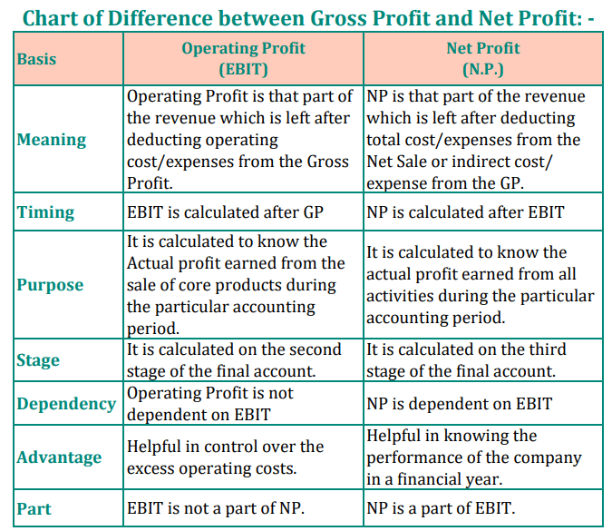

## Table of Contents

## What is operating profit?

Operating profit is the money a business makes from its main activities after paying for the costs of running those activities. It is calculated by taking the revenue from sales and subtracting the cost of goods sold and other operating expenses, like rent and salaries. This number shows how well a company is managing its core business before other factors like taxes and interest are considered.

Knowing the operating profit is important because it tells you if the company's main business is making money. If the operating profit is high, it means the company is good at earning more from its products or services than it spends to make or provide them. If it's low or negative, it might mean the company needs to cut costs or find ways to increase sales to stay healthy.

## What is net income?

Net income is the amount of money a company has left after it pays all its expenses. It's what you get when you take the total revenue and subtract all the costs, including the cost of goods sold, operating expenses, taxes, and interest on any loans. Net income is also called the bottom line because it's the last number on the income statement, and it shows if the company made a profit or a loss for that period.

This number is really important because it tells you how well the whole business is doing, not just the main activities. If a company has a high net income, it means it's doing well overall. But if the net income is low or negative, the company might be struggling to make ends meet. Investors and business owners look at net income to see if the company is a good investment or if it's time to make some changes.

## How is operating profit calculated?

Operating profit is figured out by taking the money a company makes from selling its products or services, which is called revenue, and then taking away the costs of making those products or providing those services. These costs are called the cost of goods sold. After that, you also take away other costs that come from running the business every day, like paying for rent, utilities, and salaries. These are called operating expenses. What's left after you subtract the cost of goods sold and operating expenses from the revenue is the operating profit.

This number is important because it shows how well the main part of the business is doing before you think about other things like taxes or interest on loans. If the operating profit is big, it means the company is good at making more money from what it sells than it spends to make or sell it. If it's small or negative, it might mean the company needs to find ways to spend less money or sell more to make the business healthier.

## How is net income calculated?

Net income is what's left after a company pays for everything it needs to run its business. To find out the net income, you start with the total money the company makes from selling its products or services, which is called revenue. Then you take away the cost of making those products or providing those services, which is called the cost of goods sold. After that, you also take away the money spent on things like rent, utilities, and salaries, which are called operating expenses. This gives you the operating profit.

Next, you need to take away other costs that aren't part of the day-to-day running of the business. These include interest on any loans the company has, and taxes that the company needs to pay. After you subtract these costs from the operating profit, what's left is the net income. If the net income is a positive number, it means the company made a profit. If it's a negative number, it means the company had a loss. Net income is a key number because it shows how well the whole business is doing, not just the main part of it.

## What are the main differences between operating profit and net income?

Operating profit and net income are both ways to measure how well a company is doing, but they look at different parts of the business. Operating profit focuses on the money a company makes from its main activities, like selling products or services. To find the operating profit, you take the money from sales and subtract the costs of making those products or providing those services, plus other regular costs like rent and salaries. This number tells you if the core part of the business is making money before you think about other things like taxes or loan payments.

Net income, on the other hand, looks at the whole picture. It's what's left after you take away all the costs from the money the company makes. This includes not just the costs of making products or running the business, but also things like interest on loans and taxes. Net income shows if the company made a profit or a loss after paying for everything. It's a more complete measure of how well the entire business is doing, not just the main part of it.

## Why is it important to compare operating profit and net income?

Comparing operating profit and net income helps you see how well a company is doing in different ways. Operating profit shows how much money the company makes from its main business activities before paying taxes and interest on loans. It tells you if the company is good at making and selling its products or services. If the operating profit is high, it means the core business is doing well. But if it's low or negative, the company might need to find ways to cut costs or sell more.

Net income, on the other hand, shows the total profit or loss after all costs are taken out, including taxes and interest. It gives you a complete picture of the company's financial health. By comparing the two, you can see if the company's main business is strong but other costs like taxes or loan payments are eating into the profits. Or, you might see that the main business isn't doing well, which is dragging down the net income. This comparison helps business owners and investors make better decisions about where to focus their efforts to improve the company's performance.

## Can operating profit be higher than net income? Why?

Yes, operating profit can be higher than net income. Operating profit is the money a company makes from its main business activities after paying for things like making products or providing services, and other regular costs like rent and salaries. It doesn't include costs like taxes and interest on loans. So, if a company is good at making and selling its products or services, the operating profit can be high.

Net income, on the other hand, is what's left after paying for everything, including taxes and interest. If a company has to pay a lot in taxes or has big loan payments, these costs can take a big chunk out of the operating profit. That's why the net income can be lower than the operating profit. By looking at both numbers, you can see if the company's main business is doing well, even if other costs are affecting the overall profit.

## How do non-operating expenses and incomes affect the difference between operating profit and net income?

Non-operating expenses and incomes are the things that a company deals with that aren't part of its main business. These can include things like interest on loans, taxes, and money made from investments. When you look at operating profit, you don't count these non-operating items. So, operating profit only shows how well the main part of the business is doing. If a company is good at making and selling its products or services, the operating profit can be high.

But when you want to find out the net income, you have to take away all the costs, including the non-operating ones. So, if a company has to pay a lot in taxes or has big loan payments, these non-operating expenses can make the net income lower than the operating profit. On the other hand, if a company makes money from investments or other non-operating activities, this can make the net income higher than the operating profit. By looking at both operating profit and net income, you can see how these non-operating items affect the company's overall financial health.

## What insights can businesses gain from analyzing the gap between operating profit and net income?

When businesses look at the difference between operating profit and net income, they can learn a lot about their financial health. Operating profit shows how well the main part of the business is doing, like making and selling products or services. If the operating profit is high, it means the company is good at its main job. But if it's low, the company might need to find ways to cut costs or sell more. By comparing this to net income, which is what's left after paying all costs, including taxes and loan payments, businesses can see if other expenses are taking a big bite out of their profits.

The gap between operating profit and net income can show where the business might need to focus its efforts. If the gap is big because of high taxes or loan payments, the company might need to look at ways to reduce these costs. Maybe they can find a way to lower their tax bill or pay off loans faster. On the other hand, if the company is making money from investments or other non-operating activities, this can help boost the net income. Understanding this gap helps business owners and managers make better decisions to keep the company strong and healthy.

## How can changes in tax laws impact the relationship between operating profit and net income?

Changes in tax laws can have a big effect on the difference between a company's operating profit and net income. Operating profit is the money a company makes from its main business activities before paying taxes. So, if tax laws change and the company has to pay more in taxes, this won't change the operating profit. But it will make the net income lower because net income is what's left after all costs, including taxes, are taken out. If taxes go up, the gap between operating profit and net income gets bigger.

On the other hand, if tax laws change and the company ends up paying less in taxes, this can make the net income higher. The operating profit stays the same because it doesn't include taxes, but the net income goes up because there's more money left after paying the lower tax bill. This makes the gap between operating profit and net income smaller. By understanding how changes in tax laws affect this gap, businesses can plan better and make smarter decisions about how to manage their money.

## What are some industry-specific factors that might influence the comparison between operating profit and net income?

Different industries can have different things that affect how operating profit and net income compare. For example, in the tech industry, companies might spend a lot on research and development, which is part of their operating costs. If they spend a lot here, their operating profit might be lower. But if they get tax breaks for this spending, their net income could be higher than expected because they pay less in taxes. Also, tech companies might make money from investments or other non-operating activities, which can make their net income higher than their operating profit.

In the manufacturing industry, things like the cost of raw materials and production can really affect operating profit. If these costs go up, the operating profit goes down. But if the company has to pay a lot in interest on loans for new equipment, this can make the net income even lower than the operating profit. On the other hand, if the company gets government subsidies or other financial help, this can boost their net income and make the gap between operating profit and net income smaller. By looking at these industry-specific factors, businesses can better understand their financial health and plan for the future.

## How can advanced financial modeling techniques be used to predict future trends in operating profit and net income?

Advanced financial modeling techniques can help businesses predict future trends in operating profit and net income by using past data and making educated guesses about what might happen next. These models take into account things like sales, costs, and other financial details from the past. Then, they use special math formulas and computer programs to look at different situations that could happen in the future. For example, if a company thinks sales might go up next year, the model can show how that would affect the operating profit and net income. By trying out different scenarios, businesses can see what might make their profits go up or down and plan accordingly.

These models can also help businesses understand how changes in the economy or industry could affect their profits. For instance, if a new law might make taxes go up, the model can show how that would change the net income compared to the operating profit. Or if the cost of raw materials is expected to rise, the model can predict how that would affect the operating profit. By looking at these different possibilities, companies can make better decisions about where to spend their money and how to prepare for the future. This helps them stay strong and keep making profits even when things change.

## What is Operating Profit?

Operating profit, commonly referred to as operating income, represents the earnings a company derives from its core, day-to-day business operations, excluding deductions like taxes and interest. This metric highlights the effectiveness with which a company generates revenue through its primary business activities. To calculate operating profit, one must subtract operating expenses from total revenue:

$$
\text{Operating Profit} = \text{Revenue} - (\text{Variable Operating Expenses} + \text{Fixed Operating Expenses})
$$

Operating expenses include variable costs, such as raw materials and production costs, which fluctuate with the level of output, and fixed costs, such as salaries, rent, and utilities, which remain constant regardless of the production level. By focusing solely on these expenses and excluding one-time or irregular financial activities, operating profit offers insights into how well a company's management controls operational efficiency and optimizes routine expenditures.

Evaluating operating profit enables investors to discern the core profitability of a company before factoring in financial structures, non-operational income, and other external elements. This distinction is vital because a high operating profit suggests robust business management and operational efficiency, even if net income may be affected by other factors like high interest or tax expenses.

Understanding this metric is crucial for distinguishing businesses with strong operational capabilities from those whose profits might be skewed by financial engineering or favorable tax conditions.

## What is Understanding Net Income?

Net income, also known as net earnings or net profit, represents the total profit of a company after deducting all expenses from its total revenue. These expenses include operating costs, taxes, interest, and any other financial charges. Calculated as:

$$
\text{Net Income} = \text{Total Revenue} - (\text{Operating Expenses} + \text{Taxes} + \text{Interest} + \text{Other Expenses})
$$

This calculation provides a comprehensive view of how much profit remains after all costs associated with generating revenue are accounted for. As such, net income is often referred to as the "bottom line" on an income statement. It is a critical measure for assessing a company's financial performance, reflecting the efficiency of operations, cost management, and overall business strategy implementation.

For investors, net income serves as a crucial indicator of financial health and profitability. It directly affects earnings per share (EPS), a measure that divides net income by the number of outstanding shares of the company's stock. EPS is instrumental in evaluating a company's profitability on a per-share basis and is commonly used to compare the financial performance of companies within the same industry.

An understanding of net income is essential, as it can influence investor decision-making and consequently impact stock prices. When a company reports strong net income figures, it often signals potential for growth and increased stock value, attracting investors. Conversely, weak net income may cause concern about the company's financial health, prompting stock sell-offs. This link between net income and stock valuation underscores its importance in financial analysis and investment strategy development.

## References & Further Reading

[1]: ["Understanding Financial Statements"](https://online.hbs.edu/blog/post/how-to-read-financial-statements) by James O. Gill and Clyde P. Stickney.

[2]: ["Financial Statement Analysis: A Practitioner's Guide"](https://onlinelibrary.wiley.com/doi/book/10.1002/9781119201489) by Martin S. Fridson and Fernando Alvarez.

[3]: ["The Interpretation of Financial Statements"](https://online.hbs.edu/blog/post/how-to-read-financial-statements) by Benjamin Graham & Spencer B. Meredith.

[4]: ["Advances in Financial Machine Learning"](https://www.amazon.com/Advances-Financial-Machine-Learning-Marcos/dp/1119482089) by Marcos Lopez de Prado.

[5]: ["Quantitative Trading: How to Build Your Own Algorithmic Trading Business"](https://www.amazon.com/Quantitative-Trading-Build-Algorithmic-Business/dp/1119800064) by Ernest P. Chan.

[6]: ["Algorithmic Trading and DMA: An introduction to direct access trading strategies"](https://www.semanticscholar.org/paper/Algorithmic-trading-%26-DMA-%3A-an-introduction-to-Johnson/aa5de1ab883d5e23b6651faa7c1807586d688e4b) by Barry Johnson.