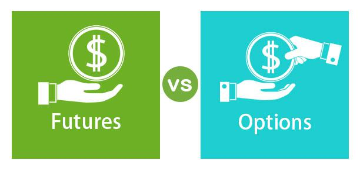

## Table of Contents

## What are options and how do they work?

Options are financial tools that give you the right, but not the obligation, to buy or sell an asset at a set price before a certain date. They are like tickets that let you make a choice later. There are two main types of options: calls and puts. A call option lets you buy an asset, like a stock, at a fixed price. A put option lets you sell an asset at a fixed price. You pay a fee, called a premium, to get this right.

When you buy an option, you're betting on where you think the price of the asset will go. If you think the price will go up, you might buy a call option. If you think the price will go down, you might buy a put option. If the price moves in the direction you predicted, you can use your option to make a profit. If it doesn't, you can just let the option expire and only lose the premium you paid. This makes options a way to potentially make money with less risk than buying the asset outright.

## What are futures and how do they work?

Futures are contracts where you agree to buy or sell something at a set price on a specific date in the future. This "something" can be anything from oil to corn to financial assets like stock indexes. The main idea behind futures is to lock in a price today for a transaction that will happen later. This can be helpful if you want to protect yourself against price changes. For example, a farmer might use futures to guarantee a price for their crops before they're even harvested.

When you trade futures, you don't have to pay the full amount right away. Instead, you put down a smaller amount called "margin." This makes futures a way to bet on price changes without needing a lot of money upfront. If the price of the asset goes up, you can make a profit. But if it goes down, you could lose money. Futures are often used by businesses to manage risk, but they can also be used by investors trying to make money from price movements.

## How do the basic structures of options and futures differ?

Options and futures are both financial tools, but they work in different ways. An option gives you the right, but not the obligation, to buy or sell an asset at a set price before a certain date. You pay a fee, called a premium, for this right. If the price of the asset moves in the direction you expect, you can use your option to make a profit. If it doesn't, you can just let the option expire and only lose the premium you paid. This makes options a way to potentially make money with less risk than buying the asset outright.

Futures, on the other hand, are contracts where you agree to buy or sell an asset at a set price on a specific date in the future. Unlike options, futures come with an obligation to complete the transaction. You don't pay the full amount right away; instead, you put down a smaller amount called "margin." This makes futures a way to bet on price changes without needing a lot of money upfront. If the price of the asset goes up, you can make a profit. But if it goes down, you could lose money. Futures are often used by businesses to manage risk, but they can also be used by investors trying to make money from price movements.

In summary, the key difference between options and futures is the obligation. With options, you have the choice to act on the contract or not, while with futures, you must follow through with the transaction. This difference affects how each tool is used and the level of risk involved.

## What are the primary uses of options in trading?

Options are used in trading mainly for two reasons: to make money by betting on price changes and to protect against losses. When traders think the price of something, like a stock, will go up, they can buy a call option. This gives them the right to buy the stock at a set price later. If the stock price goes up as expected, they can buy the stock at the lower price and then sell it at the higher market price, making a profit. If the price goes down, they can just let the option expire and only lose the small fee they paid for it. On the other hand, if traders think the price will go down, they can buy a put option. This lets them sell the stock at a set price, and if the price drops, they can buy it at the lower market price and then sell it at the higher set price, again making a profit.

Options are also used to protect against losses, which is called hedging. For example, if you own a stock and you're worried its price might drop, you can buy a put option on that stock. If the stock price does go down, the put option lets you sell the stock at the higher set price, limiting your loss. This is like insurance for your investment. Another way options are used is for income. Some traders sell options to other people, collecting the premium as income. If the option expires without being used, the seller keeps the premium as profit. This strategy can be riskier but can also provide a steady stream of income if done carefully.

## What are the primary uses of futures in trading?

Futures are mainly used in trading for two big reasons: to manage risk and to make money from price changes. When people or businesses want to protect themselves from price changes, they use futures. For example, a farmer might sell futures contracts for their crops to lock in a price before the harvest. This way, if the price drops later, they still get the price they agreed on. Companies that need to buy raw materials also use futures to make sure they don't pay more if prices go up. This is called hedging, and it's like insurance against price swings.

Futures are also used by traders who want to make money from guessing where prices will go. If someone thinks the price of oil will go up, they can buy a futures contract to buy oil at today's price and sell it later at a higher price, making a profit. If they think the price will go down, they can sell a futures contract now and buy it back later at a lower price. This is called speculation. Because you only need to put down a small amount of money called margin to trade futures, it can be a way to make big profits (or losses) with less money upfront.

## How does the risk profile of options compare to futures?

Options and futures have different levels of risk because of how they work. With options, you pay a fee called a premium to have the right to buy or sell something later. If you're wrong about where the price is going, you only lose the premium you paid. This makes options less risky because you know the most you can lose right from the start. But if you're right, you can make a lot more money than what you paid for the option. So, options can be a safer way to bet on prices going up or down, but you need to be right to make a big profit.

Futures are different because they come with an obligation to buy or sell something at a set price later. When you trade futures, you only need to put down a small amount of money called margin. This means you can make big profits if prices move in your favor, but you can also lose a lot more than what you put down if prices go against you. This makes futures riskier than options because there's no limit to how much you can lose. So, while futures can lead to bigger wins, they also come with the chance of bigger losses, making them a higher-risk choice.

## What are the key factors to consider when choosing between options and futures?

When deciding between options and futures, it's important to think about how much risk you're willing to take. Options are less risky because you only lose the premium you paid if things don't go as planned. This means you know the most you can lose right from the start. Futures are riskier because you have to follow through with the deal, and you can lose a lot more than what you put down if prices move against you. So, if you want to play it safer, options might be a better choice. But if you're okay with more risk and want the chance to make bigger profits, futures could be the way to go.

Another thing to consider is what you're trying to achieve. If you want to protect yourself from price changes, both options and futures can help, but they work differently. Options give you the choice to act or not, which can be good if you're not sure about the future. Futures lock you into a price, which is great if you need certainty. If you're looking to make money from guessing where prices will go, options can be a safer bet because of the limited risk. Futures can offer bigger rewards but also bigger risks. So, think about whether you want more control or more certainty, and whether you're looking to protect or to profit.

## How do the pricing mechanisms for options and futures differ?

The pricing of options is based on several factors, including the current price of the asset, the strike price, the time until the option expires, and the expected [volatility](/wiki/volatility-trading-strategies) of the asset's price. You also need to consider interest rates and any dividends if the asset is a stock. The main part of an option's price is called the premium, which is what you pay to have the right to buy or sell the asset later. The premium is affected by how likely it is that the option will be profitable. If the asset's price is expected to move a lot, the premium will be higher because there's a bigger chance the option will be worth something. If the asset's price is expected to stay steady, the premium will be lower.

Futures pricing is simpler because it's mainly about the expected future price of the asset. When you agree to buy or sell something in the future, the price you set today is based on what people think the price will be when the contract expires. Futures prices can also be affected by things like interest rates and storage costs for the asset. Unlike options, there's no premium to pay upfront for futures. Instead, you put down a smaller amount called margin, which acts like a deposit. The price of a futures contract can change every day based on the market's view of the future price of the asset.

## What are the margin requirements for trading options versus futures?

When you trade options, you usually don't need to put down a lot of money upfront. If you're buying an option, you just pay the premium, which is the price of the option itself. This is a small amount compared to buying the actual asset. But if you're selling options, you might need to put up margin. This is money you set aside to cover any losses if the option goes against you. The margin for selling options can be less than for futures, but it still depends on how risky the option is.

For futures, you always need to put down margin, no matter if you're buying or selling. The margin for futures is usually higher than for options because futures come with an obligation to complete the deal. This means there's more risk involved. The margin acts like a deposit to make sure you can cover any losses. The amount of margin needed can change based on how much the price of the asset might move, but it's generally more than what you'd need for options trading.

## How do options and futures impact portfolio diversification?

Options and futures can help make your investments more diverse by letting you bet on different things without needing a lot of money. When you use options, you can buy the right to buy or sell stocks, commodities, or other assets at a set price. This means you can add different kinds of investments to your portfolio without spending too much. For example, if you mostly own stocks, you can use options to bet on gold or oil prices, which helps spread out your risk. Options can also be used to protect your other investments by hedging against losses, which adds another layer of safety to your portfolio.

Futures work a bit differently but can also help with diversification. When you trade futures, you agree to buy or sell something at a set price in the future. This lets you add things like agricultural products, energy, or financial indexes to your portfolio. By doing this, you're not just relying on one type of investment. Futures can be riskier than options, but they can also offer big rewards if you guess right about where prices are going. Using futures can help balance your portfolio by giving you exposure to different markets and helping you manage risk in a way that's different from just owning stocks or bonds.

## What are some advanced strategies that can be employed with options but not with futures?

One advanced strategy you can use with options but not with futures is called a "straddle." A straddle involves buying both a call option and a put option on the same asset at the same strike price and expiration date. You do this when you think the price of the asset will move a lot, but you're not sure which way it will go. If the price goes up a lot, the call option makes money. If the price goes down a lot, the put option makes money. This way, you can make a profit no matter which direction the price moves, as long as it moves enough to cover the cost of both options.

Another strategy is called a "butterfly spread." This involves buying one call option at a lower strike price, selling two call options at a middle strike price, and buying another call option at a higher strike price. All options have the same expiration date. The idea is to make money if the price of the asset stays close to the middle strike price. If the price moves too far in either direction, you might lose money, but if it stays in the middle, you can make a profit. This strategy is more complex and is used when you think the price will not move much.

A third strategy is the "iron condor," which is even more advanced. It involves selling an out-of-the-money call option and an out-of-the-money put option, and then buying a further out-of-the-money call option and a further out-of-the-money put option. This creates a range where you can make money if the price of the asset stays within that range. If the price moves outside this range, you could lose money, but the goal is to collect the premiums from the options you sold and hope the price stays in the middle. These strategies show how options can be used in more flexible and creative ways than futures, allowing for different kinds of bets on price movements.

## How do regulatory environments affect the trading of options and futures?

Regulatory environments play a big role in how options and futures are traded. Governments and financial watchdogs set rules to make sure trading is fair and safe. For options and futures, there are rules about who can trade them, how much money you need to have, and what kind of information you have to share. These rules can be different in each country. For example, in the United States, the Commodity Futures Trading Commission (CFTC) and the Securities and Exchange Commission (SEC) look after futures and options. They make sure traders follow the rules and don't cheat. If the rules are strict, it might be harder to trade, but it can also make trading safer and more trustworthy.

These regulations can also affect how much it costs to trade options and futures. If the rules make it more expensive to do business, like needing more money upfront or paying higher fees, it can make trading costlier. But these costs can also help keep the market stable and protect people from big losses. Some countries might have lighter rules, which can make it easier and cheaper to trade, but it might also be riskier. So, when you're thinking about trading options or futures, it's important to know the rules in your area and how they might change the way you trade.

## What are Futures Contracts and How are They Explained?

A futures contract is a legally binding agreement to purchase or sell a specified quantity of an underlying asset at a predetermined price on a set future date. These contracts are standardized, with terms such as quality, quantity, and delivery date specified by the exchange on which they are traded. Standardization facilitates high [liquidity](/wiki/liquidity-risk-premium), allowing contracts to be easily bought and sold in the market.

Futures contracts serve multiple purposes, with hedging being one of the primary uses. Hedging allows market participants to mitigate the risk of price fluctuations in commodity and financial markets. For instance, agricultural producers might use futures to lock in selling prices for their crops, while food manufacturers might secure purchase prices for raw ingredients. Similarly, financial institutions might use [interest rate](/wiki/interest-rate-trading-strategies) futures to protect against adverse movements in borrowing costs.

In commodity markets, futures contracts are extensively used in the agriculture, energy, and metals sectors. An agricultural example might involve a wheat farmer entering a futures contract to sell wheat at a set price in six months, thereby securing revenue despite potential market volatility. In the energy sector, companies might use oil futures to hedge against fluctuations in [crude oil](/wiki/crude-oil) prices, which can significantly impact operational costs. On the financial side, currency futures allow multinational corporations to hedge against foreign exchange risk, stabilizing cash flows despite currency fluctuations.

Futures contracts are also instrumental in speculative trading. Traders can leverage futures to speculate on the price movements of various asset classes, including commodities, currencies, and indices. With their standardized nature and high liquidity, futures enable traders to enter and [exit](/wiki/exit-strategy) positions quickly, often using leverage to amplify potential returns. However, leverage also increases risk, potentially leading to significant losses if market movements are contrary to expectations.

The mathematics of futures pricing is founded on the cost-of-[carry](/wiki/carry-trading) model. The future price $F$ can be formulated as:

$$
F = S(1 + r)^t + C
$$

Where:
- $S$ is the spot price of the underlying asset
- $r$ is the risk-free rate
- $t$ is the time to maturity
- $C$ represents the cost of carry, including storage, insurance, and other relevant costs

Futures markets are notable for their role in price discovery, providing essential information regarding future expectations of asset values. This function contributes to more efficient allocation of resources within the economy, influencing production, consumption, and investment decisions across various sectors.

In summary, futures contracts offer significant benefits for hedging, speculating, and enhancing market liquidity. They are indispensable tools for participants seeking to manage risks or exploit market inefficiencies effectively.

## What are the key differences between futures and options?

Futures and options are two essential types of financial derivatives, each serving unique purposes in managing risk, speculation, and [arbitrage](/wiki/arbitrage). However, they differ significantly in their obligations, pricing mechanisms, risk profiles, and trading implications.

One of the primary distinctions between futures and options is the nature of the obligation they impose on the parties involved. A futures contract obligates both the buyer and the seller to complete the transaction at a specified date in the future at a predetermined price. This characteristic creates certainty and obligation for contract participants. Conversely, an options contract provides the holder with the right, but not the obligation, to buy (call option) or sell (put option) an asset at a set price before or on a specified expiration date. This flexibility allows options traders to choose whether to execute the transaction, depending on market movements and personal strategy.

The pricing mechanisms also vary notably between futures and options. Futures prices are influenced primarily by the spot price of the underlying asset, interest rates, and the time to expiration. These are generally determined by the formula:

$$
\text{Futures Price} = \text{Spot Price} \times (1 + r)^T
$$

where $r$ is the risk-free rate, and $T$ is the time to maturity. On the other hand, options pricing is more complex and relies on several factors outlined by the Black-Scholes model or the binomial model, such as the current price of the asset, the strike price, volatility, time remaining until expiration, and the risk-free interest rate. The option's premium is calculated using these variables, reflecting both intrinsic and extrinsic values.

The risk profiles of futures and options also differ. Futures are inherently riskier since both parties are obliged to execute the contract, exposing them to potentially unlimited losses if the market moves unfavorably. However, they also offer the potential for profit if the market moves in the individual's favor. In contrast, options traders can face defined and often limited losses, at most the premium paid for the option, while they can benefit from potentially unlimited gains depending on the market movement.

Understanding these differences is critical for traders and investors in selecting the most appropriate instrument based on their market outlook, risk tolerance, and financial goals. Futures may be preferred for their straightforward pricing and ability to lock in prices, making them suitable for precise hedging strategies. Options, with their flexibility and complex pricing structures, are often favored by those aiming to speculate on market movements or to hedge in situations where uncertainty is high.

In summary, while futures contracts necessitate the fulfillment of the contractual obligations, options provide participants with strategic choices to capitalize on their market perspectives. The decision to utilize futures or options should consider these varied characteristics and align with the trader's specific financial objectives and risk management strategies.

## References & Further Reading

[1]: Hull, J. C. (2017). ["Options, Futures, and Other Derivatives"](https://www.semanticscholar.org/paper/Options%2C-Futures%2C-and-Other-Derivatives-Hull/89bdee500c8623864fc9eb7a471546aa713acc44). Pearson Education.

[2]: Lopez de Prado, M. (2018). ["Advances in Financial Machine Learning"](https://www.amazon.com/Advances-Financial-Machine-Learning-Marcos/dp/1119482089). Wiley.

[3]: Jarrow, R. A., & Turnbull, S. M. (1996). ["Derivative Securities"](https://www.jstor.org/stable/2329239). South-Western College Publishing.

[4]: Chan, E. P. (2009). ["Quantitative Trading: How to Build Your Own Algorithmic Trading Business"](https://github.com/ftvision/quant_trading_echan_book). Wiley Trading.

[5]: Jansen, S. (2020). ["Machine Learning for Algorithmic Trading: Second Edition"](https://www.amazon.com/Machine-Learning-Algorithmic-Trading-alternative-ebook/dp/B08D9SP6MB). Packt Publishing.

[6]: Rennison, G. (2018). ["Algorithmic Trading and DMA: An introduction to direct access trading strategies"](https://www.amazon.com/Algorithmic-Trading-DMA-introduction-strategies/dp/0956399207). 4Myeloma Press.

[7]: Aronson, D. (2006). ["Evidence-Based Technical Analysis: Applying the Scientific Method and Statistical Inference to Trading Signals"](https://www.amazon.com/Evidence-Based-Technical-Analysis-Scientific-Statistical/dp/0470008741). Wiley.

[8]: Biais, B., Foucault, T., & Moinas, S. (2015). ["Equilibrium Fast Trading"](https://www.sciencedirect.com/science/article/pii/S0304405X15000288) in The Review of Financial Studies, 28(7), 1755–1791.