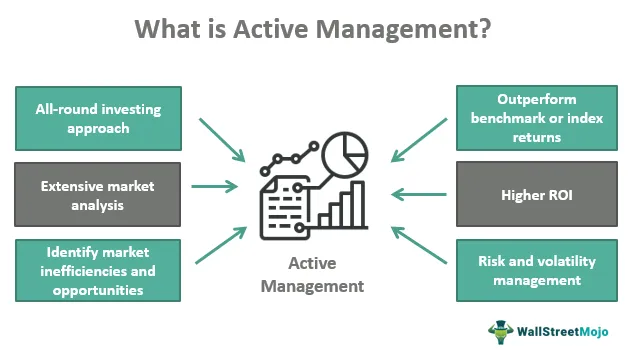

Portfolio management plays a pivotal role in investing, involving the selection and oversight of a range of investments to achieve specific financial goals. This process is essentially divided into two main categories: active and passive management. Each management style brings its own unique strategies and advantages to the table. Active management is characterized by a hands-on approach, where decisions are made to outperform a benchmark, while passive management follows a more static strategy, typically tracking a market index to match its performance.

Recent technological advancements have introduced algorithmic trading as a significant component of modern portfolio management. Algorithmic trading uses computer algorithms to automate trading decisions, leading to increased efficiency and accuracy. This integration of technology with traditional portfolio management provides investors with enhanced tools to maximize returns and manage risks more effectively.



The exploration of active management, passive management, and the inclusion of algorithmic trading illuminates their distinct characteristics and practical applications. Investors must understand these concepts to make informed decisions and optimize their investment strategies. By leveraging the strengths and insights provided by these varied approaches, individuals can tailor their portfolios to better meet their financial objectives and market conditions.

## Table of Contents

## Understanding Active Management

Active management is a portfolio strategy where investment managers make specific decisions to select investments with the objective of surpassing a benchmark index. It is typically distinguished by its proactive approach, employing comprehensive market analysis and the personal judgment of portfolio managers to guide investment choices. Unlike passive management, which aims to mirror the performance of a market index, active management seeks to exploit market inefficiencies to achieve superior returns.

Portfolio managers employing active management utilize diverse strategies, each designed to capture potential market opportunities. Among these strategies are:

- **Stock Picking:** Managers select individual stocks based on in-depth research and analysis, aiming for those predicted to outperform general market trends or are undervalued based on their intrinsic worth.

- **Market Timing:** This approach involves making strategic decisions about entering or exiting market positions based on predictions of future market movements. Market timing attempts to identify the optimal moments to buy or sell assets for maximum return.

- **Sector Rotation:** Managers shift investments between sectors of the economy based on anticipated performance changes due to economic cycles. For instance, investing more in technology during periods of growth and switching to consumer staples in economic downturns.

- **Arbitrage:** This strategy exploits price differences across different markets or forms of an instrument. Managers aim to profit from discrepancies without a corresponding level of risk, assuming efficient market conditions eventually correct these disparities.

While the potential for higher returns in active management is alluring, it also presents certain risks and costs. The hands-on nature of active investment entails higher transaction fees due to frequent buying and selling, alongside management fees for professional expertise. Moreover, the possibility of underperformance relative to the chosen benchmark poses a significant risk, compounded by potential market [volatility](/wiki/volatility-trading-strategies) and imperfect information.

Active management is deeply rooted in the belief that markets are not perfectly efficient and that skilled managers can capitalize on temporary mispricings or trends. However, because of the inherent unpredictability and ever-changing dynamics of financial markets, success in active management heavily relies on the ability to accurately interpret data and achieve consistently beneficial outcomes over time.

In sum, active management allows investors to potentially achieve better than average market returns by leveraging specialized knowledge and strategic insights. However, the associated higher risks and costs require careful consideration and weigh heavily into the decision to pursue an active management strategy.

## Exploring Passive Management

Passive management, also known as index fund management, revolves around the strategy of tracking a specific benchmark index to mirror its performance. It is characterized by a buy-and-hold approach, which reduces both transaction costs and management fees compared to active management. This method is particularly suitable for long-term investors seeking stable returns, as it aligns with the performance of the benchmark index over time.

The buy-and-hold approach inherent in passive management is formulated to minimize transaction costs by reducing the frequency of buying and selling securities. This aligns with the observation that frequent trading often incurs significant costs, such as trading fees and tax implications, which can erode the net returns on investment. By minimizing these expenses, passive management helps in preserving the returns that track the overall performance of the index.

One of the core benefits of passive management is the provision of more predictable and stable returns. By diversifying investments across an index, investors can reduce the idiosyncratic risk associated with individual securities. This diversification helps stabilize their portfolio’s performance, making it a preferred strategy for those with a low tolerance for volatility and who do not wish to attempt to outperform the market through active management.

However, it is important to note that while passive management minimizes short-term risks by diversifying across an index, it may not exploit market inefficiencies or short-term fluctuations to achieve excess returns. As passive strategies are not designed to anticipate or react to short-term market trends, they might miss out on opportunities for higher returns during favorable market conditions. Moreover, since passive investments tend to track the market, they also expose investors to the systemic risks inherent to the entire market or the specific index tracked.

In conclusion, passive management offers a cost-efficient, stable approach to investing, especially suitable for those focused on long-term asset growth and with lower risk appetites. Despite its limitations in capturing short-term market opportunities, the strategy's reduced costs and stable returns have made it a popular choice among investors looking to solidify their financial base without the active engagement required by other investment strategies.

## Portfolio Management Strategies

Portfolio management involves the strategic selection and oversight of investments to meet specific financial objectives of an investor. The core strategies in portfolio management are active and passive management, each with distinct advantages and challenges. 

Active management is characterized by proactive decision-making, where portfolio managers aim to outperform a given benchmark index. This involves continuously analyzing market trends and making investment decisions based on research and forecasts. The primary advantage of this approach is the potential for higher returns if the market is predicted accurately. However, it also carries higher risks and can incur substantial management fees due to frequent trading and detailed market analysis. 

Conversely, passive management, often associated with index fund management, aims to replicate the performance of a specific benchmark index by maintaining a buy-and-hold strategy. This approach reduces transaction costs and management fees and provides steady returns that mirror the index's performance. While this strategy is cost-effective and suitable for long-term investors seeking stable returns, it may not benefit from short-term market opportunities.

Selecting the right strategy is crucial and should align with an investor’s risk tolerance and financial goals. Risk-averse investors might prefer passive management due to its stability and lower costs. In contrast, those willing to take more significant risks for the potential of higher returns might opt for active management. 

Moreover, a combination of both strategies can be beneficial. By integrating elements of active and passive management, investors can create a balanced portfolio that takes advantage of the strengths of each strategy. This hybrid approach allows the portfolio to benefit from the stability of passive investments while capitalizing on the potential high returns of active management.

In conclusion, effective portfolio management requires a nuanced understanding of both active and passive strategies, recognizing their respective merits and risks. Investors must consider their financial goals and risk tolerance to construct a portfolio that is aligned with their investment objectives.

## The Role of Algorithmic Trading

Algorithmic trading utilizes sophisticated computer algorithms to execute trades with increased efficiency and speed by adhering to pre-defined criteria. This approach has emerged as a complement to both active and passive portfolio management strategies, offering precise data-driven insights and execution accuracy. By automating the trading process, [algorithmic trading](/wiki/algorithmic-trading) systems can potentially reduce human error and optimize decision-making in the investment process.

One of the prominent advantages of algorithmic trading lies in its capacity to process vast amounts of financial data quickly and apply quantitative models to identify trading opportunities. These algorithms rely on mathematical models and statistical analyses to predict market movements and execute trades accordingly. The efficiency of algorithmic trading stems from its ability to operate continuously and systematically, which minimizes reaction time to market events and mitigates the emotional influence on trading decisions typically observed in human traders.

Algorithmic trading is employed in various forms, ranging from high-frequency trading ([HFT](/wiki/high-frequency-trading-strategies)) which involves executing thousands of trades per second, to strategies that are implemented over a longer time horizon, such as [arbitrage](/wiki/arbitrage), [trend following](/wiki/trend-following), and [market making](/wiki/market-making). Below is a simple example of a moving average crossover strategy implemented in Python, to illustrate how algorithmic trading strategies are often structured:

```python
import pandas as pd
import numpy as np

# Sample stock price data
price_data = pd.Series(...)

# Short and long moving averages
short_window = 40
long_window = 100

# Compute the short and long moving averages
signals = pd.DataFrame(index=price_data.index)
signals['short_mavg'] = price_data.rolling(window=short_window, min_periods=1, center=False).mean()
signals['long_mavg'] = price_data.rolling(window=long_window, min_periods=1, center=False).mean()

# Generate signals (1 for buy, 0 for hold/sell)
signals['signal'] = 0.0
signals['signal'][short_window:] = np.where(signals['short_mavg'][short_window:] > signals['long_mavg'][short_window:], 1.0, 0.0)

# Generate trading orders
signals['positions'] = signals['signal'].diff()
```

The effectiveness of algorithmic trading is significantly influenced by both the quality of the algorithm and the prevailing market conditions. Sophisticated algorithms require rigorous [backtesting](/wiki/backtesting) and continuous refinement to adapt to changing market dynamics. Moreover, the competitive landscape of automated trading necessitates constant innovation as market participants increasingly employ similar strategies, potentially reducing individual gains.

Algorithmic trading's role extends beyond individual investment strategies; it also contributes to the overall market efficiency by enhancing [liquidity](/wiki/liquidity-risk-premium) and providing tighter spreads, benefiting both active and passive investment approaches. As technology advances, the integration of [machine learning](/wiki/machine-learning) and [artificial intelligence](/wiki/ai-artificial-intelligence) in algorithmic trading is expected to further enhance its capabilities, making it an increasingly indispensable tool in modern portfolio management.

## Combining Active and Passive Approaches

A hybrid approach to investment portfolio management, combining both active and passive strategies, is increasingly embraced by investors seeking to balance risk and reward. This dual strategy enables investors to harness the stability that characterizes passive investments while simultaneously pursuing the enhanced return potential often associated with active management techniques.

Incorporating passive strategies helps provide a consistent and predictable baseline performance by replicating specific market indices. This can mitigate the volatility driven by short-term market fluctuations, thus offering a layer of security in an investment portfolio. Moreover, passive investments generally incur lower costs due to reduced transaction fees and management expenses, contributing to cost-effective long-term wealth accumulation.

Conversely, active strategies introduce flexibility and adaptability, allowing investors to respond dynamically to changing market conditions and exploit market inefficiencies. Active management involves strategies like stock [picking](/wiki/asset-class-picking) and sector rotation, which require a deep understanding of market movements and can yield significant returns if executed successfully. However, they also involve higher costs and risks, emphasizing the need for careful execution and seasoned judgment.

The allocation between active and passive components in a hybrid portfolio should be aligned with the investor's risk tolerance, financial objectives, and market outlook. For instance, in a bullish market, a greater emphasis on active management could capitalize on growth opportunities, whereas, in a volatile or bearish market, passive management might offer a safer harbor.

A Python pseudocode example of balancing a hypothetical hybrid portfolio might look like this:

```python
def allocate_portfolio(total_investment, active_ratio, passive_ratio):
    active_investment = total_investment * active_ratio
    passive_investment = total_investment * passive_ratio
    return active_investment, passive_investment

# Example use:
total = 100000  # Total funds available for investment
active_ratio = 0.6  # 60% allocated to active management
passive_ratio = 0.4  # 40% allocated to passive management

active_funds, passive_funds = allocate_portfolio(total, active_ratio, passive_ratio)
print(f"Active Investment: ${active_funds}")
print(f"Passive Investment: ${passive_funds}")
```

Ultimately, a hybrid portfolio aims to exploit the strong points of both active and passive strategies, offering a more resilient and potentially rewarding investment structure. Investors are encouraged to regularly review their strategy proportions, taking into account evolving market scenarios and personal financial goals, to ensure optimal performance and risk management.

## Conclusion

The choice between active and passive management hinges on several key factors, including an investor's risk tolerance, financial aspirations, and perception of market dynamics. While active management seeks to outperform market benchmarks through strategic decision-making, passive management aims to replicate benchmark performance with minimal intervention. This decision-making process should be informed by an investor's specific financial circumstances and goals.

Algorithmic trading introduces an additional layer of precision and efficiency into portfolio management. Using computer algorithms to automate trading processes can enhance decision-making with data-driven insights, thereby reducing human error and capitalizing on market opportunities swiftly. This technological advancement complements both active and passive strategies by incorporating speed and analytical rigor into execution.

A carefully crafted combination of active and passive strategies, supplemented by algorithmic trading, can establish a resilient framework for financial success. By effectively balancing these strategies, investors can take advantage of the stability offered by passive management while pursuing potential high returns through active management.

Ultimately, investors must consider their unique financial situations, consult with financial advisors, and remain informed of market trends to effectively navigate and manage their portfolios. A nuanced understanding of these strategies can empower investors to achieve their financial objectives while aligning with their risk preferences and market outlook.

## References & Further Reading

[1]: Sharpe, W. F. (1991). ["The Arithmetic of Active Management."](https://web.stanford.edu/~wfsharpe/art/active/active.htm) Financial Analysts Journal, 47(1), 7-9.

[2]: Malkiel, B. G. (1995). ["Returns from Investing in Equity Mutual Funds 1971 to 1991."](https://onlinelibrary.wiley.com/doi/abs/10.1111/j.1540-6261.1995.tb04795.x) The Journal of Finance, 50(2), 549-572.

[3]: Fama, E. F., & French, K. R. (2004). ["The Capital Asset Pricing Model: Theory and Evidence."](https://www.aeaweb.org/articles?id=10.1257/0895330042162430) Journal of Economic Perspectives, 18(3), 25-46.

[4]: Poterba, J. M., & Shoven, J. B. (2002). ["Exchange-traded funds: A New Investment Option for Taxable Investors."](https://economics.mit.edu/sites/default/files/publications/Exchange-Traded%20Funds%20A%20New%20Investment%20Option.pdf) American Economic Review, 92(2), 422-427.

[5]: Jagadeesh, N., & Titman, S. (1993). ["Returns to Buying Winners and Selling Losers: Implications for Stock Market Efficiency."](https://www.bauer.uh.edu/rsusmel/phd/jegadeesh-titman93.pdf) The Journal of Finance, 48(1), 65-91.

[6]: Hasbrouck, J. (2007). ["Empirical Market Microstructure: The Institutions, Economics, and Econometrics of Securities Trading."](https://academic.oup.com/book/52241) Oxford University Press.

[7]: Farrell, J. L. Jr. (1997). ["Portfolio Management: Theory and Application."](https://archive.org/details/portfoliomanagem0000farr) McGraw-Hill.

[8]: Bogle, J. C. (2017). ["The Little Book of Common Sense Investing: The Only Way to Guarantee Your Fair Share of Stock Market Returns."](https://www.amazon.com/Little-Book-Common-Sense-Investing/dp/1119404509) Wiley.