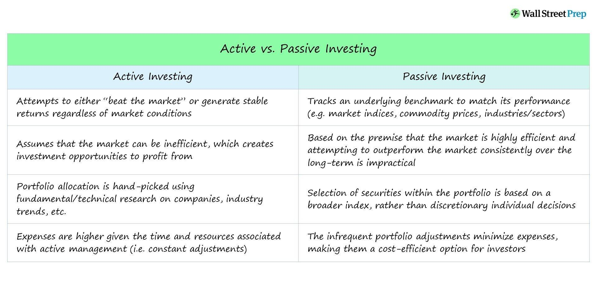

## Table of Contents

## What is passive portfolio management?

Passive portfolio management is a way of investing where you try to match the performance of a specific market index, like the S&P 500, instead of trying to beat it. This is usually done by buying and holding a diversified mix of investments, such as stocks or bonds, that reflect the index. The idea is to keep costs low and minimize the need for constant buying and selling, which can be expensive and time-consuming.

A common way to do passive portfolio management is by investing in index funds or exchange-traded funds (ETFs). These funds are designed to track the performance of an index without the need for active management. Because they require less work and fewer transactions, they often have lower fees than actively managed funds. This makes passive portfolio management a popular choice for investors who want a simple, cost-effective way to grow their money over the long term.

## What is active portfolio management?

Active portfolio management is when someone tries to do better than the overall market by picking specific investments. Instead of just following an index like the S&P 500, the person managing the portfolio looks for stocks, bonds, or other investments that they think will grow more than others. They might buy and sell these investments often, trying to take advantage of short-term changes in the market.

This type of management can be more exciting and potentially more rewarding, but it also comes with higher risks and costs. Because the manager is always buying and selling, there are more fees involved. Also, it takes a lot of research and skill to pick the right investments, and not everyone gets it right all the time. That's why active portfolio management might not always beat the market, even though that's the goal.

## How do passive and active portfolio management strategies differ?

Passive and active portfolio management are two different ways to invest money. Passive portfolio management means trying to match the performance of a market index, like the S&P 500, without trying to beat it. You do this by buying and holding a mix of investments that reflect the index. This way of investing is simpler and usually cheaper because it doesn't require a lot of buying and selling. People often use index funds or ETFs to do passive management because these funds track the index automatically.

On the other hand, active portfolio management is when someone tries to do better than the overall market. The person managing the portfolio picks specific investments, like stocks or bonds, that they think will grow more than others. They might buy and sell these investments often, hoping to take advantage of short-term changes in the market. This type of management can be more exciting and potentially more rewarding, but it also comes with higher risks and costs. Because the manager is always buying and selling, there are more fees involved, and it takes a lot of skill to pick the right investments.

In summary, passive management is about keeping things simple and low-cost by following the market, while active management is about trying to beat the market with more hands-on, potentially riskier strategies. Both have their place, and the choice between them depends on what an investor is looking for in terms of risk, cost, and involvement.

## What are the typical costs associated with passive portfolio management?

The main costs of passive portfolio management come from the fees you pay for the funds you invest in, like index funds or ETFs. These fees are called expense ratios, and they are usually lower than the fees for actively managed funds. For example, an index fund might have an expense ratio of about 0.05% to 0.20%, which means you pay $5 to $20 per year for every $10,000 you have invested. These lower costs are one of the big reasons why people choose passive management.

There might also be other small costs, like trading fees if you buy or sell your funds. But because passive management means you buy and hold your investments for a long time, you usually don't trade very often. This keeps the trading fees low. Overall, passive portfolio management is designed to be a low-cost way to invest, which can help you keep more of your money over time.

## What are the typical costs associated with active portfolio management?

Active portfolio management tends to be more expensive than passive management. The biggest cost comes from the fees you pay to the person or company managing your money. These fees are often called management fees or expense ratios, and they can be much higher than what you pay for passive funds. For example, an actively managed fund might charge an expense ratio of 0.5% to 2% or even more. That means you could pay $50 to $200 per year for every $10,000 you have invested. These higher fees are because the manager is doing a lot of work to pick and trade investments, trying to beat the market.

There are also other costs to think about. When the manager buys and sells investments often, you might have to pay trading fees or commissions. These can add up quickly, especially if the manager is very active. Plus, if the manager sells investments at a profit, you might owe taxes on those gains, which can be another cost. All these costs together can eat into your returns, so it's important to understand them before choosing active management.

## Can you explain the concept of tracking error in passive management?

Tracking error is a way to measure how well a passive investment, like an index fund or [ETF](/wiki/etf-trading-strategies), is doing compared to the index it's supposed to follow. It shows the difference between the returns of the investment and the returns of the index. If the tracking error is small, it means the investment is doing a good job of matching the index. But if the tracking error is big, it means the investment isn't following the index as closely as it should.

The tracking error can come from a few different things. One reason is the costs of running the fund, like the expense ratio, which can make the fund's returns a little lower than the index's returns. Another reason is how the fund is put together. Sometimes, it's hard to buy all the exact same stocks or bonds as the index, so the fund might have to use different ones that are similar but not exactly the same. This can also cause the fund's returns to be different from the index's returns. Keeping the tracking error small is important for passive investors because it means their money is working the way they expect it to.

## How does alpha generation work in active portfolio management?

Alpha generation in active portfolio management is all about trying to beat the market. When someone manages an investment portfolio actively, they aim to pick stocks, bonds, or other investments that will do better than the overall market. The extra return they get from these smart picks is called "alpha." If a manager can find investments that grow more than what you'd expect from just following the market, they create positive alpha. This means they're adding value to the portfolio beyond what you'd get from a passive investment.

Creating alpha isn't easy, though. It takes a lot of research, skill, and sometimes a bit of luck. Managers look at all sorts of information, like company earnings, market trends, and economic reports, to decide which investments might do well. They might also use special strategies or computer models to help them make these decisions. But because the market can be unpredictable, even the best managers don't always get it right. That's why generating alpha is a big challenge in active portfolio management, but it's also what makes it exciting and potentially rewarding.

## What are the potential benefits of using a passive investment strategy?

Using a passive investment strategy has a lot of benefits. One big one is that it's usually cheaper. Because you're not paying someone to pick and trade investments all the time, the fees you pay are lower. This means more of your money stays in your pocket and can grow over time. Another benefit is that it's simple. You don't need to spend a lot of time watching the market or deciding what to buy and sell. You just pick an index fund or ETF that follows a market index, and you're set. This can be a big relief if you don't want to spend a lot of time managing your investments.

Another advantage of passive investing is that it's more predictable. Since you're trying to match the performance of a market index, you have a good idea of how your investments will do over time. This can help you feel more confident and less worried about sudden changes in the market. Plus, because passive investing is about holding onto your investments for a long time, it can help you avoid making quick decisions that might not be good in the long run. Overall, passive investing can be a smart choice if you want a low-cost, simple, and steady way to grow your money.

## What are the potential benefits of using an active investment strategy?

Using an active investment strategy can help you make more money than just following the market. When someone manages your money actively, they try to pick the best investments that will grow faster than the overall market. If they pick well, your portfolio can do better than a passive one, giving you extra returns. This extra return is called "alpha," and it's what active managers aim for. If they're good at their job, they can find opportunities that others miss, which can lead to bigger gains.

Another benefit of active investing is that it can be more flexible. Active managers can change what they invest in based on what's happening in the market or the economy. If they see a good chance to make money in a certain area, they can move your money there quickly. They can also protect your money better if they think the market is going to go down. This flexibility can be really helpful, especially if you're okay with taking on a bit more risk to possibly get more reward.

## How do market conditions affect the performance of passive versus active management?

Market conditions can affect how well passive and active management do. When the market is doing well and going up steadily, passive management can be a good choice. This is because passive funds just follow the market, so if the market is growing, so will your investments. But if the market is going through a lot of ups and downs, active management might do better. Active managers can change what they're investing in to try to make the most of the good times and protect your money during the bad times. So, in a choppy market, active management might help you do better than just following the market.

On the other hand, when the market is really tough and going down a lot, passive management might still be a better choice for some people. This is because passive funds are usually cheaper, so you lose less money to fees when the market is down. Active managers might not be able to beat the market in a big downturn, and their higher fees can make things worse. But if an active manager is really good at [picking](/wiki/asset-class-picking) the right investments, they might be able to lose less money than the market does. So, it really depends on how good the active manager is and what's happening in the market.

## What role does investor skill and experience play in choosing between passive and active management?

Investor skill and experience can make a big difference when choosing between passive and active management. If you're new to investing or don't have a lot of time to spend on it, passive management might be the better choice. It's simpler and doesn't need a lot of work. You just pick an index fund or ETF that follows a market index, and you're good to go. This way, you don't need to be an expert to do well. Plus, since passive funds are usually cheaper, you can keep more of your money over time.

On the other hand, if you're good at picking investments and enjoy doing research, active management might be more your style. It takes a lot of skill and experience to find the right stocks or bonds that will beat the market. If you're confident in your abilities and willing to put in the time, you might do better with active management. But remember, it's harder and riskier, and not everyone can beat the market. So, your skill and experience really matter when deciding which way to go.

## How can advanced quantitative models enhance active portfolio management strategies?

Advanced quantitative models can help active portfolio management by making it easier to find good investments and manage risk. These models use math and computers to look at a lot of data really fast. They can find patterns and trends that might be hard for a person to see. This means active managers can pick stocks or bonds that are more likely to do well. The models can also help managers understand how different investments might affect each other, so they can build a portfolio that's less risky but still has a good chance to grow.

Using these models can also help active managers make quicker decisions. The market can change fast, and having a model that can analyze data in real-time can be a big advantage. It helps managers adjust their investments to take advantage of new opportunities or protect their money if the market starts to go down. While these models don't guarantee success, they can give active managers powerful tools to try to beat the market and create more value for their investors.

## References & Further Reading

[1]: Sharpe, W. F. (1991). ["The Arithmetic of Active Management."](https://web.stanford.edu/~wfsharpe/art/active/active.htm) Financial Analysts Journal, 47(1), 7-9.

[2]: Malkiel, B. G. (1995). ["Returns from Investing in Equity Mutual Funds 1971 to 1991."](https://onlinelibrary.wiley.com/doi/abs/10.1111/j.1540-6261.1995.tb04795.x) The Journal of Finance, 50(2), 549-572.

[3]: Fama, E. F., & French, K. R. (2004). ["The Capital Asset Pricing Model: Theory and Evidence."](https://www.aeaweb.org/articles?id=10.1257/0895330042162430) Journal of Economic Perspectives, 18(3), 25-46.

[4]: Poterba, J. M., & Shoven, J. B. (2002). ["Exchange-traded funds: A New Investment Option for Taxable Investors."](https://economics.mit.edu/sites/default/files/publications/Exchange-Traded%20Funds%20A%20New%20Investment%20Option.pdf) American Economic Review, 92(2), 422-427.

[5]: Jagadeesh, N., & Titman, S. (1993). ["Returns to Buying Winners and Selling Losers: Implications for Stock Market Efficiency."](https://www.bauer.uh.edu/rsusmel/phd/jegadeesh-titman93.pdf) The Journal of Finance, 48(1), 65-91.

[6]: Hasbrouck, J. (2007). ["Empirical Market Microstructure: The Institutions, Economics, and Econometrics of Securities Trading."](https://academic.oup.com/book/52241) Oxford University Press.

[7]: Farrell, J. L. Jr. (1997). ["Portfolio Management: Theory and Application."](https://archive.org/details/portfoliomanagem0000farr) McGraw-Hill.

[8]: Bogle, J. C. (2017). ["The Little Book of Common Sense Investing: The Only Way to Guarantee Your Fair Share of Stock Market Returns."](https://www.amazon.com/Little-Book-Common-Sense-Investing/dp/1119404509) Wiley.

