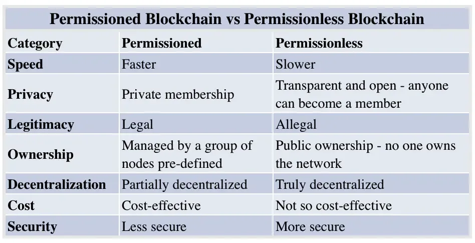

## Table of Contents

## What is a blockchain?

A blockchain is like a digital notebook that keeps a record of transactions. It's special because once something is written in it, it can't be changed or deleted. This notebook is shared across many computers, so everyone can see the same information. This makes it very secure and trustworthy because no single person can control it.

Each page in the blockchain notebook is called a "block." When a new transaction happens, it gets added to a new block. Once a block is full, it gets locked and added to the chain of previous blocks. This chain of blocks helps keep track of the order of transactions and makes sure everything stays in the right order. This system is used for things like cryptocurrencies, where people can send and receive money without a bank.

## What is a permissioned blockchain?

A permissioned blockchain is a type of blockchain where only certain people are allowed to join and make changes. It's like a private club where you need an invitation to get in. This is different from a public blockchain, where anyone can join and participate. In a permissioned blockchain, there's usually someone in charge who decides who gets to join and what they can do.

These blockchains are often used by businesses and organizations that want more control over their data and transactions. For example, a company might use a permissioned blockchain to keep track of its supply chain, making sure only trusted partners can see and add information. This can make things more secure and efficient, but it also means the blockchain isn't as open and decentralized as a public one.

## What is a permissionless blockchain?

A permissionless blockchain is like a public park where anyone can come and go as they please. It's open to everyone, and you don't need permission to join or make transactions. This type of blockchain is what powers cryptocurrencies like Bitcoin, where anyone can send and receive money without needing approval from a central authority.

Because it's open to everyone, a permissionless blockchain can be more decentralized and harder to control by any single group. This makes it very secure, but it can also be slower and use more energy because lots of people are trying to add new blocks to the chain at the same time. Despite these challenges, many people like permissionless blockchains because they believe in the idea of a system that no one person or group can control.

## What are the key differences between permissioned and permissionless blockchains?

The main difference between permissioned and permissionless blockchains is who can join and participate. A permissioned blockchain is like a private club where only invited members can join and make changes. It's often used by businesses that want more control over their data and who can access it. On the other hand, a permissionless blockchain is like a public park where anyone can come in and participate. It's open to everyone, and you don't need permission to make transactions. This type of blockchain is used for cryptocurrencies like Bitcoin.

Another key difference is how they handle security and efficiency. Permissioned blockchains can be more efficient and secure because they have fewer participants and a central authority managing things. This makes them faster and less energy-consuming. However, they are less decentralized because a small group controls who can join. Permissionless blockchains, while more decentralized and harder to control, can be slower and use more energy because many people are competing to add new blocks to the chain. Despite this, many people prefer them for their openness and the idea of a system that no one can fully control.

## Can you provide examples of permissioned blockchains?

One example of a permissioned blockchain is Hyperledger Fabric. It's used by businesses to keep track of things like supply chains or contracts. Only people who are part of the business network can join and make changes. This makes it easier for companies to trust the information because they know who is adding it.

Another example is Corda, which is used by banks and financial institutions. It helps them do things like process transactions and keep records safely. Only the banks and their partners can use it, so it's very private and secure. This helps them work together without worrying about outsiders messing with their data.

## Can you provide examples of permissionless blockchains?

Bitcoin is a famous example of a permissionless blockchain. It's like a big, open notebook where anyone can write down transactions. People use it to send and receive money without needing a bank to say it's okay. Because anyone can join, it's very hard for any one person or group to control it, which makes it safe and trustworthy.

Another example is Ethereum. This blockchain is not just for sending money, but also for running special programs called smart contracts. These programs can do things automatically, like pay someone when they finish a job. Just like Bitcoin, anyone can use Ethereum without asking for permission, making it a very open and free system.

## How does the level of decentralization differ between permissioned and permissionless blockchains?

Permissioned blockchains are less decentralized because they have rules about who can join and what they can do. It's like a club where only certain people get to be members. Because there's someone in charge deciding who gets in, the control is more centralized. This can make things easier to manage and more efficient, but it means the system isn't as open and free as a fully decentralized one.

Permissionless blockchains, on the other hand, are more decentralized. They're like a big, open park where anyone can come and go. Since no one needs permission to join, it's harder for any single person or group to take control. This makes the system very secure and trustworthy, but it can also make things slower and more complicated because there are so many people involved.

## What are the security implications of using a permissioned versus a permissionless blockchain?

Permissioned blockchains can be more secure in some ways because only certain people are allowed to join and make changes. This means the people in charge can keep a closer eye on what's happening and stop any bad actors from messing things up. Since it's like a private club, it's easier to trust the information because you know who is adding it. But, if someone inside the group does something wrong, it could still cause problems.

Permissionless blockchains are secure in a different way. Because anyone can join and no one person is in charge, it's very hard for anyone to take over the system. This makes it really safe and trustworthy because it's so hard to control. However, because anyone can join, there's a bigger chance of bad actors trying to do something harmful. So, while it's very secure against takeovers, it needs strong ways to check and stop these bad actions.

## How do transaction speeds and scalability compare between permissioned and permissionless blockchains?

Permissioned blockchains usually have faster transaction speeds and better scalability. This is because only a small group of people are allowed to join and make changes. With fewer people involved, it's easier to process transactions quickly. It's like having a small, private road where cars can move faster because there's less traffic. This makes permissioned blockchains great for businesses that need to handle a lot of transactions quickly and smoothly.

On the other hand, permissionless blockchains can be slower and less scalable. This is because anyone can join and try to add new blocks to the chain. It's like a busy highway where lots of cars are trying to get through at the same time. This can slow things down and use more energy. But people still use them because they like the idea of a system that's open to everyone and hard for any one person to control.

## What are the regulatory and compliance considerations for permissioned versus permissionless blockchains?

Permissioned blockchains are easier to manage when it comes to following rules and laws. Because only certain people are allowed to join and make changes, it's easier for the people in charge to make sure everything is done correctly. They can set up rules and check that everyone follows them. This makes it simpler to meet the requirements set by governments and other organizations. For example, a bank using a permissioned blockchain can make sure that all transactions follow financial regulations without much trouble.

Permissionless blockchains can be trickier when it comes to regulations. Since anyone can join and make transactions without asking for permission, it's harder to control and make sure everything follows the rules. This can be a problem because different countries have different laws about things like money and privacy. People who use permissionless blockchains need to be careful and might need to use special tools or methods to make sure they're following the law. This is one reason why some businesses prefer permissioned blockchains, even though permissionless ones are more open and free.

## How do the consensus mechanisms typically used in permissioned blockchains differ from those in permissionless blockchains?

Permissioned blockchains often use simpler consensus mechanisms because they have fewer people involved. One common method is called "Practical Byzantine Fault Tolerance" (PBFT). In PBFT, a group of trusted people vote on whether to add a new block to the chain. Since everyone knows and trusts each other, it's quick and easy to reach an agreement. This makes the system faster and more efficient, which is great for businesses that need to process a lot of transactions quickly.

Permissionless blockchains, on the other hand, need more complex consensus mechanisms because anyone can join. The most well-known method is "Proof of Work" (PoW), which is used by Bitcoin. In PoW, people compete to solve hard math problems, and the first one to solve it gets to add a new block to the chain. This takes a lot of energy and time, but it's very secure because it's hard for anyone to take control. Another method is "Proof of Stake" (PoS), used by Ethereum, where people with more coins have a better chance of adding new blocks. This is faster and uses less energy than PoW, but it's still more complicated than the methods used in permissioned blockchains.

## What are the future trends and potential developments for both permissioned and permissionless blockchains?

For permissioned blockchains, the future looks bright as businesses continue to see their value in managing private data and transactions securely. One trend is that more companies will start using them to improve their supply chains and keep better track of their products. Another trend is the development of better tools and software to make it easier for businesses to set up and use permissioned blockchains. These tools will help companies follow rules and laws more easily, making it simpler to use blockchains in areas like finance and healthcare. As technology gets better, we might see even faster and more secure permissioned blockchains that can handle a lot more transactions at once.

For permissionless blockchains, the focus is on solving some of their big challenges, like speed and energy use. One big trend is the move from Proof of Work to Proof of Stake, which uses less energy and can process transactions faster. This change is already happening with Ethereum and could make permissionless blockchains more popular for everyday use. Another trend is the growth of decentralized finance (DeFi), where people can do things like borrow and lend money without banks. As more people use these systems, we might see new ways to make them even safer and easier to use. Overall, both types of blockchains are likely to keep growing and changing, each finding their own place in the world.

## References & Further Reading

[1]: Nakamoto, S. (2008). ["Bitcoin: A Peer-to-Peer Electronic Cash System."](https://nakamotoinstitute.org/library/bitcoin/)

[2]: Wood, G. (2014). ["Ethereum: A Secure Decentralised Generalised Transaction Ledger."](https://ethereum.github.io/yellowpaper/paper.pdf)

[3]: Buterin, V. (2013). ["A Next-Generation Smart Contract and Decentralized Application Platform."](https://www.semanticscholar.org/paper/A-NEXT-GENERATION-SMART-CONTRACT-%26-DECENTRALIZED-Buterin/0dbb8a54ca5066b82fa086bbf5db4c54b947719a)

[4]: Mougayar, W. (2016). ["The Business Blockchain: Promise, Practice, and Application of the Next Internet Technology."](https://books.google.com/books/about/The_Business_Blockchain.html?id=CEsPDAAAQBAJ)

[5]: Casey, M.J., & Vigna, P. (2018). ["The Truth Machine: The Blockchain and the Future of Everything."](https://books.google.com/books/about/The_Truth_Machine.html?id=37QoDwAAQBAJ)

[6]: Tapscott, D., & Tapscott, A. (2016). ["Blockchain Revolution: How the Technology Behind Bitcoin Is Changing Money, Business, and the World."](https://dl.acm.org/doi/10.5555/3051781)

[7]: Antonopoulos, A. M. (2017). ["Mastering Bitcoin: Unlocking Digital Cryptocurrencies."](https://books.google.com/books/about/Mastering_Bitcoin.html?id=IXmrBQAAQBAJ)

[8]: Drescher, D. (2017). ["Blockchain Basics: A Non-Technical Introduction in 25 Steps."](https://link.springer.com/book/10.1007/978-1-4842-2604-9)

[9]: Mougayar, W. (2018). ["Tokenomics: The Business Model for the Web."](https://wmougayar.com/2017/06/10/tokenomics-a-business-guide-to-token-usage-utility-and-value/)