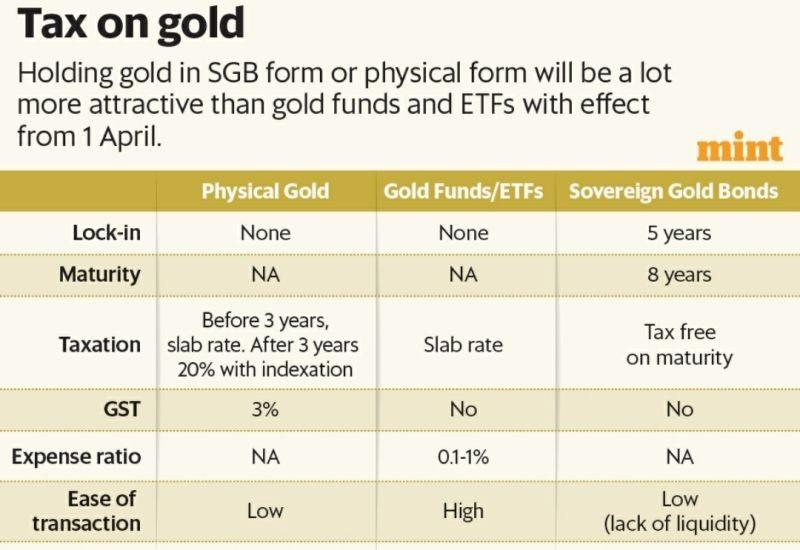

Investing in gold has consistently been a favored strategy for portfolio diversification and protection against economic turmoil. The enduring appeal of gold lies in its intrinsic value and historical role as a stable store of wealth. As financial markets face fluctuations and uncertainties, gold offers a haven for investors seeking stability.

Investors today have multiple pathways to integrate gold into their portfolios: physical gold, gold funds, and algorithmic trading. Physical gold, in forms such as bars, coins, or jewelry, provides a tangible asset and is often perceived as a hedge against inflation and currency devaluation. However, it requires considerations of storage, insurance, and authenticity verification to mitigate risks associated with fraud or loss.



Gold funds, particularly Exchange-Traded Funds (ETFs), provide indirect exposure to gold prices and offer increased liquidity compared to physical gold. These funds allow investors to trade gold on stock exchanges with lower transaction costs and the opportunity for professional management. This option facilitates diversification without the logistical concerns tied to holding physical gold.

Algorithmic trading represents a modern approach to gold investment, utilizing advanced algorithms for automatic trading based on specific criteria. This method enables precise and rapid transactions, especially tailored for trading gold ETFs in dynamic markets. Despite its efficiency advantages, algorithmic trading demands a robust understanding of market trends and a sophisticated technological setup.

This article will explore these different gold investment avenues, detailing their benefits, risks, and strategic implications for both seasoned investors and those new to the market. Understanding these options is crucial for making informed decisions and optimizing investment portfolios effectively.

## Table of Contents

## Physical Gold: A Tangible Asset

Physical gold provides investors with a reliable and tangible asset, offering a degree of security particularly valued during periods of economic instability. As an investment, physical gold can be acquired in various physical forms, including bars, coins, and jewelry. Each form comes with its own set of considerations, such as storage requirements and insurance costs. Bars are typically purchased for significant investment purposes due to their higher value per unit, while coins and jewelry might appeal to individuals seeking manageable or aesthetically pleasing options.

Investors should be aware of the challenges associated with owning physical gold, primarily concerning storage and insurance. Secure storage is essential to protect gold from theft or damage, often necessitating the use of safe deposit boxes or private vault facilities. The costs associated with these storage solutions can accumulate over time, impacting the overall profitability of the investment. Additionally, insuring the gold adds another layer of financial responsibility, ensuring the asset is protected against potential losses.

Due diligence is a critical component when purchasing physical gold. The market for gold can host various scams and offers promising authenticity that may not hold up under scrutiny. It is essential for investors to verify the legitimacy of sellers and the authenticity of gold products. Industry certifications, provenance documentation, and purity ratings from reputable sources can provide assurance of the gold's quality and legal standing.

Although physical gold does not provide dividends or interest, it has demonstrated a historical capacity for value appreciation. This capacity becomes particularly pronounced during times of economic uncertainty or inflation. Gold's role as a hedge against inflation and currency devaluation makes it an attractive choice for investors seeking to preserve wealth. Historical data suggest that gold prices often rise when traditional financial instruments falter, offering a counterbalance to other investments in a diversified portfolio.

Given these considerations, physical gold remains a significant component in the arsenal of portfolio diversification strategies. By carefully assessing storage solutions, verifying authenticity, and understanding market conditions, investors can effectively leverage physical gold to bolster their financial security amidst economic fluctuations.

## Gold Funds: The Advantage of ETFs

Gold ETFs (Exchange-Traded Funds) have become a preferred choice for investors seeking exposure to gold without the complexities associated with physical ownership. These funds operate by tracking the price of gold, yet they do not require the acquisition or storage of physical assets, thus offering a more convenient avenue for participation in the gold market.

One of the primary advantages of gold ETFs is their listing on stock exchanges. This feature provides investors with significantly higher [liquidity](/wiki/liquidity-risk-premium) compared to physical gold. High liquidity ensures that investors can buy or sell shares of gold ETFs readily, leading to lower transaction costs. The ease of trading shares on exchanges at any time during market hours adds to the attractiveness of ETFs, particularly for investors looking to quickly mobilize their assets in response to market developments.

Gold ETFs hold physical gold as the underlying asset, which means they offer a form of ownership via shares. These shares represent a portion of the total gold held by the [ETF](/wiki/etf-trading-strategies), allowing investors to gain indirect exposure to gold prices. This diversification reduces the risk associated with single-asset investments, as the ETF typically invests across various gold-related holdings.

Moreover, ETFs benefit from professional management, relieving investors from managing physical assets themselves. Professional management ensures that the gold holdings align with the fund’s objectives and market conditions, optimizing returns and reducing risks. The economies of scale achieved by these funds often result in lower costs, as management fees are spread over a large pool of investors, making them an economical choice for individuals and institutional investors alike.

Despite these advantages, gold ETFs lack the tangible aspect of owning physical gold. Investors do not have physical possession of gold bars or coins, which might be a consideration for those who value the intrinsic security of tangible assets. Nonetheless, the convenience, cost-effectiveness, and professional management offerings of gold ETFs make them an appealing choice for many investors looking to harness the stability and potential growth of gold in their investment portfolios.

## Algorithmic Trading: The Modern Approach

Algorithmic trading involves the use of computational algorithms to automate financial trading activities, based on specific pre-defined criteria. This modern approach is especially beneficial for trading gold ETFs (Exchange-Traded Funds), given its advantages in terms of speed, precision, and responsive execution of trades that can adapt to market fluctuations.

One of the primary advantages of [algorithmic trading](/wiki/algorithmic-trading) is its ability to execute trades at speeds significantly faster than human capabilities, leveraging real-time data to make swift decisions. This is particularly valuable in trading environments characterized by rapid price movements, such as those associated with gold ETFs, where quick execution can minimize costs and optimize entry and [exit](/wiki/exit-strategy) points.

Additionally, algorithmic trading enhances decision-making efficiency by permitting the analysis and execution of complex strategies that incorporate numerous data inputs. Algorithms are capable of scanning vast datasets for trading signals, providing a systematic, high-frequency trading solution that can capitalize on minimal price discrepancies and [arbitrage](/wiki/arbitrage) opportunities across various markets.

However, effective implementation of algorithmic trading demands a robust understanding of market trends and a sophisticated technological infrastructure. Traders must ensure their algorithms account for a multitude of factors, including timing, price limits, and trade volumes, to mitigate risks inherent in automated trading systems. Furthermore, algorithmic trading systems require constant monitoring and adjustments to adapt to changing market conditions and to prevent systemic errors from exacerbating financial losses.

The implementation of algorithmic trading also necessitates comprehensive [backtesting](/wiki/backtesting) against historical market data to validate strategies before deployment in live trading environments. This process involves simulating trades with past data to evaluate the algorithm's performance and refine its parameters, ensuring reliability and efficacy in actual market conditions.

In technical terms, algorithmic trading often employs programming languages such as Python for developing and testing trading algorithms. Python's extensive libraries, such as NumPy for numerical computation and pandas for data manipulation, provide a robust foundation for creating sophisticated predictive models and simulations. Here's a basic example of a moving average crossover strategy using Python:

```python
import pandas as pd

# Load historical data for a gold ETF
data = pd.read_csv('gold_etf_data.csv')
data['SMA_20'] = data['Close'].rolling(window=20).mean()  # 20-day simple moving average
data['SMA_50'] = data['Close'].rolling(window=50).mean()  # 50-day simple moving average

# Define trading signals
data['Signal'] = 0
data['Signal'][20:] = np.where(data['SMA_20'][20:] > data['SMA_50'][20:], 1, 0)  # Buy signal
data['Position'] = data['Signal'].diff()  # Identify position changes

# Print signals
print(data[['Date', 'Close', 'SMA_20', 'SMA_50', 'Signal', 'Position']].tail())
```

Algorithmic trading in gold ETFs, while offering numerous advantages such as cost reduction and strategic execution, requires investors to maintain a vigilant approach to managing risks and leveraging technological tools effectively. Mastery of this trading approach can lead to substantial improvements in portfolio performance and risk mitigation.

## Comparing the Options: Which Investment is Right for You?

Choosing the appropriate gold investment approach largely depends on an investor’s diversification needs, risk tolerance, and investment objectives. Each of the primary options—physical gold, gold funds, and algorithmic trading—offers distinct advantages and challenges.

Physical gold is preferred by individuals who value the tangibility of their investments. Owning physical gold, whether in the form of bars, coins, or jewelry, provides a direct, personal control over one's assets. However, this option necessitates dealing with potential scams, as authenticity is a crucial [factor](/wiki/factor-investing). Additionally, investors must consider storage and insurance costs to safeguard against theft or loss. Transaction costs can also be higher compared to other investment forms. Despite these challenges, physical gold is often seen as a safe haven during economic turbulence and does not correlate strongly with other financial assets, thus providing effective diversification.

Gold funds, particularly Exchange-Traded Funds (ETFs), offer a more convenient alternative. ETFs allow investors to gain exposure to gold prices without the complications of handling physical gold. They trade on stock exchanges, which enhances liquidity and potentially reduces transaction costs. Gold ETFs often include professional management, which can aid in diversifying risk across various gold-related investments. While ETFs do not provide the physical ownership of gold, they are favored by investors seeking ease of access and lower management overhead.

Algorithmic trading represents a modern approach to investing in gold, particularly suitable for gold ETFs. This method uses algorithms to automatically execute trades based on predefined conditions. The primary benefits of algorithmic trading include speed and precision, making it possible to capitalize on market fluctuations efficiently. This can lead to reduced trading costs and improved decision-making efficiency. However, successful algorithmic trading requires a solid understanding of market trends and access to a robust technological infrastructure. It is particularly appealing to tech-savvy investors and financial institutions who seek to optimize large trading operations swiftly and effectively.

Ultimately, the choice among physical gold, gold funds, and algorithmic trading should align with an investor's strategy. Physical gold appeals to those who want to manage an asset tangibly, while gold ETFs suit those who value liquidity and professional oversight. Algorithmic trading offers strategic advantages for those comfortable with technology and quick execution in volatile markets. Each option has its merits and should be considered within the context of individual investment goals and risk tolerance profiles.

## Conclusion

Gold remains a viable investment for portfolio diversification and risk management amid economic uncertainties. As an asset, it often acts as a hedge against inflation and currency devaluation, given its historical stability during periods of market [volatility](/wiki/volatility-trading-strategies). Investors are presented with options such as physical gold, gold funds, and algorithmic trading, each with distinct features and operational mechanisms.

The choice between physical gold, gold funds, and algorithmic trading depends on individual investment strategies and preferences. Physical gold offers the advantage of tangibility, appealing to those seeking a direct form of wealth preservation. In contrast, gold funds, notably Exchange Traded Funds (ETFs), provide liquidity and ease of trading without the complexities linked to storing and insuring physical assets. Meanwhile, algorithmic trading represents a modern strategy, leveraging advanced computational techniques to optimize trading decisions swiftly and accurately.

Understanding the unique advantages and downsides of each option can empower investors to optimize their portfolios effectively. Physical gold, while stable, incurs storage costs and lacks income generation. Gold ETFs, although more cost-effective, lack the inherent security of physical possession, while algorithmic trading necessitates technical expertise and carries inherent technology risks.

As market conditions evolve, staying informed and adaptable in your investment approach will remain crucial. Adapting strategies based on market trends and personal financial objectives can enhance potential returns while mitigating risks. Diversification, coupled with a sound understanding of each investment avenue, can equip investors to navigate the complexities of the gold market effectively. Leveraging resources such as financial news platforms, analytical tools, and expert consultations can help investors stay ahead in an ever-changing economic landscape.

## References & Further Reading

[1]: Bodie, Z., Kane, A., & Marcus, A. J. (2014). ["Investments"](https://www.mheducation.com/highered/product/Investments-Bodie.html). McGraw-Hill Education.

[2]: Baur, D. G., & McDermott, T. K. (2010). ["Is gold a safe haven? International evidence."](https://www.sciencedirect.com/science/article/pii/S0378426609003343) Journal of Banking & Finance, 34(8), 1886-1898.

[3]: World Gold Council. (n.d.). ["Investment in Gold: An Investors Guide."](https://www.gold.org/)

[4]: Erb, C. B., & Harvey, C. R. (2013). ["The golden dilemma."](https://www.nber.org/papers/w18706) Financial Analysts Journal, 69(4), 10-42.

[5]: Fabozzi, F. J., Gupta, F., & Markowitz, H. M. (2002). ["The Theory and Practice of Investment Management."](https://onlinelibrary.wiley.com/doi/book/10.1002/9781118267028) Wiley.

[6]: Lo, A. W. (2016). ["Advances in Financial Machine Learning"](https://books.google.com/books/about/Advances_in_Financial_Machine_Learning.html?id=oU9KDwAAQBAJ) by Marcos Lopez de Prado.

[7]: Cumming, D., Johan, S., & Li, D. (2011). ["Exchange-Traded Funds (ETFs): Much Ado About Nothing?"](https://onlinelibrary.wiley.com/doi/abs/10.1002/sej.1265) Review of Finance, 17(1), 1-48.

[8]: Murphy, C., & Nickerson, D. (2021). ["Algorithmic Trading with Python: Quantitative Methods and Strategy Development."](https://www.amazon.com/Algorithmic-Trading-Python-Quantitative-Development/dp/B086Y6H6YG) Packt Publishing.