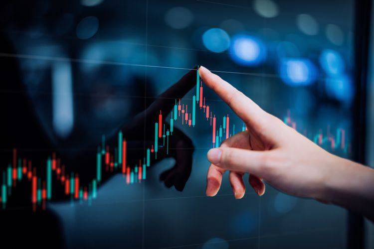

In the world of financial markets, understanding the nuances of price changes is crucial for traders. Terms like ticks, pips, and points play a significant role in describing these changes. These measurement units serve as fundamental components for quantifying price movements across diverse financial instruments, from stocks to currencies and futures. Each unit offers unique insights into market dynamics and aids traders in developing strategies optimized for specific trading environments.

In stock markets, price changes are frequently communicated in terms of points, providing a clear representation of market shifts. Conversely, in the forex market, pips are the standard unit, capturing the smallest price fluctuations to enable precise currency pair analysis. Meanwhile, ticks are pivotal in futures trading and algorithmic trading systems, where they denote the minutest movement in price data and enable high-frequency trading (HFT) strategies.



This article aims to demystify the terms ticks, pips, and points, elucidating their respective roles and significance in algorithmic trading. By understanding these units, traders can enhance their strategies and make informed decisions tailored to different markets. Furthermore, the relationship between these pricing units and trading strategies is vital, particularly in environments where speed and precision are paramount. For instance, high-frequency trading relies heavily on tick data for the rapid execution of trades and to gain a competitive advantage.

By exploring how ticks, pips, and points impact trading strategies and decision-making processes in high-frequency and algorithmic trading environments, traders and market participants can better navigate the complexities of financial markets. This knowledge enables them to optimize their approach to risk management and capitalize on opportunities that arise from small yet significant price changes.

## Table of Contents

## Understanding Points in Trading

Points in trading represent the largest unit of price change and are typically utilized to quantify variations occurring to the left side of the decimal point. In the context of stock markets, a change in the stock price from $100 to $105 indicates a movement of five points. This method of measurement provides a straightforward and efficient way to communicate significant changes in market prices. The concept of points is crucial in summarizing overall trends in market movements, as it offers a clear and concise representation of price fluctuations.

In stock market analysis, points serve as fundamental tools for reporting and evaluating market performance. Analysts often use points to describe broader market indices, such as the Dow Jones Industrial Average or the S&P 500, where movements are expressed in terms of point changes. For instance, a statement like "The Dow Jones fell by 200 points today" succinctly conveys substantial shifts in the market, offering an immediate understanding of market dynamics.

The use of points is particularly significant in the context of technical analysis and financial reporting. By focusing on point changes, analysts and traders can observe trends over time, allowing for the assessment of market [momentum](/wiki/momentum) and investor sentiment. This aids in making informed investment decisions based on historical data and trend analysis.

Overall, the application of points in trading is essential for efficient market communication, providing a clear and quantifiable measure of price movements. The straightforward nature of points as a measurement tool simplifies the analysis of market trends and enhances the clarity of financial reports and discussions.

## The Role of Ticks

Ticks denote the smallest measurable price movement of a trading instrument, particularly within the futures and stock markets. They provide traders the ability to monitor precise and incremental price changes, which are vital for making informed trading decisions. The role of ticks is underscored by their contribution to effective price tracking, which is indispensable for determining entry and [exit](/wiki/exit-strategy) points in trading strategies.

The minimum tick size can vary significantly across different markets and asset classes. For instance, in the U.S. stock market, a tick might represent a movement of $0.01 for equities priced above $1, while futures contracts might have varying tick sizes depending on the commodity and the exchange specifications. This variability necessitates traders to thoroughly understand the specific tick structure of each market they participate in, as it directly impacts transaction costs, the bid-ask spread, and ultimately, profitability.

Bid-ask spreads—an essential consideration for traders—are the difference between the highest price a buyer is willing to pay (bid) and the lowest price a seller is willing to accept (ask). Tick sizes play a crucial role in the formation of these spreads. Smaller tick sizes generally translate to narrower spreads, which can reduce trading costs for high-frequency traders. Conversely, larger ticks might result in wider spreads, influencing [liquidity](/wiki/liquidity-risk-premium) and market participation.

From a strategic perspective, recognizing the tick size is crucial for efficient execution of trading strategies. For example, [algorithmic trading](/wiki/algorithmic-trading) systems rely on high-frequency data, including tick-by-tick information, to identify price patterns and execute trades at optimal moments. Algorithms account for ticks to precisely manage risk and adapt to market [volatility](/wiki/volatility-trading-strategies), providing traders with a competitive edge in rapidly changing market environments.

Implementing efficient trading strategies necessitates a comprehensive understanding of tick dynamics. Traders must integrate tick size knowledge into their algorithms to optimize trading performance and leverage minute price changes for substantial gains. Consequently, ticks serve as fundamental components in crafting sophisticated trading strategies and executing them with precision across diverse financial markets.

## Pips: A Forex Trading Essential

Pips, or "percentage in point," denote the smallest price movement a currency pair can register in the [forex](/wiki/forex-system) market. Typically, this is measured to the fourth decimal place, making them a critical unit for tracking minute fluctuations in currency values. For most currency pairs, a movement from 1.2345 to 1.2346 equals one pip. However, for currency pairs involving the Japanese yen, pips are usually quantified to the second decimal point, such as a movement from 110.12 to 110.13.

In forex trading, pips are essential for evaluating potential gains or losses. They enable traders to quantitatively assess risk and devise trading strategies that align with market volatility. Pips serve as a standardized unit to compare price changes across different currency pairs, facilitating the calculation of spreads, profits, and losses.

A trader's ability to effectively leverage pips in their strategy can significantly impact their profitability. For instance, the pip value for a standard lot (100,000 units of currency) in a currency pair like EUR/USD is approximately $10. Calculating potential returns involves understanding the pip value and potential movement. For example, if a trader anticipates a 50-pip movement on EUR/USD, the potential profit (or loss) would be 50 pips × $10/pip = $500.

Moreover, the volatility of currency pairs often dictates trading strategies. High-volatility pairs, exhibiting larger pip movements, may present greater profit opportunities, albeit with increased risk. Conversely, low-volatility pairs provide stability but with potentially lower returns. Forex traders optimize strategies by analyzing historical pip data and anticipating future price trends.

Pips are indispensable in forex trading, assisting traders in defining market dynamics and optimizing performance. Traders who adeptly harness the intricacy of pip movements can enhance their decision-making process and effectively manage risk, leading to more consistent trading outcomes.

## When to Use Pips, Points, or Ticks

Selecting between pips, points, or ticks requires comprehension of the specific market context and attributes of the financial instrument being traded. Each unit serves a distinct purpose depending on the nuances of the financial market involved.

Points are predominantly used in stock markets to represent larger movements. For example, a stock price change from $150 to $153 indicates a three-point increase. This straightforward representation facilitates easy communication of significant price changes and trend analysis within equities markets. Points provide an effective way to summarize larger market trends and are instrumental in reporting and strategic analysis.

In forex trading, pips or "percentage in point" are crucial for representing the smallest price changes to the fourth decimal. For example, if the EUR/USD currency pair moves from 1.1234 to 1.1235, it is said to move by one pip. Pips are vital for forex traders as they provide a measure for volatility and an essential tool for risk assessment and potential return calculations. By using pips, forex professionals can fine-tune their strategies to accommodate currency pair volatility and optimize their trading decisions.

Ticks signify the smallest incremental movement of a financial instrument to the right of the decimal point and are most relevant in high-frequency trading environments, like futures markets. The minimum tick size varies among different financial products, affecting bid-ask spreads and influencing trading strategy execution. Ticks allow traders to track minute fluctuations, essential for high-frequency and algorithmic trading, where rapid analysis and execution are critical.

Ultimately, understanding these units and their respective applications is crucial for traders aiming to make informed decisions. By selecting the appropriate unit—points for larger movements in stocks, pips for forex, and ticks for fine-grained analysis in futures—traders can align their strategies with market-specific dynamics, enhancing their capacity to manage risk and capture profitable opportunities.

## Algorithmic Trading with Ticks, Pips, and Points

Algorithmic and high-frequency trading systems rely on the precise measurement of market movements facilitated by ticks, pips, and points. In these environments, every millisecond counts, and the ability to track small price changes is essential to exploit minute market inefficiencies for profit. Tick data, in particular, is invaluable for rapid analysis and execution. It provides detailed insights into market fluctuations, allowing traders to implement strategies that capitalize on even the smallest price shifts.

An algorithmic trading strategy may use tick data to identify patterns or signals that indicate potential price movements. For example, traders can employ moving averages or other technical indicators to analyze tick data streams and make buy or sell decisions instantaneously. Consider the use of Moving Average Convergence Divergence (MACD), which can be calculated using tick data:
$$
\text{MACD} = \text{EMA}_{\text{short}} - \text{EMA}_{\text{long}}
$$
where $\text{EMA}_{\text{short}}$ and $\text{EMA}_{\text{long}}$ represent the exponentially weighted moving averages over short and long timeframes, respectively.

Integrating ticks, pips, and points effectively into trading strategies also requires advanced algorithms and robust data processing systems. These systems must handle the massive volumes of tick data that are typical in high-frequency trading. Modern trading platforms accomplish this with the help of big data technologies and parallel processing. Technologies like Apache Kafka and Apache Spark provide scalable solutions to process real-time data streams and perform complex computations across distributed systems.

Python has emerged as a popular language for implementing algorithmic trading strategies due to its rich ecosystem of libraries, such as Pandas for data manipulation and NumPy for numerical operations. An example of Python code to calculate moving averages on tick data:

```python
import pandas as pd

def calculate_moving_average(data, window):
    return data.rolling(window=window).mean()

tick_data = pd.Series([20.05, 20.10, 20.15, 20.20, 20.25])
short_window = 2
long_window = 3

ema_short = calculate_moving_average(tick_data, short_window)
ema_long = calculate_moving_average(tick_data, long_window)

macd = ema_short - ema_long
print(macd)
```

In summary, ticks, pips, and points are essential components in algorithmic trading systems. Their effective integration into trading strategies requires sophisticated algorithms and powerful data processing tools to ensure accurate interpretation and swift execution, thereby maximizing potential gains in volatile markets.

## Conclusion

Understanding and utilizing ticks, pips, and points is indispensable for success in financial trading. Each pricing unit plays a specific role in different markets and trading strategies, contributing substantially to informed decision-making and risk management. In stock markets, points offer a macroscopic view of market trends, aiding investors in capturing broad movement patterns. Conversely, in the forex market, pips serve as a finer measurement, allowing traders to navigate the nuanced fluctuations in currency pairs, which is crucial for optimizing trading strategies based on market volatility.

Ticks, identified as the smallest price movement across various financial instruments, are especially valuable in high-frequency and algorithmic trading environments. They enable the precise tracking of incremental changes, facilitating traders to respond swiftly and efficiently. This real-time data is pivotal in deploying algorithmic trading systems that demand rapid analysis and execution. Such systems rely on processing extensive tick data volumes, necessitating sophisticated algorithms to capitalize on minute price differences.

Traders who harness these measurement tools effectively can gain a significant competitive edge. By accurately interpreting market-specific dynamics through these units, they can enhance their decision-making processes, optimize trading strategies, and better manage financial risks. As a result, the successful integration of ticks, pips, and points into trading strategies can lead to enhanced profitability and sustainability in the fast-paced world of algorithmic trading.

## References & Further Reading

[1]: Yadav, S., & Dhingra, B. (2019). ["Algorithmic Trading: Computational Techniques and Applications."](https://www.researchgate.net/publication/378548435_Algorithmic_Trading_and_AI_A_Review_of_Strategies_and_Market_Impact) Springer.

[2]: Schulmeister, S. (2009). ["Profitability of Technical Stock Trading: Has it Moved from Daily to Intra-daily Data?"](https://onlinelibrary.wiley.com/doi/abs/10.1016/j.rfe.2008.10.001) Review of Financial Economics, 18(4), 190-201.

[3]: Aldridge, I. (2013). ["High-Frequency Trading: A Practical Guide to Algorithmic Strategies and Trading Systems,"](https://books.google.com/books/about/High_Frequency_Trading.html?id=8QpIsVUMhmEC) 2nd Edition. Wiley Finance.

[4]: Tsay, R.S. (2005). ["Analysis of Financial Time Series."](https://onlinelibrary.wiley.com/doi/book/10.1002/9780470644560) Wiley-Interscience.

[5]: Murphy, J.J. (1999). ["Technical Analysis of the Financial Markets: A Comprehensive Guide to Trading Methods and Applications."](https://www.amazon.com/Technical-Analysis-Financial-Markets-Comprehensive/dp/0735200661) New York Institute of Finance.