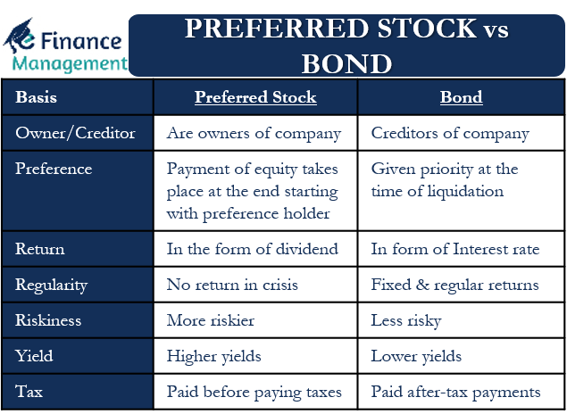

## Table of Contents

## What are preference shares?

Preference shares are a type of stock that gives its owners certain advantages over common shareholders. The main advantage is that preference shareholders get paid their dividends before common shareholders. Dividends are payments that companies make to their shareholders from their profits. If a company cannot pay all its dividends, preference shareholders will still get their dividends, while common shareholders might not get anything.

There are different types of preference shares, but they all have this basic feature of getting paid first. Some preference shares also have a fixed dividend rate, which means the company promises to pay a certain amount every year. This can make preference shares more attractive to investors who want a steady income. However, preference shareholders usually do not get to vote at company meetings, unlike common shareholders who often have voting rights.

## What are bonds?

Bonds are like loans that people or big groups like companies and governments can borrow. When you buy a bond, you are giving money to the borrower, and they promise to pay you back after a certain time. They also usually pay you a little bit of money every year, which is called interest. This interest is like a thank you for lending them the money.

There are different kinds of bonds, but they all work in a similar way. Some bonds are safer because they come from strong, reliable borrowers like big governments. Others might be riskier because they come from smaller companies that might have a harder time paying back the money. People like to buy bonds because they can be a safe way to save money and earn a little bit of interest over time.

## How do preference shares differ from common shares?

Preference shares and common shares are two types of stocks that companies can issue, but they have some key differences. Preference shares give their owners a special advantage: they get paid their dividends before common shareholders. Dividends are like little payments that companies make to their shareholders when they make a profit. If a company can't pay all its dividends, preference shareholders will still get their money, while common shareholders might not get anything. This makes preference shares more attractive to people who want a steady income from their investments.

On the other hand, common shares usually come with voting rights, which means common shareholders can vote on important company decisions at meetings. Preference shareholders usually don't get to vote. Also, while preference shares often have a fixed dividend rate, the dividends for common shares can change depending on how well the company is doing. So, common shares can be riskier but also offer the chance for bigger rewards if the company does really well.

## What are the main types of bonds?

There are several main types of bonds that people can invest in. One common type is government bonds, which are issued by governments to raise money. They are usually seen as very safe because governments are less likely to go bankrupt. Another type is corporate bonds, which are issued by companies. These can be riskier than government bonds because companies can fail and not pay back the money. There are also municipal bonds, which are issued by local governments like cities or states, to fund projects like schools or roads.

Another important type of bond is treasury bonds, which are a specific kind of government bond issued by the national government. They are known for being very secure and are often used by people who want a safe place to keep their money. Then there are junk bonds, which are issued by companies that might be struggling financially. These bonds offer higher interest rates to attract investors, but they are much riskier because the companies might not be able to pay back the money. Finally, there are savings bonds, which are designed for individual investors and are backed by the government, making them a low-risk investment option.

## What is the typical return on preference shares compared to bonds?

Preference shares usually offer a higher return than bonds. This is because they are riskier than many types of bonds, especially government bonds. When you buy preference shares, you might get a fixed dividend, which is like getting a regular payment. This dividend is often higher than the interest you would get from a bond. But, the exact return can change depending on the company and how well it's doing.

Bonds, on the other hand, are often seen as safer investments. They give you a steady interest payment, which is usually lower than the dividends from preference shares. For example, government bonds might give you a small but very safe return. Corporate bonds might offer a bit more interest, but they can be riskier than government bonds. So, if you want a higher return and are okay with more risk, preference shares might be better. But if you want something safer with a smaller return, bonds could be the way to go.

## How does the risk profile of preference shares compare to that of bonds?

Preference shares are usually riskier than bonds. When you buy preference shares, you are investing in a company, and if the company does badly, it might not be able to pay you the dividends you were expecting. Also, if the company goes bankrupt, preference shareholders are paid after bondholders but before common shareholders. This means there's a chance you might not get all your money back if things go really wrong. 

Bonds are generally seen as safer investments. When you buy a bond, you are lending money to a government or a company, and they promise to pay you back with interest. Government bonds are especially safe because governments are less likely to go bankrupt. Corporate bonds can be riskier, but they still have a lower risk than preference shares because bondholders get paid back before preference shareholders if the company fails. So, if you want a safer investment, bonds might be a better choice than preference shares.

## What are the tax implications of investing in preference shares versus bonds?

When you invest in preference shares, the dividends you get are usually taxed differently than the interest you get from bonds. In many places, dividends from preference shares are taxed at a lower rate than regular income. This can be good for you because you get to keep more of your money. But, if the company does badly and can't pay dividends, you won't get any money, and you can't claim that as a loss on your taxes.

On the other hand, the interest you earn from bonds is usually taxed as regular income. This means you might have to pay a higher tax rate on the money you get from bonds than on the dividends from preference shares. However, bonds are often seen as safer, so you might be more likely to get your interest payments. If you buy a bond and then sell it for more than you paid, you might have to pay capital gains tax on the profit, which can also be taxed at a different rate depending on where you live.

So, when you're thinking about taxes, preference shares might give you a better deal because of the lower tax rate on dividends. But bonds can be more predictable and safer, even if you have to pay more in taxes on the interest. It's a good idea to talk to a tax advisor to understand how these investments will affect your taxes based on where you live and your personal situation.

## Can preference shares be converted into common shares, and how does this compare to bond convertibility?

Some preference shares can be converted into common shares. This means if you own these special preference shares, you can choose to trade them for common shares of the same company. This can be good if you think the company will do well in the future and you want to have voting rights and the chance for bigger rewards. Not all preference shares can be converted though, so you need to check before you buy them.

Bonds can also be convertible, but it works a bit differently. Convertible bonds let you swap your bond for a set number of common shares of the company that issued the bond. This can be a good deal if the company does well because you can get the shares at a lower price than if you bought them on the stock market. But, like with preference shares, not all bonds can be converted, so you need to know what you're buying. Both convertible preference shares and convertible bonds give you a chance to benefit from the company's growth, but they also add a bit more risk to your investment.

## What are the voting rights associated with preference shares compared to bonds?

Preference shares usually do not come with voting rights. This means that if you own preference shares, you generally cannot vote on big decisions at the company's meetings. The main advantage of preference shares is that you get paid dividends before common shareholders. Common shareholders, on the other hand, often have voting rights, which means they can have a say in how the company is run. So, if you want to have a voice in the company, common shares might be better for you, but if you want a more secure income, preference shares could be the way to go.

Bonds do not come with voting rights at all. When you buy a bond, you are lending money to a company or government, and they promise to pay you back with interest. You do not get to vote on company decisions because you are not an owner of the company, just a lender. This is different from both preference shares and common shares, where you are an owner of part of the company. So, if you buy bonds, you are giving up any chance to vote on company matters, but you are often getting a safer and more predictable return on your investment.

## How do the redemption features of preference shares differ from those of bonds?

Preference shares sometimes have a redemption feature, which means the company can buy them back from you at a certain time or after a certain date. This is like the company giving you your money back, plus any dividends you're owed. Not all preference shares can be redeemed though, so you need to check before you buy them. If the shares can be redeemed, the company might do it when they have extra money or when the shares reach a certain age. This can be good for you because you get your money back, but it can also mean you lose the chance to keep [earning](/wiki/earning-announcement) dividends.

Bonds almost always have a redemption feature. When you buy a bond, the company or government that issued it promises to pay you back the full amount of the bond when it reaches its maturity date. This is like a set time when they have to give you your money back. Bonds are different from preference shares because they always have this promise to pay you back at the end. This makes bonds a safer investment because you know exactly when you'll get your money back, as long as the issuer doesn't go bankrupt.

## What role do preference shares and bonds play in a company's capital structure?

Preference shares and bonds are important parts of a company's capital structure. They help the company raise money to grow and do new projects. When a company sells preference shares, it gets money from investors who want a steady income from dividends. These investors are paid before common shareholders, which can make the company more attractive to them. Preference shares are a bit like a middle ground between owning part of the company and lending money to it. They can help the company keep a balance between the money it needs and the risks it takes.

Bonds are another way for a company to raise money, but they work differently. When a company sells bonds, it's basically borrowing money from investors. The company promises to pay back the money with interest at a set time. This makes bonds safer for investors because they know when they'll get their money back. Bonds can be a good way for a company to get money without giving up ownership, like they would with common or preference shares. By using both preference shares and bonds, a company can build a strong capital structure that helps it grow while managing risk.

## How do market conditions affect the pricing and attractiveness of preference shares versus bonds?

Market conditions can really change how much people want to buy preference shares and bonds, and how much they cost. When the economy is doing well and people feel confident, they might be more interested in preference shares. This is because preference shares can give bigger rewards, like higher dividends, but they are also riskier. So, when the market is strong, the price of preference shares might go up because more people want to buy them. On the other hand, if the economy is not doing so well, people might be more scared to take risks. They might prefer bonds, which are usually safer. This can make the price of bonds go up because more people want to buy them.

Interest rates are another big part of market conditions that affect preference shares and bonds. When interest rates go up, new bonds start to pay more interest, which can make older bonds with lower interest rates less attractive. This can cause the price of those older bonds to go down. Preference shares can also be affected by interest rates, but in a different way. If interest rates go up, the fixed dividends from preference shares might not look as good compared to the new, higher interest rates from bonds. This can make preference shares less attractive and cause their prices to drop. So, understanding market conditions, like how the economy is doing and what interest rates are, is important when deciding between preference shares and bonds.

## References & Further Reading

[1]: "Bonds: An Introduction to the Core Concepts" by Martin P. Fridson and Fernando Alvarez. This book offers comprehensive insights into the mechanics of bond investing.

[2]: ["The Handbook of Fixed Income Securities"](https://www.amazon.com/Handbook-Fixed-Income-Securities-Ninth/dp/1260473899) by Frank J. Fabozzi

[3]: ["Preferred Stock Investing"](https://www.kiplinger.com/investing/602804/preferred-stock-should-i-buy-it) by Doug K. Le Du. This source provides detailed knowledge on investment strategies involving preferred stocks.

[4]: Lopez de Prado, M. (2018). ["Advances in Financial Machine Learning"](https://www.amazon.com/Advances-Financial-Machine-Learning-Marcos/dp/1119482089) John Wiley & Sons, Inc.

[5]: Box, G., & Jenkins, G. (2015). ["Time Series Analysis: Forecasting and Control"](https://www.researchgate.net/publication/299459188_Time_Series_Analysis_Forecasting_and_Control5th_Edition_by_George_E_P_Box_Gwilym_M_Jenkins_Gregory_C_Reinsel_and_Greta_M_Ljung_2015_Published_by_John_Wiley_and_Sons_Inc_Hoboken_New_Jersey_pp_712_ISBN_) 

[6]: ["Quantitative Trading: How to Build Your Own Algorithmic Trading Business"](https://github.com/LucindaYa/quant-resources/blob/master/Quantitative%20Trading%20How%20to%20Build%20Your%20Own%20Algorithmic%20Trading%20Business.pdf) by Ernest P. Chan, which presents practical knowledge for developing algorithmic trading systems.