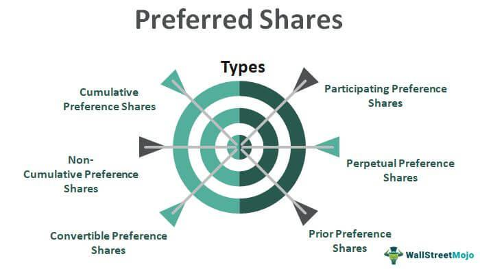

In the ever-evolving financial landscape, understanding the diverse investment instruments available is crucial. This article explores bonds, preference shares, and algorithmic trading to provide insights into their dynamics, benefits, and strategic importance. Bonds, known for their fixed income nature, represent loans made by investors to borrowers, offering regular interest payments and a specified maturity date for principal repayment. Preference shares, or preferred stocks, offer equity ownership with fixed dividends prioritizing them over common stock dividends. Algorithmic trading, meanwhile, utilizes advanced mathematical models and software to execute trades with speed and precision, enhancing investment strategies.

Each of these financial tools operates under distinct mechanisms, carries unique risk factors, and offers varied potential returns, appealing to both seasoned investors and novices. Investors will gain clarity on how these instruments work individually and in synergy, emphasizing their operational intricacies and strategic roles in investment portfolios. This article also highlights how integrating these tools can create a diversified portfolio tailored for optimal performance. Additionally, the role of algorithmic trading in refining financial strategies will be examined, showcasing its capacity to enhance decision-making through data analysis and automated processes.



Through a comprehensive guide, we aim to cater to a wide audience, providing essential knowledge for informed investment choices. Understanding bonds, preference shares, and algorithmic trading paves the path for achieving financial goals, encouraging a balanced approach to risk and reward.

## Table of Contents

## Understanding Bonds

Bonds are financial instruments classified as fixed-income securities. They represent a loan provided by an investor to a borrower, typically a corporation or government. The borrower issues a bond to raise funds, agreeing to pay regular interest to the bondholder until a pre-determined maturity date, at which the principal amount is repaid.

1. **Interest Payments and Maturity**: Bonds are characterized by their predictable income stream. Interest payments, commonly referred to as coupon payments, are made at regular intervals. The interest rate, or coupon rate, is usually fixed and is a percentage of the bond's face value. Upon reaching maturity, the bondholder is repaid the face value of the bond.

2. **Investment Safety**: Compared to equities, bonds are generally considered safer investments due to their fixed returns and seniority in the capital structure. In the event of liquidation, bondholders are prioritized over equity holders in repayment. This makes bonds an attractive choice for risk-averse investors seeking steady income.

3. **Secured Bonds**: Certain bonds are secured against the issuer’s assets, providing an additional layer of security. In a default scenario, these assets can be liquidated to satisfy bondholder claims, reducing the potential loss.

4. **Diverse Market**: The bond market is expansive, offering a range of options across different geographies, industries, and risk profiles. Investors can choose from government bonds, corporate bonds, municipal bonds, and more. Each type presents varying levels of risk and return, influenced by factors such as credit ratings, interest rate fluctuations, and economic conditions.

In summary, bonds offer a structured, reliable form of investment, catering to those who prioritize capital preservation and predictable income streams. Their diverse nature allows for tailored investment strategies, aligning with both individual investor goals and comprehensive portfolio management.

## Exploring Preference Shares

Preference shares, also known as preferred stocks, are a type of equity instrument providing ownership in a company along with preferential treatment concerning dividend payments. These shares are distinct from common stocks, where dividends are paid after preference shareholders have received their fixed dividends. Unlike bonds, preference shares typically do not have a maturity date and can exist indefinitely, offering ongoing potential for dividend income.

A defining characteristic of preference shares is the fixed dividend rate attached to them. This means that regardless of the company's financial performance for a particular period, preference shareholders are entitled to receive a predetermined dividend before any dividends are declared to common shareholders. This aspect makes preference shares an attractive option for investors seeking a stable income stream, especially in periods of economic instability where common dividends might fluctuate.

While they offer a reliable income source, preference shares often come with the trade-off of lacking voting rights. This means that preference shareholders generally do not participate in the decision-making processes within the company, such as electing the board of directors or approving major corporate actions. This absence of voting power aligns preference shares more closely with debt instruments like bonds than with traditional equity, although they still maintain certain equity features.

In a liquidation scenario, preference shareholders hold a priority claim over common shareholders when it comes to the distribution of a company’s assets. However, they are subordinate to debt holders, meaning bondholders and other creditors are prioritized first. This priority in asset distribution adds a layer of financial security to preference shares, making them a less risky investment than common stocks during times of financial distress.

The hybrid nature of preference shares—combining elements of both equity and debt—makes them a versatile component in an investment portfolio. Investors may choose preference shares when they desire the potential for steady returns typical of bonds while still participating in the ownership of a company. This balance can offer a unique advantage for those looking to optimize the equity allocation in their portfolios with instruments that have bond-like characteristics but derive their value from the issuing entity’s equity. The strategic integration of preference shares can thus contribute to a diversified investment approach, catering to a wide range of risk appetites and income requirements.

## Algorithmic Trading: Revolutionizing Investment Strategies

Algorithmic trading employs sophisticated mathematical models and software to execute financial transactions with remarkable speed and accuracy. At its core, this approach leverages data analysis to minimize human error and provides a significant competitive advantage in the dynamic financial markets.

The integration of algorithms in trading strategies enables the optimization of portfolios by systematically analyzing large datasets to predict market trends. This process aids in executing trades at the most opportune moments, capitalizing on price discrepancies and market inefficiencies. By utilizing advanced statistical techniques, algorithms assess historical data and current market conditions to forecast potential movements, adjusting trading strategies accordingly.

While the benefits of [algorithmic trading](/wiki/algorithmic-trading) are substantial, it is not without its challenges. Market [volatility](/wiki/volatility-trading-strategies) can lead to rapid fluctuations in asset prices, potentially impacting the performance of algorithm-driven trades. Additionally, technological failures, such as software bugs or hardware malfunctions, can disrupt trading activities, underscoring the importance of having robust contingency plans.

Successful implementation of algorithmic trading requires robust systems designed to handle the vast amounts of data processed at high speeds. Continuous monitoring and systematic testing of trading algorithms are crucial to ensure their effectiveness and adaptability in real-time. This includes rigorous [backtesting](/wiki/backtesting) processes to validate the performance of models against historical data, adjusting parameters as needed to align with evolving market conditions.

Moreover, the complexity of developing and managing algorithmic trading systems often necessitates collaboration between financial experts, data scientists, and software developers. This interdisciplinary approach ensures the creation of tailored algorithms that align with specific investment strategies and risk management objectives.

In conclusion, while algorithmic trading offers a multitude of advantages, its success hinges on the integration of powerful analytical tools, strategic oversight, and flexible systems capable of adapting to the ever-shifting financial landscape.

## Bonds vs. Preference Shares: A Comparative Analysis

Bonds and preference shares are two distinct financial instruments that provide investors with opportunities for regular income, but they differ significantly in their structure and risk profiles.

Bonds are fixed-income securities that offer a predictable stream of interest payments, known as the coupon, which is paid at regular intervals over the life of the bond. They are typically considered a lower-risk investment compared to other financial instruments due to their prioritization in debt repayment. In the event of liquidation, bondholders are ranked higher in the repayment hierarchy than shareholders. The certainty of interest payments and the predefined maturity date, at which the principal amount is returned, make bonds a safer option for conservative investors.

Preference shares, on the other hand, are a hybrid between bonds and common stocks. They represent equity in the company, providing dividends that, while typically fixed, can vary based on the company's profitability. Unlike bonds, preference shares do not have a maturity date, meaning they can exist indefinitely. Their dividends are prioritized over common stock dividends but generally come after bond interest payments in terms of company obligations. Preference shares may offer higher returns than bonds but come with more risk, as they are subordinate to bond obligations. 

When choosing between bonds and preference shares, investors need to consider their individual risk tolerance and investment goals. Bonds may appeal to those seeking stability and assured returns while accepting potentially lower yields, reflective of their lower risk. Conversely, preference shares might attract investors seeking enhanced returns, albeit at the risk of increased volatility and lower priority in financial distress scenarios.

A comparative analysis of these instruments often includes examining historical performance and prevailing market conditions. For instance, during periods of low-interest rates, the fixed dividends from preference shares might appear more attractive compared to the yield on bonds, which would typically be lower in such an environment. However, market trends reveal that preference shares may be more sensitive to changes in interest rates, as rising rates could lead to reduced relative attractiveness and price volatility.

In conclusion, both bonds and preference shares offer unique benefits and drawbacks, and the choice between them should align with an investor's financial objectives and risk appetite. Understanding the interplay between these factors and external market conditions is crucial for effective decision-making and portfolio management.

## Integrating Algorithmic Trading with Bonds and Preference Shares

Algorithmic trading serves as a transformative tool for managing investments in bonds and preference shares. By utilizing algorithms, traders can automate and optimize trading processes, making them more efficient and potentially enhancing returns. Algorithms enable investors to perform real-time analysis and respond swiftly to market conditions, which is essential in both fixed-income and equity markets.

Real-time market analysis offered by algorithmic trading can significantly benefit bond and preference share investors. For instance, algorithms can monitor [interest rate](/wiki/interest-rate-trading-strategies) fluctuations and dividend announcements to adjust investment positions accordingly. This automation reduces human error and enhances the precision of trade executions.

Algorithmic trading systems employ mathematical models to predict market movements and identify optimal trading opportunities. Consider a scenario where an algorithm identifies a discrepancy in the yield spread of a bond relative to the interest rate curve. An algorithm might use this information to execute trades that capitalize on the deviation, potentially leading to profitable outcomes.

Risk management is a critical component supported by algorithmic trading. Algorithms can assess market volatility and adjust portfolios to mitigate potential losses. For instance, a volatility prediction model might suggest reallocating investments if significant market changes are anticipated.

Investors must ensure that their algorithmic trading systems align with bonds and preference shares' unique characteristics. Bonds, for example, may require algorithms that account for credit ratings and changes in interest rates. Preference shares would benefit from algorithms that consider dividend health and payout patterns.

To efficiently integrate algorithmic trading in these investment types, investors can utilize conditional trading strategies. For example, in Python, one might use an algorithm to sell a bond if its price falls below a certain threshold:

```python
def execute_trade(bond_price, threshold):
    if bond_price < threshold:
        return "Sell"
    else:
        return "Hold"

bond_price = 95
threshold = 100
trade_decision = execute_trade(bond_price, threshold)
print(trade_decision)  # Output: Sell
```

In conclusion, algorithmic trading provides a sophisticated level of control and analysis for traders engaging with bonds and preference shares. By embracing these technologies, investors not only safeguard their portfolios through enhanced risk management but also push the frontier of potential returns. The key lies in customizing algorithms to fit the specific investment instrument, ensuring compatibility and efficiency.

## Conclusion

Understanding and strategically leveraging bonds, preference shares, and algorithmic trading can significantly enhance an investment portfolio. Each of these financial instruments presents unique opportunities that investors can harness to achieve diverse financial goals. Bonds offer a safer investment option with fixed returns, while preference shares provide a blend of equity and fixed income advantages. Algorithmic trading introduces precision and efficiency in executing investment strategies, allowing for quick responses to market changes.

By staying informed about market trends and technological advancements, investors can maximize the benefits these financial tools offer. The global financial landscape is continuously evolving, and keeping abreast of new developments ensures that investors can make informed decisions that align with their objectives. Advances in algorithmic trading, for instance, are continuously reshaping how portfolios are managed, providing opportunities to exploit market inefficiencies.

Careful planning and integration of bonds, preference shares, and algorithmic trading can help construct robust investment strategies. The synergy between these instruments allows for crafting portfolios that are both resilient and capable of achieving specific financial targets. For example, bonds can provide stability, preference shares can enhance income potential, and algorithmic trading can optimize the timing and execution of trades.

Ultimately, the key to successful investment lies in balancing risk and reward. Each investor has unique financial objectives, and aligning portfolios with these goals requires thoughtful selection and combination of various financial instruments. Whether seeking to secure steady income, capitalize on market trends, or achieve long-term growth, having a well-rounded approach bolstered by bonds, preference shares, and algorithmic trading can significantly contribute to financial success.

## References & Further Reading

[1]: "Bonds: An Introduction to the Core Concepts" by Martin P. Fridson and Fernando Alvarez. This book offers comprehensive insights into the mechanics of bond investing.

[2]: ["The Handbook of Fixed Income Securities"](https://www.amazon.com/Handbook-Fixed-Income-Securities-Ninth/dp/1260473899) by Frank J. Fabozzi

[3]: ["Preferred Stock Investing"](https://www.kiplinger.com/investing/602804/preferred-stock-should-i-buy-it) by Doug K. Le Du. This source provides detailed knowledge on investment strategies involving preferred stocks.

[4]: Lopez de Prado, M. (2018). ["Advances in Financial Machine Learning"](https://www.amazon.com/Advances-Financial-Machine-Learning-Marcos/dp/1119482089) John Wiley & Sons, Inc.

[5]: Box, G., & Jenkins, G. (2015). ["Time Series Analysis: Forecasting and Control"](https://www.researchgate.net/publication/299459188_Time_Series_Analysis_Forecasting_and_Control5th_Edition_by_George_E_P_Box_Gwilym_M_Jenkins_Gregory_C_Reinsel_and_Greta_M_Ljung_2015_Published_by_John_Wiley_and_Sons_Inc_Hoboken_New_Jersey_pp_712_ISBN_) 

[6]: ["Quantitative Trading: How to Build Your Own Algorithmic Trading Business"](https://github.com/LucindaYa/quant-resources/blob/master/Quantitative%20Trading%20How%20to%20Build%20Your%20Own%20Algorithmic%20Trading%20Business.pdf) by Ernest P. Chan, which presents practical knowledge for developing algorithmic trading systems.