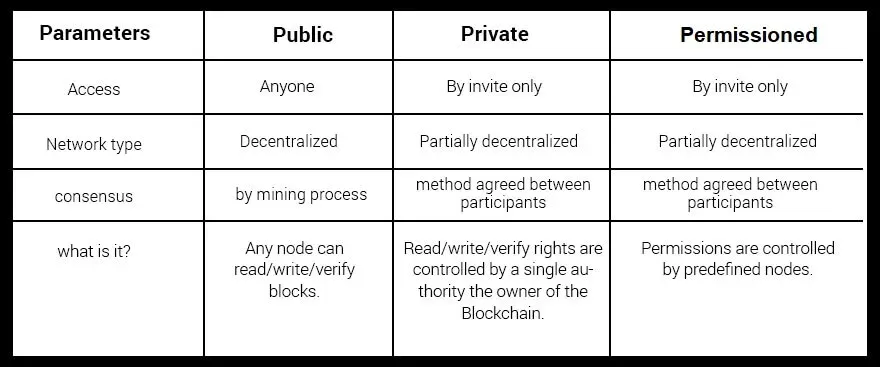

## Table of Contents

## What is a blockchain?

A blockchain is a type of database that stores information in blocks chained together. Imagine it like a digital notebook where each page is a block, and these pages are linked in a way that you can't remove or change them without everyone knowing. This makes it very secure and transparent because all the information is shared across many computers, not just one.

The main use of blockchain today is for cryptocurrencies like Bitcoin. When someone sends Bitcoin, the transaction is recorded in a block. Once the block is full, it gets added to the chain, and everyone can see the transaction. This system helps prevent fraud because once the information is in the blockchain, it's very hard to change. Besides money, blockchain can be used for other things like tracking shipments or verifying the authenticity of products.

## What are the main types of blockchains?

There are three main types of blockchains: public, private, and consortium. A public blockchain is like a public park where anyone can come in and use it. It's open to everyone, and anyone can join and see all the transactions. Bitcoin and Ethereum are examples of public blockchains. They are very secure because lots of people are checking the information, but they can be slower and use more energy.

A private blockchain is more like a private club where only members can join. It's controlled by one organization, and they decide who can use it and see the transactions. This type of blockchain is faster and uses less energy than a public one, but it's less secure because fewer people are checking the information. Companies often use private blockchains for things like tracking shipments or managing records.

A consortium blockchain is a mix of public and private. It's run by a group of organizations, not just one. It's like a group of clubs working together. They decide who can join and see the transactions. This type of blockchain is more secure than a private one but still faster and more energy-efficient than a public one. It's often used by banks or other businesses that need to work together but also want to keep some control.

## What is a public blockchain and how does it work?

A public blockchain is like a big, open notebook that anyone can read and write in. It's used by cryptocurrencies like Bitcoin and Ethereum. Anyone can join a public blockchain, and they don't need permission from anyone. This makes it very open and fair because everyone can see what's happening. It's also very secure because lots of people are checking the information to make sure it's correct.

When someone wants to add information to a public blockchain, like sending Bitcoin, the information is put into a block. Once the block is full, it gets added to the chain of blocks. Everyone who uses the blockchain can see the new block and check that the information is right. This process is called mining, and it's done by computers solving hard math problems. Because so many people are checking the information, it's very hard for someone to cheat or change the information once it's in the blockchain.

## What is a private blockchain and how does it work?

A private blockchain is like a private club where only certain people can join. It's run by one organization, and they decide who can use it and see the information. This makes it different from a public blockchain, where anyone can join and see everything. Private blockchains are often used by companies for things like tracking shipments or managing records.

In a private blockchain, adding new information works a bit like in a public one. When someone wants to add information, like a new shipment, it goes into a block. Once the block is full, it gets added to the chain. But unlike a public blockchain, only the people in the private club can see and check the new block. This makes it faster and uses less energy than a public blockchain, but it's also less secure because fewer people are checking the information.

## What is a permissioned blockchain and how does it work?

A permissioned blockchain is like a private club where only certain people can join. It's different from a public blockchain, where anyone can come in and see everything. In a permissioned blockchain, there's a boss or a group of bosses who decide who gets to join and who can see the information. This makes it more controlled and secure for the people who need it, like businesses or organizations that want to keep some things private.

When someone wants to add new information to a permissioned blockchain, like a record of a shipment, it goes into a block. Once the block is full, it gets added to the chain. Only the people who are allowed in the club can see and check the new block. This makes it faster and uses less energy than a public blockchain, but it's also less secure because fewer people are checking the information. Permissioned blockchains are often used by companies for things like tracking shipments or managing records securely within their network.

## How do public, private, and permissioned blockchains differ in terms of accessibility and control?

Public blockchains are like open parks where anyone can come in and play. They let everyone join and see all the information that's added. This means anyone can use them without asking for permission, which makes them very open and fair. But because so many people can join, they can be slower and use more energy. Bitcoin and Ethereum are examples of public blockchains.

Private blockchains are more like private clubs where only certain people can join. They are run by one organization, and they decide who gets to be a part of it and who can see the information. This makes them faster and they use less energy than public blockchains, but they are also less secure because fewer people are checking the information. Companies often use private blockchains to keep their information safe and private.

Permissioned blockchains are a bit like private clubs too, but they can be run by one organization or a group of organizations. They decide who gets to join and who can see the information, making them more controlled and secure for the people who need it. They are faster and use less energy than public blockchains, but like private blockchains, they are less secure because fewer people are checking the information. Businesses often use permissioned blockchains to manage records securely within their network.

## What are the typical use cases for public blockchains?

Public blockchains are used a lot for cryptocurrencies like Bitcoin and Ethereum. People use them to send and receive money without needing a bank. Anyone can join and see the transactions, which makes it very open and fair. This openness helps prevent fraud because it's hard for someone to cheat when everyone can see what's happening. 

Besides money, public blockchains can also be used for things like smart contracts. Smart contracts are like digital agreements that automatically do what they're supposed to do when certain things happen. For example, if you rent a house and pay on time, the smart contract can automatically unlock the door for you. This makes things easier and more trustworthy because the agreement is right there on the blockchain for everyone to see.

## What are the typical use cases for private blockchains?

Private blockchains are often used by companies to keep their information safe and private. They are like a private club where only certain people can join. Companies use private blockchains to track things like shipments or manage records. For example, a company might use a private blockchain to keep track of where their products are at all times, making sure they get from the factory to the store safely. This helps them know if something goes wrong and fix it quickly.

Another common use for private blockchains is in supply chain management. Companies can use them to make sure everyone in the supply chain follows the rules. For example, a food company might use a private blockchain to track where their ingredients come from and make sure they are safe. This helps them know if there's a problem with the food and stop it before it reaches customers. By keeping this information private, companies can protect their business secrets while still making sure everything is done right.

## What are the typical use cases for permissioned blockchains?

Permissioned blockchains are often used by businesses that need to work together but also want to keep some control over who can join and see the information. For example, banks might use a permissioned blockchain to handle payments between them. This way, they can make sure only trusted banks can join and see the transactions, making the system more secure and efficient. It's like a group of friends sharing a secret club where they decide who gets in.

Another common use is in supply chain management. Companies in a supply chain can use a permissioned blockchain to track products from the factory to the store. Only the companies involved can see the information, which helps them keep their business secrets safe while still making sure everything is done right. For example, a group of car manufacturers might use it to track parts and make sure they meet quality standards before they're put into cars.

## How do the security models of public, private, and permissioned blockchains compare?

Public blockchains are very secure because lots of people are checking the information all the time. It's like having many guards watching over the same thing. If someone tries to change something, it's hard because everyone can see it and will stop it. But because so many people can join, it can be slower and use more energy. Bitcoin and Ethereum are examples of public blockchains where everyone can see the transactions and help keep them safe.

Private blockchains are less secure than public ones because fewer people are checking the information. It's like having just a few guards instead of many. This makes them faster and they use less energy, but they can be easier to cheat if someone inside the club decides to do something wrong. Companies often use private blockchains to keep their information safe and private, but they need to trust the people who are allowed in.

Permissioned blockchains are a bit like private ones but can be run by one organization or a group. They are more secure than private blockchains because more people might be checking the information, but still less secure than public ones. It's like having a group of trusted guards instead of just a few or many. Businesses use permissioned blockchains to work together while keeping some control over who can join and see the information, making it a good middle ground between security and control.

## What are the scalability and performance differences among public, private, and permissioned blockchains?

Public blockchains can be slow and use a lot of energy because lots of people can join and check the information. It's like trying to do a group project with everyone in your school; it takes longer because so many people are involved. But, they are very secure because of all the people checking. Bitcoin and Ethereum are examples of public blockchains that can handle many users but might take longer to process transactions.

Private blockchains are faster and use less energy than public ones because only a few people are allowed to join and check the information. It's like doing a group project with just your close friends; it's quicker and easier to manage. They are less secure than public blockchains, but companies use them to keep their information private and quick to process. For example, a company might use a private blockchain to track shipments without letting everyone see their business secrets.

Permissioned blockchains are somewhere in between public and private ones. They are run by one organization or a group, so they can be faster and use less energy than public blockchains but still let more people join than private ones. It's like doing a group project with a few selected classmates; it's faster than the whole school but still more secure than just your friends. Businesses use them to work together while keeping some control over who can see the information, making them a good choice for balancing speed and security.

## What are the regulatory and compliance implications for each type of blockchain?

Public blockchains are open for everyone to see and use, which makes it hard for governments to control them. Because anyone can join, it's tough to make rules that everyone has to follow. For example, Bitcoin is a public blockchain, and many countries have different rules about using it. Some countries say it's okay to use Bitcoin, while others say it's not. This can make it hard for people and businesses to know if they're doing things right. Also, because public blockchains are so open, it can be hard to keep private information private, which is important for things like following rules about data protection.

Private blockchains are easier for companies to control and follow rules because only certain people can join. This makes it easier to make sure everyone follows the same rules and keeps information private. For example, a company might use a private blockchain to track shipments and make sure they follow rules about how goods are moved. But, because private blockchains are controlled by one company, they have to make sure they follow all the rules themselves, which can be a lot of work. This can be good for things like keeping financial records safe and following rules about money, but it means the company has to be very careful.

Permissioned blockchains are like private ones but can be run by a group of organizations. This makes it easier for them to work together and follow rules because they can all agree on what to do. For example, banks might use a permissioned blockchain to move money between them and make sure they follow rules about banking. Because only trusted people can join, it's easier to keep things private and follow rules about data protection. But, like private blockchains, the group has to make sure they follow all the rules, which can be tricky if the rules change or if the group gets bigger.

## References & Further Reading

[1]: Pilkington, M. (2016). ["Blockchain Technology: Principles and Applications."](https://papers.ssrn.com/sol3/papers.cfm?abstract_id=2662660) Research Handbook on Digital Transformations, Edward Elgar Publishing.

[2]: Nakamoto, S. (2008). ["Bitcoin: A Peer-to-Peer Electronic Cash System."](https://nakamotoinstitute.org/library/bitcoin/)

[3]: Buterin, V. (2013). ["Ethereum White Paper: A next-generation smart contract and decentralized application platform."](https://ethereum.org/content/whitepaper/whitepaper-pdf/Ethereum_Whitepaper_-_Buterin_2014.pdf)

[4]: Mougayar, W. (2016). ["The Business Blockchain: Promise, Practice, and Application of the Next Internet Technology."](https://books.google.com/books/about/The_Business_Blockchain.html?id=CEsPDAAAQBAJ)

[5]: Tapscott, D., & Tapscott, A. (2016). ["Blockchain Revolution: How the Technology Behind Bitcoin is Changing Money, Business, and the World."](https://dl.acm.org/doi/10.5555/3051781)

[6]: Antonopoulos, A. M. (2017). ["Mastering Bitcoin: Unlocking Digital Cryptocurrencies."](https://books.google.com/books/about/Mastering_Bitcoin.html?id=IXmrBQAAQBAJ)

[7]: Thayer, R. P., et al. (2018). ["Blockchains and Financial Market Innovation."](https://www.researchgate.net/publication/334279610_Blockchain_Technology_and_the_Financial_Market_An_Empirical_Analysis)

[8]: Biais, B., Bisière, C., Bouvard, M., Casamatta, C., & Ma, K. (2019). ["The Blockchain Folk Theorem."](https://papers.ssrn.com/sol3/papers.cfm?abstract_id=3108601) The Review of Financial Studies, 32(5), 1662-1715.

