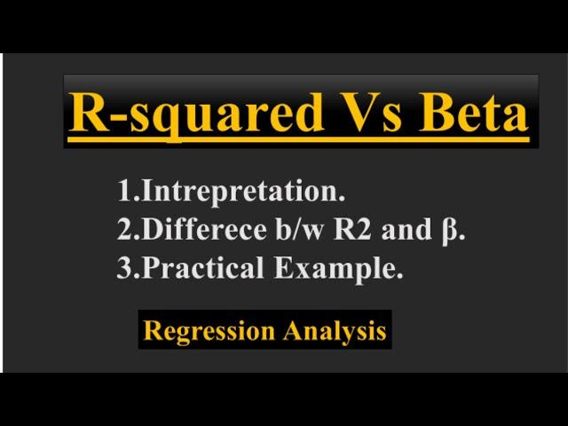

## Table of Contents

## What is R-Squared and how is it calculated?

R-Squared, often written as R², is a measure used in statistics to show how well a model fits the data. It tells you the percentage of the variation in the dependent variable that can be explained by the independent variable or variables in your model. Think of it as a way to see how good your model is at predicting outcomes. If R² is close to 1, it means your model explains a lot of the variation in the data, which is good. If it's close to 0, it means your model doesn't explain much of the variation, and you might need to improve it.

To calculate R-Squared, you first need to find the total sum of squares (TSS), which measures the total variation in your dependent variable. Then, you calculate the explained sum of squares (ESS), which measures the variation in your dependent variable that your model can explain. The difference between TSS and ESS is the residual sum of squares (RSS), which is the variation that your model can't explain. R-Squared is then calculated as ESS divided by TSS, or 1 minus RSS divided by TSS. Both formulas give you the same result, showing the proportion of the total variation that your model accounts for.

## What does Beta measure in the context of finance?

In finance, Beta measures how much a stock's price moves compared to the overall market. If a stock has a Beta of 1, it means the stock moves with the market. If the market goes up by 10%, the stock should also go up by about 10%. A Beta higher than 1 means the stock is more volatile than the market. For example, if a stock has a Beta of 1.5 and the market goes up by 10%, the stock might go up by 15%. On the other hand, a Beta lower than 1 means the stock is less volatile than the market. If a stock has a Beta of 0.5 and the market goes up by 10%, the stock might only go up by 5%.

Beta is important for investors because it helps them understand the risk of a stock. If you want to invest in a stock that is less risky than the market, you might look for stocks with a low Beta. If you are willing to take on more risk for potentially higher returns, you might choose stocks with a high Beta. Beta is calculated by comparing the returns of the stock to the returns of the market over time. This comparison gives investors a simple number that they can use to make decisions about their investments.

## How do R-Squared and Beta relate to each other in statistical models?

R-Squared and Beta are both important numbers in [statistics](/wiki/bayesian-statistics) and finance, but they measure different things. R-Squared tells you how well a model explains the data. It's like a score that shows how much of the changes in the thing you're trying to predict can be explained by your model. If R-Squared is high, it means your model is doing a good job at explaining why things are happening the way they are. On the other hand, Beta is used in finance to measure how much a stock's price moves compared to the overall market. It's a way to see if a stock is more or less risky than the market as a whole.

Even though R-Squared and Beta are used in different ways, they can both be part of the same model. For example, in a financial model that tries to predict stock prices, you might use Beta as one of the factors that affect the stock's price. The R-Squared of this model would tell you how well all the factors, including Beta, explain the changes in the stock price. So, while R-Squared gives you an overall measure of how good your model is, Beta is just one piece of information that might be used in the model. Both numbers help you understand different parts of how well your model works and how risky a stock might be.

## Can you explain the significance of R-Squared in regression analysis?

R-Squared is really important in regression analysis because it tells you how well your model fits the data. Imagine you're trying to predict something, like how much it will rain based on the clouds you see. R-Squared is like a score that shows how good your prediction is. If your R-Squared is close to 1, it means your model is doing a great job at explaining why things are happening the way they are. It's like saying, "Hey, my model can explain almost all of the changes in the rain!" On the other hand, if your R-Squared is close to 0, it means your model isn't doing a good job, and you might need to try something different.

But, it's important to know that R-Squared isn't perfect. Just because your R-Squared is high doesn't mean your model is the best one out there. Sometimes, you can make your R-Squared higher by adding more things to your model, but that doesn't always mean your model is better. It's like adding more ingredients to a recipe hoping it will taste better, but sometimes it just makes the dish more complicated without improving it. So, while R-Squared is a helpful tool, you should also look at other things, like how well your model predicts new data, to make sure you're on the right track.

## What is the interpretation of Beta in a stock's performance?

Beta is a number that tells you how much a stock's price moves compared to the overall market. If a stock has a Beta of 1, it means the stock moves the same way as the market. For example, if the market goes up by 10%, a stock with a Beta of 1 should also go up by about 10%. But if a stock has a Beta higher than 1, like 1.5, it means the stock is more sensitive to the market's movements. So, if the market goes up by 10%, a stock with a Beta of 1.5 might go up by 15%. On the other hand, if a stock has a Beta lower than 1, like 0.5, it means the stock is less sensitive to the market. If the market goes up by 10%, a stock with a Beta of 0.5 might only go up by 5%.

Understanding Beta is important because it helps investors know how risky a stock might be. If you're looking for a stock that's less risky than the market, you might choose one with a low Beta. These stocks don't move as much as the market, so they can be safer. But if you're willing to take on more risk for the chance of higher returns, you might pick a stock with a high Beta. These stocks can go up a lot when the market goes up, but they can also go down a lot when the market goes down. So, Beta is a useful tool for figuring out how much risk you're taking on when you invest in a stock.

## How does a high R-Squared value affect the reliability of a model?

A high R-Squared value means your model is good at explaining why things happen the way they do. If you have a high R-Squared, it's like getting a high score on a test - it shows that your model can account for a lot of the changes you see in the data. This makes the model seem more reliable because it suggests that the factors you're using in your model are important and really help predict what's going to happen.

But, a high R-Squared doesn't always mean your model is perfect. Sometimes, you can make your R-Squared higher by adding more things to your model, but that doesn't always make your model better. It's like adding more ingredients to a recipe hoping it will taste better, but sometimes it just makes the dish more complicated without improving it. So, while a high R-Squared can make your model seem more reliable, you should also check other things, like how well your model predicts new data, to make sure it's really good.

## What does a Beta greater than 1 indicate about a stock's volatility?

A Beta greater than 1 means a stock is more volatile than the overall market. Imagine the market is like a big boat moving through the water. If a stock has a Beta over 1, it's like a small boat that rocks more with the waves than the big boat does. So, if the market goes up or down, this stock will go up or down even more. For example, if the market goes up by 10%, a stock with a Beta of 1.5 might go up by 15%.

This higher [volatility](/wiki/volatility-trading-strategies) can be both good and bad. On the good side, when the market is doing well, a stock with a high Beta can give you bigger gains. It's like getting a bigger reward for taking a bigger risk. But on the bad side, when the market is not doing well, a stock with a high Beta can lose more value than the market. So, it's important for investors to think about how much risk they want to take before choosing stocks with a Beta greater than 1.

## How can R-Squared be used to compare the effectiveness of different models?

R-Squared is a great tool for comparing how well different models work. Imagine you have two different ways to guess how much it will rain based on the clouds you see. R-Squared tells you which guess is better at explaining why it's raining the way it is. If one model has a higher R-Squared, it means that model is doing a better job at explaining the rain. It's like choosing between two different maps to find your way home - the map that gets you home faster and with fewer wrong turns is the better one.

But, it's important to remember that R-Squared isn't perfect for comparing models. Sometimes, a model can have a high R-Squared just because it has a lot of things in it, not because it's the best model. It's like adding more and more ingredients to a recipe hoping it will taste better, but sometimes it just makes the dish more complicated without improving it. So, while R-Squared is helpful, you should also look at other things, like how well the models predict new data, to make sure you're choosing the best one.

## In what scenarios might Beta be more useful than R-Squared for investment decisions?

Beta is more useful than R-Squared for investment decisions when you want to understand how risky a stock is compared to the overall market. Imagine you're at a carnival and you're deciding which ride to go on. Some rides are wild and throw you around a lot, while others are smoother and more predictable. Beta tells you if a stock is like the wild ride or the smoother one. If a stock has a Beta higher than 1, it means it's more sensitive to the market's ups and downs, like the wild ride. This can help you decide if you want to take on that extra risk for the chance of bigger rewards, or if you'd rather stick with a safer, less volatile stock.

In another scenario, Beta is helpful when you're building a diversified investment portfolio. Think of it like planning a trip with different activities. You want some excitement, but not too much, so you mix wild rides with calmer ones. Beta helps you balance your investments by showing you which stocks will move more or less than the market. By including stocks with different Betas, you can manage the overall risk of your portfolio. R-Squared, on the other hand, doesn't give you this kind of information about risk, so Beta is more useful when your main concern is how much a stock's price might swing compared to the market.

## How do changes in market conditions affect the stability of R-Squared and Beta?

Changes in market conditions can make R-Squared less stable. R-Squared tells you how well a model explains the data, but if the market changes a lot, the things that used to help explain what's happening might not work as well anymore. Imagine you're trying to guess how much it will rain based on the clouds you see, but suddenly the weather starts acting differently. Your old way of guessing won't be as good, and your R-Squared will go down. So, when the market changes, you might need to update your model to keep it working well.

Beta, which measures how much a stock moves compared to the market, can also become less stable when market conditions change. If the market starts acting differently, the way a stock moves compared to the market might change too. It's like if you're on a boat and the waves get bigger or smaller, how much your boat rocks compared to the big boat might change. This means you need to keep checking the Beta of your stocks because it might not stay the same as the market changes. Understanding how Beta can change helps you know how risky your investments might be at different times.

## What are the limitations of using R-Squared as a sole measure of model fit?

R-Squared is a helpful number that tells you how well your model explains what's happening, but it has some problems if you use it as the only way to see if your model is good. One big problem is that R-Squared can go up just by adding more things to your model, even if those things don't really help make your model better. It's like adding more ingredients to a recipe hoping it will taste better, but sometimes it just makes the dish more complicated without improving it. So, a high R-Squared doesn't always mean your model is the best one.

Another issue with R-Squared is that it doesn't tell you if your model will work well with new data. Just because your model explains the old data well doesn't mean it will be good at predicting what will happen next. It's like being good at guessing the weather based on last week's clouds, but not being able to guess what will happen tomorrow. So, while R-Squared is a useful tool, you need to look at other things, like how well your model predicts new data, to make sure it's really good.

## How can advanced statistical techniques enhance the interpretation of Beta and R-Squared in complex models?

Advanced statistical techniques can help you understand Beta and R-Squared better, especially in complicated models. For example, using something called "time series analysis" can help you see how Beta changes over time. This is important because the market can change, and a stock's Beta might not stay the same. By looking at Beta over time, you can see if it's getting more or less risky. Another technique, called "cross-validation," can help you check how well your model, and its R-Squared, work with new data. This is like testing your model on different sets of data to make sure it's not just good at explaining the old data but can also predict new things well.

Also, techniques like "multiple regression" and "[factor](/wiki/factor-investing) analysis" can make your models more detailed and accurate. Multiple regression lets you look at how different things affect your stock's price at the same time, which can give you a better idea of what's really going on. Factor analysis can help you find hidden patterns in your data that might affect Beta or R-Squared. By using these advanced techniques, you can get a fuller picture of how well your model works and how risky your investments might be. This can help you make smarter decisions about your investments.

## What is R-Squared?

R-squared, or the coefficient of determination, is a statistical measure used to evaluate the goodness-of-fit of a regression model. It quantifies how well the independent variables in a regression model explain the variability of the dependent variable. The value of R-squared ranges from 0 to 1, where an R-squared close to 1 suggests that a substantial proportion of the variance in the dependent variable is accounted for by the model.

In the context of trading, a high R-squared value implies that the model can effectively capture market price movements based on the specified parameters. This feature enables traders to identify patterns and potential outcomes with greater accuracy, enhancing the reliability of their trading strategies.

The mathematical representation of R-squared is given by:

$$
R^2 = 1 - \frac{SS_{\text{residual}}}{SS_{\text{total}}}
$$

where $SS_{\text{residual}}$ is the sum of squares of the residual errors (the portion of variance not explained by the model), and $SS_{\text{total}}$ is the total sum of squares representing the total variance in the dependent variable.

In practical terms, if you have a dataset with observations on a dependent variable $Y$ and one or more independent variables $X_1, X_2, \ldots, X_n$, you typically start by fitting a regression model (e.g., linear regression) to predict $Y$ using $X_1, X_2, \ldots, X_n$. The R-squared value will give you a snapshot of how much of the change in $Y$ can be attributed to changes in the independent variables, helping you assess the model's explanatory power.

In finance, understanding the R-squared value is crucial for traders who use algorithmic models to make informed decisions. While a high R-squared is desirable, it is important to remember that it does not imply causation but rather a correlation between the predicted and actual values. Thus, it should be interpreted carefully, especially when used in developing predictive trading models.

## What is the difference between R-Squared and Adjusted R-Squared?

R-squared, or the coefficient of determination, is fundamentally important in assessing the fit of a regression model. It quantifies the proportion of variance in the dependent variable that can be predicted from the independent variables. However, one significant limitation of R-squared is its tendency to increase as more predictors are added to the model, regardless of whether they contribute meaningfully to explaining the variation in the dependent variable.

To address this, the adjusted R-squared metric is employed. It adjusts the R-squared value based on the number of predictors in the model, thereby providing a more accurate measure of model performance. The formula for adjusted R-squared is:

$$

\text{Adjusted } R^2 = 1 - \left( \frac{(1 - R^2)(n - 1)}{n - k - 1} \right) 
$$

where $n$ is the number of observations and $k$ is the number of predictors.

In essence, the adjusted R-squared penalizes the inclusion of additional predictors that do not enhance the explanatory power of the model. This is particularly useful in [algorithmic trading](/wiki/algorithmic-trading), where overfitting can be a significant concern. Models that fit the training data too well may perform poorly on unseen data due to their sensitivity to noise rather than the underlying data patterns.

In trading models, a high adjusted R-squared value is generally preferable, as it implies that the predictors included in the model genuinely contribute to explaining the variability in the dependent variable. This assists traders in selecting models that offer the most predictive power without unnecessary complexity.

By comparing R-squared and adjusted R-squared, traders can make informed decisions about model complexity. A prudent approach is to seek a balance where the model's explanatory power is maximized while minimizing the risk of overfitting. This enables more reliable data analysis and forecasting, crucial for crafting robust algorithmic trading strategies.

## References & Further Reading

For readers interested in expanding their understanding of R-squared, beta, and their application in [quantitative trading](/wiki/quantitative-trading), several resources offer comprehensive insights:

1. **Books**: 
   - "Quantitative Analysis in Financial Markets" by Marco Avellaneda provides a solid foundation in applying statistical measures in trading. This book addresses various metrics, including beta and R-squared, highlighting their significance in constructing algorithmic strategies.
   - "Quantitative Trading: Algorithms, Analytics, Data, Models, Optimization" by Xin Guo and others is an excellent resource that combines theory with practical application in algorithmic trading, with a focus on the mathematical aspects of financial markets.

2. **Academic Papers**: 
   - "The Evaluation of Beta and R-Squared for Financial Instruments" often appears in journals like the Journal of Finance, where comprehensive studies delve into the accuracy and reliability of these statistics in different market scenarios.

3. **Online Courses and Lectures**: 
   - Platforms like Coursera and edX offer courses such as "Mathematics for Machine Learning" that cover statistical metrics. These courses are designed to equip traders with the analytical tools necessary for developing robust models.

4. **Software Documentation and Practical Guides**: 
   - The Python library `statsmodels` offers an extensive guide on implementing statistical models, including functions to compute and interpret R-squared and beta. Users can learn how to use these tools in practice with Python.
   - Kaggle's community forums and notebooks are rich resources for learning through shared trading models and discussions that illustrate the use of these metrics in real-world applications.

5. **Web Articles and Financial Blogs**:
   - Websites like Investopedia and QuantStart frequently publish articles that break down complex financial terms and provide examples of how metrics like R-squared and beta are applied in algorithmic trading.

These references collectively provide a well-rounded exploration of R-squared and beta, essential for anyone looking to deepen their knowledge in quantitative trading and enhance their trading models.

