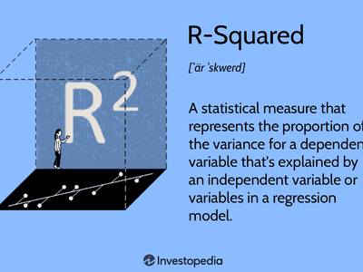

In algorithmic trading, statistical metrics such as Beta and R-Squared are pivotal in developing effective trading strategies. This article provides an in-depth examination of these metrics, with a particular emphasis on their application within algorithmic trading. A thorough understanding of Beta and R-Squared enables traders to evaluate market risks, predict security returns, and improve the reliability of their models.

These metrics are integral to calculating risk exposure and assessing the performance of predictive models. Beta measures the sensitivity of a security’s returns relative to market movements, which indicates its volatility in comparison to a benchmark index. Conversely, R-Squared, also known as the coefficient of determination, assesses the proportion of variance in a dependent variable that is predictable from independent variables within a regression model. These measures are not only fundamental in evaluating individual securities but also crucial in assessing the performance of trading strategies comprehensively.

In this article, we will explore how Beta and R-Squared are calculated, their significance, and how they can be combined to make more informed and data-driven trading decisions. Through understanding the mathematical foundations and practical applications of both metrics, traders can gain the knowledge necessary to optimize their algorithms for precision and achieve success amidst volatile market conditions.

Let us begin by analyzing the definitions and mathematical underpinnings of Beta and R-Squared within the context of financial markets, providing a foundation for enhancing algorithmic trading practices.

## Table of Contents

## What is R-Squared?

R-squared, or the coefficient of determination, is a statistical measure used to evaluate the goodness-of-fit of a regression model. It quantifies how well the independent variables in a regression model explain the variability of the dependent variable. The value of R-squared ranges from 0 to 1, where an R-squared close to 1 suggests that a substantial proportion of the variance in the dependent variable is accounted for by the model.

In the context of trading, a high R-squared value implies that the model can effectively capture market price movements based on the specified parameters. This feature enables traders to identify patterns and potential outcomes with greater accuracy, enhancing the reliability of their trading strategies.

The mathematical representation of R-squared is given by:

$$
R^2 = 1 - \frac{SS_{\text{residual}}}{SS_{\text{total}}}
$$

where $SS_{\text{residual}}$ is the sum of squares of the residual errors (the portion of variance not explained by the model), and $SS_{\text{total}}$ is the total sum of squares representing the total variance in the dependent variable.

In practical terms, if you have a dataset with observations on a dependent variable $Y$ and one or more independent variables $X_1, X_2, \ldots, X_n$, you typically start by fitting a regression model (e.g., linear regression) to predict $Y$ using $X_1, X_2, \ldots, X_n$. The R-squared value will give you a snapshot of how much of the change in $Y$ can be attributed to changes in the independent variables, helping you assess the model's explanatory power.

In finance, understanding the R-squared value is crucial for traders who use algorithmic models to make informed decisions. While a high R-squared is desirable, it is important to remember that it does not imply causation but rather a correlation between the predicted and actual values. Thus, it should be interpreted carefully, especially when used in developing predictive trading models.

## Understanding Beta in Trading

Beta is a statistical measure that evaluates the sensitivity of a security's returns in relation to movements in the overall market, typically represented by a benchmark index such as the S&P 500. It serves as an indicator of the [volatility](/wiki/volatility-trading-strategies) of a security compared to the market. A beta value of 1 implies that the security's price will move with the market. If the beta is less than 1, the security is considered less volatile than the market. Conversely, a beta greater than 1 indicates that the security is more volatile.

Investors and traders harness beta to gauge their exposure to market risk and adjust their portfolios accordingly. A portfolio with a higher average beta indicates higher risk and potential return, while a lower average beta suggests a defensive strategy with less market risk.

In [algorithmic trading](/wiki/algorithmic-trading), beta is integrated into trading strategies to ensure that they align with market trends and correspond with the trader’s risk appetite. Algorithmic models may utilize beta to create hedging strategies that seek to protect against market volatility or capitalize on predicted market trends. By incorporating beta into trading algorithms, traders can dynamically adjust strategies based on changing market conditions, tailoring risk exposure to suit specific investment goals.

For algorithmic trading, understanding beta is crucial as it provides insights into how individual asset movements are swayed by broader market changes. This knowledge facilitates the creation of sophisticated, risk-adjusted trading tactics that can react to varying market scenarios. By thoroughly analyzing beta, traders can enhance their decision-making process, optimizing asset allocation and risk management to better navigate the complexities of financial markets.

## R-Squared vs. Adjusted R-Squared

R-squared, or the coefficient of determination, is fundamentally important in assessing the fit of a regression model. It quantifies the proportion of variance in the dependent variable that can be predicted from the independent variables. However, one significant limitation of R-squared is its tendency to increase as more predictors are added to the model, regardless of whether they contribute meaningfully to explaining the variation in the dependent variable.

To address this, the adjusted R-squared metric is employed. It adjusts the R-squared value based on the number of predictors in the model, thereby providing a more accurate measure of model performance. The formula for adjusted R-squared is:

$$

\text{Adjusted } R^2 = 1 - \left( \frac{(1 - R^2)(n - 1)}{n - k - 1} \right) 
$$

where $n$ is the number of observations and $k$ is the number of predictors.

In essence, the adjusted R-squared penalizes the inclusion of additional predictors that do not enhance the explanatory power of the model. This is particularly useful in algorithmic trading, where overfitting can be a significant concern. Models that fit the training data too well may perform poorly on unseen data due to their sensitivity to noise rather than the underlying data patterns.

In trading models, a high adjusted R-squared value is generally preferable, as it implies that the predictors included in the model genuinely contribute to explaining the variability in the dependent variable. This assists traders in selecting models that offer the most predictive power without unnecessary complexity.

By comparing R-squared and adjusted R-squared, traders can make informed decisions about model complexity. A prudent approach is to seek a balance where the model's explanatory power is maximized while minimizing the risk of overfitting. This enables more reliable data analysis and forecasting, crucial for crafting robust algorithmic trading strategies.

## The Role of R-Squared in Algorithmic Trading

R-squared, or the coefficient of determination, plays a vital role in algorithmic trading by evaluating the reliability and predictive accuracy of trading models. In essence, R-squared measures the extent to which fluctuations in a dependent variable, typically asset prices, can be attributed to variations in one or more independent variables featured in the model.

A primary advantage of using R-squared in algorithmic trading is its ability to quantify the proportion of variance in asset movements that is explained by selected indicators. For instance, an R-squared value of 0.8 implies that 80% of the variations in asset prices can be explained by the model's inputs. This provides an evaluative metric for determining the model's explanatory power and helps traders in developing strategies based on statistically significant relationships.

Moreover, R-squared should be employed in conjunction with other statistical measures, like adjusted R-squared and p-values, to enhance model robustness. While R-squared provides insights into the goodness-of-fit, adjusted R-squared further accounts for the number of predictors, reducing the risk of overfitting. This ensures that the model remains parsimonious and effective in explaining the asset price movements without incorporating redundant variables.

By accurately interpreting and applying R-squared values, traders can refine the precision of their models. This involves aligning predictions more closely with actual market behaviors, thus improving the predictive strength and reliability of trading algorithms. Continuous model evaluation and recalibration using R-squared, coupled with an understanding of its limitations, enable traders to adapt to evolving market dynamics effectively. Through this approach, R-squared becomes an indispensable part of the statistical toolkit for developing robust, data-driven trading strategies.

## R-Squared vs. Beta: Complementary Metrics

R-squared and beta are integral metrics in trading analysis, each serving its unique purpose and collectively offering a comprehensive view of asset performance. Beta, a measure of a security's sensitivity to market movements, elucidates the potential risk associated with market volatility. It indicates how much the price of a security is expected to move relative to the market index. For instance, a beta greater than 1 signifies higher volatility compared to the market, whereas a beta less than 1 suggests lower volatility, thereby assisting traders in gauging risk exposure and tailoring their strategies accordingly.

Complementing beta, R-squared quantifies how well changes in an asset's returns are explained by movements in the benchmark index. It offers insights into the degree of correlation between the asset's performance and market indices. A high R-squared value signifies that a substantial portion of the asset's price movements can be predicted by market trends, facilitating the development of strategies based on market alignment.

Together, beta and R-squared furnish traders with a holistic perspective on assets, capturing both the risk [factor](/wiki/factor-investing) (via beta) and the explanatory power of market trends (via R-squared). Employing these metrics in tandem allows traders to construct strategies that effectively balance risk management and predictive power, thus strengthening the robustness of trading systems. By leveraging the interplay between beta and R-squared, traders can enhance the precision of their predictive models, align investment strategies with market dynamics, and optimize their decision-making process in volatile markets.

## Limitations of R-Squared

R-squared, while extremely useful for evaluating the fit of a regression model, has notable limitations that must be recognized by traders and analysts. Primarily, it does not infer causality; a high R-squared indicates a strong correlation between the dependent variable and the independent variables in the model but does not imply one causes the other. This is fundamental because a model might show high predictive power statistically but may not account for the underlying causal mechanisms driving the market phenomena.

Overfitting is another significant risk when using R-squared. An overly complex model with numerous predictors can yield a high R-squared value, misleading traders into believing the model is sound. However, such models may capture noise instead of meaningful patterns, which tends to deteriorate predictive performance on out-of-sample data. Overfitting can be mitigated through strategies like cross-validation, which ensures that model performance is consistent across different data subsets.

Furthermore, R-squared presupposes a linear relationship between variables. This assumption can be limiting in the context of financial markets, where relationships may often be nonlinear due to the complex interplay of macroeconomic factors, market sentiments, and trader behaviors. Thus, relying solely on R-squared could result in oversimplified models that fail to capture the true dynamics of market data.

To overcome these limitations, it is critical to interpret R-squared values in conjunction with other analytical measures and statistical techniques. Analysts should integrate tools like p-values, adjusted R-squared, and residual analysis to derive more reliable insights. Moreover, incorporating domain expertise to understand the market context and employing advanced algorithms that can model nonlinear relationships, like [machine learning](/wiki/machine-learning) techniques, can enhance model robustness. By doing so, traders can better account for the intricacies inherent in financial market data and improve their strategy development processes.

## Improving R-Squared in Trading Models

Improving the R-squared value in trading models is a critical task for traders aiming to enhance the precision and reliability of their predictive models. One fundamental approach to achieving this is through the optimization of model assumptions and the enhancement of predictor relevance. Techniques such as feature selection and regularization play a pivotal role in refining the model.

Feature selection is about identifying and retaining only the most significant variables, which reduces noise and potential overfitting. Techniques like Recursive Feature Elimination (RFE) or algorithms such as LASSO (Least Absolute Shrinkage and Selection Operator) can be employed to automatically select important features. Regularization provides a means to penalize more complex models, favoring simpler models that minimize overfitting risk. LASSO regularization, in particular, helps in feature selection by shrinking insignificant coefficients to zero.

Addressing multicollinearity is another aspect that can improve R-squared. Multicollinearity occurs when predictor variables are highly correlated, leading to unreliable coefficient estimates. A Variance Inflation Factor (VIF) greater than 5-10 is typically used as a threshold to identify multicollinearity. Applying Principal Component Analysis (PCA) or simply removing highly correlated predictors can mitigate these issues.

Nonlinear relationships, which can often occur in trading data, need to be explored beyond the initial assumptions of linearity. Employing techniques such as polynomial regression or kernel tricks in Support Vector Machines (SVM) can capture more complex interactions between variables, potentially improving model fit and R-squared values.

Model validation through cross-validation is essential for testing the robustness of R-squared improvements. Splitting the dataset into multiple training and testing sets, as done in k-fold cross-validation, helps ensure that the model's performance is consistent across different data subsets, thereby reinforcing its generalizability and enhancing the credibility of the R-squared value.

Leveraging tools like machine learning can further advance model capabilities in capturing complex market patterns. Algorithms such as Random Forests or Gradient Boosting can handle nonlinearities and interactions effectively, often outperforming traditional regression approaches in terms of R-squared. These methods analyze feature importance and interactions systematically, making them valuable for improving predictive strength and model fit.

Incorporating these strategies into trading models not only helps achieve a higher R-squared but also ensures that the model's predictive power is more aligned with intricate market dynamics, ultimately contributing to more robust and reliable trading decisions.

## Conclusion

In algorithmic trading, R-squared serves as a significant tool for validating predictive models, offering insights into how well a model captures the variance in asset returns. However, its utility must be tempered with caution. Understanding R-squared enables traders to develop strategies that are statistically sound and adaptable to changing market conditions. This involves recognizing that R-squared alone does not capture the entirety of a model's effectiveness or predictive power.

Integrating R-squared with other metrics, such as adjusted R-squared, p-values, and beta, and committing to ongoing model refinement, can lead to more consistent data-driven outcomes. These additional metrics and techniques help address shortcomings like overfitting and misleading causal interpretations, ensuring the model remains robust under various market scenarios.

The nuanced comprehension of both R-squared and beta is crucial for navigating the complexities of modern financial markets. While R-squared assesses the explanatory power of variables in the model, beta offers insights into risk relative to market movements. Together, they guide traders toward more informed and balanced trading decisions, allowing them to optimize algorithmic strategies for precision and success amidst market volatility. Thus, while R-squared is a valuable component of model validation, its application must be part of a broader analytical framework that harmonizes multiple statistical perspectives within algorithmic trading.

## References & Further Reading

For readers interested in expanding their understanding of R-squared, beta, and their application in [quantitative trading](/wiki/quantitative-trading), several resources offer comprehensive insights:

1. **Books**: 
   - "Quantitative Analysis in Financial Markets" by Marco Avellaneda provides a solid foundation in applying statistical measures in trading. This book addresses various metrics, including beta and R-squared, highlighting their significance in constructing algorithmic strategies.
   - "Quantitative Trading: Algorithms, Analytics, Data, Models, Optimization" by Xin Guo and others is an excellent resource that combines theory with practical application in algorithmic trading, with a focus on the mathematical aspects of financial markets.

2. **Academic Papers**: 
   - "The Evaluation of Beta and R-Squared for Financial Instruments" often appears in journals like the Journal of Finance, where comprehensive studies delve into the accuracy and reliability of these statistics in different market scenarios.

3. **Online Courses and Lectures**: 
   - Platforms like Coursera and edX offer courses such as "Mathematics for Machine Learning" that cover statistical metrics. These courses are designed to equip traders with the analytical tools necessary for developing robust models.

4. **Software Documentation and Practical Guides**: 
   - The Python library `statsmodels` offers an extensive guide on implementing statistical models, including functions to compute and interpret R-squared and beta. Users can learn how to use these tools in practice with Python.
   - Kaggle's community forums and notebooks are rich resources for learning through shared trading models and discussions that illustrate the use of these metrics in real-world applications.

5. **Web Articles and Financial Blogs**:
   - Websites like Investopedia and QuantStart frequently publish articles that break down complex financial terms and provide examples of how metrics like R-squared and beta are applied in algorithmic trading.

These references collectively provide a well-rounded exploration of R-squared and beta, essential for anyone looking to deepen their knowledge in quantitative trading and enhance their trading models.