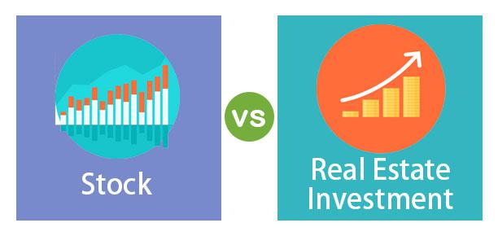

Understanding the complexities of investment avenues is crucial for achieving financial success. Individuals and institutions are continually tasked with making informed decisions regarding where to allocate their resources for optimal returns. Two of the most prominent avenues for investment, real estate and stocks, present distinct opportunities and challenges that appeal to a range of investor profiles.

Real estate investments are traditionally known for their stability and potential to act as a hedge against inflation. They offer tangible asset ownership and the possibility of a consistent rental income stream. Conversely, stock investments provide an avenue for purchasing corporate equity, characterized by high liquidity and the potential for significant capital gains. However, the risks associated with these investment choices vary significantly. Real estate, while stable, often requires substantial capital and is subject to market value fluctuations and liquidity constraints. Stocks, on the other hand, are highly volatile and sensitive to economic conditions and market cycles, leading to rapid changes in value.



In recent years, algorithmic trading has emerged as a significant development in financial markets, influencing both stock and real estate investment strategies. Algorithmic trading automates trade execution using pre-defined criteria, aiming to enhance speed and efficiency, minimize human error, and reduce emotional biases in trading decisions. This evolution allows investors to capitalize on market opportunities more effectively by utilizing complex models and strategies. As such, understanding the impact and implications of algorithmic trading is essential for modern investors looking to adapt to evolving market dynamics.

Investors can position themselves better by comprehending the role of algorithmic trading in both real estate and stock investments. By integrating these advanced technologies into their investment processes, investors can achieve more strategic efficiency, ultimately optimizing their portfolios. This article will explore the comparison between real estate and stock investments, with a particular focus on how algorithmic trading serves as a tool for enhancing investment outcomes. By the end of this guide, investors will gain valuable insights into leveraging modern trading technologies to improve their investment strategies.

## Table of Contents

## Real Estate vs. Stock Market: Overview

Investment strategies often oscillate between two predominant asset classes: real estate and stocks. Each offers distinct opportunities, challenges, and profiles itself as attractive to varying investor needs.

Real estate investments center on tangible assets, providing a sense of stability that is particularly appealing in uncertain economic times. The physical nature of real estate—whether it is residential homes, commercial properties, or industrial complexes—serves as a hedge against inflation. This is because real estate values and rental incomes tend to increase when inflation rises, protecting the purchasing power of investors. Moreover, real estate generates steady rental income, which can be a significant source of cash flow, contributing to an investor's financial portfolio security.

Conversely, stock market investments focus on purchasing equity in companies listed on public exchanges. Stocks are characterized by their high [liquidity](/wiki/liquidity-risk-premium), allowing investors to buy and sell shares quickly, often with lower transaction costs compared to real estate transactions. This liquidity provides flexibility for investors to adapt their strategies in response to market changes. Stocks also offer the potential for substantial capital gains, especially if an investor identifies and invests in high-growth companies. This potential for high returns, however, comes with increased [volatility](/wiki/volatility-trading-strategies) and risk, as stock prices can fluctuate significantly over short periods due to market conditions and company performance.

The decision to invest in real estate or stocks hinges on understanding the distinct risk-reward dynamics inherent to each. Real estate generally involves lower volatility compared to stocks but requires considerable upfront capital and has higher transaction costs, which can be limiting for some investors. Additionally, it involves ongoing maintenance and management expenses that can impact net returns.

On the other hand, stocks expose investors to market volatility with prices influenced by company performance, economic indicators, and geopolitical events. These fluctuations may result in substantial value changes that require investors to actively monitor their investments and possess a solid understanding of market trends.

Investors must evaluate their financial goals, risk tolerance, and liquidity needs before deciding which asset class aligns best with their strategy. For those seeking stability and a hedge against inflation, real estate might be the preferred choice. Conversely, investors with a higher risk tolerance who seek rapid liquidity and potential high returns might gravitate towards stocks. Balancing these factors is crucial for optimizing an investment portfolio.

## Comparison of Returns

Stocks have long been recognized for their potential to deliver substantial annual returns compared to real estate. This advantage is largely attributed to the intrinsic volatility and liquidity of stock markets, which can provide significant opportunities for capital gains. According to historical data, the average annual returns for stocks have ranged between 6% to 10%, depending on the index and time period analyzed. Real estate, on the other hand, typically offers lower annual returns, though these are often perceived as more stable and predictable over the long term.

Economic conditions play a crucial role in shaping returns from both stocks and real estate investments. Stock market returns are highly sensitive to economic cycles, inflation rates, and [interest rate](/wiki/interest-rate-trading-strategies) changes. For instance, during economic expansions, consumer and business confidence typically rise, leading to an increase in corporate profits and stock prices. Conversely, economic recessions are often associated with stock market declines as corporate profits decrease and investor sentiment wanes.

Real estate returns are similarly affected by economic conditions, though often with a lag compared to stocks. Factors such as employment rates, wage growth, and interest rates significantly influence real estate values and rental income potential. For example, low interest rates tend to boost real estate markets by making borrowing cheaper, thereby increasing demand for property purchases and consequentially driving up prices.

Investors must keenly evaluate market cycles and economic indicators when assessing potential returns from stocks and real estate. In stock markets, this involves analyzing financial metrics such as the price-to-earnings (P/E) ratio, earnings growth, and dividend yields to assess market value and potential future growth. 

Python can be utilized to assess these market cycles through historical data analysis. Here's an example of how one might calculate average stock returns over a given period:

```python
import pandas as pd
import numpy as np

# Load historical stock data (e.g., S&P 500)
data = pd.read_csv('historical_stock_data.csv')
data['Return'] = data['Close'].pct_change()

# Calculate average annual return
average_annual_return = np.mean(data['Return']) * 252  # assuming 252 trading days in a year
print(f"Average Annual Return: {average_annual_return:.2%}")
```

Real estate analysis, by contrast, may involve the examination of property price indices, rental yields, and cash flow potential. Additionally, geographic location and market demand are critical in determining future property value appreciation and returns.

Ultimately, understanding these dynamics allows investors to make informed decisions and tailor their portfolios to achieve desired financial outcomes. By comprehensively analyzing both economic conditions and market indicators, investors can harness stock and real estate investments to effectively optimize their returns.

## Risks Involved

Real estate and stock market investments [carry](/wiki/carry-trading) intrinsic risks that potential investors must understand and manage for effective decision-making.

**Real Estate Investments: Risks and Challenges**

Real estate investments are inherently exposed to fluctuations in market value, which can be attributed to various economic, social, and environmental factors. These fluctuations can significantly impact the valuation of properties, leading to potential losses. One key risk [factor](/wiki/factor-investing) is the illiquidity of real estate. Real estate is a tangible asset class that often requires considerable time to transact. Unlike stocks, which can be sold relatively quickly in most market conditions, real estate transactions are subject to lengthy processes such as property appraisals, negotiations, and legal formalities. This can lead to challenges in converting property into cash in urgent situations, complicating liquidity management.

Additionally, changes in interest rates can indirectly influence property prices by affecting borrowing costs. When interest rates rise, mortgage rates typically increase, reducing affordability for potential buyers and possibly leading to a decrease in property demand and prices. Moreover, real estate investments demand ongoing management and maintenance, requiring resources for property upkeep, regulatory compliance, and tenant management.

**Stock Market Investments: Risks and Volatility**

In contrast, stock market investments are marked by higher volatility and economic sensitivity. Stocks represent equity in companies, meaning their performance is often linked to broader economic conditions. Factors such as changes in interest rates, inflation, and overall economic growth directly impact stock prices. Given the stock market's susceptibility to sudden and significant value changes, investors may encounter substantial volatility. For instance, geopolitical events, corporate earnings reports, or changes in regulatory policies can trigger swift market reactions, leading to rapid price alterations.

The high liquidity of stock investments offers flexibility, allowing investors to execute buy or sell transactions quickly. However, this also means that stocks can experience rapid devaluation over short time frames, necessitating vigilant market monitoring. Diversification strategies, such as the use of portfolios comprising multiple asset classes, are critical in mitigating such risks. This approach assists investors in balancing potential losses against gains across different investments.

**Key Considerations for Managing Investment Risks**

Investors must understand the specific risks associated with each asset class to make informed decisions. It involves analyzing market conditions, recognizing cyclical economic patterns, and evaluating the influences of external events on asset valuations. Utilizing probabilistic models and scenario analysis can aid in quantifying risk exposure and potential financial outcomes.

In conclusion, the risk profiles of real estate and stock investments necessitate distinct approaches to risk management. While real estate's stability is countered by liquidity challenges, stocks' volatility offers both opportunities and threats. A comprehensive understanding of these risk dynamics is essential for strategically navigating investment choices.

## Algorithmic Trading Explained

Algorithmic trading, also known as automated trading or black-box trading, involves using computer algorithms to automate trading decisions. The primary objective is to execute trades at optimal times while minimizing manual intervention, thereby enhancing both speed and efficiency.

### Automation and Execution

Algorithmic trading leverages pre-defined rules to determine how trades are executed, covering aspects such as timing, price, and quantity. These rules are encoded into algorithms, enabling the automation of trading processes across various markets. The automation reduces the likelihood of human errors that can result from manual trading, ensuring adherence to precise strategic criteria and diminishing the impact of emotional biases – a common pitfall in traditional trading environments.

### Enhancing Speed and Efficiency

The speed at which algorithmic trades are executed is one of its defining features. Algorithms can process complex market data and execute trades in fractions of a second, far surpassing human capabilities. This rapid execution is especially beneficial in high-frequency trading environments, where even microsecond advantages can lead to significant gains.

### Complex Models and Strategies

Algorithmic trading employs sophisticated mathematical models and quantitative strategies to identify and capitalize on market opportunities. These models analyze vast datasets, including historical and real-time market data, to generate buy and sell signals. For instance, a simple mean-reversion strategy might involve purchasing an asset when its price dips below its historical average, expecting it to revert to the mean over time. Conversely, a [momentum](/wiki/momentum)-based strategy might buy assets experiencing upward price movements, assuming the trend will continue.

In addition, [machine learning](/wiki/machine-learning) techniques are progressively integrated into [algorithmic trading](/wiki/algorithmic-trading) strategies to refine prediction models and enhance decision-making. By learning from market data, these models can adapt to changing conditions, potentially increasing the robustness and profitability of trades.

### Example of a Simple Algorithm

Below is a basic example of a mean-reversion strategy implemented in Python using a simplistic approach:

```python
import yfinance as yf  # For more datasets, visit: https://paperswithbacktest.com/datasets
import numpy as np

# Fetch historical data for a stock
data = yf.download('AAPL', start='2020-01-01', end='2021-01-01')

# Calculate the rolling mean
window = 20
data['Rolling Mean'] = data['Close'].rolling(window=window).mean()

# Define buy/sell signals based on mean-reversion strategy
data['Signal'] = np.where(data['Close'] < data['Rolling Mean'], 1, -1)

# Display the strategy's signals
print(data[['Close', 'Rolling Mean', 'Signal']])
```

In this example, buy signals are generated when the stock's closing price falls below its rolling mean, while sell signals occur when the price rises above it. This simple strategy illustrates the basic principle of algorithmic trading—automating decision-making processes grounded in mathematical logic.

Through sophisticated strategies and rapid execution, algorithmic trading represents a powerful tool for traders aiming to optimize their performance in increasingly complex and competitive market environments.

## Impact of Algorithmic Trading on Markets

Algorithmic trading, which utilizes computer systems to execute trades based on pre-programmed instructions, is a critical component of modern financial markets. Its capacity for high-speed and high-frequency transactions significantly enhances market liquidity and efficiency. Liquidity refers to the ease with which assets can be bought or sold without affecting their price, and algorithmic trading contributes by enabling rapid matching of buyers and sellers, thus maintaining a fluid market environment.

However, the proliferation of algorithmic trading introduces certain challenges. One notable issue is the potential exacerbation of market volatility. High-frequency trading can lead to rapid fluctuations in asset prices, particularly when large volumes of trades are executed in milliseconds. This was evident in the 2010 Flash Crash, where the Dow Jones Industrial Average plunged by about 1,000 points within minutes, driven partly by algorithmic trades.

Another challenge is the reduction in market transparency. The complexity of the algorithms used can obscure the underlying motives and strategies, making it difficult for traditional monitoring systems and human regulators to understand trading patterns quickly.

To mitigate these challenges, effective oversight is imperative. Regulatory bodies and financial institutions are progressively employing advanced monitoring tools to track algorithmic activities. For instance, machine learning algorithms can analyze vast amounts of trading data to detect anomalies that may indicate manipulative strategies or systemic risks.

Moreover, implementing circuit breakers and other risk controls can prevent extreme market conditions caused by algorithmic trading. These measures ensure that unexpected market movements prompt temporary trading halts, providing markets with time to stabilize.

As technology evolves, continuous advancements in monitoring analytics and real-time data processing are crucial for managing the complexities introduced by algorithmic trading. By balancing innovation with robust oversight, financial markets can harness the benefits of algorithmic trading while minimizing its potential drawbacks.

## Advantages and Challenges of Algorithmic Trading

Algorithmic trading offers distinct advantages that have revolutionized financial markets. One of the primary benefits is rapid trade execution. Algorithms can process and execute trades in milliseconds, significantly faster than human traders. This speed allows for taking advantage of short-lived market opportunities that might not be captured otherwise. Additionally, algorithmic trading ensures strategic consistency by adhering strictly to predefined trading criteria without deviation caused by human emotions. This consistency can lead to more disciplined and potentially more successful trading, as it reduces the likelihood of decisions driven by fear or greed.

Operational efficiency is another notable advantage. Automated systems can handle complex trading strategies across multiple markets and time zones simultaneously, providing a level of efficiency that manual trading cannot match. This not only maximizes opportunities but also enhances resource utilization and reduces operational costs by minimizing the need for extensive human oversight.

Despite its advantages, algorithmic trading presents significant challenges. Regulatory compliance emerges as a critical concern, given the fast-paced nature of algorithmic strategies and their potential market impact. Traders must ensure that their algorithms comply with financial regulations, which can be complex and vary across jurisdictions. 

Data accuracy is another crucial challenge. Algorithmic systems rely heavily on the quality of input data to make informed decisions. Inaccurate or delayed data can lead to suboptimal trading outcomes, emphasizing the need for robust data validation processes.

Potential market impact risks also pose challenges. High-frequency trades can exacerbate market volatility and, in certain cases, contribute to market disruptions. The infamous "Flash Crash" of 2010, where major stock indices experienced a rapid decline, highlighted the potential tumult that algorithmic trading can cause. Thus, traders must implement risk management strategies to mitigate these impacts.

To balance the benefits and challenges of algorithmic trading effectively, traders need to adopt a multifaceted approach. This includes developing robust, compliant, and adaptive strategies that evolve with market conditions, ensuring data integrity through comprehensive validation techniques, and incorporating risk management tools to offset potential adverse market effects. Proper oversight and continuous evaluation of trading algorithms are essential to optimize outcomes and sustain efficiency over time.

## Future Trends in Algorithmic Trading

Advancements in [artificial intelligence](/wiki/ai-artificial-intelligence) (AI) and machine learning (ML) are significantly transforming algorithmic trading, making it more adaptable and predictive. AI and ML technologies allow traders to develop algorithms that can process vast amounts of data, identify patterns, and make trading decisions faster and more accurately than humans. These capabilities are particularly advantageous in high-frequency trading, where milliseconds can make a substantial difference in outcomes.

Machine learning models, such as [reinforcement learning](/wiki/reinforcement-learning) and [deep learning](/wiki/deep-learning), enable the dynamic adjustment of trading strategies based on changing market conditions. These algorithms learn from historical data, recognizing complex patterns that may indicate future price movements. For instance, deep neural networks can be used to forecast stock prices or volatility, aiding traders in developing strategies that optimize returns while minimizing risk.

Robo-advisors are another key trend, democratizing access to sophisticated trading tools previously available only to institutional investors. These automated platforms use algorithms to manage investment portfolios, offering personalized strategies based on individual risk profiles and financial goals. Robo-advisors can rebalance portfolios automatically, execute trades, and monitor market conditions to optimize investment performance continually.

The technological growth in financial markets, while presenting numerous opportunities, also introduces regulatory challenges. The increasing complexity and speed of electronic trading necessitate enhanced regulatory frameworks to ensure market stability and integrity. Investors and trading firms must navigate these regulations carefully to maximize the benefits of technological advancements while mitigating potential risks.

As algorithmic trading continues to evolve, the integration of AI and ML stands as a pivotal factor shaping its future. Investors and traders who leverage these technologies effectively will likely achieve superior strategic efficiency and competitive advantage. However, addressing the regulatory implications remains crucial to maintaining a level playing field and protecting all market participants.

## Conclusion

Both real estate and stocks present unique advantages and challenges to investors, necessitating tailored investment strategies to optimize returns and manage risks effectively. Real estate offers tangible asset ownership with potential benefits such as stability, rental income, and inflation hedging. However, it comes with challenges like market value fluctuations and liquidity constraints. On the other hand, stocks provide high liquidity and the potential for significant capital gains, albeit with higher volatility and economic sensitivity.

Algorithmic trading represents a transformative development in the investment landscape. It automates trading processes, enhancing strategic efficiency through rapid trade execution and adherence to strategic criteria, thereby minimizing emotional biases and human errors. As algorithmic trading becomes more prevalent, it offers investors improved market efficiency and liquidity, albeit with challenges such as increased market volatility and transparency issues. 

Investors must remain informed and adaptable to capitalize on the opportunities presented by technological advancements like algorithmic trading. By integrating these tools effectively, investors can enhance their portfolio management strategies and potentially achieve better financial outcomes. The continuous evolution of financial technologies underscores the importance for investors to engage with modern trading systems, embrace new data-driven insights, and implement strategies that align with the changing dynamics of investment markets.

## References & Further Reading

- Bergstra, J., et al. (2011). *Algorithms for Hyper-Parameter Optimization.* This work provides an essential foundation for understanding optimization algorithms, crucial for developing sophisticated trading models. The study's insights into hyper-parameter tuning play a significant role in enhancing the predictive accuracy of machine learning models used in algorithmic trading systems. Accessible via Journal of Machine Learning Research, which can be found at http://jmlr.csail.mit.edu.

- Lopez de Prado, M. *Advances in Financial Machine Learning.* This book is a comprehensive resource on applying machine learning techniques to solve practical problems in financial markets. It emphasizes algorithm transparency, devising strategies to improve data processing, feature engineering, and overfitting prevention in trading algorithms. Available from Wiley Finance publications.

- Aronson, D. *Evidence-Based Technical Analysis: Applying the Scientific Method and Statistical Inference to Trading Signals.* Aronson advocates for the rigorous application of statistical methods to derive objective trading signals. The text is invaluable for those seeking a robust, scientific approach to technical analysis and backtesting in algorithmic trading.

- Jansen, S. *Machine Learning for Algorithmic Trading.* This book provides a hands-on guide to implementing machine learning techniques in trading strategies. Covering topics from data acquisition to deploying trading algorithms, it serves as a practical starting point for incorporating AI in trading decisions. Published by Packt Publishing, the book contains real-world code examples that facilitate the transition from theory to practical application.

- Chan, E. P. *Quantitative Trading: How to Build Your Own Algorithmic Trading Business.* Chan outlines the process of creating a trading business, offering insights into strategy development, risk management, and infrastructure setup. This guide is perfect for those intending to establish their algorithmic trading operations, balanced between theoretical concepts and practical tips. Available through Wiley Trading.

