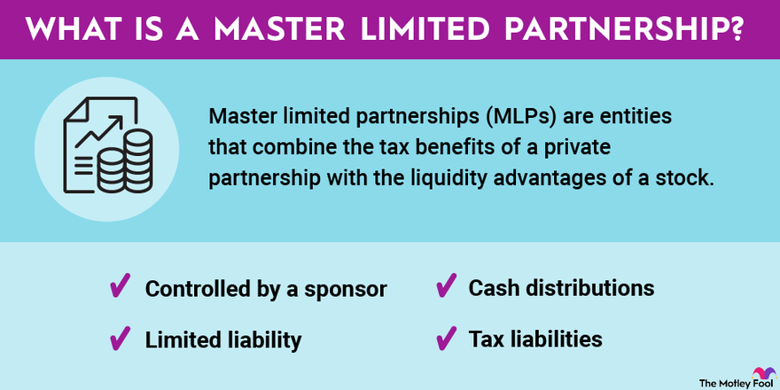

## Table of Contents

## What are Real Estate Investment Trusts (REITs)?

Real Estate Investment Trusts, or REITs, are companies that own, operate, or finance income-generating real estate. They work a bit like a mutual fund, but instead of investing in stocks or bonds, they invest in properties like apartments, shopping centers, offices, and hotels. People can buy shares in a REIT, which allows them to earn dividends from the real estate income without having to buy or manage the property themselves.

REITs are popular because they offer a way for people to invest in real estate without the hassle of being a landlord. They are required by law to pay out at least 90% of their taxable income as dividends to shareholders each year. This makes them attractive to investors looking for regular income. Plus, REITs can be traded on major stock exchanges, making it easy to buy and sell shares.

## What are Master Limited Partnerships (MLPs)?

Master Limited Partnerships, or MLPs, are a type of business structure that combines the tax benefits of a partnership with the liquidity of publicly traded securities. They are most commonly used in industries like energy, where they own and operate assets like pipelines and storage facilities. People can buy units in an MLP, which are similar to shares in a company, and they can trade these units on major stock exchanges.

The main attraction of MLPs is that they usually offer high dividend yields. This is because MLPs are required to distribute most of their income to unit holders, which means investors can get regular payments. However, MLPs also come with some complexity. For example, the tax treatment of MLP income can be different from regular stock dividends, and investors need to fill out extra tax forms. Despite this, MLPs can be a good choice for people looking to invest in certain industries and get regular income from their investments.

## How do REITs generate income for investors?

REITs make money for investors by owning and managing properties that bring in rent. These properties can be things like apartments, shopping centers, or office buildings. When people or businesses pay rent to live or work in these properties, the REIT collects that money. The REIT then uses some of this money to take care of the properties, like fixing things that break or keeping them clean. After paying for these costs, the rest of the money is what the REIT has left to share with investors.

This leftover money is given to investors as dividends. By law, REITs have to give at least 90% of their taxable income back to their investors every year. This means that if you own shares in a REIT, you get a piece of the rent money that the properties bring in. It's like getting a regular paycheck from the real estate, without having to deal with being a landlord yourself. This makes REITs a good choice for people who want to earn money from real estate without the hassle.

## How do MLPs generate income for investors?

MLPs make money for investors by running businesses, mostly in the energy industry, like pipelines and storage facilities. These businesses charge fees for using their services, like moving oil or gas from one place to another. The money they get from these fees is their income. MLPs use some of this money to keep their business running and to pay for things like repairs or new equipment. The rest of the money, which is a lot, they give to people who own units in the MLP.

This money that MLPs give to investors is called a distribution, and it's like getting a regular payment, kind of like a dividend. MLPs have to give most of their income to unit holders, which is why the payments can be pretty big. This makes MLPs a good choice for people who want to get regular income from their investments. But, it's a bit more complicated because the tax rules for MLP income are different from regular stock dividends, and investors need to do a bit more work on their taxes.

## What are the tax implications of investing in REITs?

When you invest in REITs, you need to know about the taxes. The dividends you get from REITs can be taxed in different ways. Some of the dividend might be taxed as regular income, which can be at a higher rate than other types of dividends. Another part of the dividend might be a return of capital, which isn't taxed right away but reduces the cost basis of your investment. This means when you sell your REIT shares, you might owe more taxes on the profit. Also, if the REIT makes money from selling properties, that part of the dividend is taxed as capital gains.

It's important to keep track of these different parts of your REIT dividends because they affect your taxes differently. You'll get a form called a 1099-DIV from the REIT at the end of the year, which tells you how much of your dividend is taxed as regular income, return of capital, and capital gains. This helps you fill out your tax return correctly. If you're not sure about how to handle these taxes, it might be a good idea to talk to a tax professional to make sure you're doing everything right.

## What are the tax implications of investing in MLPs?

When you invest in MLPs, the tax rules can be a bit tricky. The money you get from MLPs, called distributions, isn't taxed like regular stock dividends. Instead, you get a special tax form called a Schedule K-1, which shows how much of the distribution is a return of your investment and how much is income. The return of capital part isn't taxed right away, but it reduces the amount you paid for your MLP units. This means when you sell your units, you might owe more taxes on any profit you make.

The income part of the distribution from MLPs can be taxed as regular income, which might be at a higher rate than other types of dividends. Also, because MLPs operate in specific industries like energy, you might have to deal with state taxes from the states where the MLP does business. This can make your taxes more complicated because you'll need to file in multiple states. It's a good idea to talk to a tax professional if you're thinking about investing in MLPs, so they can help you understand all the tax rules and make sure you're doing everything right.

## How does the liquidity of REITs compare to that of MLPs?

REITs are generally more liquid than MLPs. This means it's easier to buy and sell shares of REITs because they are traded on big stock exchanges like the New York Stock Exchange or NASDAQ. You can buy or sell them quickly during trading hours, just like you would with regular stocks. This makes it easier for investors to get in and out of their investments in REITs without waiting a long time.

On the other hand, MLPs can be less liquid. While some MLPs are also traded on major stock exchanges, they might not have as many buyers and sellers as REITs. This can make it harder to sell your MLP units quickly, especially if you want to sell a lot of them at once. The lower [liquidity](/wiki/liquidity-risk-premium) of MLPs can mean you might have to wait longer or accept a lower price when you want to sell.

So, if you're looking for an investment that you can easily turn into cash, REITs might be a better choice than MLPs. But if you're okay with holding onto your investment for a longer time and dealing with a bit more complexity, MLPs could still be a good option for you.

## What are the typical sectors in which REITs operate?

REITs usually work in different kinds of real estate. They often own and manage places where people live, like apartments and houses. These are called residential REITs. They also own shopping centers and malls, which are retail REITs. People go to these places to buy things, and the shops pay rent to the REIT.

Another big area for REITs is office buildings. These are called office REITs, and companies rent space in these buildings to work. REITs also invest in hotels, which are hospitality REITs. People stay in these hotels and pay money, which goes to the REIT. Some REITs even own big warehouses and factories, which are industrial REITs. Companies use these places to store and make things.

There are also special kinds of REITs that don't own buildings but instead give loans to people who want to buy real estate. These are called mortgage REITs. They make money from the interest on these loans. So, REITs can work in many different parts of real estate, from where people live and shop to where they work and stay when traveling.

## What are the typical sectors in which MLPs operate?

MLPs mostly work in the energy business. They own and run things like pipelines that move oil and gas from one place to another. They also own storage places for oil and gas. When companies need to use these pipelines or storage spots, they pay the MLP. This money is how MLPs make their income.

Sometimes, MLPs also work in other parts of the energy world, like making and selling energy. But most of the time, they stick to owning and running the big stuff that helps move and store energy. This focus on energy makes MLPs different from other kinds of investments, and it's why they can be a good choice for people who want to invest in the energy industry.

## How do the risk profiles of REITs and MLPs differ?

REITs and MLPs have different kinds of risks because they work in different industries. REITs invest in real estate, so their main risks come from things like changes in the real estate market. If a lot of people can't pay rent or if the value of buildings goes down, REITs can lose money. Also, if interest rates go up, it can be harder for REITs to borrow money to buy more properties, and this can hurt their profits. But, REITs can be less risky because they have to pay out most of their income as dividends, which can make them more stable for investors looking for regular income.

MLPs, on the other hand, mostly work in the energy business, so their risks come from things like changes in oil and gas prices. If the price of oil goes down a lot, MLPs can make less money because fewer companies will want to use their pipelines and storage. Also, MLPs can be affected by rules and laws about energy, which can change and make it harder for them to do business. MLPs can be riskier because they are more tied to the ups and downs of the energy market, but they can also offer bigger rewards if the energy business is doing well.

## What are the key performance indicators to consider when evaluating REITs versus MLPs?

When looking at REITs, some important things to check are the funds from operations (FFO) and the occupancy rate. FFO tells you how much money the REIT is making from its properties after paying for things like maintenance and interest on loans. A higher FFO means the REIT is doing well. The occupancy rate shows how full the REIT's buildings are. If most of the spaces are rented out, that's good because it means the REIT is getting a lot of rent money. Also, look at the dividend yield, which is how much money you get back from your investment each year. A good yield can mean a good return, but make sure the REIT can keep paying it.

For MLPs, you should look at the distributable cash flow (DCF) and the distribution coverage ratio. DCF is like the money the MLP has left after paying for everything it needs to run its business. A higher DCF means the MLP can give more money back to its investors. The distribution coverage ratio tells you if the MLP is giving out more money than it's making, which can be risky. A ratio above 1 is good because it means the MLP is covering its payments. Also, check the MLP's leverage ratio, which shows how much debt it has. Too much debt can be risky, but some debt is normal for MLPs.

## How have REITs and MLPs performed historically in terms of returns and volatility?

Historically, REITs have given investors a good mix of returns and some ups and downs. Over the long term, REITs have often done better than regular stocks in terms of giving investors money back through dividends. This is because REITs have to pay out at least 90% of their income as dividends. But, REITs can also be a bit more up and down than regular stocks because they are tied to the real estate market. When the real estate market does well, REITs can do really well, but if the market has problems, like during the 2008 financial crisis, REITs can lose a lot of value. Overall, REITs can be a good choice for people who want regular income and are okay with some risk.

MLPs, on the other hand, have had their own ups and downs over the years. They have often given investors really high dividends because they have to pay out most of their income. This can be great for people looking for regular income. But, MLPs can be even more up and down than REITs because they are tied to the energy market. When oil and gas prices are high, MLPs can do very well, but when prices drop, like they did in the 2014-2016 oil price crash, MLPs can lose a lot of value. So, MLPs can offer big rewards, but they also come with a lot of risk and can be more volatile than REITs.

## References & Further Reading

[1]: Geltner, D., Miller, N. G., Clayton, J., & Eichholtz, P. (2013). ["Commercial Real Estate Analysis and Investments"](https://www.researchgate.net/publication/245702364_Commercial_Real_Estate_Analysis_and_Investments). On the topic of REITs and real estate investment strategies.

[2]: Wurtzebach, C. H., & Miles, M. E. (1991). ["Modern Real Estate"](https://books.google.com/books/about/Modern_Real_Estate.html?id=H_5KAQAAIAAJ). Discusses various aspects of real estate investments, including REITs.

[3]: Petersen, M. (2020). ["MLPs and Planning for the Energy Revolution"](https://faculty.cnr.ncsu.edu/nilspeterson/publications/). Provides insights into understanding and investing in Master Limited Partnerships.

[4]: Lopez de Prado, M. (2018). ["Advances in Financial Machine Learning"](https://www.amazon.com/Advances-Financial-Machine-Learning-Marcos/dp/1119482089). Offers an in-depth look into machine learning approaches in finance, relevant for algorithmic trading.

[5]: Chan, E. P. (2013). ["Algorithmic Trading: Winning Strategies and Their Rationale"](https://github.com/ftvision/quant_trading_echan_book). Explores various strategies for implementing algorithmic trading successfully.

[6]: Reitnauer, S. (2012). ["Master Limited Partnerships: High Income and Stable Returns from Energy Infrastructure Investments"](https://accountinginsights.org/master-limited-partnerships-features-tax-implications-and-trends/). This book provides a focused view on MLPs and their benefits in investment portfolios.

[7]: ["Understanding REITs"](https://www.fool.com/investing/stock-market/market-sectors/real-estate-investing/reit/). A comprehensive guide from the National Association of Real Estate Investment Trusts, covering the basics and benefits of investing in REITs.

[8]: Narang, R. (2013). ["Inside the Black Box: A Simple Guide to Quantitative and High-Frequency Trading"](https://onlinelibrary.wiley.com/doi/book/10.1002/9781118662717). Offers insights into the methods and strategies behind quantitative and algorithmic trading.