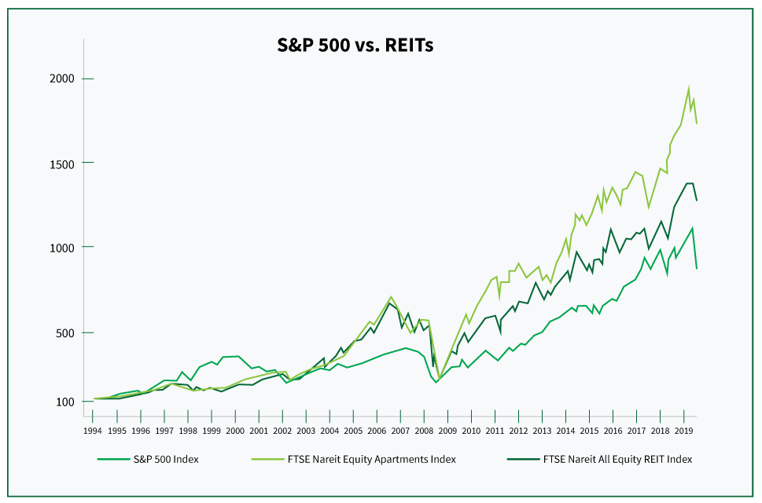

## Table of Contents

## What is a REIT?

A REIT, or Real Estate Investment Trust, is a company that owns, operates, or finances income-generating real estate. It's like a big property owner that people can invest in, kind of like buying shares in a company. REITs can own different types of properties, like apartments, shopping centers, or offices. By investing in a REIT, people can earn money from real estate without having to buy and manage properties themselves.

REITs have to follow certain rules. One big rule is that they must pay out at least 90% of their taxable income as dividends to their shareholders each year. This is good for investors because it means they get regular income from their investment. REITs are popular because they offer a way to invest in real estate without the hassle of being a landlord. They also help people diversify their investments, which can make their overall investment strategy safer.

## What is real estate crowdfunding?

Real estate crowdfunding is a way for a lot of people to pool their money together to invest in real estate. Instead of one person buying a whole property, many people can chip in smaller amounts. This makes it easier for people who don't have a lot of money to still invest in real estate. It's done through online platforms where people can see different real estate projects and choose which ones they want to invest in.

These platforms connect investors with real estate developers or property owners who need money for their projects. Once the project is funded, the investors own a piece of the property. They can earn money from it through rental income or when the property is sold for a profit. Real estate crowdfunding can be a good way to diversify investments and possibly earn more money, but it also comes with risks, so it's important to do your homework before investing.

## How do REITs generate income for investors?

REITs generate income for investors mainly through rental income from the properties they own. When people or businesses rent space in a building owned by a REIT, the rent money goes to the REIT. The REIT then pays out most of this money as dividends to its investors. This means that if you own shares in a REIT, you get a piece of the rental income regularly, usually every few months.

Besides rental income, REITs can also make money when they sell properties for more than they paid for them. This is called capital gains. If a REIT buys a building, fixes it up, and then sells it at a higher price, the profit from that sale can be shared with investors. However, REITs have to pay out at least 90% of their taxable income as dividends, so most of the income investors get comes from the rent the properties earn.

## How does real estate crowdfunding generate income for investors?

Real estate crowdfunding lets investors make money in a few ways. One way is through rental income. When a group of investors funds a project, like an apartment building or a shopping center, the rent paid by tenants goes to the investors. This money is shared among all the investors based on how much they put in. So, if you invest in a crowdfunded property, you can get a part of the rent money every month or every few months.

Another way to make money from real estate crowdfunding is when the property is sold. If the property goes up in value over time, the investors can sell it for more than they paid. The profit from this sale, called capital gains, is then shared among the investors. This can give investors a big payout if the property's value has gone up a lot. But remember, there are risks too, like if the property doesn't do well or if the market goes down, investors might lose money.

## What are the minimum investment amounts for REITs versus real estate crowdfunding?

For REITs, the minimum investment amount is usually pretty low. You can buy shares of a REIT just like you would buy shares of any company on the stock market. This means you might be able to start investing with as little as the price of one share, which can be anywhere from a few dollars to a few hundred dollars. It's easy to get started because you can buy shares through a regular brokerage account.

Real estate crowdfunding can have higher minimums. Depending on the platform and the project, you might need to invest anywhere from a few hundred to a few thousand dollars. Each crowdfunding platform sets its own rules, so it's good to check different ones to see what fits your budget. While it's more than what you might need for a REIT, it's still less than buying a whole property on your own.

## What are the liquidity differences between REITs and real estate crowdfunding?

REITs are usually pretty easy to buy and sell. They trade on stock exchanges just like regular stocks, so you can buy or sell them whenever the market is open. This means if you need your money back quickly, you can sell your shares in a REIT without much trouble. The price might go up or down, but you can get your money out fast.

Real estate crowdfunding is different. It's not as easy to get your money out because the investments are in actual properties, which can't be sold as quickly as stocks. Often, you have to wait until the property is sold or until the project is finished before you can get your money back. Some platforms might let you sell your investment to someone else, but that's not always an option and can take time. So, if you need your money back soon, real estate crowdfunding might not be the best choice.

## How do the risk profiles of REITs compare to those of real estate crowdfunding?

REITs and real estate crowdfunding both have risks, but they're a bit different. With REITs, you're investing in a company that owns a lot of properties. The main risks are things like changes in the real estate market, interest rates going up or down, and the overall economy doing well or not. If a lot of people can't pay rent, or if property values drop, the REIT might not make as much money, and the value of your investment could go down. But because REITs are traded on stock exchanges, you can sell your shares if you need to, which helps manage some risk.

Real estate crowdfunding has different risks because you're usually investing in one specific project or property. If that project doesn't do well, like if it's hard to find tenants or if construction costs go up, you could lose money. Also, it's harder to get your money out quickly because you can't just sell your investment like you can with a REIT. But if the project does well, you might make more money than you would with a REIT. So, crowdfunding can be riskier, but it also has the potential for bigger rewards if things go right.

## What are the tax implications of investing in REITs compared to real estate crowdfunding?

When you invest in REITs, the tax rules are a bit different than with regular stocks. REITs have to pay out at least 90% of their taxable income as dividends, and these dividends can be taxed as regular income, which might be higher than the tax rate for qualified dividends from other stocks. But, part of the dividends from REITs can be considered return of capital, which isn't taxed right away but reduces your cost basis in the investment. When you sell your REIT shares, you'll owe capital gains tax on any profit, just like with other stocks.

Real estate crowdfunding has its own tax rules, which can be more complicated because you're investing directly in a property. The income you get from rent is usually taxed as regular income. If the property is sold and you make a profit, you'll owe capital gains tax on that profit. But, you might also be able to take advantage of tax deductions like depreciation, which can lower your taxable income. The exact tax treatment can depend on the type of crowdfunding investment and the specific project, so it's a good idea to talk to a tax professional to understand how it applies to you.

## How do the management and operational structures of REITs differ from real estate crowdfunding platforms?

REITs are run like big companies. They have a board of directors and professional managers who make decisions about which properties to buy, sell, or manage. These managers take care of everything from finding tenants to keeping the buildings in good shape. Because REITs are public companies, they have to follow a lot of rules and report their finances regularly to shareholders and the government. This structure makes REITs more stable and easier to understand because you can see how they're doing through their reports.

Real estate crowdfunding platforms, on the other hand, work more like a marketplace. They connect investors with real estate projects that need funding. Each project might have its own team of developers or property managers who handle the day-to-day work. The platform itself doesn't manage the properties but helps with the paperwork and money transfers between investors and the project leaders. This means the management can be different for each project you invest in, and it might not be as easy to get information about how each project is doing compared to a REIT.

## What types of properties are typically involved in REITs versus real estate crowdfunding?

REITs usually own big groups of properties. They might have lots of apartment buildings, shopping centers, office buildings, or even hospitals and hotels. Because REITs are big companies, they can own all kinds of properties in different places. This helps them spread out their risk. If one type of property isn't doing well, they might still make money from other types.

Real estate crowdfunding often focuses on specific projects or smaller properties. You might see things like a single apartment building, a new development project, or even a commercial space like a restaurant or store. The projects can be new buildings or ones that need to be fixed up. Since crowdfunding lets lots of people invest a little bit of money, it's good for smaller or more unique projects that might not attract big investors.

## How have REITs and real estate crowdfunding performed historically in terms of returns?

Historically, REITs have given investors pretty good returns over the long run. From 1972 to 2022, the average annual return for REITs was around 10-12%. This is a bit higher than what you might get from the stock market, which has averaged around 10% over the same time. But, like any investment, REITs can go up and down. During the 2008 financial crisis, REITs lost a lot of value, but they bounced back over time. The returns can also depend on the type of REIT. For example, healthcare and industrial REITs have done better than retail REITs in recent years.

Real estate crowdfunding is newer, so we don't have as much history to look at. But from what we can see, the returns can be all over the place. Some projects have given investors returns of 20% or more, while others have lost money. It really depends on the project and how well it does. Crowdfunding can be riskier because you're often putting money into one specific property, not a big group of them like with REITs. But if you pick the right project, you might make more money than you would with a REIT.

## What future trends might impact the growth and regulation of REITs and real estate crowdfunding?

In the future, technology and changes in how people live and work could really change REITs and real estate crowdfunding. More people might work from home, so there could be less need for office buildings. This could make office REITs struggle, but it might help residential REITs and crowdfunding projects that focus on homes and apartments. Also, new technology like smart buildings and green energy could make some properties more valuable. REITs and crowdfunding platforms that invest in these kinds of properties might do better. 

Regulations could also change how REITs and real estate crowdfunding work. Governments might make new rules to protect investors, especially in crowdfunding where it's easier for people to lose money. These rules could make it harder to start new projects but might make investors feel safer. Also, as more people use crowdfunding, the government might want to make sure it's fair and transparent. For REITs, new tax laws or changes in how they have to report their finances could affect how much money they make and how they operate.

## References & Further Reading

[1]: ["The Intelligent REIT Investor: How to Build Wealth with Real Estate Investment Trusts"](https://www.amazon.com/Intelligent-REIT-Investor-Wealth-Investment/dp/1119252717) by Stephanie Krewson-Kelly and R. Brad Thomas

[2]: Agrawal, N. (2021). ["Real Estate Crowdfunding: A Framework for Successful Real Estate Investments."](https://link.springer.com/chapter/10.1007/978-3-031-74608-6_29) SSRN Electronic Journal.

[3]: ["REITs: Building Profits with Real Estate Investment Trusts"](https://www.amazon.com/REITs-Building-Profits-Estate-Investment/dp/0471193240) by Ralph L. Block

[4]: Narang, R. (2014). ["Inside the Black Box: A Simple Guide to Quantitative and High-Frequency Trading."](https://onlinelibrary.wiley.com/doi/book/10.1002/9781118662717) Wiley Finance, Second Edition.

[5]: Crowdfunding Centre. (2020). ["The Impact of Real Estate Crowdfunding: Investment At Your Fingertips."](https://www.investopedia.com/ask/answers/100214/what-real-estate-crowdfunding.asp) The Crowdfunding Centre Research and Updates.

[6]: ["Trading and Exchanges: Market Microstructure for Practitioners"](https://academic.oup.com/book/52292) by Larry Harris

[7]: Cotter, J., Gabriel, S., & Roll, R. (2015). ["Can Investors Use Real Estate Investment Trusts (REITs) to Hedge a Portfolio?"](https://www.semanticscholar.org/paper/A-Comparative-Anatomy-of-REITS-and-Residential-Real-Cotter-Roll/2eb36259b0461db3c191dcb8f5f0882a9bce9f5a) UCLA Anderson School of Management Papers.