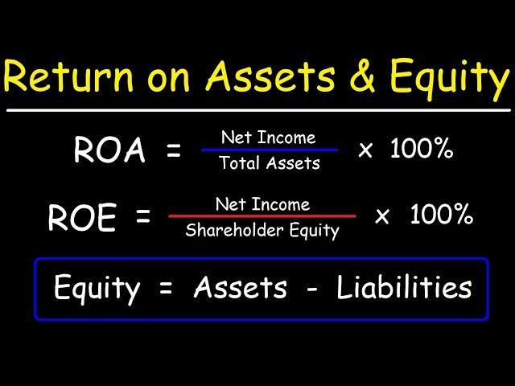

Financial metrics such as Return on Equity (ROE) and Return on Assets (ROA) are crucial for evaluating company performance. These metrics offer insights into how effectively a company is generating profits relative to certain financial baselines. ROE measures a company’s profitability by evaluating how much profit it generates with the money shareholders have invested. On the other hand, ROA provides an understanding of how efficiently a company is deploying its total assets to generate earnings. Both metrics are essential indicators used by investors to assess a company's operational efficiency and financial health.

In traditional investing, metrics like ROE and ROA have long been utilized to compare companies within the same industry and to assess their relative financial performance. Investors rely on these metrics to determine if a company is effectively using its resources and if it presents a viable investment opportunity. These metrics also assist in identifying sustainable competitive advantages, gauging a company’s capacity to generate profit, and anticipating future performance trends.



The relevance of these financial metrics extends significantly into the domain of algorithmic trading. As the financial industry becomes increasingly driven by data and technology, algorithmic trading has grown, leveraging intricate mathematical models to make swift, data-driven trading decisions. ROE and ROA are among the critical metrics incorporated into these models to identify fundamentally strong stocks. They enable algorithms to discern patterns and insights swiftly that would be cumbersome for human analysts to process manually.

Algorithmic trading, which involves executing orders using pre-programmed trading instructions accounting for variables such as time, price, and volume, significantly benefits from the use of financial metrics like ROE and ROA. These metrics serve as foundational data points that algorithms analyze to evaluate a company’s performance. With the capacity to process vast datasets rapidly, algorithmic trading systems can make informed trading decisions based on the underlying financial health of companies as reflected in their ROE and ROA statistics.

The increasing role of algorithmic trading is reshaping how financial metrics are leveraged for making informed trading decisions. By facilitating the automation of trading processes, ROE and ROA not only enhance the efficiency of trading strategies but also contribute to reducing human bias and error. This evolution in trading underscores the need for a comprehensive understanding of these metrics, as they are integral to both traditional investing approaches and the ever-evolving sphere of algorithmic trading.

## Table of Contents

## Understanding Return on Equity (ROE)

Return on Equity (ROE) is a critical financial metric that measures a company's ability to generate profits from its shareholders' equity. It is particularly significant as it provides insights into how effectively management is utilizing the equity capital invested by shareholders to produce earnings. ROE is widely regarded as an indicator of managerial efficiency, reflecting the competence with which a company's leadership team is handling shareholders' investments.

The formula for calculating ROE is as follows:

$$
\text{ROE} = \frac{\text{Net Income}}{\text{Shareholders' Equity}}
$$

### Components of ROE Calculation:

1. **Net Income**: This is the profit a company has after all expenses, taxes, and costs have been deducted from total revenue. Net income is a crucial component as it represents the actual profitability of a company within a given period.

2. **Shareholders' Equity**: This figure represents the net value of a company and is calculated as total assets minus total liabilities. Shareholders' equity illustrates the residual interest that shareholders have in the company after all obligations have been met.

ROE serves as a barometer for assessing how well a company is converting the equity it has raised into increased net earnings. A higher ROE indicates that a company is efficient at generating returns on investment from its shareholders, implying sound management practices and potentially higher growth prospects.

For example, consider a company with a net income of $500,000 and total shareholders' equity of $2,500,000. The ROE would be:

$$
\text{ROE} = \frac{500,000}{2,500,000} = 0.20 \text{ or } 20\%
$$

This 20% ROE signifies that for every dollar of shareholders' equity, the company generates 20 cents in profit, thus indicating a healthy return on the equity capital provided by investors. It underscores the company's efficacy in maximizing shareholder wealth, bearing in mind that a comparison with industry or historical averages is essential for contextual interpretation.

In summary, ROE is a vital measure for investors and analysts, not only because it assesses profitability in relation to equity but also due to its role in evaluating the overall efficiency of a company's management team. This makes ROE a necessary consideration when evaluating potential investments and strategic business decisions.

## Understanding Return on Assets (ROA)

Return on Assets (ROA) is a key financial metric used to evaluate a company's operational efficiency in utilizing its assets to generate profits. Essentially, ROA indicates the effectiveness with which a firm employs its resources, including both equity and debt, to produce earnings. This metric provides vital insights into the operational efficiency of a company as it considers both the equity and debt components in the asset pool, allowing for a more comprehensive view of how well a company is managing its total asset base.

The formula for calculating ROA is:

$$
\text{ROA} = \frac{\text{Net Income}}{\text{Total Assets}}
$$

Net income represents the profit after taxes and interest, while total assets encompass the entire asset base including fixed, current, tangible, and intangible assets. This formula highlights the percentage of profit a company earns relative to its total asset base, providing a ratio that investors and analysts use to compare against industry peers or historical performance.

A higher ROA indicates that a company is effectively using its assets to generate higher earnings, which can be a marker of strong operational efficiency and management performance. Conversely, a lower ROA may suggest that the company is inefficient in its asset utilization or has an excessive asset base without generating corresponding profits.

Industry variations significantly influence ROA figures. Capital-intensive industries, such as utilities and manufacturing, tend to have lower ROA levels due to their large asset bases required for operations. In contrast, industries with fewer asset requirements, like service-based businesses, often display higher ROA figures. Consequently, when comparing ROA, it is essential to account for these inherent industry differences to accurately assess a company's operational efficiency. 

In conclusion, ROA serves as a critical indicator of a company's capability to convert its investments into profits, taking a holistic view by accounting for both equity and debt. The application of ROA thus requires thoughtful interpretation, especially when considering industry-specific asset utilization norms.

## Key Differences Between ROE and ROA

Return on Equity (ROE) and Return on Assets (ROA) are both essential financial metrics but offer different perspectives on a company's financial health and performance. ROE specifically focuses on the profitability generated from shareholders' equity, essentially measuring how effectively management uses invested capital. In contrast, ROA examines how efficiently a company uses its total assets, providing a broader insight that includes both equity and debt components.

The fundamental distinction between ROE and ROA lies in their denominator: ROE uses shareholders' equity, whereas ROA uses total assets. This difference is crucial, as total assets include both equity and liabilities. Consequently, ROE and ROA can reflect differing financial conditions, particularly in scenarios involving varying levels of leverage.

### Influence of Financial Leverage

Leverage, or the use of borrowed capital in a company's financial structure, significantly impacts the interpretation of ROE and ROA:

1. **High Leverage Scenarios:**
   - A highly leveraged company may exhibit a high ROE because the returns generated from equity are amplified by the use of debt. However, this leverage does not affect the ROA as positively, since ROA accounts for total assets, including the borrowed funds. This scenario illustrates where ROE might suggest strong performance, but ROA tempers that conclusion by showing less efficiency in the use of total capital.

2. **Low Leverage Scenarios:**
   - Conversely, a company with low leverage might display similar ROE and ROA values, indicating that most asset financing comes from equity. This can suggest stability and efficient use of total resources without extensive reliance on debt.

### Implications for Investors and Analysts

Understanding the differences between ROE and ROA is vital for investors and analysts as these metrics can lead to varying conclusions about a company's financial health:

- **Investment Decision-Making:**
  - Investors focused on shareholder value might prefer companies with high ROE, perceiving them as more profitable investments in terms of equity. However, analysts cautious of financial stability might scrutinize high leverage that inflates ROE, turning to ROA for a more comprehensive assessment.

- **Risk Assessment:**
  - High ROE coupled with modest ROA might flag potential over-reliance on debt. Such a disparity should prompt further analysis to gauge the sustainability of returns, particularly in varying market conditions that may impact debt repayment capacity.

In summary, ROE and ROA both provide valuable insights, yet they diverge in the scope and emphasis of their analysis. By examining these metrics together, analysts and investors can gain a nuanced understanding of a company's operational efficacy and financial leverage impact, helping inform strategic decisions and improve risk assessments.

## The DuPont Identity and its Role in Linking ROE and ROA

The DuPont Identity is a valuable framework used to break down the Return on Equity (ROE) into distinct components, allowing for a deeper understanding of a company's financial performance. This analytical tool decomposes ROE into three main components: operating efficiency, asset use efficiency, and financial leverage.

The formula for ROE using the DuPont Identity is expressed as follows:

$$
\text{ROE} = \text{Profit Margin} \times \text{Total Asset Turnover} \times \text{Equity Multiplier}
$$

1. **Operating Efficiency (Profit Margin):** This component reflects the company’s ability to convert sales into profit. It is calculated as net income divided by sales. A higher profit margin indicates effective cost management and pricing strategies.

2. **Asset Use Efficiency (Total Asset Turnover):** This measures how effectively a company is using its assets to generate sales, calculated as sales divided by total assets. A higher asset turnover ratio suggests efficient asset utilization.

3. **Financial Leverage (Equity Multiplier):** This reflects the extent to which a firm uses debt to finance its assets, calculated as total assets divided by shareholders' equity. Greater financial leverage indicates higher reliance on debt in the capital structure.

The DuPont analysis helps in linking ROE with Return on Assets (ROA) by incorporating the equity multiplier. ROA is calculated as:

$$
\text{ROA} = \text{Net Income} / \text{Total Assets}
$$

Hence, ROE can be rewritten in terms of ROA as:

$$
\text{ROE} = \text{ROA} \times \text{Equity Multiplier}
$$

This relationship underscores the influence of financial leverage on ROE, illustrating how companies with higher leverage can achieve a higher ROE, provided that the cost of debt does not outweigh the returns from asset investments.

**Example:**

Consider a company with a net income of $1 million, sales of $10 million, total assets of $5 million, and shareholders' equity of $2 million.

- Profit Margin = $\frac{1 \text{ million}}{10 \text{ million}} = 0.1$ or 10%
- Total Asset Turnover = $\frac{10 \text{ million}}{5 \text{ million}} = 2$
- Equity Multiplier = $\frac{5 \text{ million}}{2 \text{ million}} = 2.5$

Using the DuPont formula:

$$
\text{ROE} = 0.1 \times 2 \times 2.5 = 0.5 \text{ or 50%}
$$

- ROA for the company is $\frac{1 \text{ million}}{5 \text{ million}} = 0.2$ or 20%

The equity multiplier's value of 2.5 indicates how leveraging affects ROE, increasing it from the 20% represented by ROA to 50%. This example clearly shows that operational or leverage changes can significantly influence ROE and ROA, making the DuPont Identity an essential tool for financial analysis.

## Applying ROE and ROA in Algorithmic Trading

The application of Return on Equity (ROE) and Return on Assets (ROA) in [algorithmic trading](/wiki/algorithmic-trading) hinges on these metrics' ability to pinpoint fundamentally strong stocks. These financial measures serve as essential indicators for developing and optimizing trading algorithms that rely on quantitative analysis.

ROE and ROA metrics facilitate the identification of companies with efficient management and robust asset utilization. In algorithmic trading, such metrics are incorporated into algorithms to screen potential investment opportunities. By evaluating ROE, algorithms can focus on firms capable of generating profit from shareholders' equity, an indicator of superior managerial performance and business viability. Similarly, ROA highlights how well a firm utilizes its total asset base, providing insights into operational efficiency across both debt and equity.

Implementing these metrics in algorithmic trading requires converting financial data into actionable insights. This is typically achieved through quantitative models that integrate ROE and ROA calculations. For instance, an algorithm may be programmed in Python to filter stocks based on predefined thresholds for ROE and ROA, thus isolating companies that demonstrate optimal financial performance.

```python
import pandas as pd

# Sample dataset with stock information
data = {'Stock': ['A', 'B', 'C', 'D'],
        'Net_Income': [50000, 60000, 70000, 80000],
        'Shareholder_Equity': [200000, 300000, 350000, 400000],
        'Total_Assets': [500000, 600000, 700000, 800000]}

# Create a DataFrame
df = pd.DataFrame(data)

# Calculate ROE and ROA
df['ROE'] = df['Net_Income'] / df['Shareholder_Equity']
df['ROA'] = df['Net_Income'] / df['Total_Assets']

# Define ROE and ROA thresholds
ROE_threshold = 0.15
ROA_threshold = 0.08

# Filter stocks that meet the criteria
filtered_stocks = df[(df['ROE'] > ROE_threshold) & (df['ROA'] > ROA_threshold)]
```

This Python snippet demonstrates a straightforward filtering process where stocks with ROE exceeding 15% and ROA surpassing 8% are selected for further analysis.

However, integrating financial metrics into trading algorithms is not without challenges. A primary issue is the dynamic and volatile nature of financial markets, where variables influencing ROE and ROA can fluctuate rapidly. In such an environment, algorithms must adapt to changing data inputs, potentially requiring real-time updates or retraining using [machine learning](/wiki/machine-learning) techniques to remain effective.

Moreover, reliance on historical data can lead to overfitting, where an algorithm performs well on past data but poorly on unseen data. To mitigate this, diverse datasets should be used for training, and model robustness should be tested through techniques such as cross-validation.

Lastly, the complexity of financial statements can pose difficulties in accurately calculating ROE and ROA, especially in firms with intricate capital structures. High-quality data sourcing and preprocessing are crucial to overcome this barrier, ensuring that algorithms reflect accurate and up-to-date financial conditions.

In conclusion, while ROE and ROA offer powerful tools for enhancing algorithmic trading strategies, successful implementation necessitates careful consideration of market dynamics, algorithm adaptability, and data fidelity.

## Example of ROE and ROA in Practical Analysis

To demonstrate the calculation and interpretation of Return on Equity (ROE) and Return on Assets (ROA), consider a hypothetical company, XYZ Corp, operating in the manufacturing sector. For the fiscal year, XYZ Corp has the following financial data:

- Net Income: $500,000
- Shareholder's Equity: $2,500,000
- Total Assets: $5,000,000

### Calculating ROE

Return on Equity (ROE) is defined as the measure of a company's ability to generate profits from its shareholders' equity. It is calculated using the formula:

$$
\text{ROE} = \frac{\text{Net Income}}{\text{Shareholders' Equity}}
$$

Substituting the given values:

$$
\text{ROE} = \frac{500,000}{2,500,000} = 0.20 \, \text{or} \, 20\%
$$

This indicates that for every dollar of equity invested by shareholders, XYZ Corp generates 20 cents in net income, reflecting strong profitability and efficient management of equity.

### Calculating ROA

Return on Assets (ROA) assesses how efficiently a company uses its assets to produce profits. The formula is:

$$
\text{ROA} = \frac{\text{Net Income}}{\text{Total Assets}}
$$

For XYZ Corp:

$$
\text{ROA} = \frac{500,000}{5,000,000} = 0.10 \, \text{or} \, 10\%
$$

This 10% ROA reveals that XYZ Corp earns 10 cents for every dollar invested in assets, highlighting its operational efficiency relative to the assets it owns.

### Contrasting ROE and ROA

The calculated ROE of 20% is higher than the ROA of 10%. This discrepancy can arise from XYZ Corp's leverage - the degree to which it uses borrowed funds in addition to its equity. The higher ROE suggests effective use of leverage to enhance returns to shareholders. However, it also signifies increased financial risk due to the potential obligation to service debt.

These metrics together depict XYZ Corp as a company that efficiently uses both its equity and assets but also relies on financial leverage. For investors and analysts, this analysis provides a nuanced view of the company's financial health and operational efficiency, leading to informed decision-making. Understanding both the similarities and contrasts of ROE and ROA in the context of leverage and asset management is critical for thorough financial assessment.

## Conclusion

Return on Equity (ROE) and Return on Assets (ROA) serve as crucial metrics in evaluating company performance, providing investors and traders with insights into management efficiency, profitability, and asset utilization. ROE, by reflecting a company's ability to generate profits from its shareholders' equity, becomes a vital measure in assessing managerial efficiency. In contrast, ROA underscores the effectiveness with which a company employs its assets, considering both debt and equity, to generate profits. These metrics offer two complementary perspectives on a company's financial health.

In traditional investing, ROE and ROA guide investors in identifying companies that demonstrate robust profitability and efficient asset management. By examining these metrics together, investors can gauge not only how well equity capital is being used to generate returns but also how effectively the overall asset base contributes to profitability. This holistic understanding aids in making informed investment decisions and constructing well-balanced portfolios.

The relevance of ROE and ROA has also extended to algorithmic trading, where their role in identifying fundamentally strong stocks is increasingly being recognized. Algorithmic trading strategies can leverage these metrics to optimize decision-making processes, segment markets, and manage risks effectively. However, integrating these financial metrics into algorithmic models involves challenges such as data consistency, adaptability to market conditions, and computation complexities. Therefore, traders and analysts striving for superior trading performance are encouraged to employ advanced financial analytics.

Using ROE and ROA in tandem provides comprehensive insights that are crucial for both traditional investors and algorithmic traders. These metrics collectively manifest a deeper understanding of a company's financial condition and operational efficiency, paving the way for more informed and strategic investment choices. As the financial landscape continues to evolve, the pursuit of advanced financial analytical tools and models can further enhance trading performance, providing a competitive edge in both traditional and algorithmic markets.

## References & Further Reading

[1]: ["Return on Equity (ROE) - A Complete Guide"](https://www.investopedia.com/terms/r/returnonequity.asp) on Investopedia

[2]: Penman, S. H. (2013). "Financial Statement Analysis and Security Valuation." McGraw-Hill Education.

[3]: ["Algorithmic Trading: Winning Strategies and Their Rationale"](https://books.google.com/books/about/Algorithmic_Trading.html?id=WAlFDwAAQBAJ) by Ernie Chan

[4]: Damodaran, A. (2012). "Investment Valuation: Tools and Techniques for Determining the Value of Any Asset." John Wiley & Sons.

[5]: ["Return on Assets (ROA) - Understanding the Basics"](https://www.businessinsider.com/personal-finance/investing/return-on-assets) on Investopedia