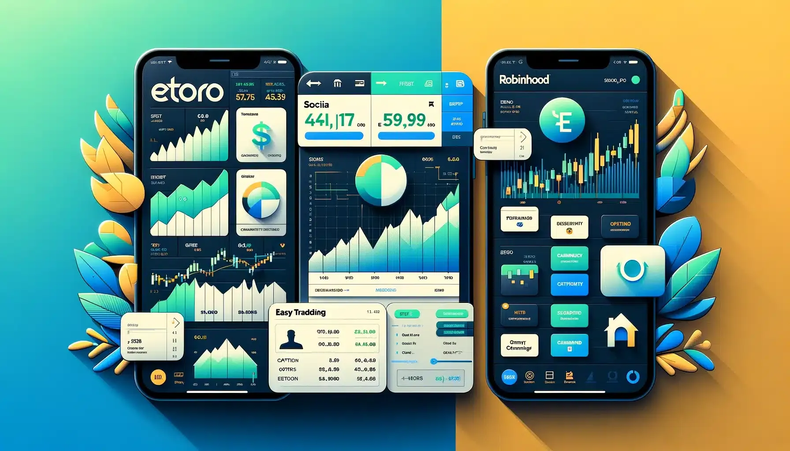

## Table of Contents

## What are Robinhood and eToro, and how do they differ at a basic level?

Robinhood and eToro are both online platforms that let people buy and sell stocks and other investments. Robinhood started in the United States and is known for not charging any fees for trading stocks, which makes it popular among people new to investing. They have a simple app that is easy to use on your phone. eToro, on the other hand, started in Israel and is used all over the world. It's also easy to use, but it has a special feature called "social trading" where you can copy what other successful investors are doing.

The main difference between Robinhood and eToro is in what they offer and how they work. Robinhood focuses a lot on stocks and options, and it's really straightforward. They've added things like crypto trading over time, but it's all about keeping things simple and cheap. eToro, though, offers a wider range of investments like stocks, crypto, and even forex. Their big thing is the social trading feature, which lets you see what others are doing and follow them if you want. So, if you're looking for a simple, no-fee way to trade stocks, Robinhood might be better for you. But if you want to try different types of investments and learn from others, eToro could be the way to go.

## How do the user interfaces of Robinhood and eToro compare for beginners?

Robinhood's user interface is designed to be very simple and easy for beginners to use. When you open the app, you see a clean screen with big buttons and clear labels. It's easy to find stocks and buy or sell them with just a few taps. The app uses simple language and doesn't have a lot of extra stuff that might confuse new users. This makes it a good choice if you're just starting out and want something straightforward.

eToro's interface is also user-friendly, but it has more features that might take a bit more time to get used to. When you open the app, you see a dashboard with different sections for your investments, a news feed, and the social trading part where you can see what other people are doing. There are more buttons and options, which can be helpful once you know what they do, but it might feel a bit busy at first. If you're a beginner, you might need a little more time to explore and understand all the different parts of eToro, but it can be rewarding once you get the hang of it.

## What are the fee structures for trading on Robinhood versus eToro?

Robinhood is known for not charging any fees for trading stocks and exchange-traded funds (ETFs). This means you can buy and sell these investments without paying any commission. However, Robinhood does charge fees for some other things. For example, if you trade options, there is a fee of about $0.65 per contract. Also, if you want to take money out of your Robinhood account right away, there might be a fee for that. And if you want to trade cryptocurrencies, Robinhood charges a small fee that changes depending on how much you're trading.

eToro has a bit more complicated fee structure. They don't charge a fee for buying or selling stocks, but they do have something called a "spread," which is a small difference between the buying and selling price. This spread can be seen as a cost for trading. For cryptocurrencies, eToro charges a fee that can be up to 1% of the amount you're trading. If you use their social trading feature and copy other traders, there's a fee of 1% on any profits you make from that. And if you want to take your money out of eToro, there's a fee for that too, which depends on how you're taking the money out.

## How do the available investment options on Robinhood and eToro differ?

Robinhood offers a range of investment options that are mainly focused on stocks and exchange-traded funds (ETFs). You can easily buy and sell stocks from big companies like Apple or smaller ones. They also let you trade options, which are more advanced and let you bet on whether a stock's price will go up or down. In addition to stocks and ETFs, Robinhood lets you trade cryptocurrencies like Bitcoin and Ethereum. They've added these over time to give users more choices, but the main focus is still on stocks.

eToro, on the other hand, provides a wider variety of investment options. You can trade stocks and ETFs just like on Robinhood, but eToro also lets you trade cryptocurrencies, forex (which is trading different currencies), and commodities like gold and oil. One unique thing about eToro is that they let you invest in something called CFDs (Contracts for Difference), which let you trade on the price movements of various assets without actually owning them. This gives you more ways to invest, but it can also be more complex and riskier.

## What educational resources do Robinhood and eToro offer to new investors?

Robinhood has some good stuff to help people who are new to investing learn more. They have a section in their app called "Learn" where you can find articles and videos about investing. These explain things like what stocks are, how to start investing, and even more advanced stuff like options trading. They also have a newsletter called "Snacks" that gives you quick updates on what's happening in the market. This can be really helpful if you want to keep learning while you're starting out.

eToro also offers a lot of educational resources for new investors. They have a part of their website called "eToro Academy" where you can find all sorts of learning materials. There are courses, webinars, and articles that cover everything from the basics of investing to more complex topics like forex trading. eToro also has a feature where you can follow and learn from experienced traders, which can be a great way to see how others invest and pick up tips along the way. This makes eToro a good place for beginners who want to dive deeper into investing.

## How do the account opening processes and requirements compare between Robinhood and eToro?

Opening an account with Robinhood is pretty easy and quick. You just need to download their app, put in your email, and set up a password. Then, you'll need to give them some personal info like your name, address, and Social Security number so they can check who you are. Robinhood is only for people in the United States, so you need to be a U.S. citizen or resident to use it. Once you're all set up, you can start trading right away. They don't ask for a lot of money to get started, so it's good for beginners.

eToro's account opening process is also simple, but it might take a bit longer because they work in many countries around the world. You start by going to their website or app, entering your email, and setting up a password. Then, you'll need to give them your name, address, and sometimes a photo ID to prove who you are. eToro is available in many countries, so you don't need to be in the U.S. to use it. They might ask for a bit more info depending on where you live, but once your account is approved, you can start trading. Like Robinhood, eToro doesn't need a lot of money to start, making it friendly for new investors.

## What are the security measures and insurance protections offered by Robinhood and eToro?

Robinhood takes security seriously. They use strong encryption to keep your info safe when you're using their app or website. They also have something called two-[factor](/wiki/factor-investing) authentication, which means you need to enter a special code sent to your phone to log in. This makes it harder for someone else to get into your account. Robinhood is also a member of the Securities Investor Protection Corporation (SIPC). This means if Robinhood ever goes out of business, SIPC can help you get back up to $500,000 of your cash and securities. But remember, this doesn't protect you if you lose money because the stock market goes down.

eToro also works hard to keep your account safe. They use encryption to protect your data and have two-factor authentication to make sure it's really you logging in. eToro follows rules set by different countries to keep your money safe. In the U.S., eToro is also a member of SIPC, so like Robinhood, if eToro goes out of business, SIPC can help you recover up to $500,000 of your cash and securities. Outside the U.S., eToro might have different protections depending on where you live. Just like with Robinhood, this protection doesn't cover losses from the market going down.

## How do the social trading and community features of eToro compare to Robinhood's offerings?

eToro is really big on social trading and community stuff. They have a feature where you can see what other people are doing with their investments. You can follow successful traders and even copy what they're doing automatically. This is called "CopyTrading." eToro also has a news feed where people share their thoughts and ideas about investing. It's like a social media site for investors. This can be really helpful if you're new to investing because you can learn from others and see what's working for them.

Robinhood doesn't have the same kind of social trading features as eToro. They do have a section called "Snacks" where you can read quick news about the market, but it's not the same as seeing what other people are doing with their money. Robinhood also has a community forum where users can talk about investing, but it's not as built into the app as eToro's social features. So, if you want to learn from other investors and see what they're doing, eToro might be a better choice. But if you just want to trade on your own and get some news, Robinhood's offerings might be enough for you.

## What are the advanced trading features available on Robinhood and eToro for experienced traders?

Robinhood has some advanced trading features that can be good for experienced traders. One of them is trading options, which let you bet on whether a stock's price will go up or down. This can be riskier but also give you more ways to make money. Robinhood also lets you use something called margin trading, where you can borrow money from them to buy more stocks. This can make your investments bigger, but it's also riskier because you have to pay back the money you borrow. They also have a feature called "Gold," which is a paid subscription that gives you more benefits like a higher [interest rate](/wiki/interest-rate-trading-strategies) on your cash and bigger instant deposits.

eToro offers a few advanced features too, but they're a bit different from Robinhood's. One big thing is trading CFDs (Contracts for Difference), which let you trade on price movements without actually owning the asset. This can be good for experienced traders because it gives you more ways to make money, but it's also riskier. eToro also lets you trade forex, which is about trading different currencies. This can be tricky but interesting for experienced traders. Plus, with eToro's social trading features, experienced traders can share their strategies and even let others copy their trades, which can be a cool way to show off what you know and maybe make some extra money.

## How do the mobile app functionalities and user experiences differ between Robinhood and eToro?

Robinhood's mobile app is really easy to use and looks clean. When you open it, you see big buttons and clear labels that help you find what you want quickly. It's great for buying and selling stocks because you can do it with just a few taps. The app also has a section called "Learn" where you can read about investing, and a news section called "Snacks" that keeps you updated on what's happening in the market. Overall, Robinhood's app is all about keeping things simple and letting you trade without any fuss.

eToro's mobile app is also easy to use, but it has a lot more going on. When you open it, you see a dashboard with different sections for your investments, a news feed, and the social trading part where you can see what other people are doing. There are more buttons and options, which can be helpful once you know what they do, but it might feel a bit busy at first. eToro's app lets you do more than just trade stocks; you can also trade things like cryptocurrencies and forex. The social trading feature is a big part of the app, letting you learn from and copy other traders, which can be really useful if you want to see how others are investing.

## What are the tax implications and reporting tools provided by Robinhood and eToro?

Robinhood makes it easy to see what you need to know about taxes. At the end of the year, they send you a form called a 1099, which shows how much money you made or lost from your investments. This form helps you fill out your taxes. Robinhood also has a tool in their app called "Tax Center" where you can see all your trades and figure out what you need to report. It's simple to use and can help you get your taxes done right. But remember, if you're not sure about taxes, it's a good idea to talk to a tax expert.

eToro also helps with taxes but in a bit different way. They give you a tax report at the end of the year that shows your profits and losses. This report can be a bit more complicated because eToro lets you trade things like cryptocurrencies and forex, which can have different tax rules. eToro doesn't have a special tool like Robinhood's Tax Center, but they do give you all the info you need to do your taxes. If you trade a lot of different things on eToro, it might be a good idea to use tax software or talk to a tax expert to make sure you get everything right.

## How do the customer support options and responsiveness compare between Robinhood and eToro?

Robinhood's customer support is easy to reach but can sometimes take a while to get back to you. You can contact them through the app by sending a message or email. They also have a help center with lots of articles that can answer common questions. If you need to talk to someone right away, Robinhood doesn't have a phone number you can call, so you might have to wait for an answer. Overall, their support is good for simple questions, but for bigger problems, it might take longer to get help.

eToro's customer support is a bit different. They have a help center with articles and FAQs, just like Robinhood. But eToro also lets you talk to someone on live chat during certain hours, which can be faster than waiting for an email. They have a phone number you can call too, but it's not available 24/7. eToro's support can be quicker to respond, especially if you use the live chat, but it still depends on how busy they are. In general, eToro might be a bit better if you need quick help, but both platforms can take some time to solve bigger issues.

## What are the pros and cons?

### Pros and Cons of Using eToro for Algo Trading

**Pros:**

1. **Social Trading Features:** eToro is renowned for its social trading capabilities, allowing users to copy successful traders' strategies. This feature is beneficial for algorithmic traders seeking inspiration or validation of their automated strategies.

2. **Diverse Asset Range:** eToro offers a broad range of assets, including cryptocurrencies, stocks, and forex, enabling algo traders to diversify their strategies across different markets.

3. **User-Friendly Interface:** The platform provides an intuitive user interface, making it accessible for both novice and experienced algo traders to set up and monitor their automated trading systems.

4. **Innovative Tools:** eToro has integrated several tools for technical analysis which can aid in developing and testing algorithms.

**Cons:**

1. **Limited Customization for Algorithms:** eToro's platform may not offer as much flexibility for custom algorithm development compared to other platforms dedicated solely to algorithmic trading.

2. **Higher Spreads and Fees:** While eToro's fees are competitive for long-term investors, its spreads and fees might be higher than those on platforms specifically designed for high-frequency algo trading, impacting the profitability of strategies reliant on narrow margins.

### Pros and Cons of Using Robinhood for Algo Trading

**Pros:**

1. **No Commission Trading:** Robinhood's commission-free trading model is advantageous for algorithmic traders, especially those executing high-frequency strategies, as it reduces operational costs.

2. **Simple API Access:** Robinhood offers API access, enabling traders to create and implement their algorithms efficiently. 

3. **Mobile-Friendly Platform:** Robinhood's mobile app is highly rated for its ease of use, making it convenient for traders who rely on mobile technology to monitor their trading systems.

**Cons:**

1. **Market Breadth Limitations:** Compared to other platforms, Robinhood's asset offerings, particularly in international markets, are more limited, potentially restricting the diversification of algo trading strategies.

2. **Reduced Advanced Tools:** Robinhood may lack some of the more advanced technical analysis tools and charting capabilities available on other algorithmic trading platforms, posing a limitation for more complex strategy development.

### Factors to Consider When Choosing Between eToro and Robinhood

1. **Strategy Complexity:** Traders must consider the complexity of their algorithmic strategies. eToro may better serve those looking for community-driven insights and diverse asset classes, whereas Robinhood caters to traders seeking cost-effective, simpler algorithms.

2. **Market Access Needs:** eToro provides broader market access; therefore, traders requiring a wide range of global markets might prefer eToro.

3. **Technical Needs:** Traders who need comprehensive technical tools and extensive charting capabilities might find Robinhood lacking.

### Impact of Fees and Charges on Profitability in Algo Trading

In [algorithmic trading](/wiki/algorithmic-trading), the impact of fees and charges can be substantial, especially for high-frequency traders. While Robinhood's zero-commission structure is advantageous, it is essential for traders to scrutinize the spread costs and inactivity fees on eToro, as these can erode profits significantly. Calculating expected returns involves taking the total cost into account, represented as: 

$$
\text{Net Profit} = \text{Gross Profit} - (\text{Commission Fees} + \text{Spread Costs} + \text{Other Charges})
$$

### Ease of Transition for Those Switching Platforms

Transitioning between eToro and Robinhood involves several considerations:

1. **Data Migration:** Evaluate how easily trading data and algorithmic code can be transferred between platforms.

2. **Learning Curve:** Given the differences in user interfaces and available functionalities, traders may experience varying levels of ease in adapting to a new platform.

3. **Support Resources:** Platforms offering robust support, including tutorials and customer service, can significantly ease the transition process for newcomers.

## References & Further Reading

[1]: Bergstra, J., Bardenet, R., Bengio, Y., & Kégl, B. (2011). ["Algorithms for Hyper-Parameter Optimization."](https://papers.nips.cc/paper/4443-algorithms-for-hyper-parameter-optimization) Advances in Neural Information Processing Systems 24.

[2]: ["Advances in Financial Machine Learning"](https://www.amazon.com/Advances-Financial-Machine-Learning-Marcos/dp/1119482089) by Marcos Lopez de Prado

[3]: ["Evidence-Based Technical Analysis: Applying the Scientific Method and Statistical Inference to Trading Signals"](https://www.amazon.com/Evidence-Based-Technical-Analysis-Scientific-Statistical/dp/0470008741) by David Aronson

[4]: ["Machine Learning for Algorithmic Trading"](https://books.google.com/books/about/Machine_Learning_for_Algorithmic_Trading.html?id=4f30DwAAQBAJ) by Stefan Jansen

[5]: ["Quantitative Trading: How to Build Your Own Algorithmic Trading Business"](https://books.google.com/books/about/Quantitative_Trading.html?id=j70yEAAAQBAJ) by Ernest P. Chan