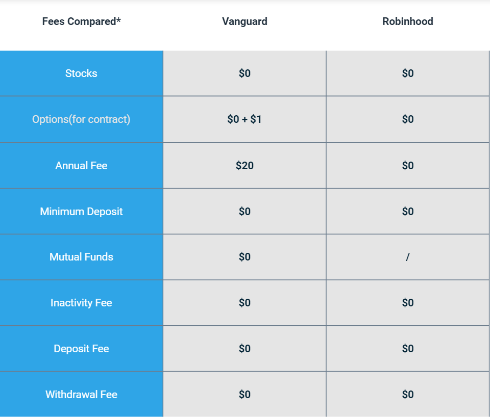

## Table of Contents

## What are Robinhood and Vanguard?

Robinhood is a company that helps people buy and sell stocks, which are small pieces of big companies. It's popular because it doesn't charge money for trading, so it's easy for anyone to start investing. Robinhood has a simple app that you can use on your phone, making it easy to keep track of your investments anytime, anywhere. However, because it's free, Robinhood makes money in other ways, like by lending out the stocks you own to other people.

Vanguard is another company that helps people invest their money, but it's been around longer than Robinhood. Vanguard is known for its low-cost index funds, which are a way to invest in a big group of stocks all at once. This can be safer than picking individual stocks because it spreads out the risk. Vanguard also offers other types of investments, like bonds and mutual funds. Unlike Robinhood, Vanguard charges small fees for its services, but these fees are usually lower than many other companies, making it a good choice for people who want to save money over time.

## What types of investment products do Robinhood and Vanguard offer?

Robinhood offers stocks, which are pieces of big companies, and exchange-traded funds (ETFs), which are like baskets of different stocks. They also have options, which are a bit more complicated and let you bet on whether a stock will go up or down. Recently, Robinhood started offering cryptocurrencies like Bitcoin and Ethereum, which are digital money that you can use online. They also have a feature called Robinhood Gold, where you can borrow money to buy more stocks, but you have to pay interest on the borrowed money.

Vanguard offers a wide range of investment products. They are well-known for their index funds, which let you invest in a big group of stocks all at once, helping to spread out your risk. They also offer mutual funds, which are similar to index funds but managed by professionals who pick the stocks. Vanguard has ETFs too, which you can buy and sell like stocks. Besides these, Vanguard offers bonds, which are loans you give to companies or governments that pay you back with interest, and target-date funds, which automatically adjust your investments based on when you plan to retire.

## How do the fees and commissions compare between Robinhood and Vanguard?

Robinhood is known for not charging any commissions for trading stocks, ETFs, and options. This means you don't pay any money when you buy or sell these investments. However, Robinhood does make money in other ways, like by charging for things like Robinhood Gold, which lets you borrow money to invest, and by [earning](/wiki/earning-announcement) interest on the cash you keep in your account. They also get paid for lending out the stocks you own to other people.

Vanguard charges small fees for its services, but these fees are usually lower than many other companies. For example, Vanguard's index funds and ETFs have very low expense ratios, which are the yearly fees you pay to own the funds. These fees are often much less than 1% of your investment each year. Vanguard also charges fees for buying and selling some of their mutual funds, but they try to keep these fees as low as possible. Overall, Vanguard's fees can save you a lot of money over time, especially if you're investing for the long term.

## What are the account minimums required by Robinhood and Vanguard?

Robinhood does not have any account minimums. This means you can start investing with as little money as you want. Whether you have $1 or $100, you can open an account and start buying stocks, ETFs, or even cryptocurrencies. This makes it easy for anyone to begin investing, no matter how much money they have.

Vanguard, on the other hand, has different minimums depending on the type of account and investment you choose. For many of their mutual funds, you need at least $3,000 to start investing. But if you want to invest in their ETFs, you can start with the cost of just one share, which can be much less than $3,000. Vanguard also offers some funds with no minimum if you sign up for automatic investments, making it a bit easier to get started with less money.

## How do the user interfaces of Robinhood and Vanguard differ?

Robinhood's user interface is designed to be simple and easy to use, especially on your phone. When you open the app, you see a clean layout with big buttons and clear labels. It's easy to find stocks and ETFs to buy, and you can see how your investments are doing at a glance. The app uses bright colors and simple graphs to show you your money's progress. Robinhood also has a feature where you can practice trading with fake money, which can help you learn without risking real cash.

Vanguard's user interface is a bit more complicated but still easy to use once you get the hang of it. Their website and app have more options and information, which can be good if you want to learn more about investing. You can see all your different investments in one place, and there are tools to help you plan for the future, like retirement calculators. The design is more serious and professional-looking, with lots of information and charts. It might take a bit longer to get used to, but it's great for people who want to dive deeper into their investments.

## What kind of investment tools and resources do Robinhood and Vanguard provide?

Robinhood provides simple tools and resources for people who are new to investing. They have a feature called "Robinhood Snacks" which gives you quick news about what's happening in the world of money. There's also a section called "Learn" where you can read easy-to-understand articles about investing. Robinhood lets you practice trading with fake money in a feature called "Paper Trading," so you can learn without losing real money. They also have a tool that shows you how much money you could make or lose if you buy or sell a stock, which helps you make better decisions.

Vanguard offers more detailed tools and resources for people who want to learn a lot about investing. They have a lot of articles and videos that explain different ways to invest and plan for the future. Vanguard's website has tools like retirement calculators that help you figure out how much money you'll need when you stop working. They also have a tool called "Portfolio Watch" that keeps an eye on your investments and tells you if you need to make changes. Vanguard's resources are great if you want to learn more and make smart choices about your money.

## How do the mobile apps of Robinhood and Vanguard compare in functionality and user experience?

Robinhood's mobile app is designed to be super easy to use, especially if you're new to investing. When you open the app, you see a simple layout with big buttons and clear labels. It's really easy to find stocks and ETFs to buy, and you can see how your investments are doing at a glance. The app uses bright colors and simple graphs to show you your money's progress. Robinhood also has a feature where you can practice trading with fake money, which helps you learn without risking real cash. Overall, the app feels friendly and is great for beginners.

Vanguard's mobile app is a bit more complicated but still easy to use once you get used to it. Their app has more options and information, which can be good if you want to learn more about investing. You can see all your different investments in one place, and there are tools to help you plan for the future, like retirement calculators. The design is more serious and professional-looking, with lots of information and charts. It might take a bit longer to get used to, but it's great for people who want to dive deeper into their investments and have more control over their money.

## What are the tax implications of investing with Robinhood versus Vanguard?

When you invest with Robinhood, you might have to pay taxes on the money you make from your investments. If you sell a stock or [ETF](/wiki/etf-trading-strategies) for more than you paid for it, you'll have a capital gain, and you'll need to pay taxes on that gain. Robinhood doesn't take out taxes for you, so you'll need to keep track of your gains and losses yourself and report them on your tax return. If you receive dividends, which are payments from companies to their shareholders, you'll also need to pay taxes on those. Robinhood provides you with a tax document called a 1099 form to help you report your earnings to the IRS.

With Vanguard, the tax situation is similar, but there are some differences because of the types of investments they offer. If you invest in Vanguard's index funds or ETFs and sell them for a profit, you'll also have to pay capital gains tax. But Vanguard's funds are often structured in a way that can be more tax-efficient, meaning you might pay less in taxes over time. For example, their index funds might produce fewer capital gains distributions, which are payments you get when the fund sells stocks at a profit. Like Robinhood, Vanguard will send you a 1099 form to help you with your taxes. If you're investing in a retirement account like an IRA with Vanguard, you might not have to pay taxes on your gains until you take the money out, which can be a big advantage.

## How do the customer service options and support quality differ between Robinhood and Vanguard?

Robinhood's customer service is mostly through their app or website. You can send them a message or use their chat feature to get help. They also have a lot of help articles and videos to answer common questions. But some people say it can take a while to get a response, especially if you have a big problem. Robinhood doesn't have phone support, so if you need to talk to someone, you have to use the chat or email. Overall, their support is okay for simple questions, but it might not be the best if you have a complicated issue.

Vanguard's customer service is more detailed and they offer more ways to get help. You can call them on the phone, send an email, or use their chat feature. They also have a lot of educational resources like articles, videos, and even workshops to help you learn about investing. People usually say that Vanguard's support team is friendly and good at explaining things. If you have a big problem, you can usually get help pretty quickly. So, if you want a lot of support and someone to talk to, Vanguard might be a better choice.

## What are the security measures in place at Robinhood and Vanguard to protect investor assets?

Robinhood uses several ways to keep your money and information safe. They use something called two-[factor](/wiki/factor-investing) authentication, which means you need more than just a password to get into your account. They also keep most of the money you invest in something called a clearinghouse, which is like a safe place where your money is protected even if Robinhood has problems. Robinhood also follows rules from the government to make sure they're doing everything they can to keep your investments safe.

Vanguard also has strong security measures to protect your investments. They use two-factor authentication too, so it's harder for someone else to get into your account. Vanguard keeps your money in a special account that's separate from their own money, which means your investments are safe even if Vanguard has financial problems. They also have insurance that protects your money up to a certain amount, and they follow strict rules set by the government to make sure they're doing everything right to keep your investments secure.

## How do the performance and historical returns of similar investment products from Robinhood and Vanguard compare?

When you look at the performance and historical returns of similar investment products from Robinhood and Vanguard, it's important to know that both offer stocks and ETFs, but they can have different results. Robinhood lets you buy individual stocks and ETFs, and the performance of these depends on which ones you pick. For example, if you buy a stock that goes up a lot, you'll make more money. But if it goes down, you'll lose money. Robinhood doesn't have its own funds, so the returns are based on the individual investments you choose. Over time, some stocks and ETFs do well, while others don't, so your overall performance depends on your choices.

Vanguard, on the other hand, is known for its index funds and ETFs, which are designed to match the performance of a whole market, like the S&P 500. These funds usually have lower fees, which can help you keep more of your money over time. For example, if you invest in Vanguard's S&P 500 ETF, your returns will be similar to the overall market's performance, minus the small fees Vanguard charges. Historically, Vanguard's index funds have done well because they spread your money across many different stocks, reducing the risk if one stock does badly. So, if you're comparing similar ETFs, like those tracking the S&P 500, Vanguard's might have a slight edge over time because of their lower fees.

## What advanced trading features are available on Robinhood and Vanguard for experienced investors?

Robinhood has some advanced trading features for people who know a lot about investing. They offer options trading, which lets you bet on whether a stock will go up or down without buying the stock itself. This can be risky but can also make you more money if you're right. Robinhood also has a feature called margin trading, where you can borrow money from them to buy more stocks. This is part of their Robinhood Gold service, but you have to pay interest on the money you borrow. These features are good for experienced investors who understand the risks and want to try more complicated ways to invest.

Vanguard also offers some advanced features, but they focus more on helping you plan for the future rather than short-term trading. They have something called "Portfolio Watch," which keeps an eye on your investments and tells you if you need to make changes to keep your money safe. Vanguard also lets you trade options, but they make sure you understand the risks before you start. They don't offer margin trading like Robinhood, but they do have tools like retirement calculators and detailed research reports that can help you make smart choices about your long-term investments.

## References & Further Reading

[1]: Burton G. Malkiel, & Charles D. Ellis. (2015). ["The Elements of Investing."](https://www.amazon.com/Elements-Investing-Lessons-Every-Investor/dp/1118484878) Wiley.

[2]: John C. Bogle. (2003). ["Common Sense on Mutual Funds: New Imperatives for the Intelligent Investor."](https://www.amazon.com/Common-Sense-Mutual-Funds-Imperatives/dp/0471392286) Wiley.

[3]: Burton G. Malkiel. (2019). ["A Random Walk Down Wall Street: The Time-Tested Strategy for Successful Investing."](https://www.amazon.com/Random-Walk-Down-Wall-Street/dp/0393358380) W. W. Norton & Company.

[4]: Hargrave, M. (2023). ["Algorithmic Trading: Definition, How It Works, Risks, Benefits."](https://www.msn.com/en-us/movies/news/a-shinobi-movie-is-in-the-works-led-by-extraction-director-sam-hargrave/ar-AA1rYZEX) Investopedia.

[5]: Nicolas P. B. Bollen, & Jeffrey A. Busse. (2001). ["On the Timing Ability of Mutual Fund Managers."](https://www.jstor.org/stable/222543) The Review of Financial Studies, 15(4), 1035–1070.

[6]: Eugene F. Fama, & Kenneth R. French. (1992). ["The Cross-Section of Expected Stock Returns."](https://onlinelibrary.wiley.com/doi/abs/10.1111/j.1540-6261.1992.tb04398.x) Journal of Finance, 47(2), 427-465.