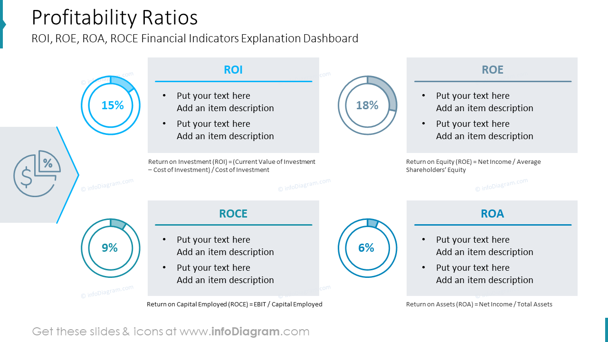

## Table of Contents

## What is ROCE?

ROCE stands for Return on Capital Employed. It is a financial ratio that helps to understand how well a company is using its money to make profits. Imagine you lend money to a friend to start a business. ROCE tells you how much profit your friend makes from the money you gave them. It is calculated by dividing the company's earnings before interest and taxes (EBIT) by the capital employed. Capital employed is the total amount of money the company uses to run its business, including things like buildings, machines, and money borrowed.

ROCE is important because it shows how efficiently a company is using its resources. If a company has a high ROCE, it means it is good at turning the money it uses into profits. This can be attractive to investors because it suggests the company is a good place to invest money. On the other hand, a low ROCE might mean the company is not using its money well, and investors might want to look elsewhere. By comparing the ROCE of different companies, investors can decide which ones are likely to give them the best return on their investment.

## What is ROA?

ROA stands for Return on Assets. It's a way to see how good a company is at making money from the things it owns, like buildings, machines, and money in the bank. You find ROA by dividing the company's profit by the total value of its assets. If a company makes a lot of profit compared to what it owns, it has a high ROA. This means the company is using its stuff well to make money.

ROA is important because it helps people who might want to invest in the company. If a company has a high ROA, it shows that it's good at turning its assets into profit. This can make the company look like a good choice for investors. On the other hand, a low ROA might mean the company isn't using its assets well, and investors might want to look at other companies instead. By comparing the ROA of different companies, investors can decide which ones are likely to give them the best return on their investment.

## How is ROCE calculated?

ROCE, or Return on Capital Employed, is a way to see how well a company is using its money to make profits. To calculate ROCE, you take the company's earnings before interest and taxes (EBIT) and divide it by the capital employed. EBIT is the money the company makes before it pays interest on any loans and before it pays taxes. Capital employed is the total amount of money the company uses to run its business, including things like buildings, machines, and money borrowed.

For example, if a company has an EBIT of $100,000 and its capital employed is $500,000, you would calculate ROCE like this: ROCE = EBIT / Capital Employed = $100,000 / $500,000 = 0.20 or 20%. This means the company makes a 20% return on the money it uses to run its business. A higher ROCE percentage shows that the company is good at turning the money it uses into profits, which can be attractive to investors.

## How is ROA calculated?

ROA, or Return on Assets, is a way to see how well a company is using its stuff to make money. To find ROA, you take the company's profit and divide it by the total value of its assets. Assets are things like buildings, machines, and money in the bank. For example, if a company makes a profit of $50,000 and its assets are worth $250,000, you would calculate ROA like this: ROA = Profit / Assets = $50,000 / $250,000 = 0.20 or 20%. This means the company makes a 20% return on its assets.

ROA is important because it helps people decide if a company is a good place to invest their money. If a company has a high ROA, it means it's good at using its assets to make profits. This can make the company look attractive to investors. On the other hand, a low ROA might mean the company isn't using its assets well, and investors might want to look at other companies instead. By comparing the ROA of different companies, investors can decide which ones are likely to give them the best return on their investment.

## What do ROCE and ROA measure?

ROCE, or Return on Capital Employed, measures how well a company is using its money to make profits. It tells you how much profit a company makes from the money it uses to run its business. This includes things like buildings, machines, and borrowed money. If a company has a high ROCE, it means it's good at turning the money it uses into profits. Investors like to see a high ROCE because it shows that the company is using its money well, which can make the company a good place to invest.

ROA, or Return on Assets, measures how well a company is using its stuff to make money. It shows how much profit a company makes compared to the total value of its assets, like buildings, machines, and money in the bank. A high ROA means the company is good at using its assets to make profits. This can make the company look attractive to investors because it suggests the company is efficient at turning its assets into money. On the other hand, a low ROA might mean the company isn't using its assets well, and investors might want to look elsewhere.

## Why are ROCE and ROA important for investors?

ROCE and ROA are important for investors because they help them see how well a company is using its money and stuff to make profits. ROCE shows how much profit a company makes from the money it uses to run its business. If a company has a high ROCE, it means it's good at turning the money it uses into profits. Investors like to see a high ROCE because it shows that the company is using its money well, which can make the company a good place to invest.

ROA is also important because it tells investors how much profit a company makes compared to the total value of its assets. A high ROA means the company is good at using its stuff, like buildings and machines, to make money. This can make the company look attractive to investors because it suggests the company is efficient at turning its assets into profits. By looking at both ROCE and ROA, investors can get a better idea of how well a company is doing and decide if it's a good place to put their money.

## How do ROCE and ROA differ in their focus?

ROCE, or Return on Capital Employed, focuses on how well a company uses the money it has to make profits. It looks at all the money the company uses to run its business, including buildings, machines, and borrowed money. If a company has a high ROCE, it means it's good at turning the money it uses into more money. This helps investors see if the company is using its money well and if it might be a good place to invest.

ROA, or Return on Assets, focuses on how well a company uses its stuff to make money. It looks at the profit the company makes compared to the total value of its assets, like buildings, machines, and money in the bank. A high ROA means the company is good at using its stuff to make profits. This helps investors see if the company is efficient at turning its assets into money. So, while ROCE looks at how well the company uses its money, ROA looks at how well it uses its stuff.

## Can ROCE and ROA be used together to assess a company's performance?

Yes, ROCE and ROA can be used together to get a better picture of a company's performance. ROCE, or Return on Capital Employed, tells you how well a company is using its money to make profits. It looks at all the money the company uses, including things like buildings, machines, and borrowed money. If a company has a high ROCE, it means it's good at turning the money it uses into more money. This can help investors see if the company is using its money well.

ROA, or Return on Assets, shows how well a company is using its stuff to make money. It compares the profit the company makes to the total value of its assets, like buildings, machines, and money in the bank. A high ROA means the company is good at using its stuff to make profits. By looking at both ROCE and ROA, investors can get a fuller understanding of how well a company is doing. They can see if the company is efficient at using both its money and its stuff to make profits, helping them decide if it's a good place to invest.

## What are the limitations of using ROCE?

ROCE, or Return on Capital Employed, can be a helpful way to see how well a company is using its money to make profits. But it has some limits. One problem is that ROCE can be different depending on how a company decides to measure its capital. Some companies might include things like goodwill in their capital, while others might not. This can make it hard to compare ROCE between different companies. Also, ROCE can be affected by how a company uses debt. If a company borrows a lot of money, it might look like it has a high ROCE because the money it uses to make profits is lower. But this might not show the whole picture because the company still has to pay back the debt.

Another limit of ROCE is that it doesn't tell you about the quality of the profits. A company might have a high ROCE, but if those profits come from selling off assets or from one-time events, it might not be a good sign for the future. ROCE also doesn't consider the size of the company. A small company might have a high ROCE just because it's small and growing fast, but this might not last as it gets bigger. So, while ROCE can be useful, it's important to look at other things too, like how the company makes its money and how it's growing over time.

## What are the limitations of using ROA?

ROA, or Return on Assets, can help you see how well a company uses its stuff to make money. But it has some problems. One big problem is that ROA can be different depending on how a company decides to value its assets. Some companies might use old values for their buildings and machines, while others might use new values. This can make it hard to compare ROA between different companies. Also, ROA can be affected by how a company uses debt. If a company borrows a lot of money to buy assets, it might look like it has a high ROA because the value of its assets goes up. But this might not show the whole picture because the company still has to pay back the debt.

Another problem with ROA is that it doesn't tell you about the quality of the profits. A company might have a high ROA, but if those profits come from selling off assets or from one-time events, it might not be a good sign for the future. ROA also doesn't consider the size of the company. A small company might have a high ROA just because it's small and growing fast, but this might not last as it gets bigger. So, while ROA can be useful, it's important to look at other things too, like how the company makes its money and how it's growing over time.

## How do industry standards affect the interpretation of ROCE and ROA?

Industry standards play a big role in how we understand ROCE and ROA. Different industries have different ways of making money and using their stuff. For example, a tech company might have a high ROCE because it doesn't need a lot of buildings and machines to make profits. But a factory might have a lower ROCE because it needs a lot of big machines and buildings to make things. So, when we look at ROCE, we need to compare it to what's normal for that industry. If a company's ROCE is higher than the industry average, it might be doing a better job at using its money to make profits.

The same thing goes for ROA. Some industries, like retail, might have a lot of stuff like stores and inventory, which can make their ROA look lower. But a software company might have fewer physical assets and a higher ROA. So, when we look at ROA, we need to see how it stacks up against other companies in the same industry. If a company's ROA is higher than the industry average, it might be using its stuff better to make money. By comparing ROCE and ROA to industry standards, we can get a better idea of how well a company is doing compared to its competitors.

## What advanced techniques can be used to analyze trends in ROCE and ROA over time?

To analyze trends in ROCE and ROA over time, one advanced technique is to use time series analysis. This means looking at the ROCE and ROA numbers for a company over many years and seeing if there are patterns or changes. You can use charts and graphs to see if the numbers are going up, down, or staying the same. This helps you understand if the company is getting better or worse at using its money and stuff to make profits. By comparing these trends to what's happening in the industry, you can see if the company is doing better or worse than its competitors over time.

Another technique is to use regression analysis. This is a bit more complicated, but it helps you see how different things might be affecting ROCE and ROA. For example, you might want to know if changes in the economy or in the company's sales are making the ROCE and ROA go up or down. Regression analysis can help you find these connections. By understanding these links, you can predict how ROCE and ROA might change in the future based on what's happening now. This can be really helpful for making smart investment decisions.

## What are ROA and ROCE and how can they be understood?

Return on Assets (ROA) and Return on Capital Employed (ROCE) are two fundamental financial metrics used to evaluate a company's efficiency and profitability. These metrics are crucial for investors and analysts who seek to make informed decisions about company potential and financial health.

ROA is calculated by dividing a company's net income by its total assets. This metric assesses how effectively a company can convert its assets into net earnings, serving as a measure of management effectiveness in utilizing the company's asset base. The formula for ROA is as follows:

$$
\text{ROA} = \frac{\text{Net Income}}{\text{Total Assets}}
$$

A higher ROA indicates more efficient use of assets and superior management performance. This metric is particularly relevant for asset-intensive industries where the efficient use of capital assets needs consistent monitoring.

ROCE, on the other hand, measures a company's profitability relative to its total capital employed, including debt and equity. This metric provides insight into how well a company generates shareholder and debt holder value. The ROCE formula can be expressed as:

$$
\text{ROCE} = \frac{\text{Earnings Before Interest and Tax (EBIT)}}{\text{Capital Employed}}
$$

Where capital employed is calculated as the total assets minus current liabilities, or equivalently, the sum of shareholders' equity and long-term debt. ROCE is a valuable measure of long-term profitability and efficiency and is especially useful when assessing companies that utilize significant amounts of capital for operations.

While both ROA and ROCE provide critical insights, their focus varies. ROA concentrates specifically on asset efficiency, providing a lens through which to view profitability from asset utilization. Conversely, ROCE encompasses a broader perspective by evaluating overall capital efficiency, including the effective use of debt and equity. By comparing ROA and ROCE, investors can gain a more comprehensive understanding of a company's operational efficiency and financial health, informing strategic decision-making around investments.

Inconsistencies between ROA and ROCE may signal differing levels of debt usage or capital structuring, thus guiding investors on risk and return expectations. These metrics, when analyzed together, form part of a robust framework for assessing corporate performance and sustainable growth potential.

## What are the differences and similarities between ROA and ROCE?

Return on Assets (ROA) and Return on Capital Employed (ROCE) are pivotal financial metrics that offer distinct perspectives on a company's efficiency and profitability. Both metrics are instrumental in evaluating financial performance, yet they serve different purposes and applications.

ROA is a measure of how efficiently a company can convert its assets into net income. It is calculated using the formula:

$$
\text{ROA} = \frac{\text{Net Income}}{\text{Total Assets}}
$$

This equation indicates the percentage of profit generated from a company's total assets. ROA is particularly advantageous for asset-heavy industries, such as manufacturing or utilities, where the effective utilization of assets can significantly impact profitability. Investors often use ROA to assess a company's capability of generating returns relative to its asset base, making it a vital tool in evaluating the operational efficiency of firms with substantial physical assets.

On the other hand, ROCE provides a broader analysis by evaluating how effectively a company generates profits from its total capital, which comprises both equity and debt. The formula for ROCE is:

$$
\text{ROCE} = \frac{\text{Earnings Before Interest and Tax (EBIT)}}{\text{Capital Employed}}
$$

Capital Employed typically includes total assets minus current liabilities, reflecting both equity and long-term debt. ROCE offers an encompassing viewpoint on capital efficiency, accounting for all financial resources used to generate profits. It is invaluable in assessing companies that utilize a mix of equity and debt financing, providing insights into how well management uses the capital at its disposal to generate earnings. Investors can better understand a company's financial leverage and capital allocation effectiveness through ROCE.

The variances between ROA and ROCE arise from their differing focuses—asset efficiency versus total capital efficiency. These differences are crucial when tailoring analyses to specific company profiles or industry standards. For example, an investor interested in a capital-intensive industry might prioritize ROCE to understand how well a company uses its comprehensive capital resources, while an investor in an asset-heavy sector could focus more on ROA to gauge performance relative to asset utilization.

In summary, ROA and ROCE are complementary metrics that collectively provide a holistic view of company performance, allowing investors and analysts to discern efficiency variances based on either asset concentration or capital structure. Combining these metrics with broader financial analyses can lead to more informed investment decisions.

## How can Strategic Investment Decisions be made Using ROA and ROCE?

Return on Assets (ROA) and Return on Capital Employed (ROCE) are critical financial metrics extensively used by investors to make informed strategic investment decisions. These metrics provide insights into a company's ability to efficiently generate profits from its asset base and capital structure, guiding investors in identifying potential investment opportunities.

ROA is defined as the net income of a company divided by its total assets, expressed as a percentage:

$$
\text{ROA} = \left( \frac{\text{Net Income}}{\text{Total Assets}} \right) \times 100
$$

This metric focuses on how effectively a company is using its assets to produce earnings, making it particularly useful for assessing asset-heavy businesses, such as manufacturing firms and utilities. High ROA values can indicate efficient asset utilization, which is crucial for determining long-term sustainable growth.

ROCE, on the other hand, provides a broader perspective by evaluating how well a company utilizes all of its capital, including both equity and debt. It is expressed as follows:

$$
\text{ROCE} = \left( \frac{\text{Earnings Before Interest and Tax (EBIT)}}{\text{Capital Employed}} \right) \times 100
$$

Where capital employed is the sum of shareholders' equity and debt liabilities. ROCE highlights the returns generated on the capital involved in the business operations, thus offering an inclusive view of corporate profitability and efficiency. This metric is particularly valuable for comparing companies in capital-intensive industries where borrowing plays a significant role in funding operations.

The strategic use of ROA and ROCE can guide investors in selecting investments that promise sustainable returns. By analyzing these metrics, investors can compare companies within the same industry or sector, identifying those that leverage their assets and capital more effectively than their peers. However, it's crucial for investors to consider industry-specific benchmarks, as capital requirements and operational dynamics can vary widely between sectors.

The emergence of [algorithmic trading](/wiki/algorithmic-trading) has further enhanced the decision-making accuracy for investors by integrating these financial metrics with real-time data and other advanced analytics. Algorithmic models can be developed to automate the evaluation process, allowing investors to respond swiftly to market conditions and refine their investment strategies based on up-to-date information.

Investors should also be mindful of economic cycles, assessing how companies perform under varying macroeconomic conditions. This holistic approach ensures a more nuanced view of a company's enduring financial health and its resilience amidst economic fluctuations.

In conclusion, while ROA and ROCE are powerful tools in an investor's arsenal, these metrics are most effective when used alongside other financial indicators and qualitative factors. This comprehensive analysis enables strategic investment decisions that are both data-driven and aligned with long-term financial goals.

## What are the implications for investors and businesses?

Return on Assets (ROA) and Return on Capital Employed (ROCE) are pivotal metrics that equip investors and businesses with nuanced insights into a company’s operational efficiency and financial architecture. These ratios serve as essential tools in evaluating how well a company utilizes its resources to generate profits, thereby influencing investment decisions and corporate strategies.

**Investor Insights and Decision-Making:**

For investors, ROA and ROCE offer discrete perspectives into a company's functioning. ROA, represented mathematically as:

$$
\text{ROA} = \frac{\text{Net Income}}{\text{Total Assets}}
$$

provides a direct measure of how effectively a company is able to generate earnings from its assets. This metric is particularly pertinent for asset-heavy industries, such as manufacturing or utilities, where efficient asset use is critical for profitability.

Conversely, ROCE, calculated as:

$$
\text{ROCE} = \frac{\text{Earnings Before Interest and Tax (EBIT)}}{\text{Capital Employed}}
$$

where Capital Employed is the sum of Shareholder's Equity and Debt, offers a broader view by considering both equity and debt. It speaks to a company's ability to earn returns on all the capital at its disposal and is useful in industries where leveraging debt is a significant aspect of the business model.

**Strategic Planning and Corporate Benefits:**

For businesses, ROA and ROCE are invaluable in shaping strategic planning, capital allocation, and performance optimization. These metrics guide decisions about where to allocate resources to maximize returns. A company with high ROA might consider expanding its asset base to generate further profits, while a company with strong ROCE might be effectively balancing its debt to equity, ensuring strategic growth with an optimal capital mix.

Employing ROA and ROCE in tandem allows businesses to adopt a holistic view of their financial health. For instance, a robust ROA but lower ROCE might suggest efficient asset use but suboptimal capital structuring. This insight could lead to strategic adjustments in capital sourcing or asset management.

**Holistic Financial Analysis:**

While ROA and ROCE provide quantitative insights, they should be employed alongside other analyses for a comprehensive understanding. Investors and businesses should integrate these metrics with qualitative factors such as market trends, economic conditions, and industry benchmarks. By doing so, they ensure a more balanced evaluation framework, accommodating the dynamic nature of financial landscapes.

Incorporating such multidimensional analysis supports well-informed investment and strategic decisions, ensuring that both investors and organizations are positioned to optimize returns while mitigating risks in an evolving market environment.

## References & Further Reading

[1]: ["Advances in Financial Machine Learning"](https://www.amazon.com/Advances-Financial-Machine-Learning-Marcos/dp/1119482089) by Marcos Lopez de Prado

[2]: ["Evidence-Based Technical Analysis: Applying the Scientific Method and Statistical Inference to Trading Signals"](https://www.amazon.com/Evidence-Based-Technical-Analysis-Scientific-Statistical/dp/0470008741) by David Aronson

[3]: ["Machine Learning for Algorithmic Trading"](https://github.com/stefan-jansen/machine-learning-for-trading) by Stefan Jansen

[4]: ["Quantitative Trading: How to Build Your Own Algorithmic Trading Business"](https://www.amazon.com/Quantitative-Trading-Build-Algorithmic-Business/dp/1119800064) by Ernest P. Chan

[5]: Bodie, Z., Kane, A., & Marcus, A. J. (2014). "Investments" (10th ed.). McGraw-Hill Education. 

[6]: Damodaran, A. (2001). ["Corporate Finance: Theory and Practice"](https://archive.org/details/corporatefinance0000damo_v8d8) (2nd ed.). Wiley. 

[7]: Pardo, R. (2008). ["The Evaluation and Optimization of Trading Strategies"](https://onlinelibrary.wiley.com/doi/book/10.1002/9781119196969) (2nd ed.). Wiley.

[8]: Gitman, L. J., Juchau, R., & Flanagan, J. (2015). "Principles of Managerial Finance." Pearson Higher Education. 

[9]: Fabozzi, F. J., & Markowitz, H. M. (2011). "The Theory and Practice of Investment Management." Wiley.