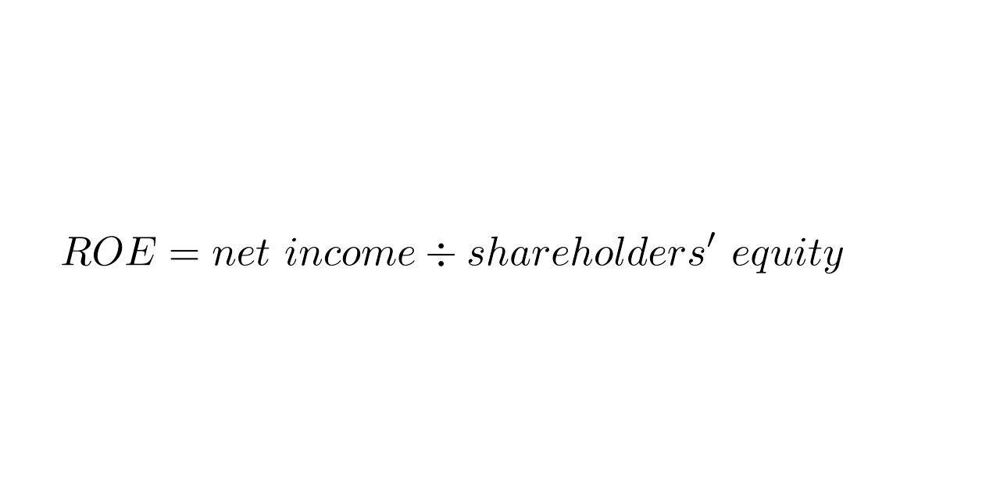

In the world of finance and investment, professionals frequently utilize financial ratios to assess a company's performance and profitability. Among these, Return on Equity (ROE) and Return on Capital Employed (ROCE) stand out as two critical metrics, offering insightful perspectives into a company's operational efficiency. ROE evaluates how well a company generates profits from its shareholders' equity, while ROCE assesses the overall effectiveness with which a company employs its capital, including both debt and equity.

Understanding these metrics is crucial for making informed investment decisions, particularly in the domain of algorithmic trading. Both ROE and ROCE are employed to develop trading strategies that capitalize on a company's financial health and growth potential. By analyzing these ratios, algorithms can identify patterns and opportunities, thereby optimizing trading decisions for enhanced returns.



The key to successfully leveraging ROE and ROCE lies in their application within financial analysis. Investors and analysts equipped with an understanding of these metrics can better evaluate the financial stability and efficiency of companies. This knowledge enables them to optimize trading strategies and improve the quality of investment decisions, ensuring a comprehensive analysis of a company's financial performance.

## Table of Contents

## Understanding ROE

Return on Equity (ROE) is a key financial metric that measures a company's ability to generate profit from its shareholders' equity. This ratio is expressed as a percentage and illustrates how effectively a company is using the capital invested by its shareholders to generate earnings. Mathematically, ROE is calculated using the following formula:

$$
\text{ROE} = \frac{\text{Net Income}}{\text{Shareholders' Equity}}
$$

Here, net income refers to the profit a company makes after deducting all expenses, taxes, and costs from its total revenue. Shareholders' equity, on the other hand, represents the residual interest in the assets of the company after deducting liabilities. A high ROE suggests that a company is efficiently using its equity base to produce profits, which can be a positive signal for investors looking for strong investment opportunities.

Investors often regard a high ROE as indicative of a company's financial health, as it reflects the firm's capability to turn equity investments into profit. This efficiency in generating earnings can make a company attractive to potential investors who seek enterprises with effective management and strong fundamentals.

However, it's crucial to understand that a high ROE is not inherently indicative of a well-performing company. One must consider the company's debt levels when evaluating ROE. High leverage, or significant borrowing, can artificially inflate ROE. This is because while debt does not directly affect shareholders' equity, it can increase net income through leveraged investments, thus boosting ROE figures. 

For instance, a company might take on substantial debt to finance new projects, leading to increased earnings without altering the equity base. This can result in a higher ROE, yet the underlying financial risk associated with increased leverage could pose potential threats to long-term stability. Therefore, when assessing ROE, it is imperative to analyze the debt-to-equity ratio to get a complete picture of the financial structure and risk profile of a company. 

Furthermore, comparing ROE across companies in the same industry is more insightful than across different sectors, as capital structures and industry-specific factors can vary significantly. Understanding these nuances helps investors discern whether a high ROE truly reflects operational efficiency or merely the effects of financial leverage.

## Understanding ROCE

Return on Capital Employed (ROCE) is a financial metric used to evaluate a company's profitability and the efficiency with which it utilizes its capital. It is a key indicator for assessing how well a company is generating profits from its total capital, which includes both equity and debt. The ROCE formula is defined as follows:

$$
\text{ROCE} = \frac{\text{EBIT}}{\text{Capital Employed}}
$$

where EBIT stands for Earnings Before Interest and Taxes, and Capital Employed is calculated as Total Assets minus Current Liabilities.

ROCE is particularly beneficial in assessing companies within capital-intensive industries, such as manufacturing, telecommunications, and utilities. These sectors typically require substantial investments in physical assets and infrastructure, making ROCE an invaluable tool for gauging long-term profitability.

In evaluating ROCE, a higher value suggests more efficient use of capital in generating operating profits. It enables investors and analysts to determine whether a company is effectively employing its resources to produce returns above the cost of capital. This insight is critical for comparing companies within the same sector, allowing for more accurate analysis of operational performance and strategic positioning.

One significant advantage of ROCE over other profitability metrics is its ability to include both equity and debt in its calculation. This comprehensive approach provides a broader understanding of a company’s financial structure and resource allocation. Consequently, ROCE serves as an important benchmark for investors looking to identify firms that make optimal use of their capital resources.

## Key Differences Between ROE and ROCE

While both Return on Equity (ROE) and Return on Capital Employed (ROCE) offer valuable insights into a company's profitability, they differ in the financial elements they assess and the insights they provide. ROE focuses primarily on the returns achieved from shareholders' equity. It gives an indication of how effectively a company uses investors' funds to generate profits. The formula for ROE is:

$$

\text{ROE} = \frac{\text{Net Income}}{\text{Shareholders' Equity}}
$$

This metric is particularly useful when equity is the main source of financing, providing a clear picture of profitability attributable to shareholders. However, it is crucial to consider the impact of a company's debt levels because high leverage can artificially inflate ROE, posing a risk of financial instability.

On the other hand, ROCE measures a company’s profitability and the efficiency with which it employs its capital, factoring in both equity and debt. The formula for ROCE is:

$$
\text{ROCE} = \frac{\text{EBIT}}{\text{Capital Employed}}
$$

"Capital Employed" is usually defined as total assets minus current liabilities. ROCE is particularly instrumental for evaluating companies in capital-intensive industries, such as manufacturing or utilities, where significant levels of debt are often utilized. By considering total capital, including debt, ROCE provides a more comprehensive view of a company’s financial structure and its ability to generate returns across its entire capital base.

When comparing ROE and ROCE, a key consideration is how each metric can signal financial health and risk. A company exhibiting a high ROE but a low ROCE might suggest that the company is heavily reliant on debt financing, which can be a potential financial risk. This discrepancy highlights an excessive leverage situation, where the cost of debt may not be sufficiently compensated by the earnings, thereby obscuring the actual operational efficiency.

In summary, while ROE is optimal for assessing companies where equity is the primary mode of financing, ROCE is best suited for companies with significant capital investments and debt. It offers a broader assessment of resource utilization and profitability, serving as a more holistic financial metric.

## ROE and ROCE in Algo Trading

In [algorithmic trading](/wiki/algorithmic-trading), Return on Equity (ROE) and Return on Capital Employed (ROCE) are key financial metrics that enhance the ability of trading algorithms to evaluate the financial health of companies. These metrics provide quantitative insights into a company's operational efficiency and profitability, playing a vital role in developing robust algorithmic trading strategies.

Algorithms employ ROE and ROCE to filter stocks based on efficiency and profitability criteria. The ROE metric is utilized to assess how well a company generates profit relative to shareholders' equity. This involves calculating the ROE using the formula: 
$$
\text{ROE} = \frac{\text{Net Income}}{\text{Shareholders' Equity}}
$$
A high ROE indicates effective use of equity capital, which is particularly important for selecting stocks in sectors where equity financing is prominent. 

On the other hand, ROCE provides a broader view as it encompasses both equity and debt, making it especially useful for capital-intensive industries. It is calculated using:
$$
\text{ROCE} = \frac{\text{EBIT}}{\text{Capital Employed}}
$$
where EBIT represents Earnings Before Interest and Taxes. ROCE helps in identifying companies that effectively utilize their overall capital, encompassing both equity and debt.

Analyzing trends in these ratios allows algorithms to detect patterns and market opportunities. For example, a consistently improving ROCE might indicate a company’s growing operational efficiency, making it a potential candidate for investment. Simultaneously monitoring ROE can help confirm that increased profits are not solely due to high leverage but are an outcome of efficient equity use.

By incorporating ROE and ROCE into algo trading strategies, traders can enhance decision-making processes and potentially improve returns. Algorithms can swiftly compare these metrics across companies and sectors, identifying those that meet specified financial health criteria. Integrating such metrics enables a more thorough risk assessment by differentiating between companies with healthy financial structures and those over-relying on debt.

In practice, an example algorithm in Python could look like this:

```python
def filter_stocks_by_metrics(stocks, min_roe, min_roce):
    """
    Filter stocks based on minimum ROE and ROCE values.

    :param stocks: List of stock data, each a dictionary with ROE and ROCE values
    :param min_roe: Minimum required Return on Equity
    :param min_roce: Minimum required Return on Capital Employed
    :return: List of stocks that meet the criteria
    """
    return [stock for stock in stocks if stock['ROE'] >= min_roe and stock['ROCE'] >= min_roce]

# Example usage with dummy data
stocks_data = [
    {'ticker': 'ABC', 'ROE': 15, 'ROCE': 18},
    {'ticker': 'DEF', 'ROE': 10, 'ROCE': 12},
    {'ticker': 'GHI', 'ROE': 20, 'ROCE': 25}
]

filtered_stocks = filter_stocks_by_metrics(stocks_data, min_roe=12, min_roce=15)
print(filtered_stocks)
```

Overall, deploying ROE and ROCE effectively in algorithmic trading strategies enables investors to make informed choices, optimizing the allocation of resources and improving potential investment outcomes.

## Practical Applications

Investors employing Return on Equity (ROE) as a metric should particularly consider companies that are equity-heavy and demonstrate consistent profit generation. This is because ROE effectively measures how well a company uses shareholders' equity to generate profits. Companies with stable profit streams and low debt levels often exhibit sustainable ROE figures, making them attractive to investors seeking companies that provide a dependable return on their equity investments. 

Conversely, Return on Capital Employed (ROCE) is most beneficial when analyzing companies with significant debt on their balance sheet. ROCE considers both equity and debt in its calculation, providing a comprehensive analysis of how efficiently a company utilizes its capital. For businesses operating in capital-intensive sectors, where substantial investments in assets and infrastructure are common, ROCE offers a clearer picture of resource utilization. It answers how effectively a company is generating profits from its total capital base, which includes both debt and equity.

For portfolio managers, both ROE and ROCE are crucial tools in the quest to invest in high-efficiency companies. Portfolio managers can employ these metrics to assess and compare companies against industry averages, enabling a competitive evaluation of potential investments. Such comparisons can reveal how well a company is performing relative to its peers, providing insights into operational efficiency and profitability. 

The use of industry benchmarks is vital in this context, as it allows investors to distinguish companies that are outperforming or underperforming relative to industry standards. This comparative analysis aids in identifying not only strong performers but also potential investment risks. By leveraging these financial ratios, investors and portfolio managers can craft a diversified portfolio that maximizes returns while managing risk effectively.

## Conclusion

Both Return on Equity (ROE) and Return on Capital Employed (ROCE) are crucial for understanding a company's financial performance. While each metric provides distinct insights—ROE into the efficiency of equity deployment and ROCE into the effectiveness of total capital utilization—using them together offers a more complete picture of a company’s operational success. 

Investors and algorithmic traders should integrate these ratios into a broader set of financial tools to enhance their decision-making processes. By understanding and applying ROE and ROCE, individuals can assess profitability and efficiency more effectively, helping to identify investment opportunities and optimize trading strategies. These metrics are invaluable for evaluating the potential for growth in value and sustainability of profits, allowing for more informed and strategic financial evaluations. 

Ultimately, ROE and ROCE serve as indispensable benchmarks for gauging a company's capacity to generate returns and for making comparative and competitive assessments within and across industries. Understanding these ratios supports better financial management and investment strategy development, contributing to enhanced trading outcomes and informed investment choices.

## References & Further Reading

[1]: Penman, S. H. (2010). ["Financial Statement Analysis and Security Valuation"](https://archive.org/details/financialstateme0000penm_r9u4). McGraw-Hill Education.

[2]: Damodaran, A. (2012). ["Investment Valuation: Tools and Techniques for Determining the Value of Any Asset, 3rd Edition"](https://books.google.com/books/about/Investment_Valuation.html?id=5SRHAAAAQBAJ). Wiley.

[3]: ["Principles of Corporate Finance"](https://www.fincart.com/blog/corporate-finance-importance-types-principles/) by Richard A. Brealey, Stewart C. Myers, and Franklin Allen

[4]: ["Financial Intelligence for Entrepreneurs: What You Really Need to Know About the Numbers"](https://www.amazon.com/Financial-Intelligence-Entrepreneurs-Really-Numbers/dp/1422119157) by Karen Berman and Joe Knight

[5]: ["The Intelligent Investor: The Definitive Book on Value Investing"](https://www.amazon.com/Intelligent-Investor-Third-Definitive-Investing/dp/0063423537) by Benjamin Graham