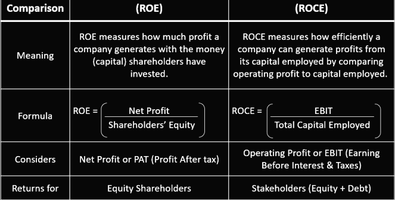

## Table of Contents

## What is Return on Equity (ROE)?

Return on Equity (ROE) is a financial ratio that shows how well a company is using the money invested by its shareholders to generate profit. It is calculated by dividing the company's net income by the shareholders' equity. In simple terms, ROE tells you how much profit a company makes with the money shareholders have put into it.

ROE is important because it helps investors see how efficiently a company is turning their investment into profit. A higher ROE means the company is doing a better job of using the money to grow and make profits. For example, if a company has an ROE of 15%, it means for every dollar of shareholders' equity, the company is making 15 cents in profit. This can be useful for comparing different companies to see which one is a better investment.

## What is Return on Capital Employed (ROCE)?

Return on Capital Employed (ROCE) is a financial measure that shows how well a company is using all the money it has to make profits. This money, or capital, includes everything from shareholders' investments to loans the company has taken. ROCE is calculated by dividing the company's earnings before interest and taxes (EBIT) by the total capital employed. In simple terms, it tells you how much profit a company is making for every dollar of capital it uses.

ROCE is important because it helps investors and managers see how efficiently a company is using its total resources to generate profit. A higher ROCE means the company is doing a good job at turning its capital into earnings. For example, if a company has an ROCE of 20%, it means for every dollar of capital employed, the company is making 20 cents in profit. This can be useful for comparing the performance of different companies or tracking a company's performance over time.

## How is ROE calculated?

Return on Equity (ROE) is a way to see how well a company uses the money that shareholders have put into it. To calculate ROE, you take the company's net income, which is the profit after all expenses and taxes, and divide it by the shareholders' equity. Shareholders' equity is what's left over when you subtract all the company's debts from its total assets. So, the formula for ROE is: ROE = Net Income / Shareholders' Equity.

ROE gives you a percentage that shows how much profit the company makes for each dollar of shareholders' money. For example, if a company has a net income of $10 million and shareholders' equity of $50 million, the ROE would be 20%. This means the company makes 20 cents of profit for every dollar that shareholders have invested. It's a useful number for investors because it helps them see if the company is good at using their money to make more money.

## How is ROCE calculated?

Return on Capital Employed (ROCE) is a way to see how well a company uses all its money to make profits. This money, called capital, includes everything like money from shareholders and loans the company has taken. To find ROCE, you take the company's earnings before interest and taxes (EBIT), which is the profit before paying interest and taxes, and divide it by the total capital employed. The formula for ROCE is: ROCE = EBIT / Capital Employed.

ROCE tells you how much profit the company makes for every dollar of capital it uses. For example, if a company has an EBIT of $8 million and its total capital employed is $40 million, the ROCE would be 20%. This means the company makes 20 cents of profit for every dollar of capital it uses. ROCE is important for investors and managers because it shows how efficiently the company is using all its resources to make money.

## Why are ROE and ROCE important financial metrics?

ROE and ROCE are important financial metrics because they help investors and managers understand how well a company is using its money to make profits. ROE looks at how much profit a company makes from the money that shareholders have invested. It tells you if the company is good at turning the shareholders' money into more money. A high ROE means the company is doing a great job at using the shareholders' investment to grow and make profits. This can help investors decide if a company is a good place to put their money.

ROCE, on the other hand, looks at how well a company uses all its money, including money from shareholders and loans, to make profits. It shows how efficient the company is at using all its resources to generate earnings. A high ROCE means the company is doing well at turning all its capital into profits. This is useful for comparing different companies or tracking how a company's performance changes over time. Both ROE and ROCE are key numbers that help people see if a company is using its money wisely to make more money.

## What do ROE and ROCE tell us about a company's performance?

ROE, or Return on Equity, tells us how good a company is at using the money that shareholders have put into it to make profits. It's like looking at how much profit the company makes for every dollar that shareholders have invested. If a company has a high ROE, it means it's doing a great job at turning the shareholders' money into more money. This can be really helpful for investors because it shows if the company is a good place to put their money. For example, if a company has an ROE of 15%, it means for every dollar of shareholders' money, the company makes 15 cents in profit.

ROCE, or Return on Capital Employed, tells us how well a company is using all its money, including money from shareholders and loans, to make profits. It shows how efficient the company is at using all its resources to make money. A high ROCE means the company is doing well at turning all its capital into profits. This is useful for comparing different companies or seeing how a company's performance changes over time. For example, if a company has an ROCE of 20%, it means for every dollar of capital it uses, the company makes 20 cents in profit. Both ROE and ROCE help us see if a company is using its money wisely to make more money.

## How do ROE and ROCE differ in what they measure?

ROE, or Return on Equity, measures how well a company uses the money that shareholders have put into it to make profits. It looks at the net income, which is the profit after all expenses and taxes, and divides it by the shareholders' equity. This tells us how much profit the company makes for every dollar of shareholders' money. A high ROE means the company is doing a good job at turning the shareholders' investment into more money. It's a useful number for investors because it helps them see if the company is a good place to put their money.

ROCE, or Return on Capital Employed, measures how well a company uses all its money to make profits. This includes not just the money from shareholders, but also loans the company has taken. ROCE looks at the earnings before interest and taxes (EBIT) and divides it by the total capital employed. This tells us how much profit the company makes for every dollar of capital it uses. A high ROCE means the company is efficient at turning all its resources into profits. It's useful for comparing different companies or tracking a company's performance over time.

## Can ROE and ROCE be used to compare companies in different industries?

ROE and ROCE can be used to compare companies in different industries, but it's important to keep in mind that different industries have different ways of making money and using their resources. For example, a tech company might have a different ROE and ROCE compared to a manufacturing company because they use their money in different ways. So, when comparing companies from different industries, it's helpful to think about these differences and maybe compare them to other companies in the same industry to get a better idea of how they're doing.

Still, ROE and ROCE can give you a general idea of how well a company is doing at making profits from the money it uses. If you see that one company has a much higher ROE or ROCE than another, it might mean that company is better at using its money to make profits, even if they're in different industries. But to really understand the numbers, it's good to look at other things too, like how the industry is doing overall and other financial numbers, to get the full picture.

## What are the limitations of using ROE as a performance metric?

ROE, or Return on Equity, can be a helpful way to see how well a company is using the money from shareholders to make profits. But it has some limitations that you should know about. One big problem is that ROE doesn't show the whole picture of a company's financial health. For example, a company might have a high ROE because it's taking on a lot of debt. If the company uses that debt to make more money, the ROE goes up, but it might also be riskier because the company has to pay back the debt.

Another limitation of ROE is that it can be different across industries. What's a good ROE in one industry might not be good in another. For instance, tech companies might have higher ROEs than utility companies because they use their money in different ways. So, if you're comparing companies from different industries just by looking at their ROE, you might not get a fair comparison. It's better to compare companies within the same industry to get a clearer idea of how they're doing.

Lastly, ROE can be affected by one-time events or accounting choices. A company might have a high ROE one year because it sold a big asset or changed how it counts its money. These things can make the ROE look better or worse than it really is. So, it's important to look at ROE over several years and with other financial numbers to understand a company's true performance.

## What are the limitations of using ROCE as a performance metric?

ROCE, or Return on Capital Employed, can be a good way to see how well a company uses all its money to make profits. But it has some limits. One big problem is that ROCE might not show the whole picture of a company's financial health. A company might have a high ROCE because it's using a lot of debt. If it uses that debt to make more money, the ROCE goes up, but it also becomes riskier because the company has to pay back the debt. So, a high ROCE doesn't always mean a company is doing well.

Another limit of ROCE is that it can be different across industries. What's a good ROCE in one industry might not be good in another. For example, manufacturing companies might have different ROCEs than service companies because they use their money in different ways. So, if you're comparing companies from different industries just by looking at their ROCE, you might not get a fair comparison. It's better to compare companies within the same industry to get a clearer idea of how they're doing.

Lastly, ROCE can be affected by one-time events or how a company does its accounting. A company might have a high ROCE one year because it sold a big asset or changed how it counts its money. These things can make the ROCE look better or worse than it really is. So, it's important to look at ROCE over several years and with other financial numbers to understand a company's true performance.

## How can a company improve its ROE and ROCE?

A company can improve its ROE by making more profit or using less of the shareholders' money. One way to do this is by increasing sales and cutting costs, which will boost the net income. For example, a company might start selling more products or find cheaper ways to make them. Another way is to use the shareholders' money more wisely. This could mean paying off debts or buying back shares, which reduces the amount of shareholders' equity and can make the ROE go up. It's like making more with less, and it shows investors that the company is good at using their money to make profits.

To improve ROCE, a company needs to make more profit from all the money it uses, including money from shareholders and loans. One way to do this is by increasing the earnings before interest and taxes (EBIT). This can be done by growing sales, cutting costs, or finding new ways to make money. Another way is by using less capital. A company might sell off assets it doesn't need or pay down its debts, which lowers the total capital employed. By making more money with less capital, the company can show it's using its resources efficiently and attract more investors.

## In what scenarios would ROE be more relevant than ROCE, and vice versa?

ROE is more relevant when you want to know how well a company is using the money that shareholders have put into it. This is important for shareholders because they want to see if their investment is being used to make profits. For example, if you're an investor looking at where to put your money, ROE can help you see which companies are good at turning your investment into more money. It's also useful when comparing companies within the same industry, especially if those companies have different levels of debt. ROE focuses just on the shareholders' money, so it's a good way to see how the company is doing from the shareholders' point of view.

ROCE is more relevant when you want to see how well a company is using all its money, not just the shareholders' money. This includes money from loans, which is important for understanding the overall efficiency of the company. For example, if you're a manager or an analyst looking at how the company is using all its resources, ROCE can show you if the company is good at turning all its money into profits. It's also useful when comparing companies across different industries because it looks at the total capital employed. ROCE gives a broader view of the company's performance, which can be helpful for making big decisions about how to use the company's money.

## What is ROE and how can it be understood?

Return on Equity (ROE) is a key financial metric that measures a company's ability to generate profit from its shareholders' equity. This ratio is expressed as a percentage and illustrates how effectively a company is using the capital invested by its shareholders to generate earnings. Mathematically, ROE is calculated using the following formula:

$$
\text{ROE} = \frac{\text{Net Income}}{\text{Shareholders' Equity}}
$$

Here, net income refers to the profit a company makes after deducting all expenses, taxes, and costs from its total revenue. Shareholders' equity, on the other hand, represents the residual interest in the assets of the company after deducting liabilities. A high ROE suggests that a company is efficiently using its equity base to produce profits, which can be a positive signal for investors looking for strong investment opportunities.

Investors often regard a high ROE as indicative of a company's financial health, as it reflects the firm's capability to turn equity investments into profit. This efficiency in generating earnings can make a company attractive to potential investors who seek enterprises with effective management and strong fundamentals.

However, it's crucial to understand that a high ROE is not inherently indicative of a well-performing company. One must consider the company's debt levels when evaluating ROE. High leverage, or significant borrowing, can artificially inflate ROE. This is because while debt does not directly affect shareholders' equity, it can increase net income through leveraged investments, thus boosting ROE figures. 

For instance, a company might take on substantial debt to finance new projects, leading to increased earnings without altering the equity base. This can result in a higher ROE, yet the underlying financial risk associated with increased leverage could pose potential threats to long-term stability. Therefore, when assessing ROE, it is imperative to analyze the debt-to-equity ratio to get a complete picture of the financial structure and risk profile of a company. 

Furthermore, comparing ROE across companies in the same industry is more insightful than across different sectors, as capital structures and industry-specific factors can vary significantly. Understanding these nuances helps investors discern whether a high ROE truly reflects operational efficiency or merely the effects of financial leverage.

## What is ROCE and how can it be understood?

Return on Capital Employed (ROCE) is a financial metric used to evaluate a company's profitability and the efficiency with which it utilizes its capital. It is a key indicator for assessing how well a company is generating profits from its total capital, which includes both equity and debt. The ROCE formula is defined as follows:

$$
\text{ROCE} = \frac{\text{EBIT}}{\text{Capital Employed}}
$$

where EBIT stands for Earnings Before Interest and Taxes, and Capital Employed is calculated as Total Assets minus Current Liabilities.

ROCE is particularly beneficial in assessing companies within capital-intensive industries, such as manufacturing, telecommunications, and utilities. These sectors typically require substantial investments in physical assets and infrastructure, making ROCE an invaluable tool for gauging long-term profitability.

In evaluating ROCE, a higher value suggests more efficient use of capital in generating operating profits. It enables investors and analysts to determine whether a company is effectively employing its resources to produce returns above the cost of capital. This insight is critical for comparing companies within the same sector, allowing for more accurate analysis of operational performance and strategic positioning.

One significant advantage of ROCE over other profitability metrics is its ability to include both equity and debt in its calculation. This comprehensive approach provides a broader understanding of a company’s financial structure and resource allocation. Consequently, ROCE serves as an important benchmark for investors looking to identify firms that make optimal use of their capital resources.

## What are the key differences between ROE and ROCE?

While both Return on Equity (ROE) and Return on Capital Employed (ROCE) offer valuable insights into a company's profitability, they differ in the financial elements they assess and the insights they provide. ROE focuses primarily on the returns achieved from shareholders' equity. It gives an indication of how effectively a company uses investors' funds to generate profits. The formula for ROE is:

$$

\text{ROE} = \frac{\text{Net Income}}{\text{Shareholders' Equity}}
$$

This metric is particularly useful when equity is the main source of financing, providing a clear picture of profitability attributable to shareholders. However, it is crucial to consider the impact of a company's debt levels because high leverage can artificially inflate ROE, posing a risk of financial instability.

On the other hand, ROCE measures a company’s profitability and the efficiency with which it employs its capital, factoring in both equity and debt. The formula for ROCE is:

$$
\text{ROCE} = \frac{\text{EBIT}}{\text{Capital Employed}}
$$

"Capital Employed" is usually defined as total assets minus current liabilities. ROCE is particularly instrumental for evaluating companies in capital-intensive industries, such as manufacturing or utilities, where significant levels of debt are often utilized. By considering total capital, including debt, ROCE provides a more comprehensive view of a company’s financial structure and its ability to generate returns across its entire capital base.

When comparing ROE and ROCE, a key consideration is how each metric can signal financial health and risk. A company exhibiting a high ROE but a low ROCE might suggest that the company is heavily reliant on debt financing, which can be a potential financial risk. This discrepancy highlights an excessive leverage situation, where the cost of debt may not be sufficiently compensated by the earnings, thereby obscuring the actual operational efficiency.

In summary, while ROE is optimal for assessing companies where equity is the primary mode of financing, ROCE is best suited for companies with significant capital investments and debt. It offers a broader assessment of resource utilization and profitability, serving as a more holistic financial metric.

## References & Further Reading

[1]: Penman, S. H. (2010). ["Financial Statement Analysis and Security Valuation"](https://archive.org/details/financialstateme0000penm_r9u4). McGraw-Hill Education.

[2]: Damodaran, A. (2012). ["Investment Valuation: Tools and Techniques for Determining the Value of Any Asset, 3rd Edition"](https://books.google.com/books/about/Investment_Valuation.html?id=5SRHAAAAQBAJ). Wiley.

[3]: ["Principles of Corporate Finance"](https://www.fincart.com/blog/corporate-finance-importance-types-principles/) by Richard A. Brealey, Stewart C. Myers, and Franklin Allen

[4]: ["Financial Intelligence for Entrepreneurs: What You Really Need to Know About the Numbers"](https://www.amazon.com/Financial-Intelligence-Entrepreneurs-Really-Numbers/dp/1422119157) by Karen Berman and Joe Knight

[5]: ["The Intelligent Investor: The Definitive Book on Value Investing"](https://www.amazon.com/Intelligent-Investor-Third-Definitive-Investing/dp/0063423537) by Benjamin Graham