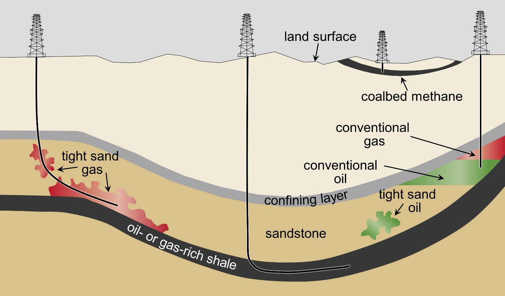

This article examines the distinct characteristics and economic implications of shale oil compared to conventional oil, highlighting their respective roles within the global energy landscape. Shale oil has risen to prominence primarily due to advancements in hydraulic fracturing technology, also known as fracking. This method has significantly altered the dynamics of oil production, allowing previously inaccessible reserves to be tapped. As a result, the understanding of these differences in oil types is crucial for investors, ensuring informed and strategic decision-making in the commodities market.

The integration of technology, especially algorithmic trading, has transformed the way commodities like oil are traded on global markets. Algorithmic trading utilizes sophisticated algorithms to analyze vast amounts of data swiftly, predicting market trends and allowing traders to respond rapidly to market shifts. This technological advancement provides traders with opportunities to leverage fluctuations in the volatile oil market.

The extraction methods for shale and conventional oil not only carry economic consequences but also pose various environmental challenges. Shale oil extraction methods, particularly fracking, have been scrutinized for potential environmental impacts such as water contamination and induced seismic activities. Conversely, conventional oil drilling, although also associated with environmental risks, typically benefits from more established regulatory frameworks.

This article aims to equip readers with an in-depth understanding of these complex interactions between different oil types and emerging trading technologies. The environmental and economic challenges presented by each extraction method are also considered, providing a comprehensive view of the current and future oil market landscape.

## Table of Contents

## Understanding Shale Oil and Conventional Oil

Shale oil and conventional oil represent two primary categories of oil extraction methods, distinguished by their geological formations and extraction technologies. Shale oil is categorized as unconventional oil due to its entrapment in fine-grained sedimentary rock formations known as shale. The extraction of shale oil utilizes hydraulic fracturing, commonly known as fracking. This method involves injecting high-pressure fluid into the shale rock to create fractures, allowing the oil to be released and ultimately recovered. Hydraulic fracturing has become a cornerstone of shale oil production, enabling the extraction from reservoirs previously deemed non-viable with conventional methods.

In contrast, conventional oil is found in more accessible large pockets within porous rock formations, facilitating its extraction through traditional drilling methods. Conventional oil wells can directly access these reservoirs, allowing oil to flow freely to the surface. This ease of extraction translates to lower production costs compared to shale oil. In oil-rich regions such as the Middle East, the cost of conventional oil production is significantly lower, often as low as $10 per barrel, due to favorable geological conditions and established infrastructure.

The higher production costs of shale oil can be attributed to the complexity and intensity of the fracking process. The method requires substantial investment in technology and equipment, as well as considerations for environmental and regulatory compliance. Additionally, shale oil wells tend to have shorter production lifespans, necessitating continual drilling activities to maintain output levels. This contrasts with many conventional oil wells, which can produce for several decades with minimal additional investment.

Despite its higher costs, shale oil production's technological advancements have reshaped the global oil landscape, particularly in countries like the United States. These advancements have enabled previously untapped resources to be brought to market, increasing overall supply and influencing global oil prices. Furthermore, the development of shale oil has enhanced energy independence for such countries.

In summary, the key differences between shale oil and conventional oil lie in their extraction methods, geological formations, and associated production costs. While conventional oil benefits from lower production costs in geologically favorable regions, shale oil has garnered attention for its potential to unlock vast, previously inaccessible reserves through technological innovation.

## Economic Impacts of Shale and Conventional Oil

Shale oil has significantly altered the landscape of global energy markets, particularly for the United States. Thanks to advancements in hydraulic fracturing and horizontal drilling, the U.S. has transitioned from a major oil importer to a significant exporter. This transformation has contributed to increased energy independence and has had profound implications for global oil supply chains.

In terms of price dynamics, shale oil differs from conventional oil primarily due to its production costs. The extraction of shale oil involves complex and expensive processes, with break-even prices often higher than those for conventional oil. As a result, shale oil producers are more sensitive to price fluctuations in the oil market. When prices drop below the break-even point—estimated to be between $40 to $60 per barrel for many shale operations—producers may choose to halt production to avoid losses. This makes shale oil production highly elastic and responsive to market prices, contributing to greater price [volatility](/wiki/volatility-trading-strategies). 

Conversely, conventional oil producers, particularly those in regions with low extraction costs like the Middle East, can sustain operations even when market prices are low. With production costs potentially as low as $10 per barrel, these producers have the advantage of maintaining supply and profitability through price downturns, exerting more control over global pricing and supply. This capacity to maintain production creates a competitive landscape where conventional oil can often undercut shale oil, influencing market dynamics and price stability.

For investors, understanding these variables is crucial to assessing risk and potential returns in the oil market. The volatility resulting from the interplay of shale and conventional oil production necessitates a strategic approach to investment. Investors must consider factors such as market trends, geopolitical events, and technological advancements influencing production costs and capabilities. By analyzing these elements, investors can better anticipate shifts in supply and demand, optimize portfolio management, and pursue advantageous positions in both the short and long term. 

In conclusion, the divergent economic impacts of shale and conventional oil underscore the need for a nuanced understanding of the oil market. These insights are not only essential for energy policy but also critical for investors seeking to navigate a complex and ever-evolving financial landscape.

## The Role of Algorithmic Trading in Oil Markets

Algorithmic trading has fundamentally transformed the oil markets by enabling transactions with unprecedented speed and precision. By leveraging algorithms, traders are able to process large volumes of data quickly, thereby making informed decisions based on real-time market conditions, current events, and fluctuations in supply and demand. This high-frequency trading method allows traders to exploit market inefficiencies and capitalize on price discrepancies, which can be particularly beneficial given the intrinsic volatility of the oil market.

At the core of [algorithmic trading](/wiki/algorithmic-trading) is the ability to analyze vast datasets to forecast price movements effectively. Algorithms utilize historical data, statistical models, and [machine learning](/wiki/machine-learning) techniques to identify patterns and predict future price trends. This predictive capability empowers traders to optimize their strategies and enhance their profit margins. For instance, an algorithm might consider variables such as geopolitical developments, changes in production levels, and inventory data to assess potential price shifts.

Moreover, algorithmic trading offers traders the advantage of speed—a critical element in commodity markets like oil where prices can change rapidly. By automating the trading process, the time from identifying a trading opportunity to executing a trade is reduced to milliseconds, allowing traders to respond almost instantaneously to market changes. This speed not only improves the efficiency of trades but also reduces the risks associated with human error.

However, this technology also introduces a layer of complexity that requires traders and investors to keep pace with both technological advancements and market knowledge. The development of sophisticated trading algorithms demands a deep understanding of programming, financial markets, and quantitative analysis. Furthermore, the competitive nature of algorithmic trading means that traders must continuously refine their algorithms to maintain an advantage.

As algorithmic trading continues to evolve, it poses both opportunities and challenges for participants in the oil markets. Those who are able to harness the power of technology and adapt to its complexities are likely to gain a significant competitive edge in trading commodities like oil.

## Environmental Considerations

Fracking, or hydraulic fracturing, is a crucial technique for extracting shale oil but has prompted several environmental concerns. This process involves injecting high-pressure fluid mixtures into shale formations to release oil. One significant issue is water contamination, as the chemicals used in fracking fluids can seep into groundwater supplies. A 2016 U.S. Environmental Protection Agency (EPA) report highlighted instances of drinking water contamination near fracking sites, though the report concluded that the occurrences were not widespread or systemic (EPA, 2016).

Additionally, fracking has been associated with seismic activities. Studies have shown that the injection of wastewater from fracking into deep wells can induce earthquakes. According to a 2015 study published in the journal "Science," the increase in seismic activity in parts of the U.S. correlates with wastewater disposal practices (Ellsworth, 2013).

In contrast, conventional oil drilling poses different environmental risks. These include oil spills, which can have devastating effects on marine and terrestrial ecosystems. However, regulations surrounding conventional oil extraction are often more robust, with comprehensive frameworks designed over decades to mitigate environmental damage. Established practices, such as using blowout preventers and conducting routine inspections, aim to reduce incidents like the infamous Deepwater Horizon spill in 2010.

As the oil industry seeks to maintain its role in the energy sector, sustainable practices and technologies are gaining prominence. Innovations such as advanced water recycling methods for fracking and the adoption of cleaner extraction technologies are being explored. Companies are increasingly investing in technologies that mitigate environmental risks, recognizing the importance of long-term environmental sustainability.

Balancing economic interests with environmental responsibility is vital for ensuring the oil industry's future. This dual focus not only addresses the growing demand for sustainable practices but also aligns with public and regulatory expectations. Developing environmentally responsible methods can help secure the industry's social license to operate, ensuring continued economic contribution while minimizing ecological impacts. Therefore, the future of oil extraction heavily depends on reconciling production needs with environmental preservation.

## The Future of Oil and Trading Technologies

As the global focus on renewable energy intensifies, the oil industry faces increasing pressure to innovate in order to remain relevant and profitable. The advancement of algorithmic trading plays a pivotal role in this evolving landscape, providing financial analysts and traders with increasingly sophisticated tools. These tools enable rapid data analysis and execution of trades, leveraging vast datasets that encompass geopolitical events, market trends, and supply-demand dynamics. Such capabilities enhance decision-making processes and offer competitive advantages in predicting market movements.

Algorithmic trading's evolution is set to introduce even more refined techniques, potentially employing [artificial intelligence](/wiki/ai-artificial-intelligence) (AI) and machine learning to bolster predictive accuracy. For instance, machine learning algorithms can be trained to identify patterns from historical data, allowing traders to develop models that anticipate future price fluctuations. This integration of advanced technology signifies a transformative shift, underscoring the necessity for investors to remain agile and informed about these innovations to optimize their strategies.

In parallel, technological advancements in shale oil extraction promise to improve operational efficiencies and reduce production costs. Techniques such as enhanced oil recovery through CO2 injection and horizontal drilling are expected to evolve, maximizing output and addressing some of the environmental concerns associated with shale oil extraction. Despite these technological improvements, geopolitical factors remain influential. Oil markets are sensitive to political stability, trade policies, and international relations, which can impact oil supply and prices globally.

Consequently, investors and companies must be adept at navigating both technological advancements and geopolitical uncertainties. Strategic investment in technology and diversification of energy portfolios will be crucial for adapting to shifting energy paradigms. Stakeholders must weigh the benefits of maintaining oil investment against exploring opportunities in renewable energy sectors, often employing risk assessment models to balance these interests.

Ultimately, the future of oil and trading technologies demands a forward-thinking approach. Embracing technological innovations while considering the broader geopolitical and economic context will be essential for sustaining relevance in this dynamic market.

## Conclusion

Shale oil's economic impact is considerable, primarily due to its role in reshaping the energy landscape and turning regions like the United States into prominent energy exporters. Despite this, shale oil production generally incurs higher costs due to the complex extraction techniques such as hydraulic fracturing. These higher costs juxtapose the relatively cheaper production of conventional oil, particularly in regions like the Middle East, where production can be as low as $10 per barrel.

For investors engaged in algorithmic trading, comprehending the distinctions between shale and conventional oil is essential. Shale oil's sensitivity to market prices necessitates an intricate analysis to predict production halts when prices decline below break-even points. Algorithmic trading leverages data to navigate such complexities, offering competitive advantages by predicting market fluctuations through advanced analysis of supply, demand, and geopolitical events.

The future trajectory of the oil industry is set to be influenced heavily by evolving environmental policies and technological advancements. As global pressures towards renewable energy intensify, the oil sector must innovate continually to maintain relevance and profitability. Investments in sustainable practices not only mitigate environmental concerns, such as those associated with fracking and conventional drilling, but also ensure alignment with regulatory standards, promoting long-term industry viability.

To thrive amid industry shifts, stakeholders must proactively adapt their strategies, which involves staying informed about technological developments and regulatory changes. Strategic investments in resource management and embracing new technologies will be pivotal in navigating the future energy landscape effectively. This adaptive approach will enable investors and companies to align with both economic and environmental priorities, positioning themselves advantageously for the evolving dynamics of global energy markets.

## References & Further Reading

[1]: Ellsworth, W. L. (2013). "Injection-Induced Earthquakes." Science, 341(6142), 1225942. DOI: 10.1126/science.1225942

[2]: U.S. Environmental Protection Agency (EPA). (2016). "Hydraulic Fracturing for Oil and Gas: Impacts from the Hydraulic Fracturing Water Cycle on Drinking Water Resources in the United States." [EPA Report](https://www.epa.gov/sites/production/files/2016-12/documents/hfdwa_executive_summary.pdf)

[3]: ["Advances in Financial Machine Learning"](https://www.amazon.com/Advances-Financial-Machine-Learning-Marcos/dp/1119482089) by Marcos Lopez de Prado

[4]: ["Quantitative Trading: How to Build Your Own Algorithmic Trading Business"](https://www.amazon.com/Quantitative-Trading-Build-Algorithmic-Business/dp/1119800064) by Ernest P. Chan

[5]: ["Advances in Shale Oil Production and Forecasting"](https://www.sciencedirect.com/science/article/pii/S030626192201861X) by Wang, J., & Krupnick, A., Society of Petroleum Engineers (SPE) Conference Paper.