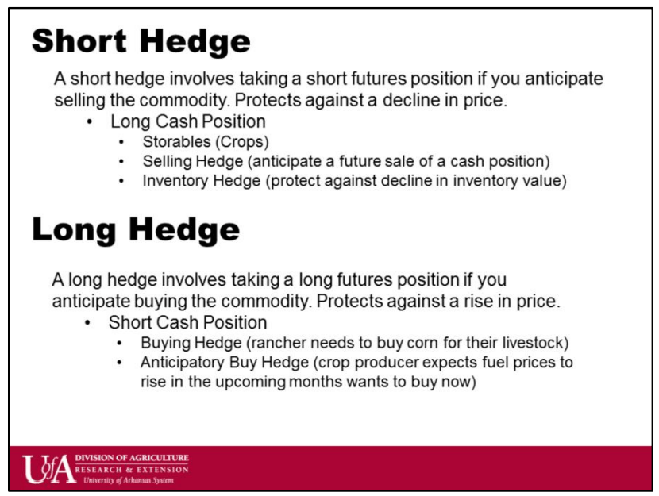

## Table of Contents

## What is a hedge in financial terms?

A hedge in financial terms is like a safety net for investors. It's a strategy used to reduce the risk of losing money on an investment. Imagine you're worried that the value of your stock might go down. To hedge, you might buy another investment that will go up in value if your stock goes down. This way, any losses you might have on your stock could be offset by gains in the other investment.

Hedging is common in many areas of finance, like stocks, commodities, and currencies. For example, a farmer might use hedging to protect against falling crop prices. They could do this by selling futures contracts, which lock in a price for their crops in advance. If the market price drops later, the farmer is still protected because they get the higher price they locked in. Hedging doesn't always prevent losses, but it can make them less severe and give investors more peace of mind.

## What is the difference between a short hedge and a long hedge?

A short hedge is used by someone who wants to protect themselves from falling prices. Imagine you own something, like a bunch of wheat, and you're worried that the price of wheat might go down before you can sell it. To protect yourself, you can use a short hedge. You do this by selling a futures contract for wheat at today's price. If the price of wheat does drop, you'll lose money on the wheat you own, but you'll make money on the futures contract because you sold it at a higher price. This way, the losses on your wheat are balanced out by gains on the futures contract.

A long hedge, on the other hand, is used by someone who wants to protect themselves from rising prices. Let's say you need to buy something, like oil, in the future, but you're worried that the price of oil might go up before you can buy it. To protect yourself, you can use a long hedge. You do this by buying a futures contract for oil at today's price. If the price of oil does rise, you'll have to pay more for the oil you need, but you'll make money on the futures contract because you bought it at a lower price. This way, the extra cost of the oil is balanced out by gains on the futures contract.

## How does a short hedge work to mitigate risk?

A short hedge helps people who own something and are worried that its price might go down. Imagine you have a lot of corn and you plan to sell it later, but you're afraid the price of corn might drop. To protect yourself, you can use a short hedge by selling a futures contract for corn at today's price. If the price of corn does fall, you'll lose money on the corn you own because you'll have to sell it for less. But, you'll make money on the futures contract because you sold it at a higher price than the market price when you need to settle the contract.

This way, the money you lose on your corn is made up for by the money you gain from the futures contract. It's like having insurance against falling prices. A short hedge doesn't always make you break even, but it can make your losses smaller. By using a short hedge, you can feel more secure knowing that even if the price of your corn goes down, you have a way to offset those losses.

## How does a long hedge function to protect against price increases?

A long hedge helps people who need to buy something in the future but are worried that its price might go up. Imagine you run a bakery and you need to buy flour in a few months. You're afraid the price of flour might rise, which would make your costs go up. To protect yourself, you can use a long hedge by buying a futures contract for flour at today's price. If the price of flour does increase, you'll have to pay more for the flour you need to buy. But, you'll make money on the futures contract because you bought it at a lower price than the market price when you need to settle the contract.

This way, the extra money you have to spend on flour is made up for by the money you gain from the futures contract. It's like having insurance against rising prices. A long hedge doesn't always make you break even, but it can make the extra costs smaller. By using a long hedge, you can feel more secure knowing that even if the price of flour goes up, you have a way to offset those extra costs.

## What are the typical scenarios where a short hedge would be used?

A short hedge is often used by people who own things and want to protect themselves if prices drop. For example, imagine you're a farmer who grows wheat. You plan to sell your wheat in a few months, but you're worried the price of wheat might go down by then. To protect yourself, you can sell a futures contract for wheat at today's price. If the price of wheat does fall, you'll lose money on your wheat because you'll have to sell it for less. But you'll make money on the futures contract because you sold it at a higher price. This way, the money you lose on your wheat can be made up by the money you gain from the futures contract.

Another common scenario is in the oil industry. Oil companies often have a lot of oil they plan to sell later. If they think the price of oil might drop, they can use a short hedge to protect themselves. They do this by selling oil futures contracts at the current price. If the price of oil does go down, they'll lose money on the oil they own, but they'll make money on the futures contract they sold at a higher price. This helps them balance out their losses and gives them more peace of mind about future price changes.

## In what situations would a long hedge be more appropriate?

A long hedge is often used by people who need to buy something in the future and want to protect themselves if prices go up. Imagine you run an airline and you need to buy jet fuel in six months. You're worried that the price of jet fuel might increase by then. To protect yourself, you can buy a futures contract for jet fuel at today's price. If the price of jet fuel does rise, you'll have to pay more for the jet fuel you need to buy. But you'll make money on the futures contract because you bought it at a lower price. This way, the extra money you have to spend on jet fuel can be made up by the money you gain from the futures contract.

Another common situation where a long hedge is useful is for businesses that need to buy raw materials. For example, a chocolate maker needs to buy cocoa in the future. If they think the price of cocoa might go up, they can use a long hedge to protect themselves. They do this by buying cocoa futures contracts at the current price. If the price of cocoa does increase, they'll have to pay more for the cocoa they need, but they'll make money on the futures contract they bought at a lower price. This helps them balance out their costs and gives them more peace of mind about future price changes.

## What are the potential costs associated with implementing a short hedge?

When you use a short hedge, you might have to pay some costs. One cost is the transaction fee you pay to buy or sell the futures contract. This fee goes to the broker who helps you with the trade. Another cost can be the margin you need to put up. When you sell a futures contract, you have to keep some money in your account as a deposit. This is called the margin, and it's there to make sure you can cover any losses if the price goes against you.

There's also the risk that the hedge might not work perfectly. If the price of what you're hedging doesn't move the way you expect, you could end up losing money on both your original investment and the futures contract. This is called basis risk. It happens because the price of the futures contract might not move exactly the same way as the price of what you're trying to protect. So, even though a short hedge can help you manage risk, it's not a guarantee, and it comes with its own set of costs and risks.

## What are the financial implications of setting up a long hedge?

Setting up a long hedge can help you manage the risk of prices going up, but it also comes with some costs. One cost is the fee you pay to buy the futures contract. This is called a transaction fee, and it goes to the broker who helps you with the trade. Another cost is the margin you need to put up. When you buy a futures contract, you have to keep some money in your account as a deposit. This is called the margin, and it's there to make sure you can cover any losses if the price moves against you.

There's also a risk that the hedge might not work perfectly. This is called basis risk. It happens because the price of the futures contract might not move exactly the same way as the price of what you're trying to protect. If the price of what you're hedging doesn't go up as much as you thought, you could end up losing money on the futures contract while still having to pay more for what you need to buy. So, while a long hedge can help you manage the risk of rising prices, it's not a perfect solution and comes with its own set of costs and risks.

## How do short and long hedges impact the financial statements of a company?

When a company uses a short hedge, it's trying to protect itself from falling prices. Let's say a company owns a lot of wheat and is worried the price will drop before it can sell. They might sell a futures contract for wheat at today's price. If the price of wheat does go down, they'll lose money on the wheat they own, but they'll make money on the futures contract. This can help them balance out their losses. On the financial statements, the gains or losses from the futures contract will show up as unrealized gains or losses until the contract is settled. Once settled, these gains or losses become realized and will affect the company's net income. The use of a short hedge might also show up in the notes to the financial statements, explaining the company's risk management strategy.

On the other hand, a long hedge is used when a company needs to buy something in the future and is worried about prices going up. For example, an airline might need to buy jet fuel in six months and is concerned about rising prices. They could buy a futures contract for jet fuel at today's price. If the price of jet fuel does go up, they'll have to pay more for the fuel, but they'll make money on the futures contract. This can help them balance out their costs. The gains or losses from the futures contract will also show up as unrealized gains or losses on the financial statements until the contract is settled. Once settled, these become realized and will impact the company's net income. The long hedge strategy might also be explained in the notes to the financial statements, showing how the company is managing its risk of rising prices.

## What are the advanced strategies for optimizing short and long hedges?

To optimize a short hedge, companies can use something called a "stack and roll" strategy. This means they sell futures contracts that are due at different times, like a stack of pancakes. As each contract comes close to expiring, they "roll" it over by selling a new contract for a later date. This helps them keep their hedge going without having to settle all their contracts at once. Another way to optimize a short hedge is by using options. Instead of just selling futures, they can buy put options, which give them the right to sell at a certain price. This can be less risky because they don't have to sell if the price goes up, but it costs more because they have to pay for the option.

For a long hedge, companies can also use a "stack and roll" strategy. They buy futures contracts that expire at different times, and as each one gets close to expiring, they buy a new one for a later date. This keeps their hedge in place over a long period. Another advanced strategy is using call options. Instead of just buying futures, they can buy call options, which give them the right to buy at a certain price. This can be less risky because they don't have to buy if the price goes down, but it costs more because they have to pay for the option. Both of these strategies help companies manage their risk better and can be more flexible than just using futures contracts alone.

## How can the effectiveness of short and long hedges be measured and compared?

To measure the effectiveness of short and long hedges, you can look at how well they reduce risk. For a short hedge, you compare the price you get for your product with the price you locked in with the futures contract. If the market price drops, but the futures contract helps you make up for that loss, then your hedge was effective. You can use something called the "hedge ratio" to see how much of your risk you've covered. The hedge ratio is the value of the futures contract divided by the value of what you're trying to protect. A good short hedge will have a hedge ratio close to 1, meaning it covers most of your risk.

For a long hedge, you look at how much extra you have to pay for what you need to buy and how much you make from the futures contract. If the price goes up, but the futures contract helps you make up for that extra cost, then your hedge was effective. You can also use the hedge ratio here to see how well you've covered your risk. A good long hedge will also have a hedge ratio close to 1. To compare the effectiveness of short and long hedges, you can look at how much they reduce your risk and how close their hedge ratios are to 1. The one that does a better job at reducing risk and has a hedge ratio closer to 1 is more effective.

## What are the regulatory considerations and compliance issues related to short and long hedges?

When companies use short and long hedges, they need to follow rules set by financial regulators. These rules are there to make sure that companies are being honest and fair when they use futures and options to manage their risk. For example, in the United States, the Commodity Futures Trading Commission (CFTC) and the Securities and Exchange Commission (SEC) have rules about how companies can use these financial tools. Companies need to report their hedging activities and make sure they are not using hedges to hide other financial problems. If they don't follow these rules, they could get in trouble and face fines or other penalties.

Compliance issues can come up if a company does not keep good records of its hedging activities or if it uses hedges in a way that is not allowed. For example, if a company uses a hedge to manipulate the market or to hide losses, that would be against the rules. Companies also need to make sure they have enough money to cover their margin requirements for futures contracts. If they don't, they could be forced to close their positions, which could lead to big losses. Keeping up with these regulations can be hard, but it's important for companies to stay compliant to avoid legal problems and to keep their financial statements accurate and trustworthy.

## What is a Short Hedge: Definition and Example?

A short hedge is an essential risk management strategy that involves taking a short position to protect against anticipated declines in the price of an asset. This approach is commonly employed by producers who seek to secure a favorable sale price for commodities scheduled for future production. By locking in a current price, businesses can shield themselves from potential market downturns, ensuring stability and predictability in financial planning.

A pertinent example of a short hedge can be seen in the oil industry. Consider an oil company that anticipates selling a substantial quantity of [crude oil](/wiki/crude-oil) in six months. To mitigate the risk of falling oil prices, the company can enter into a futures contract to sell oil at a predetermined price at a specified future date. By doing so, the company secures its revenue regardless of market fluctuations. 

In this context, the futures contract acts as a derivative instrument, facilitating the execution of the short hedge. Derivatives are financial securities that derive their value from an underlying asset, and they play a critical role in hedging strategies by allowing businesses to offset potential losses. In the case of a short hedge with a futures contract, the oil company benefits if the market price decreases, as it will still sell at the higher, locked-in price. However, if the market price rises, the company might miss out on higher revenues, illustrating a potential drawback of this strategy.

The mathematics behind a short hedge can be simplified as follows:

$$
\text{Net Revenue} = \text{Revenue from Futures} + (\text{Spot Price} - \text{Futures Price}) \times \text{Quantity}
$$

This formula highlights that the ultimate goal of a short hedge is to stabilize revenue, irrespective of price changes in the market. By utilizing derivative contracts effectively, businesses secure a predictable income stream, protecting against adverse market conditions.

In summary, short hedging is a vital tool for businesses aiming to mitigate financial risks associated with declining asset prices. By strategically employing derivative contracts, producers can lock in future sales prices, ensuring financial stability and maintaining competitive advantages in volatile markets.

## References & Further Reading

[1]: Hull, J. C. (2017). ["Options, Futures, and Other Derivatives"](https://www.pearson.com/en-us/subject-catalog/p/options-futures-and-other-derivatives/P200000005938/9780136939917). Pearson.

[2]: Black, F., & Scholes, M. (1973). ["The Pricing of Options and Corporate Liabilities."](https://www.cs.princeton.edu/courses/archive/fall09/cos323/papers/black_scholes73.pdf) Journal of Political Economy, 81(3), 637-654.

[3]: Lopez de Prado, M. (2018). ["Advances in Financial Machine Learning."](https://www.amazon.com/Advances-Financial-Machine-Learning-Marcos/dp/1119482089) Wiley.

[4]: Aronson, D. R. (2007). ["Evidence-Based Technical Analysis: Applying the Scientific Method and Statistical Inference to Trading Signals."](https://www.amazon.com/Evidence-Based-Technical-Analysis-Scientific-Statistical/dp/0470008741) Wiley.

[5]: Chan, E. (2009). ["Quantitative Trading: How to Build Your Own Algorithmic Trading Business."](https://github.com/ftvision/quant_trading_echan_book) Wiley.