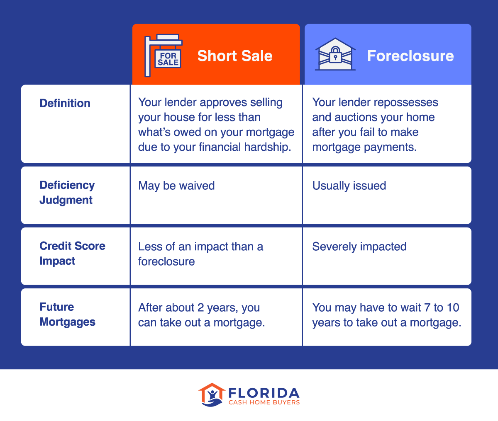

## Table of Contents

## What is a short sale?

A short sale is when someone sells a stock they don't own. They borrow the stock from someone else, sell it, and hope the price goes down. If it does, they can buy it back cheaper later and return it to the person they borrowed it from. This way, they make a profit from the difference.

But, it's risky. If the stock price goes up instead, they lose money. They have to buy it back at the higher price to return it. Also, there can be extra costs like fees for borrowing the stock. So, while short selling can be profitable, it's not for everyone because of the risks involved.

## What is a foreclosure?

A foreclosure happens when someone can't pay their home loan anymore. The bank, which lent the money for the house, can take the house back because the owner didn't keep up with the payments. This is a legal process that can take many months or even years. The bank will then sell the house to try to get back the money they lent.

After the bank takes the house, they usually sell it at an auction. Sometimes, the house is sold for less than what the owner still owed on the loan. If that happens, the owner might still owe money to the bank, even after losing their home. Foreclosure is a serious situation that can affect someone's credit score and make it hard for them to borrow money in the future.

## How does the process of a short sale work?

A short sale happens when someone wants to sell their house for less than they owe on their mortgage. This can happen when the house is worth less than the loan, and the owner can't keep up with the payments. The owner finds a buyer who is willing to pay less than the full amount of the loan. Then, the owner asks the bank to accept this lower amount instead of going through foreclosure. The bank might agree if they think it's better than trying to sell the house themselves after a foreclosure.

If the bank agrees, the buyer can buy the house for the lower price. The bank gets the money from the sale, but it's less than what the owner owed. Sometimes, the owner might still owe the bank the difference, called a deficiency. But often, the bank might forgive this difference, so the owner doesn't have to pay it. A short sale can be a way for the owner to avoid foreclosure, but it's a complicated process that needs the bank's approval.

## How does the process of a foreclosure work?

Foreclosure happens when someone can't pay their home loan anymore. The bank, which gave the loan, can take the house back because the owner didn't make the payments. This is a legal process that can take a long time, sometimes months or even years. The bank has to follow certain steps, like sending notices to the homeowner and giving them a chance to catch up on payments. If the owner still can't pay, the bank can move forward with taking the house.

After the bank takes the house, they usually sell it at an auction to try to get back the money they lent. The house might be sold for less than what the owner still owed on the loan. If that happens, the owner might still owe money to the bank, even after losing their home. Foreclosure can be tough on the owner because it can hurt their credit score and make it harder for them to borrow money in the future.

## What are the main differences between a short sale and a foreclosure?

A short sale happens when someone sells their house for less than they owe on their mortgage. They need the bank's permission to do this. The bank might agree if it's a better option than foreclosure. If the bank says yes, the house is sold to a buyer at a lower price, and the owner might not have to pay the rest of what they owe. A short sale can help the owner avoid foreclosure and some of the damage to their credit, but it's a complicated process that needs the bank's approval.

Foreclosure happens when someone can't pay their home loan anymore, and the bank takes the house back. This is a legal process that can take a long time. After taking the house, the bank usually sells it at an auction. The house might sell for less than what the owner owes, and the owner might still owe money to the bank even after losing their home. Foreclosure can hurt the owner's credit a lot and make it hard for them to borrow money later.

The main differences are that a short sale needs the bank's approval to sell the house for less than what's owed, while foreclosure is the bank taking the house back without the owner's consent. A short sale can be less damaging to the owner's credit than a foreclosure, but both processes involve losing the house and can affect the owner's financial future.

## What are the financial impacts of a short sale on a homeowner?

A short sale can affect a homeowner's finances in a few ways. When a homeowner does a short sale, they sell their house for less than they owe on the mortgage. This means the bank might forgive the rest of what they owe, so the homeowner doesn't have to pay it. This can help them avoid owing money after losing their home. But, a short sale can still hurt their credit score, though usually not as much as a foreclosure. A lower credit score can make it harder for them to borrow money or get a new loan in the future.

Also, a short sale might affect their taxes. If the bank forgives part of the loan, the IRS might see that as income and the homeowner might have to pay taxes on it. This is called "cancellation of debt income." But there are some rules that might help them avoid this tax, like if they were insolvent or if the debt was on their main home. It's a good idea for homeowners to talk to a tax professional to understand how a short sale could affect their taxes.

## What are the financial impacts of a foreclosure on a homeowner?

Foreclosure can have big effects on a homeowner's money. When someone's home is taken by the bank because they can't pay their loan, their credit score goes down a lot. A lower credit score makes it harder to get loans or credit cards in the future. It can also make the loans more expensive because the interest rates will be higher. The homeowner might still owe money to the bank, even after losing their home, if the house sells for less than what they owed. This is called a deficiency, and it can add to their financial problems.

Also, foreclosure can affect a homeowner's taxes. If the bank forgives part of the loan, the IRS might see that as income. This is called "cancellation of debt income," and the homeowner might have to pay taxes on it. But there are some rules that might help them avoid this tax, like if they were insolvent or if the debt was on their main home. It's a good idea for homeowners to talk to a tax professional to understand how foreclosure could affect their taxes.

## How does a short sale affect a homeowner's credit score?

A short sale can hurt a homeowner's credit score, but usually not as much as a foreclosure. When someone does a short sale, they sell their house for less than what they owe on their loan. The bank might agree to this if it's better than going through a foreclosure. Even though the homeowner might not have to pay the rest of what they owe, the short sale will still show up on their credit report. This can lower their credit score, making it harder to get loans or credit cards in the future.

The amount the credit score goes down can depend on a few things, like how good the homeowner's credit was before the short sale and how the lender reports it. Usually, a short sale can drop a credit score by around 100 to 150 points. But this is often less than the drop from a foreclosure, which can be around 200 to 300 points. So, while a short sale isn't good for credit, it's often seen as a better option than foreclosure when it comes to the effect on a homeowner's credit score.

## How does a foreclosure affect a homeowner's credit score?

A foreclosure can really hurt a homeowner's credit score. When someone can't pay their home loan and the bank takes their house, it shows up on their credit report. This can drop their credit score by around 200 to 300 points. A lower credit score makes it harder to get loans or credit cards in the future. It also means that if they do get a loan, they might have to pay more in interest because lenders see them as a bigger risk.

The foreclosure stays on the credit report for seven years. During that time, it can make it tough for the homeowner to borrow money or even rent a place to live. Some landlords check credit reports and might not want to rent to someone with a foreclosure on their record. So, a foreclosure not only affects their money right away but can also cause problems for a long time.

## What are the time frames involved in completing a short sale versus a foreclosure?

A short sale can take several months to complete. It starts when the homeowner finds a buyer and asks the bank to accept a lower amount than what is owed on the mortgage. The bank then reviews the request, which can take a few weeks to a couple of months. If the bank agrees, the sale can go forward, but if they don't, the process might start over or move toward foreclosure. Overall, a short sale can take anywhere from 2 to 6 months, depending on how quickly the bank makes a decision and how fast the buyer and seller can close the deal.

A foreclosure usually takes longer than a short sale. The process can last from a few months to over a year, depending on the state's laws and the specific situation. It starts when the homeowner misses payments, and the bank sends notices and gives them a chance to catch up. If the homeowner still can't pay, the bank moves to take the house and sell it at an auction. The whole process can take 6 months to 18 months or more. Foreclosure is a longer and more complicated process compared to a short sale.

## What are the potential benefits of choosing a short sale over a foreclosure?

Choosing a short sale over a foreclosure can have some benefits for a homeowner. One big benefit is that a short sale might hurt your credit score less than a foreclosure. A short sale can drop your credit score by about 100 to 150 points, while a foreclosure can drop it by 200 to 300 points. This means it might be easier to get loans or credit cards after a short sale. Also, with a short sale, the bank might forgive the rest of what you owe on the loan, so you don't have to pay it back. This can help you avoid owing money after losing your home.

Another benefit is that a short sale usually takes less time than a foreclosure. A short sale can take 2 to 6 months, while a foreclosure can take 6 months to over a year. This means you can move on with your life faster with a short sale. Plus, a short sale can be less stressful because you have more control over the process. You find a buyer and work with the bank to sell the house, instead of waiting for the bank to take your home and sell it at an auction. So, while both options have their downsides, a short sale can be a better choice for some people.

## What are the potential drawbacks of choosing a short sale over a foreclosure?

Choosing a short sale over a foreclosure can still have some problems. One big issue is that even though a short sale might not hurt your credit score as much as a foreclosure, it can still drop your score by about 100 to 150 points. This can make it harder to get loans or credit cards in the future. Also, a short sale can take a long time, usually 2 to 6 months. During this time, you have to keep working with the bank to get them to agree to the sale. This can be stressful and might feel like it's taking forever.

Another problem is that even if the bank forgives part of what you owe on the loan, the IRS might see that as income. This means you could have to pay taxes on it, which is called "cancellation of debt income." This can add to your money troubles. Plus, even though a short sale might be less damaging to your credit, it's not always easy to get the bank to agree to it. They might say no, and then you could end up with a foreclosure anyway. So, while a short sale can be better in some ways, it's not perfect and can still cause a lot of headaches.

## References & Further Reading

[1]: Chang, Y., Yavas, A., & Babajide Wintoki, M. (2012). ["Disconnect between mortgage delinquency and foreclosure."](https://papers.ssrn.com/sol3/papers.cfm?abstract_id=1525092) Journal of Banking & Finance, 36(1), 352-360.

[2]: ["Foreclosure Nation: Mortgaging the American Dream"](https://www.amazon.com/Foreclosure-Nation-Shari-B-Olefson/dp/1591026636) by Shari B. Olefson

[3]: ["Real Estate Investing for Dummies"](https://www.dummies.com/article/business-careers-money/personal-finance/investing/real-estate/real-estate-investing-for-dummies-cheat-sheet-207572/) by Eric Tyson and Robert S. Griswold

[4]: Gomber, P., Arndt, B., Lutat, M., & Uhle, T. (2011). ["High-Frequency Trading."](https://papers.ssrn.com/sol3/papers.cfm?abstract_id=1858626) Business & Information Systems Engineering, 3, 153-162.

[5]: ["Artificial Intelligence in Real Estate Investment Decisions"](https://ascendixtech.com/ai-real-estate-investment/) Journal of European Real Estate Research

[6]: ["The Foreclosure Survival Guide: Keep Your House or Walk Away with Money in Your Pocket"](https://archive.org/details/foreclosuresurvi0000elia) by Stephen Elias

[7]: Goodman, L. S., Ashworth, R., Landy, K., & Yin, L. (2014). ["Impediments to the Recovery in the Residential Mortgage Market."](https://www.semanticscholar.org/paper/Negative-Equity-Trumps-Unemployment-in-Predicting-Goodman-Ashworth/2224408559260aacd0b22798397417a696c4062a) Joint Center for Housing Studies of Harvard University.