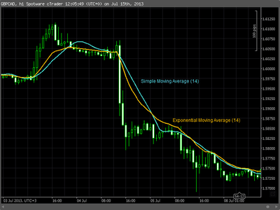

In algorithmic trading, moving averages serve as essential tools for traders to identify trends and make informed decisions. By smoothing out price data, these averages provide a clearer picture of the market's direction and are vital for both manual and automated trading strategies. This article focuses on two main types of moving averages: the exponential moving average (EMA) and the simple moving average (SMA). Understanding the differences and applications of SMAs and EMAs can significantly enhance trading strategies and outcomes.

Moving averages work by calculating the average price of a security over a specified period, updating as new data points are added. This mechanism helps in filtering out market noise and highlighting the underlying trend. SMAs calculate the average by simply dividing the sum of closing prices by the number of periods. In contrast, EMAs assign more weight to recent prices, making them more responsive to the latest market movements.



These moving averages have distinct advantages and disadvantages. SMAs offer simplicity and a clearer view of long-term trends, albeit with a lag due to their equal weighting of data points. EMAs, while more volatile and potentially prone to false signals, effectively capture short-term changes and momentum due to their higher weight on recent prices.

Integration of SMAs and EMAs into trading algorithms is common practice, assisting traders in developing robust, adaptive strategies. Techniques such as moving average crossovers enable algorithms to generate buy or sell signals, enhancing trading decisions. Selecting the appropriate moving average type and parameters is pivotal in aligning with the trader's objectives and prevailing market conditions. As financial markets evolve, moving averages will remain a cornerstone in technical analysis and algorithmic trading frameworks.

## Table of Contents

## Understanding Moving Averages

Moving averages are essential tools in the field of technical analysis, widely employed by traders to smooth out price data and provide a clearer picture of market trends. These statistical calculations enable traders to create a continuously updated average price over a specified time period, which is essential for analyzing historical price patterns and predicting future market movements.

The term "moving" is used because the average is recalculated each time a new data point is added, thereby allowing the average to "move" with the data. Two primary types of moving averages used in trading include the simple moving average (SMA) and the exponential moving average (EMA), each serving unique purposes and offering distinct advantages.

The simple moving average (SMA) is calculated by taking the sum of a specified number of a security's historical closing prices and then dividing by the number of periods. Mathematically, the SMA over $n$ days for prices $P_1, P_2, \ldots, P_n$ is expressed as:
$$
\text{SMA} = \frac{P_1 + P_2 + \cdots + P_n}{n}
$$

The exponential moving average (EMA) assigns more weight to recent prices, making it more sensitive to new data points. This characteristic allows the EMA to react more quickly to price changes compared to the SMA. The EMA is calculated using a more complex formula, including a multiplier that provides greater emphasis on recent prices. The formula for an EMA at time $t$ is:
$$
\text{EMA}_t = \left(\frac{2}{n+1}\right) \times (P_t - \text{EMA}_{t-1}) + \text{EMA}_{t-1}
$$
where $n$ is the number of defined periods, and $P_t$ is the current price.

Moving averages are instrumental in identifying the direction of a trend, as well as potential support and resistance levels in the market. Trends are characterized by the overall direction of price movements, and moving averages help highlight these trends by smoothing out short-term fluctuations and emphasizing longer-term directions. In terms of support and resistance, moving averages can serve as dynamic levels where market prices may find a barrier, leading to reversals or continuations of trends.

Incorporating moving averages into trading strategies can enhance the decision-making process, as these tools help traders discern whether a market is trending upward, downward, or experiencing a period of consolidation. They form the backbone of numerous technical indicators and trading strategies, underscoring their importance in market analysis and [algorithmic trading](/wiki/algorithmic-trading).

## Simple Moving Average (SMA)

The Simple Moving Average (SMA) is a fundamental tool in technical analysis, widely utilized to smooth out price data and highlight longer-term trends. To calculate the SMA, one takes the sum of a security's closing prices over a specified number of periods and divides it by that number of periods. Mathematically, the SMA for a period $n$ is defined as:

$$
SMA = \frac{P_1 + P_2 + \ldots + P_n}{n}
$$

where $P_i$ represents the closing price at any given point $i$.

The ease of calculation is one of the foremost advantages of SMAs, making them accessible and simple to implement. This simplification provides traders with a straightforward measure to track the average price over time, devoid of the complexities introduced by more advanced algorithms. 

However, this simplicity also leads to a fundamental drawback: the lag effect. Since SMAs assign equal importance to all data points, they can be slow to react to rapid market changes. This equal distribution means past prices can significantly influence the average, causing delays in the signal's reflection of current market conditions. Consequently, in fast-moving markets, SMAs might not provide timely signals, potentially leading traders to miss opportunistic trades or adapt too slowly to market reversals. 

Overall, while SMAs serve as a robust tool for highlighting broader trends, traders must be mindful of their limitations, particularly in volatile environments.

## Exponential Moving Average (EMA)

The Exponential Moving Average (EMA) provides a more responsive metric by placing greater emphasis on the most recent data points in a time series. Unlike the Simple Moving Average (SMA), which assigns equal weight to all observations in the period, the EMA is designed to react more swiftly to price changes, thus offering traders a tool for capturing short-term market dynamics and [momentum](/wiki/momentum).

Mathematically, the EMA for a given time period $t$ is calculated using the formula:

$$
\text{EMA}_t = \left(\frac{2}{N+1}\right) \times (\text{Price}_t - \text{EMA}_{t-1}) + \text{EMA}_{t-1}
$$

Here, $\text{Price}_t$ is the current price, $\text{EMA}_{t-1}$ is the EMA of the prior time period, and $N$ represents the number of periods in the EMA. The multiplier $\left(\frac{2}{N+1}\right)$ gives the EMA its weighting [factor](/wiki/factor-investing), ensuring more sensitivity to recent prices.

The EMA's sensitivity makes it an attractive indicator for traders who require rapid identification of emerging trends. This characteristic can be particularly advantageous in volatile markets, where quicker reactions might be necessary to gain financial advantages or mitigate losses. The ability of the EMA to provide up-to-date reflections of price changes makes it a favored choice for short-term trading strategies.

However, this feature can also be a double-edged sword. The increased weight on recent data makes the EMA more susceptible to rapid fluctuations in price, leading to potential whipsaws—short-term false signals which might mislead uninformed traders. Therefore, traders ought to combine EMA signals with other tools and analyses to decrease the likelihood of relying on misleading signals.

For illustration, consider a Python function that computes the EMA:

```python
def calculate_ema(prices, period):
    ema = [sum(prices[:period]) / period]  # Calculate initial SMA
    multiplier = 2 / (period + 1)

    for price in prices[period:]:
        new_ema = (price - ema[-1]) * multiplier + ema[-1]
        ema.append(new_ema)

    return ema
```

This function initializes the EMA calculation with a simple moving average of the initial period's prices and iteratively processes subsequent prices to automatically update the EMA. This capability mirrors the adaptive qualities of the EMA, continuously assimilating new data while providing a dynamic measure of market movement.

## Comparing SMA and EMA

While both Simple Moving Averages (SMAs) and Exponential Moving Averages (EMAs) function as tools to smooth data and reveal underlying trends, their susceptibility to price changes significantly varies. This characteristic affects their utility in different trading scenarios.

EMAs are designed to react more promptly to recent price changes compared to SMAs. This is primarily because EMAs assign exponentially increasing weights to more recent prices, thereby providing a weighted mean that prioritizes the most current data. This feature makes them particularly suitable for short-term trading strategies where capturing the most recent market movements is crucial. For instance, in a volatile market where trends are rapidly shifting, EMAs can provide timely signals for entry and [exit](/wiki/exit-strategy) points based on the latest information.

In contrast, SMAs offer a broader perspective by averaging prices over a designated number of periods, treating all prices equally. This results in a smoother curve that can effectively filter out short-term fluctuations, emphasizing the longer-term trend. While this approach can help in identifying persistent trends and reducing market noise, SMAs might lag in response to swift market changes and potentially miss out on rapid shifts in direction.

The decision to use an SMA or EMA largely hinges on the trader’s objectives and the specific market conditions. Traders aiming for a long-term perspective might favor the SMA for its ability to offer a steady view of the market's general direction. Conversely, those focusing on short-term trading might opt for the EMA due to its quicker responsiveness.

Here's a simple Python implementation to compare SMA and EMA:

```python
import pandas as pd

def simple_moving_average(prices, window):
    return prices.rolling(window=window).mean()

def exponential_moving_average(prices, span):
    return prices.ewm(span=span, adjust=False).mean()

# Example usage
data = pd.Series([22.27, 22.19, 22.08, 22.17, 22.18, 22.13, 22.23, 22.43, 22.24, 22.29, 22.15, 22.39])
window = 5
span = 5

sma = simple_moving_average(data, window)
ema = exponential_moving_average(data, span)

print("SMA:\n", sma)
print("EMA:\n", ema)
```

This code snippet illustrates the calculation of SMAs and EMAs using a sample price series with a window/span of 5 days. Analyzing these outputs further clarifies the contrasting sensitivity levels of SMAs and EMAs to recent price changes.

## Algorithmic Trading with Moving Averages

In algorithmic trading, simple moving averages (SMAs) and exponential moving averages (EMAs) are vital tools used to determine entry and exit points within trading systems. Their primary function is to smooth out price fluctuations and identify potential market trends, which are essential for formulating profitable trading strategies.

One of the most prevalent applications of moving averages in algorithmic trading is the crossover strategy. This technique involves the intersection of two or more moving averages to generate buy or sell signals. For instance, a commonly used method is the dual moving average crossover, where a short-term moving average (such as a 15-day EMA) crosses above a long-term moving average (like a 50-day SMA). This crossover can signal a buying opportunity, indicating a potential upward trend. Conversely, when the short-term moving average crosses below the long-term average, it may suggest a selling point.

The integration of moving averages into algorithmic systems offers several advantages, particularly the ability to adapt to real-time market fluctuations. By continuously recalculating and analyzing price data, trading algorithms can dynamically adjust strategies to capitalize on market movements. Python, with its extensive libraries like NumPy and pandas, is frequently used to implement such moving average strategies due to its computational efficiency and simplicity. Here's a basic example of calculating a moving average crossover strategy in Python:

```python
import pandas as pd

def moving_average_crossover(data, short_window, long_window):
    signals = pd.DataFrame(index=data.index)
    signals['price'] = data['price']
    signals['short_mavg'] = data['price'].rolling(window=short_window, min_periods=1, center=False).mean()
    signals['long_mavg'] = data['price'].rolling(window=long_window, min_periods=1, center=False).mean()
    signals['signal'] = 0.0
    signals['signal'][short_window:] = np.where(signals['short_mavg'][short_window:] > signals['long_mavg'][short_window:], 1.0, 0.0)
    signals['positions'] = signals['signal'].diff()
    return signals

# Example usage:
# data is a pandas DataFrame with a column 'price' containing the stock prices
signals = moving_average_crossover(data, short_window=15, long_window=50)
print(signals)
```

Selecting the appropriate moving average type and parameters is crucial to the algorithm's performance. The choice between using an SMA or EMA depends on the specific trading goals. SMAs, being less responsive to recent price changes, are generally suited for longer-term strategies, while EMAs, with their quicker reaction to new information, are beneficial for short-term trading.

Ultimately, the effectiveness of moving averages in algorithmic trading relies on fine-tuning these parameters to align with market conditions and trading objectives. Experimentation and [backtesting](/wiki/backtesting) are essential steps to optimize these strategies, ensuring that they contribute positively to the overall performance of automated trading systems.

## Conclusion

Understanding the functions and differences between Simple Moving Averages (SMAs) and Exponential Moving Averages (EMAs) is crucial for traders involved in algorithmic trading. These tools are pivotal in analyzing market trends and making informed trading decisions. The selection of the appropriate moving average technique is highly dependent on a trader's specific strategy, prevailing market conditions, and the desired level of responsiveness to price changes.

SMAs, with their straightforward calculation, provide a stable view of long-term trends by minimizing market noise. However, their equal weighting of all data points can result in a lag during rapidly changing market conditions. On the other hand, EMAs assign more weight to recent prices, offering greater sensitivity and faster reaction to price movements. This quality makes EMAs particularly useful in capturing short-term trends but also increases susceptibility to false signals in volatile markets.

Experimenting with both SMAs and EMAs allows traders to tailor their strategy to better match market dynamics and personal trading goals. A balanced approach might involve using SMAs to gauge long-term trends and EMAs for short-term market analysis. Such combinations can enhance the effectiveness of algorithmic trading systems, particularly in implementing strategies like moving average crossovers, where the intersection of short-term and long-term moving averages can signal potential entry or exit points.

As financial markets continue to evolve, moving averages retain their importance as foundational elements of technical analysis and algorithmic trading. Their adaptability and effectiveness in different trading scenarios underscore their value in developing robust trading strategies. Thus, integrating SMAs and EMAs into algorithmic models is not just beneficial but essential for traders looking to optimize performance in diverse market conditions.

## References & Further Reading

[1]: ["Technical Analysis of the Financial Markets: A Comprehensive Guide to Trading Methods and Applications"](https://www.amazon.com/Technical-Analysis-Financial-Markets-Comprehensive/dp/0735200661) by John J. Murphy

[2]: ["Algorithmic Trading: Winning Strategies and Their Rationale"](https://books.google.com/books/about/Algorithmic_Trading.html?id=WAlFDwAAQBAJ) by Ernie Chan

[3]: ["Python for Finance: Analyze Big Financial Data"](https://books.google.com/books/about/Python_for_Finance.html?id=E93SBQAAQBAJ) by Yves Hilpisch

[4]: ["Introduction to Statistical Learning"](https://www.statlearning.com/) by Gareth James, Daniela Witten, Trevor Hastie, and Robert Tibshirani

[5]: ["Quantitative Technical Analysis: An integrated approach to trading system development and trading management"](https://www.amazon.com/Quantitative-Technical-Analysis-integrated-development/dp/0979183855) by Dr. Howard B. Bandy