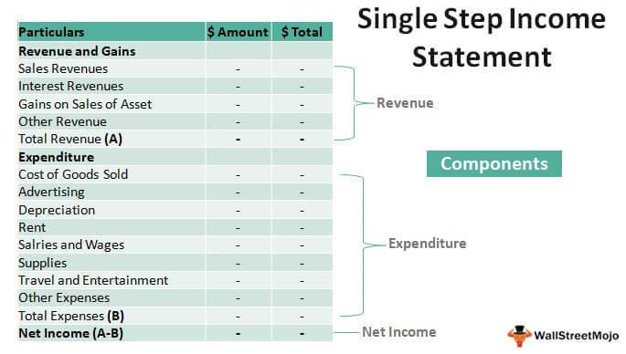

In trading, understanding financial statements is crucial for making informed decisions. This article explores the role of multiple-step and single-step income statements in the context of algorithmic trading. Income statements are essential financial documents that provide insights into a company's performance over a specific period. They summarize various financial components, including revenue, expenses, gains, and losses, thereby forming a foundational basis for investment analysis.

The structure of income statements significantly influences how automated trading strategies interpret financial health. Algorithmic trading, which relies heavily on quantitative data analysis to make quick and accurate trading decisions, can benefit from these insights. The type of income statement utilized can impact the effectiveness of these trading systems. For example, single-step income statements present a simplified view by consolidating all revenues and expenses, providing an easy-to-understand measure of net income. On the other hand, multiple-step income statements break down financial information into detailed categories such as operating and non-operating income, offering a nuanced view useful for deeper analysis.



Choosing the right type of income statement is of vital importance in algorithmic trading strategies to enhance decision-making processes. The selection can affect how well trading algorithms predict potential market movements and assess company performance. This article will compare single-step and multiple-step income statements, examining their respective advantages and disadvantages, and how each impacts the decision-making processes of traders using automated systems. Understanding these differences and their implications can equip traders with the ability to craft more effective trading strategies, resulting in improved financial outcomes.

## Table of Contents

## Understanding Single-Step Income Statements

A single-step income statement is a financial document centered around the streamlined and clear presentation of a company's revenue and expenses. In contrast to more complex formats, such as the multiple-step income statement, the single-step version calculates net income through a straightforward formula: 

$$
\text{Net Income} = \text{Total Revenue} - \text{Total Expenses}
$$

This simplicity is particularly advantageous for those new to investing and seasoned traders alike, as it offers an accessible means of understanding a company's financial performance. The format eschews detailed categorizations of operations—such as gross profit, operating margin, or other segmented financial metrics—which are typically included in a multiple-step income statement.

In [algorithmic trading](/wiki/algorithmic-trading), where decisions often need to be made swiftly and with clarity, single-step income statements can be especially beneficial. Algorithms designed with a focus on speed can utilize the streamlined data to execute trades based on net income trends without the overhead of processing more detailed financial information. This can result in faster decision-making and reduced computational load, which are crucial in high-frequency trading environments.

However, relying solely on single-step income statements has its trade-offs. The primary limitation is the lack of detailed financial metrics that can be crucial for the development of more complex trading algorithms. Without breaking down financial information into specific categories, such as cost of goods sold or operating expenses, algorithms might miss out on key insights necessary for understanding underlying business efficiencies or predicting future performance. This broad-brush approach may not suffice for traders seeking comprehensive analysis for robust algorithmic models, where detailed financial insights are pivotal.

For algorithmic traders who prioritize understanding comprehensive financial health, the limitations of single-step income statements necessitate supplementing them with additional financial data. This ensures that the trading algorithms are not only efficient but also sufficiently informed to capitalize on nuanced market trends.

## Disadvantages of Single-Step Income Statements

Despite their simplicity, single-step income statements may not suffice for algorithmic trading, which demands a thorough understanding of financial metrics. The single-step format aggregates all revenues and expenses, offering a single subtraction to arrive at net income. This straightforward approach might appeal to some traders due to its ease of use, but it lacks the granularity essential for detailed financial analysis.

One significant limitation of single-step income statements is the absence of distinct categories for revenue and expenses, such as gross and operating margins. These figures are crucial for traders who aim to analyze profitability and operational efficiency with precision. Gross margin, calculated as:

$$
\text{Gross Margin} = \frac{\text{Gross Profit}}{\text{Net Sales}}
$$

provides insights into the proportion of sales revenue exceeding the cost of goods sold, indicating how well a company is managing production costs. Operating margin, on the other hand, shows the percentage of revenue left after all operating expenses and is a key indicator of operational efficiency:

$$
\text{Operating Margin} = \frac{\text{Operating Income}}{\text{Net Sales}}
$$

Without such detailed breakdowns, traders face difficulties in making informed predictions about a company's future performance. The inability to separately evaluate core operations and non-operating activities limits the capability of advanced trading algorithms to model real-world scenarios accurately. This can lead to suboptimal trading decisions, as algorithms might not fully account for variations in cost structures or revenue streams.

Moreover, the singular focus of single-step statements may obscure critical data necessary for the calibration of trading models. For instance, sophisticated trading strategies that rely on trend analysis and [machine learning](/wiki/machine-learning) require comprehensive data inputs to fine-tune algorithms. Here, the integration of additional financial metrics becomes imperative. 

One approach to mitigating these shortcomings is to supplement single-step income statements with more granular financial data. Python, a popular language in algorithmic trading, can facilitate such enhancements. For example, data preprocessing scripts can extract key metrics from more detailed sources and incorporate them into a trading algorithm:

```python
import pandas as pd

# Sample function to calculate gross and operating margins from a detailed dataset
def calculate_margins(df):
    df['Gross Margin'] = df['Gross Profit'] / df['Net Sales']
    df['Operating Margin'] = df['Operating Income'] / df['Net Sales']
    return df[['Gross Margin', 'Operating Margin']]

# Example usage
financials_df = pd.read_csv('detailed_financials.csv')
margins_df = calculate_margins(financials_df)
```

By employing such strategies, traders can enhance their algorithm's robustness, ensuring that the simplicity of the single-step income statement does not compromise the depth of financial analysis required for effective algorithmic trading.

## Exploring Multiple-Step Income Statements

Multiple-step income statements offer a comprehensive breakdown of revenues and expenses, separating them into key categories such as operating income and non-operating income. This structure provides a better understanding of a company's core operational efficiency, allowing traders to make more informed algorithmic trading decisions. 

The detailed analysis is achieved by categorizing expenses into cost of goods sold (COGS), selling, general and administrative expenses (SG&A), and other operational costs. This breakdown is crucial for traders, as it helps them assess different aspects of business performance. For example, gross profit, calculated as revenue minus COGS, gives insights into a company's production efficiency, whereas operating income, which subtracts SG&A from gross profit, reflects the efficiency of the company's core operations.

Multiple-step income statements also aid in [backtesting](/wiki/backtesting) and refining trading algorithms, as they provide granular data that can be critical for constructing models that predict company performance. For instance, with revenues and expenses categorized, a trader can easily compute important performance metrics such as gross margin and net margin. The gross margin, which is the gross profit divided by revenue, reveals the percentage of revenue retained after accounting for COGS. Net margin, the ratio of net income to revenue, indicates the overall profitability.

These metrics are essential for developing sophisticated trading strategies. By leveraging the comprehensive data from multiple-step income statements, traders can form hypotheses and conduct more precise tests to validate their algorithms. For example, if a trading algorithm focuses on companies with high operational efficiency, the detailed expense categories in a multiple-step income statement can pinpoint companies that efficiently manage their operating costs relative to their revenue.

In conclusion, by offering a detailed financial perspective, multiple-step income statements enable traders to perform in-depth financial health analyses, ensuring that their algorithms are informed by accurate and relevant financial metrics. This allows for the development of trading strategies that are not only sophisticated but also finely attuned to the financial nuances of the companies being traded.

## Disadvantages of Multiple-Step Income Statements

Multiple-step income statements, while providing detailed insights into a company's financial performance, pose several challenges, particularly when utilized in algorithmic trading. The primary disadvantage originates from their inherent complexity, which can significantly impact both preparation and computation processes.

Firstly, the detailed nature of multiple-step income statements requires a meticulous breakdown of revenues and expenses into various categories such as operating income, non-operating income, and gross profit. This granularity, although beneficial for a comprehensive financial analysis, often makes these statements complex and time-consuming to prepare. For trading algorithms, the detailed data necessitates significant processing power, potentially extending the time required to analyze and interpret the financial metrics. In the fast-paced world of algorithmic trading, where milliseconds can make the difference, the ability to quickly process and act upon financial data is crucial. The mathematical models used in these algorithms might need additional computational resources to handle the layered data efficiently. For instance, parsing a multiple-step income statement using Python may require libraries such as `pandas` to manage data frames, which introduce overhead:

```python
import pandas as pd

# Simulating reading and processing a multiple-step income statement
data = pd.read_csv('multiple_step_income_statement.csv')
operating_income = data['Revenue'].sum() - data['Operating Expenses'].sum()
non_operating_income = data['Other Income'].sum() - data['Other Expenses'].sum()
net_income = operating_income + non_operating_income
```

Another significant challenge is the potential to overwhelm inexperienced traders. The extensive detail provided in multiple-step income statements can obscure critical insights, making it difficult for novice traders to discern the key metrics needed for informed decision-making. The necessity to sift through copious data points can lead to analysis paralysis, where the trader is unable to make timely decisions due to the sheer [volume](/wiki/volume-trading-strategy) of information presented. Moreover, presenting too much detail without clear guidance on which metrics are most relevant may result in misinterpretation or oversight of vital financial indicators.

To effectively manage and interpret the complexity of multiple-step income statements for optimized trading outcomes, traders can adopt several strategies. Firstly, employing data visualization tools can help distill complex data into more intuitive formats, allowing both algorithms and human analysts to focus on the most salient pieces of information. Additionally, a hybrid approach can be beneficial, leveraging both single-step and multiple-step data, depending on the trading context. For instance, algorithms could initially utilize a single-step approach for rapid assessment, followed by multiple-step analysis for deeper insights when needed. Moreover, developing robust filters and criteria within trading software to automatically identify and highlight critical metrics can enhance decision-making efficiency.

In conclusion, while multiple-step income statements provide essential insights for algorithmic trading, their complexity presents notable challenges. By strategically managing and interpreting this complexity, traders and algorithms can leverage detailed financial data more efficiently and effectively.

## Using Income Statements in Algorithmic Trading

In algorithmic trading, income statements serve as foundational tools for assessing and predicting financial performance. These statements offer structured insights into a company's operations, ranging from revenue generation to expense management. Understanding these financial metrics is crucial for constructing algorithms that not only predict but also respond effectively to market dynamics.

Algorithmic traders can leverage both single-step and multiple-step income statements to inform their trading strategies. Single-step income statements provide a streamlined view by summarizing total revenues and expenses. This format is quick to process, aligning with strategies that prioritize speed over depth. Traders can incorporate this data into algorithms to swiftly assess a company's overall profitability. For example, a simple algorithm could use the net income from single-step statements to make rapid buy or sell decisions:

```python
def simple_trading_strategy(net_income, threshold):
    if net_income > threshold:
        return "Buy"
    elif net_income < -threshold:
        return "Sell"
    else:
        return "Hold"
```

On the other hand, multiple-step income statements break down financial data into specific categories such as gross profit, operating income, and net income. This detailed view supports more nuanced trading algorithms that need to evaluate specific components of a company's financial health. For instance, an algorithm might separately analyze gross and operating margins to understand the efficiency of core operations:

```python
def detailed_trading_strategy(gross_margin, operating_margin, gm_threshold, om_threshold):
    if gross_margin > gm_threshold and operating_margin > om_threshold:
        return "Strong Buy"
    elif gross_margin < gm_threshold or operating_margin < om_threshold:
        return "Review"
    else:
        return "Hold"
```

Balancing the use of these formats involves matching the complexity of the algorithm with the desired trading outcomes. Simpler algorithms benefit from the speed of single-step statements, while more robust, predictive models might rely on the multifaceted insight offered by multiple-step statements. The choice depends on trading objectives, whether to execute trades at high speed, or to conduct thorough analyses for precision-based trading decisions.

By integrating data from both income statement types, traders can develop adaptive strategies that optimize performance across diverse market conditions. A sophisticated algorithm might use multiple-step statements for comprehensive annual evaluations and single-step statements for rapid quarterly assessments. This hybrid approach allows traders to benefit from detailed insights while maintaining agility.

Understanding how to best utilize these financial statements in algorithmic trading enables traders to refine their strategies and potentially improve financial returns. The ability to balance detail with efficiency is key to creating algorithms that respond to financial insights with precision and swiftness.

## Conclusion

Income statements, whether formatted as single-step or multiple-step, play a pivotal role in the ecosystem of algorithmic trading, where decisions often hinge on precise financial data analysis. Their utility in this context is derived from their ability to present a clear snapshot of a company's financial health, which is crucial for developing and refining trading algorithms.

Selecting between a single-step or multiple-step income statement is a strategic decision that should align with the specific goals and requirements of the trader or algorithm. Single-step statements offer simplicity and speed, beneficial for algorithms prioritizing quick, broad analysis. Conversely, multiple-step statements provide a detailed breakdown of financial operations, making them suitable for algorithms designed to undertake comprehensive, data-rich evaluations. 

A profound understanding of these financial narratives allows traders to craft informed trading strategies, optimizing their decision-making processes. By harnessing the nuanced insights offered by these income statements, traders can refine their trading models, leading to enhanced accuracy in forecasting and execution.

Leveraging the right income statement insights can thus translate into more effective trading strategies and superior financial results. Ultimately, this article highlights how a thorough grasp of income statements can enable traders to enhance their financial analysis techniques, paving the way for more informed and impactful trading decisions.

## References & Further Reading

[1]: Bergstra, J., Bardenet, R., Bengio, Y., & Kégl, B. (2011). ["Algorithms for Hyper-Parameter Optimization."](https://dl.acm.org/doi/10.5555/2986459.2986743) Advances in Neural Information Processing Systems 24.

[2]: ["Advances in Financial Machine Learning"](https://www.amazon.com/Advances-Financial-Machine-Learning-Marcos/dp/1119482089) by Marcos Lopez de Prado

[3]: ["Evidence-Based Technical Analysis: Applying the Scientific Method and Statistical Inference to Trading Signals"](https://www.amazon.com/Evidence-Based-Technical-Analysis-Scientific-Statistical/dp/0470008741) by David Aronson

[4]: ["Machine Learning for Algorithmic Trading"](https://github.com/stefan-jansen/machine-learning-for-trading) by Stefan Jansen

[5]: ["Quantitative Trading: How to Build Your Own Algorithmic Trading Business"](https://github.com/LucindaYa/quant-resources/blob/master/Quantitative%20Trading%20How%20to%20Build%20Your%20Own%20Algorithmic%20Trading%20Business.pdf) by Ernest P. Chan