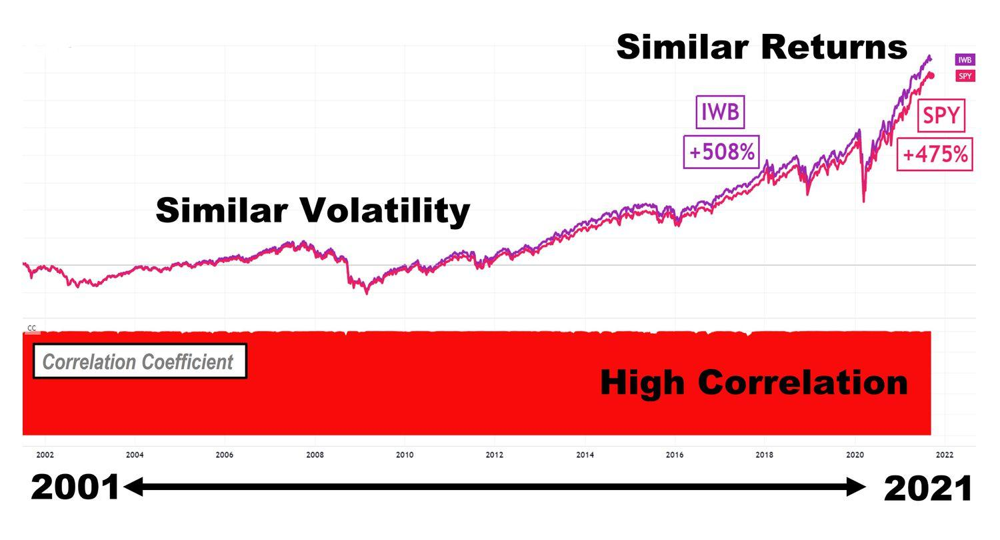

## Table of Contents

## What are the S&P 500 and Russell 1000?

The S&P 500 is a stock market index that measures the performance of 500 large companies listed on stock exchanges in the United States. It is considered a good indicator of the overall health of the U.S. economy because it includes companies from many different industries. People often use the S&P 500 to see how the stock market is doing and to compare the performance of their own investments.

The Russell 1000 is another stock market index, but it includes the 1,000 largest companies in the U.S. by market capitalization. This index covers about 92% of the total value of all U.S. stocks, making it a broad measure of the market. Like the S&P 500, the Russell 1000 is used by investors to gauge the performance of large companies and to make investment decisions.

## How are companies selected for inclusion in the S&P 500 and Russell 1000?

Companies are chosen for the S&P 500 based on several factors. The main one is that the company must be big and important in the U.S. economy. They look at how much the company is worth, which is called market capitalization. The company also needs to have most of its shares available for the public to buy and sell. Another thing they check is if the company makes enough money regularly. A group of people from S&P decide if a company fits these rules and should be in the index.

For the Russell 1000, the way companies get picked is simpler. They just look at the size of the company, or its market capitalization. Every year, they list all the companies in the U.S. from biggest to smallest. The top 1,000 companies make it into the Russell 1000. This means that the companies in the index can change every year, depending on how their size compares to others.

## What are the key differences in the composition of the S&P 500 and Russell 1000?

The S&P 500 and the Russell 1000 both include large companies, but they are put together differently. The S&P 500 has 500 companies that are chosen not just by how big they are, but also by how much money they make and how many of their shares people can buy and sell. A group of people from S&P decides which companies fit these rules and should be in the index. This means that being in the S&P 500 is a bit like getting picked for a special club where you need to meet certain standards.

On the other hand, the Russell 1000 is simpler because it just looks at how big the company is, or its market capitalization. Every year, they make a list of all the companies in the U.S. from the biggest to the smallest, and the top 1,000 make it into the Russell 1000. This means that the companies in the Russell 1000 can change every year, depending on how their size compares to others. So, while the S&P 500 is more about meeting specific criteria, the Russell 1000 is all about being one of the biggest companies around.

## How do the market capitalizations of the S&P 500 and Russell 1000 compare?

The S&P 500 and the Russell 1000 both include big companies, but they cover different parts of the market. The S&P 500 focuses on 500 large companies that meet certain rules, like making enough money and having lots of shares people can buy. Because of these rules, the S&P 500 represents a big chunk of the U.S. stock market, but it's not the whole thing. The total market capitalization of the companies in the S&P 500 is huge, but it's less than the total market capitalization of the Russell 1000.

The Russell 1000, on the other hand, includes the 1,000 biggest companies in the U.S., no matter what other rules they need to follow. This means the Russell 1000 covers a bigger part of the market than the S&P 500. It includes about 92% of the total value of all U.S. stocks, making it a very broad measure of the market. So, the market capitalization of the Russell 1000 is bigger than the S&P 500 because it includes more companies, even though both indexes focus on large companies.

## What sectors are represented in the S&P 500 and Russell 1000, and how do their weightings differ?

The S&P 500 and the Russell 1000 both include companies from many different sectors, like technology, health care, finance, and more. In the S&P 500, the weight of each sector is based on how big the companies in that sector are. For example, if tech companies in the S&P 500 are very big, the tech sector will have a bigger weight in the index. The S&P 500 often has a higher weight in sectors like information technology and health care because these sectors have some of the biggest companies in the U.S.

The Russell 1000 also includes companies from all sectors, but the way it weighs them is a bit different. Like the S&P 500, the weight of each sector in the Russell 1000 depends on the size of the companies in that sector. However, because the Russell 1000 includes more companies overall, the weights can be spread out a bit more. This means that while the tech sector might still be big in the Russell 1000, other sectors like industrials or consumer goods might have a bit more weight compared to the S&P 500. So, while both indexes cover similar sectors, the exact weights of those sectors can be different.

## How have the historical performances of the S&P 500 and Russell 1000 compared over different time periods?

Over long periods of time, like 10 or 20 years, the S&P 500 and the Russell 1000 have had pretty similar performances. Both indexes have gone up a lot over the years, but the S&P 500 has sometimes done a bit better. This is because the S&P 500 focuses on the biggest and most profitable companies, and those companies have done really well over time. For example, if you look at the last 20 years, the S&P 500 has had a higher average yearly return than the Russell 1000. But the difference isn't huge, and both indexes have made investors a lot of money over the long run.

When you look at shorter time periods, like a year or a few years, the performances of the S&P 500 and the Russell 1000 can be different. Sometimes the S&P 500 does better, and sometimes the Russell 1000 does better. It depends on which kinds of companies are doing well at that time. For example, if tech companies are doing great, the S&P 500 might do better because it has a lot of big tech companies. But if smaller companies or other kinds of big companies do well, the Russell 1000 might do better because it includes more of those companies. So, over shorter periods, the performance can swing back and forth between the two indexes.

## What are the methodologies used for rebalancing the S&P 500 and Russell 1000?

The S&P 500 gets rebalanced when companies change or when they need to make sure the index still represents the market well. This can happen at any time during the year. A group of people from S&P decide if a company should be added or taken out based on rules like how big the company is, how much money it makes, and how many shares people can buy and sell. They want to keep the index showing the best picture of the U.S. economy. So, if a company gets too small or stops making enough money, it might be taken out. And if a new company gets big and profitable enough, it might be added in.

The Russell 1000, on the other hand, gets rebalanced once a year in June. They do it by making a list of all the companies in the U.S. from the biggest to the smallest by how much they're worth. The top 1,000 companies make it into the Russell 1000. This means that every year, some companies might get added if they've grown bigger, and some might get taken out if they've gotten smaller. It's all about size, so the Russell 1000 keeps changing to show the 1,000 biggest companies at that time.

## How do the volatility and risk profiles of the S&P 500 and Russell 1000 differ?

The S&P 500 and the Russell 1000 can move up and down differently, which is called [volatility](/wiki/volatility-trading-strategies). The S&P 500 is usually a bit less jumpy because it includes fewer but bigger and more stable companies. These companies are often in industries that don't change a lot day to day. So, if you invest in the S&P 500, you might see smaller ups and downs compared to the Russell 1000. This can make the S&P 500 feel a bit safer for some people.

The Russell 1000, on the other hand, might be a bit more volatile because it includes more companies, some of which might be smaller and less stable. Even though it's still made up of big companies, having more companies means more chances for big changes. If some of these companies do really well or really badly, it can make the whole index move more. So, the Russell 1000 might feel a bit riskier than the S&P 500, but it's still a pretty safe bet compared to smaller company indexes.

## What are the implications of investing in ETFs or mutual funds tracking the S&P 500 versus the Russell 1000?

When you invest in an [ETF](/wiki/etf-trading-strategies) or mutual fund that tracks the S&P 500, you're putting your money into a group of 500 big and stable companies. These companies are chosen because they make a lot of money and have a lot of shares people can buy and sell. This can make your investment feel safer because the S&P 500 usually doesn't jump around as much. It's a good choice if you want to invest in the U.S. economy without taking too many risks. Also, because the S&P 500 has done really well over time, it's a popular choice for people who want to grow their money over many years.

On the other hand, if you invest in an ETF or mutual fund that tracks the Russell 1000, you're investing in the 1,000 biggest companies in the U.S. This includes some of the same companies as the S&P 500, but it also has more companies, which can make it a bit riskier. The Russell 1000 might move up and down a bit more than the S&P 500 because it includes more companies that can change a lot. But it's still a good way to invest in a big part of the U.S. market. If you're okay with a little more risk and want to spread your money over even more big companies, the Russell 1000 could be a good choice for you.

## How do the S&P 500 and Russell 1000 serve as benchmarks for different investment strategies?

The S&P 500 is a popular benchmark for investors who want to see how well they're doing compared to big and stable companies in the U.S. It's often used by people who want to invest in the overall health of the U.S. economy without taking too many risks. If you're investing in a way that focuses on big, well-known companies that make a lot of money, the S&P 500 is a good way to check if your investments are doing better or worse than these companies. It's also used by people who want to grow their money over many years because the S&P 500 has done well over long periods.

The Russell 1000 is another benchmark, but it's used a bit differently. It's for people who want to see how their investments are doing compared to the 1,000 biggest companies in the U.S. This index is good for investors who are okay with a little more risk and want to spread their money over more big companies. If you're investing in a way that looks at a bigger part of the market, including some smaller big companies, the Russell 1000 can help you see if you're doing better or worse than these companies. It's a good choice for people who want to make sure their investments cover a lot of different big companies in the U.S.

## What are the potential impacts of economic cycles on the performance of the S&P 500 and Russell 1000?

Economic cycles can affect the S&P 500 and the Russell 1000 in different ways. During good times, like when the economy is growing and people are spending more money, both indexes usually go up. But the S&P 500 might do a bit better because it has more of the really big and stable companies that do well when things are going great. These companies, like big tech and health care firms, often lead the way when the economy is booming. So, if you're investing in the S&P 500 during good economic times, you might see bigger gains.

When the economy is not doing so well, like during a recession, both indexes can go down. But the Russell 1000 might feel the hit a bit more because it includes more companies, some of which might be smaller and less stable. These companies can struggle more when people are spending less money. The S&P 500 might not drop as much because it has those big, stable companies that can weather tough times better. So, if you're investing in the Russell 1000 during a downturn, you might see bigger losses, but both indexes will feel the impact of a bad economy.

## How do international exposure and global economic factors influence the S&P 500 and Russell 1000 differently?

The S&P 500 and the Russell 1000 both include big U.S. companies, but they can be affected differently by what's happening in other countries. The S&P 500 has a lot of big companies that do business all over the world. For example, big tech and health care companies in the S&P 500 might sell a lot of their products in other countries. So, if something happens in another country that makes people buy less, like a slowdown in China or Europe, it can hurt the S&P 500 more because those big companies depend on selling stuff around the world.

The Russell 1000 also has companies that do business internationally, but it includes more companies overall, some of which might not have as much international business. This means that while the Russell 1000 can still be affected by what's happening in other countries, it might not feel the impact as much as the S&P 500. If the U.S. economy is doing okay but other countries are struggling, the Russell 1000 might do better because it has more companies that focus on the U.S. market. So, global economic factors can influence both indexes, but the S&P 500 might be more sensitive to what's happening around the world.

## References & Further Reading

[1]: Bergstra, J., Bardenet, R., Bengio, Y., & Kégl, B. (2011). ["Algorithms for Hyper-Parameter Optimization."](https://papers.nips.cc/paper/4443-algorithms-for-hyper-parameter-optimization) Advances in Neural Information Processing Systems 24.

[2]: ["Advances in Financial Machine Learning"](https://www.amazon.com/Advances-Financial-Machine-Learning-Marcos/dp/1119482089) by Marcos Lopez de Prado

[3]: ["Evidence-Based Technical Analysis: Applying the Scientific Method and Statistical Inference to Trading Signals"](https://www.amazon.com/Evidence-Based-Technical-Analysis-Scientific-Statistical/dp/0470008741) by David Aronson

[4]: ["Machine Learning for Algorithmic Trading"](https://github.com/stefan-jansen/machine-learning-for-trading) by Stefan Jansen

[5]: ["Quantitative Trading: How to Build Your Own Algorithmic Trading Business"](https://www.amazon.com/Quantitative-Trading-Build-Algorithmic-Business/dp/1119800064) by Ernest P. Chan