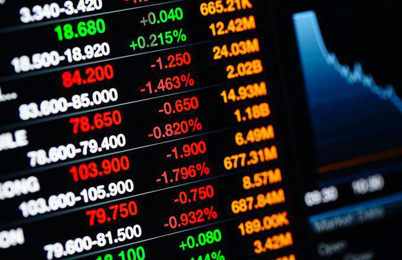

## Table of Contents

## What is an ETF?

An ETF, or Exchange-Traded Fund, is a type of investment that you can buy and sell on a stock exchange, just like stocks. It's like a basket that holds a collection of different investments, such as stocks, bonds, or commodities. When you buy shares of an ETF, you're buying a small piece of all the investments inside that basket. This makes it easy for you to diversify your investments without having to buy each one separately.

ETFs are popular because they offer a lot of benefits. They usually have lower fees than mutual funds, which means you get to keep more of your money. They are also very flexible because you can trade them throughout the day at market prices, unlike mutual funds which are only traded once a day. Plus, ETFs cover a wide range of investment options, from broad market indexes to specific sectors or themes, so you can find one that fits your investment goals.

## What is the S&P 500?

The S&P 500 is a very important stock market index in the United States. It includes the 500 largest publicly traded companies from different industries, like technology, healthcare, and finance. When people talk about "the market," they often mean the S&P 500 because it represents a big part of the U.S. economy. The index is managed by a company called Standard & Poor's, which is why it's called the S&P 500.

The S&P 500 is used as a benchmark to see how well the stock market is doing. If the S&P 500 goes up, it usually means that the overall market is doing well. If it goes down, it can mean that the market is struggling. Many investors use the S&P 500 as a way to measure their own investments. You can also invest in the S&P 500 through ETFs or mutual funds that try to match its performance.

## What is the Russell 2000?

The Russell 2000 is a stock market index in the United States. It includes the 2000 smallest companies from the Russell 3000 index. These companies are usually smaller and newer than the ones in the S&P 500. The Russell 2000 is managed by a company called FTSE Russell.

People use the Russell 2000 to see how small companies in the U.S. are doing. If the Russell 2000 goes up, it means small companies are doing well. If it goes down, it means they are struggling. Investors can also buy ETFs or mutual funds that try to match the performance of the Russell 2000. This helps them invest in small companies without buying each one separately.

## How do S&P 500 ETFs and Russell 2000 ETFs differ in terms of market capitalization?

S&P 500 ETFs focus on the 500 largest companies in the United States. These companies have big market capitalizations, which means they are worth a lot of money. When you invest in an S&P 500 [ETF](/wiki/etf-trading-strategies), you're putting your money into these big, well-known companies. This can be a good choice if you want to invest in stable, established businesses.

On the other hand, Russell 2000 ETFs focus on smaller companies. The Russell 2000 includes the 2000 smallest companies from the Russell 3000 index. These companies have smaller market capitalizations, which means they are worth less money than the ones in the S&P 500. Investing in a Russell 2000 ETF can be a good way to bet on the growth of smaller, newer companies that might have more room to grow.

## What are the typical expense ratios for S&P 500 and Russell 2000 ETFs?

S&P 500 ETFs usually have very low expense ratios. An expense ratio is the fee you pay to the company that manages the ETF. For S&P 500 ETFs, these fees are often between 0.03% and 0.10%. This means if you invest $10,000, you might pay between $3 and $10 a year in fees. The reason these fees are so low is because S&P 500 ETFs are very popular and easy to manage.

Russell 2000 ETFs usually have a bit higher expense ratios than S&P 500 ETFs. The fees for these ETFs are often between 0.10% and 0.20%. So, if you invest $10,000, you might pay between $10 and $20 a year in fees. The fees are a bit higher because managing a fund of smaller companies can be more work for the company running the ETF.

## How do the historical performance trends of S&P 500 ETFs compare to Russell 2000 ETFs?

Historically, S&P 500 ETFs have often performed better than Russell 2000 ETFs over the long term. The S&P 500 is made up of big, stable companies that tend to grow steadily. This means that S&P 500 ETFs usually have less ups and downs and can provide more consistent returns. For example, over the past 20 years, the S&P 500 has had an average annual return of around 10%. This steady growth makes it a popular choice for people who want to invest their money safely over a long time.

On the other hand, Russell 2000 ETFs, which focus on smaller companies, can have bigger ups and downs. These smaller companies can grow very fast, but they can also struggle more during tough economic times. Over the same 20-year period, the Russell 2000 has had an average annual return of around 8%. While this is a bit less than the S&P 500, some investors like Russell 2000 ETFs because they offer the chance for higher growth, even though they come with more risk.

## What are the sector allocations in S&P 500 ETFs versus Russell 2000 ETFs?

S&P 500 ETFs have their money spread out across many different sectors, but they focus more on big sectors like technology, healthcare, and finance. For example, a big part of the S&P 500 might be in tech companies like Apple and Microsoft. This means if you invest in an S&P 500 ETF, you're putting your money into these big sectors that make up a lot of the U.S. economy. The idea is to have a mix that reflects the overall economy, so you get a bit of everything.

Russell 2000 ETFs, on the other hand, have their money in smaller companies, and the sectors can be a bit different. You might see more money in sectors like industrials, consumer discretionary, and healthcare, but the companies are smaller and less well-known. Because these ETFs focus on smaller companies, they might have more money in sectors that are growing fast but are not as big as the ones in the S&P 500. This gives you a chance to invest in parts of the economy that might be on the rise but are not as stable as the big companies in the S&P 500.

## How does the liquidity of S&P 500 ETFs compare to that of Russell 2000 ETFs?

S&P 500 ETFs are usually more liquid than Russell 2000 ETFs. Liquidity means how easy it is to buy or sell something without affecting its price. Because S&P 500 ETFs are very popular and have a lot of trading going on every day, you can buy or sell them quickly without worrying about the price changing too much. This is good if you want to get in or out of your investment fast.

Russell 2000 ETFs, on the other hand, are less liquid. They focus on smaller companies that are not traded as much as the big companies in the S&P 500. This means it can be harder to buy or sell Russell 2000 ETFs quickly, and the price might move more when you do. So, if you're thinking about investing in a Russell 2000 ETF, you might need to be okay with holding onto it for a bit longer and not trading it as often.

## What are the implications of investing in S&P 500 ETFs versus Russell 2000 ETFs in terms of risk and return?

Investing in S&P 500 ETFs means you're putting your money into big, well-known companies. These companies are usually more stable, so the risk is lower. You might not see huge jumps in your investment, but it's likely to grow steadily over time. The S&P 500 has a good track record of giving investors around 10% returns each year over the long term. This makes it a safe choice if you want your money to grow without too many ups and downs.

On the other hand, investing in Russell 2000 ETFs means you're betting on smaller companies. These companies can grow a lot faster, but they can also struggle more during tough times. This makes Russell 2000 ETFs riskier than S&P 500 ETFs. You might see bigger gains if the smaller companies do well, but you could also lose more money if they don't. Over the long term, Russell 2000 ETFs have given investors around 8% returns each year, which is a bit less than the S&P 500, but the chance for higher growth can be appealing if you're willing to take on more risk.

## How do the dividend yields of S&P 500 ETFs compare to those of Russell 2000 ETFs?

S&P 500 ETFs usually have higher dividend yields than Russell 2000 ETFs. Dividend yield is the money you get from a company for owning its stock. The big companies in the S&P 500 often pay out more money to their investors because they have more money to share. So, if you invest in an S&P 500 ETF, you might get around 1.5% to 2% of your money back each year in dividends.

Russell 2000 ETFs, on the other hand, have lower dividend yields. This is because the smaller companies in the Russell 2000 don't have as much money to pay out. They might be using their money to grow their business instead. So, if you invest in a Russell 2000 ETF, you might only get around 1% to 1.5% of your money back each year in dividends. If you want more money from dividends, S&P 500 ETFs are a better choice.

## What are some popular S&P 500 and Russell 2000 ETFs and their key features?

Some popular S&P 500 ETFs include the SPDR S&P 500 ETF Trust (SPY) and the Vanguard S&P 500 ETF (VOO). SPY is one of the oldest and most traded ETFs, making it very liquid. It has an expense ratio of about 0.09%, which is low but a bit higher than some other options. VOO, on the other hand, has an even lower expense ratio of about 0.03%, making it a great choice if you want to keep your costs down. Both of these ETFs aim to match the performance of the S&P 500, so you get a piece of the 500 biggest companies in the U.S.

For Russell 2000 ETFs, the iShares Russell 2000 ETF (IWM) and the Vanguard Russell 2000 ETF (VTWO) are well-known. IWM is very popular and has a lot of trading [volume](/wiki/volume-trading-strategy), but its expense ratio is around 0.19%, which is a bit higher. VTWO has a lower expense ratio of about 0.10%, so it's a good choice if you want to save on fees. Both of these ETFs focus on smaller companies, giving you a chance to invest in parts of the economy that might grow a lot but are also riskier.

## How might macroeconomic factors influence the performance of S&P 500 ETFs differently from Russell 2000 ETFs?

Macroeconomic factors, like how the economy is doing overall, can affect S&P 500 ETFs and Russell 2000 ETFs in different ways. When the economy is doing well, people have more money to spend, and big companies in the S&P 500 usually do better. These companies are more stable and can handle economic ups and downs better. So, if the economy is growing, S&P 500 ETFs might go up more than Russell 2000 ETFs. But if the economy is not doing well, like during a recession, these big companies might not fall as much because they have more ways to keep going.

On the other hand, smaller companies in the Russell 2000 can be more sensitive to economic changes. When the economy is growing fast, these smaller companies can grow a lot because they have more room to expand. So, Russell 2000 ETFs might do really well during good times. But if the economy slows down or goes into a recession, these smaller companies can struggle more because they don't have as much money saved up. This means Russell 2000 ETFs might fall more than S&P 500 ETFs when things get tough.

## References & Further Reading

[1]: ["The Little Book of Common Sense Investing: The Only Way to Guarantee Your Fair Share of Stock Market Returns"](https://www.amazon.com/Little-Book-Common-Sense-Investing/dp/1119404509) by John C. Bogle

[2]: [Lettau, M., & Ludvigson, S. (2001). "Consumption, Aggregate Wealth, and Expected Stock Returns."](https://www.jstor.org/stable/222534) American Economic Review, 91(3), 631-652.

[3]: ["Trading and Exchanges: Market Microstructure for Practitioners"](https://www.amazon.com/Trading-Exchanges-Market-Microstructure-Practitioners/dp/0195144708) by Larry Harris

[4]: ["Algorithmic Trading: Winning Strategies and Their Rationale"](https://play.google.com/store/books/details/Algorithmic_Trading_Winning_Strategies_and_Their_R?id=CIwCTVqEj4oC&hl=en-US) by Ernest P. Chan

[5]: ["Exchange-Traded Funds and the New Dynamics of Investing"](https://academic.oup.com/book/3366) by Ananth Madhavan