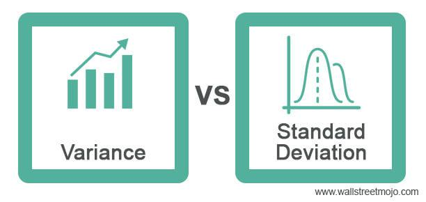

In finance, particularly in algorithmic trading, statistical analysis serves as a critical tool for traders making informed decisions. It provides a quantitative basis for understanding market dynamics, evaluating risks, and optimizing financial strategies. Among the core statistical measurements employed in this field are standard deviation and variance. These metrics play a pivotal role in quantifying risk and volatility, both of which are essential for developing robust trading strategies.

Standard deviation and variance assist traders in assessing how much individual asset prices diverge from their average, thereby offering insights into market volatility and potential risk exposure. For instance, standard deviation measures the extent to which price data points fluctuate around the mean, serving as a gauge for potential price movements. Variance complements this by providing a broader view of the dispersion within a set of financial data.



This article will explore the vital role these statistical measures play in algorithmic trading. We will examine the processes involved in calculating standard deviation and variance and discuss their application in optimizing trading strategies. These metrics are integral to effective decision-making and risk management in algorithmic trading. Understanding their significance can greatly enhance a trader's ability to navigate the complexities of financial markets and improve trading outcomes.

## Table of Contents

## Understanding Standard Deviation and Variance

Standard deviation is a statistical metric that quantifies the dispersion of a dataset in relation to its mean, representing how individual data points spread out from the average value. It provides a measure of volatility, indicating whether data points are generally close to the mean or more dispersed. Mathematically, the standard deviation ($\sigma$) of a dataset is calculated as follows:

$$

\sigma = \sqrt{\frac{1}{N} \sum_{i=1}^{N} (x_i - \bar{x})^2} 
$$

where $N$ represents the number of data points, $x_i$ denotes each individual data point, and $\bar{x}$ is the mean of the dataset.

Variance, denoted as $\sigma^2$, is intrinsically linked to standard deviation and is defined as the average of the squared differences from the mean. It offers insight into the spread of a dataset, providing a squared measure of [dispersion](/wiki/dispersion-trading) that emphasizes larger deviations more strongly due to the squaring process:

$$

\sigma^2 = \frac{1}{N} \sum_{i=1}^{N} (x_i - \bar{x})^2 
$$

In the context of trading, standard deviation and variance are essential for measuring the risk and [volatility](/wiki/volatility-trading-strategies) associated with stocks and other financial instruments. These metrics help traders understand the level of uncertainty or variability in asset prices, which can inform investment decisions and risk management strategies. High standard deviation or variance indicates greater volatility and, consequently, higher risk, whereas lower values suggest more stable price movements. Understanding these statistical measures allows traders to better quantify and navigate financial market uncertainties.

## Calculating Standard Deviation and Variance

Computing standard deviation and variance is a fundamental process in statistical analysis, especially when evaluating financial data. To calculate the standard deviation, begin by determining the mean (average) of the dataset. This involves summing all the data points and dividing by the total number of points. Once the mean is established, the variance of each data point can be calculated by subtracting the mean from each data point and squaring the result. 

The variance is then derived by averaging these squared differences. The formula for variance ($\sigma^2$) is:

$$
\sigma^2 = \frac{\sum (x_i - \mu)^2}{N}
$$

where $x_i$ represents each data point, $\mu$ is the mean of the dataset, and $N$ is the number of data points. 

To obtain the standard deviation ($\sigma$), take the square root of the variance:

$$
\sigma = \sqrt{\sigma^2}
$$

Python offers efficient libraries like NumPy and Pandas that simplify these computations. NumPy provides a direct function `np.std()` for standard deviation and `np.var()` for variance, making analysis straightforward when dealing with large datasets. Here is an example using Python:

```python
import numpy as np

data = [10, 12, 23, 23, 16, 23, 21, 16]
mean = np.mean(data)
variance = np.var(data)
standard_deviation = np.std(data)

print(f'Mean: {mean}')
print(f'Variance: {variance}')
print(f'Standard Deviation: {standard_deviation}')
```

This code calculates the mean, variance, and standard deviation of a list of data points using NumPy, demonstrating how these libraries are indispensable in analyzing financial datasets efficiently.

## Application in Algorithmic Trading

In [algorithmic trading](/wiki/algorithmic-trading), standard deviation plays a crucial role in evaluating price volatility, which is essential for developing effective trading strategies. Standard deviation offers a quantitative measure of market volatility, enabling traders to identify significant price shifts that may suggest profitable trading opportunities.

One widely recognized application of standard deviation in algorithmic trading is the utilization of Bollinger Bands. Bollinger Bands consist of a moving average (MA) and two standard deviation lines, one above and one below the MA. The formula for Bollinger Bands is:

- Upper Band = MA + (SD * n)
- Lower Band = MA - (SD * n)

where SD denotes the standard deviation of asset prices, and the multiplier 'n' is typically set to 2 in common practice.

Bollinger Bands help identify potential buy or sell signals by capturing moments when the asset price deviates significantly from its moving average. If a price moves above the upper band, it suggests the asset may be overbought, indicating a potential sell signal. Conversely, a move below the lower band can indicate an oversold condition, hinting at a potential buy signal. This makes Bollinger Bands a critical tool for traders aiming to capitalize on price volatility.

Traders employ standard deviation not merely for signal generation but also for risk management and strategy optimization. By analyzing price volatility, traders can determine appropriate position sizes, set stop-loss orders, and effectively allocate capital to minimize risk. Standard deviation provides insights into past market behavior, offering a basis for predicting future price movements and refining trading algorithms for sustained performance.

Incorporating standard deviation into algorithmic strategies allows traders to adapt to varying market conditions, ensuring their algorithms remain agile and responsive. By integrating standard deviation with other technical indicators and risk management techniques, traders can enhance the robustness and consistency of their trading strategies, leading to better investment outcomes.

## Practical Case Studies

Case studies across various financial markets highlight the significance of standard deviation in practical trading applications. These studies demonstrate how traders leverage this statistical measure to make informed decisions in equity markets, [forex](/wiki/forex-system) trading, and options trading.

In forex trading, standard deviation is crucial for assessing currency pair volatility. Traders employ this metric to determine the price fluctuation extent of currency pairs over a specific period. By calculating the standard deviation of a currency's historical prices, traders can set appropriate position sizes and establish risk parameters. A higher standard deviation indicates greater price volatility, suggesting larger potential gains or losses. Consequently, traders adjust their position sizes and stop-loss orders accordingly to manage their exposure. For instance, consider a forex trader analyzing the EUR/USD pair. By computing the standard deviation of daily closing prices over the past 50 days, the trader can gauge current market volatility levels and make informed adjustments to their trading strategy.

In options trading, standard deviation is instrumental in estimating implied volatility, which is a critical component of option pricing models. Implied volatility reflects the market's expectation of future price movements of an underlying asset. Options traders utilize standard deviation to evaluate whether options are overpriced or underpriced. A high implied volatility often leads to expensive options premiums, suggesting that the market expects significant price fluctuations. Conversely, low implied volatility may indicate cheaper options. Traders can use this information to identify lucrative trading opportunities. Consider an example involving a trader interested in options on a specific stock. By analyzing the stock's historical price data, the trader can compute the standard deviation and compare it with current implied volatility levels to assess whether options are attractively priced.

Python offers convenient libraries for calculating standard deviation in trading datasets. The following is an example using Python to compute the standard deviation of a currency pair's historical prices:

```python
import numpy as np
import pandas as pd

# Sample data representing historical prices
data = {'Date': ['2023-10-01', '2023-10-02', '2023-10-03', '2023-10-04', '2023-10-05'],
        'Price': [1.100, 1.105, 1.097, 1.102, 1.099]}

# Create a DataFrame
df = pd.DataFrame(data)

# Calculate standard deviation of prices
std_deviation = np.std(df['Price'])
print(f"The standard deviation of the currency pair is: {std_deviation}")
```

These practical applications underscore how standard deviation serves as a powerful tool for navigating the complexities of the financial markets. By effectively integrating this metric into their trading strategies, traders can enhance risk management and optimize their overall performance.

## Limitations and Considerations

Standard deviation is a widely used statistical tool in the financial domain, yet it has several limitations that traders should be aware of in the context of algorithmic trading. One of the primary assumptions underlying standard deviation is that the data follows a normal distribution. However, financial markets are known for their unpredictability, often exhibiting behaviors like leptokurtosis, where there are more frequent occurrences of extreme values than what a normal distribution would predict. This characteristic challenges the assumption of a normal distribution and can lead to underestimation of risk during volatile market conditions.

Another notable limitation of standard deviation is its retrospective nature. The metric relies on historical data to estimate the volatility of an asset. While historical trends can offer valuable insights, they do not necessarily predict future market dynamics. Markets can be influenced by unexpected events, also known as black swan events, which are extremely rare and inherently unpredictable. Such events can cause market conditions to change drastically, making historical data less relevant or even misleading in certain scenarios.

Given these limitations, traders are encouraged to complement standard deviation with other risk management tools and techniques to achieve a more holistic view of market risks. For instance, combining standard deviation with measures like Value at Risk (VaR) or stress testing scenarios can provide a more nuanced understanding of potential risks. Moreover, advanced statistical methods and financial models that incorporate factors like fat tails and skewness may offer improved risk assessment in unpredictable markets.

It is also important to use dynamic models that can adapt to changing market conditions, potentially integrating [machine learning](/wiki/machine-learning) algorithms that continuously learn from current data to adjust trading strategies accordingly. Traders should remain vigilant and flexible, applying a combination of different risk management practices along with standard deviation to make well-informed trading decisions.

## Conclusion

Statistical analysis is an essential component of modern algorithmic trading, with standard deviation and variance playing critical roles in understanding and managing trading risks. These metrics allow traders to quantify market volatility and make informed decisions about their trading strategies. By assessing how data points vary from the mean, standard deviation and variance provide insights into both the consistency and unpredictability of asset prices.

In creating algorithmic trading strategies, standard deviation and variance are indispensable for evaluating market behavior. These measures help ascertain an asset's volatility, thus enabling traders to tailor their risk management strategies accordingly. For example, a high standard deviation may indicate significant price swings, which could suggest higher risk but also greater potential for profit. Conversely, a low standard deviation might imply a more stable asset, appealing to risk-averse traders.

Integrating statistical measures into trading strategies enhances decision-making and risk management. Traders can use these tools to optimize asset allocation, determine position sizes, and develop strategies that adapt to changing market conditions. This data-driven approach helps traders not only to protect their investments but also potentially to capitalize on volatile market movements.

Ultimately, the effective use of standard deviation and variance contributes to improved trading outcomes. By leveraging these metrics, traders gain a clearer understanding of market dynamics, enabling them to make more accurate predictions about future price movements. Such insights are invaluable for developing robust trading strategies that withstand the uncertainties of financial markets.

## References & Further Reading

[1]: Engle, R. F. (1982). ["Autoregressive Conditional Heteroscedasticity with Estimates of the Variance of United Kingdom Inflation."](https://www.semanticscholar.org/paper/Autoregressive-conditional-heteroscedasticity-with-Engle/2ee6cb87fc81ecd78d161c4a92c9dfce00c8961c) Econometrica, 50(4), 987-1007.

[2]: Alexander, C. (2001). ["Market Models: A Guide to Financial Data Analysis."](https://www.casact.org/sites/default/files/old/marketmodels.pdf) Wiley.

[3]: Bollinger, J. (2002). ["Bollinger on Bollinger Bands."](https://books.google.com/books/about/Bollinger_on_Bollinger_Bands.html?id=MVrJdo8VOnIC) McGraw-Hill Education.

[4]: Tsay, R. S. (2005). ["Analysis of Financial Time Series."](https://onlinelibrary.wiley.com/doi/book/10.1002/9780470644560) Wiley-Interscience.

[5]: Lopez de Prado, M. (2018). ["Advances in Financial Machine Learning."](https://www.amazon.com/Advances-Financial-Machine-Learning-Marcos/dp/1119482089) Wiley.

[6]: Hull, J. C. (2003). ["Options, Futures, and Other Derivatives."](https://www.semanticscholar.org/paper/Options%2C-Futures%2C-and-Other-Derivatives-Hull/89bdee500c8623864fc9eb7a471546aa713acc44) Prentice Hall.