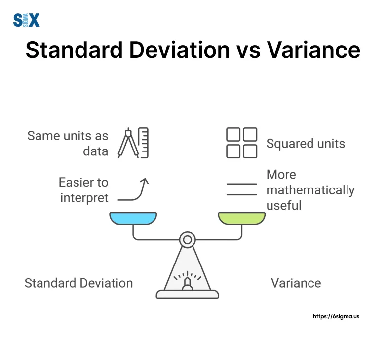

## Table of Contents

## What is standard deviation?

Standard deviation is a way to measure how spread out numbers in a set are. Imagine you have a bunch of test scores. If all the scores are close to the average score, the standard deviation will be small. But if the scores are all over the place, with some really high and some really low, the standard deviation will be large. It helps us understand if the data points are tightly clustered around the average or if they are spread out a lot.

To find the standard deviation, you first calculate the average of all the numbers. Then, you see how far each number is from that average. You square those distances, add them up, and find the average of those squared distances. Finally, you take the square root of that average. This gives you the standard deviation. It's a bit of math, but it's a really useful way to summarize how varied the data is.

## What is variance?

Variance is another way to measure how spread out a set of numbers is. It's like standard deviation's cousin. If you have a bunch of test scores, variance will tell you how much the scores differ from the average score. If all the scores are close to the average, the variance will be small. But if the scores are all over the place, the variance will be big.

To calculate variance, you start by finding the average of all the numbers. Then, you figure out how far each number is from that average. You square those distances (because you want all the distances to be positive) and then find the average of all those squared distances. That's your variance. It's a bit like standard deviation, but you don't take the square root at the end. So, variance is the average of the squared differences from the mean.

## How are standard deviation and variance calculated?

To calculate the variance, start by finding the average of all your numbers. This is also called the mean. Once you have the mean, look at each number in your set and see how far it is from the mean. This distance is called the deviation. Square each of these deviations because you want to make sure all the numbers are positive. Then, add up all these squared deviations. Finally, divide this total by the number of items in your set to get the average of the squared deviations. This average is your variance.

To find the standard deviation, you start with the variance. Once you have the variance, which is the average of the squared deviations, you take the square root of this number. The square root undoes the squaring you did earlier, so it brings the numbers back to the same scale as your original data. This final number is your standard deviation. It tells you how spread out your numbers are around the mean, in the same units as your original data.

## What is the relationship between standard deviation and variance?

Standard deviation and variance are closely related because they both measure how spread out a set of numbers is. Variance is the average of the squared differences from the mean. When you calculate variance, you find the mean of your numbers, then see how far each number is from that mean, square those distances, add them up, and divide by the number of items. This gives you a single number that tells you how much the numbers differ from the mean.

Standard deviation is simply the square root of the variance. After you find the variance, you take its square root to get the standard deviation. This step is important because it brings the measure back to the same units as your original data. So, if you measured weights in pounds, the standard deviation will also be in pounds. This makes standard deviation easier to understand and use in real-world situations because it's in the same scale as your data.

## Why is standard deviation often preferred over variance in data analysis?

Standard deviation is often preferred over variance in data analysis because it's easier to understand and use. When you calculate variance, you end up with a number that's in squared units. For example, if you're measuring weights in pounds, the variance will be in pounds squared, which doesn't make much sense in everyday life. But when you take the square root of the variance to get the standard deviation, you get a number that's back in the original units, like pounds. This makes it much easier to relate the standard deviation to the actual data you're working with.

Another reason people prefer standard deviation is that it's more intuitive. It tells you, on average, how far each number is from the mean. If you hear that the standard deviation of test scores is 10 points, you can easily understand that most scores are within 10 points above or below the average. Variance, on the other hand, gives you the average of the squared differences, which is harder to grasp without doing more math. So, standard deviation is a more straightforward way to see how spread out your data is, making it a go-to choice for many analysts.

## In what situations might variance be more useful than standard deviation?

Variance can be more useful than standard deviation when you're doing math or statistics that need squared values. For example, if you're working on a formula where you need to add or multiply variances, it's easier to use variance directly. You don't have to keep squaring and unsquaring numbers, which can make your calculations simpler and less prone to mistakes. Also, some statistical tests and models, like analysis of variance (ANOVA), work directly with variance, so it's more straightforward to use variance in those cases.

Another situation where variance might be more useful is when you want to see how much the data spreads out in a way that's not affected by the scale of the data. Because variance is the average of squared differences, it gives a clear picture of the spread without being influenced by the units of the data. This can be helpful in comparing the variability of different sets of data, especially if the data sets have different units or scales. So, if you're comparing the variability of two different things, like the heights of trees in feet and the weights of apples in grams, variance can help you see the relative spread more easily.

## How do standard deviation and variance help in understanding data distribution?

Standard deviation and variance help us understand how spread out the numbers in a set are. Imagine you have a bunch of test scores. If all the scores are close to the average score, both the standard deviation and the variance will be small. This tells you that most of the scores are pretty similar. But if the scores are all over the place, with some really high and some really low, then the standard deviation and the variance will be big. This shows that the scores are very different from each other. So, by looking at these numbers, you can get a quick idea of how much the data varies.

Variance specifically tells you the average of the squared differences from the mean. It's like taking each score, seeing how far it is from the average, squaring that distance, and then finding the average of all those squared distances. This gives you a number that shows how much the scores differ from the average. Standard deviation is just the square root of the variance, which brings it back to the same scale as your original data. So, if you're measuring weights in pounds, the standard deviation will also be in pounds, making it easier to understand. Both these measures help you see if your data is tightly clustered around the average or if it's spread out a lot.

## Can you explain the impact of outliers on standard deviation and variance?

Outliers can really change how we see the spread of data when we use standard deviation and variance. An outlier is a number that's way different from the others in the set. If you have one or more outliers, they can make the standard deviation and variance bigger. That's because these measures look at how far each number is from the average. When you have an outlier, it's usually far from the average, so it makes the distances bigger, and that makes the standard deviation and variance bigger too.

Think of it like this: Imagine you have a bunch of test scores that are all around 70 to 80. If you add one score that's 100, that's an outlier. It's way higher than the others. When you calculate the average, it goes up a bit because of the 100. But when you look at how far each score is from the new average, that 100 is way farther away than the other scores. So, when you square those distances and find the average of them for variance, or take the square root for standard deviation, the 100 makes those numbers bigger. This shows that outliers can make your data look more spread out than it really is if you just look at the standard deviation or variance.

## How do standard deviation and variance differ in their units of measurement?

Variance and standard deviation both measure how spread out numbers are, but they use different units. Variance is calculated by squaring the differences between each number and the average, then finding the average of those squared differences. Because of this squaring, the unit of variance ends up being the square of the original unit. For example, if you're measuring weights in pounds, the variance will be in pounds squared. This can make variance a bit tricky to understand because squared units aren't something we usually deal with in everyday life.

Standard deviation, on the other hand, is the square root of the variance. This means that the unit of standard deviation is the same as the original unit of the data. So, if you're measuring weights in pounds, the standard deviation will also be in pounds. This makes standard deviation easier to understand and use because it's in the same scale as your data. It tells you, on average, how far each number is from the mean in a way that's easy to relate to the original numbers.

## What are the limitations of using standard deviation and variance as measures of dispersion?

Standard deviation and variance are great for showing how spread out numbers are, but they have some limits. One big problem is that they can be really affected by outliers. An outlier is a number that's way different from the others. If you have one or more outliers, they can make the standard deviation and variance much bigger than they would be without them. This can make it look like your data is more spread out than it really is. Also, these measures don't tell you anything about where the numbers are spread out. They just give you one number for the whole spread, so you can't see if the numbers are spread out more on one side of the average or the other.

Another limitation is that standard deviation and variance can be hard to understand if you're not used to them. Variance is in squared units, which can be confusing because we don't usually use squared units in everyday life. Standard deviation is easier because it's in the same units as your data, but it still takes some math to figure out. Also, these measures assume that your data follows a certain pattern, like a normal distribution. If your data doesn't follow this pattern, standard deviation and variance might not give you a good picture of how spread out your numbers are. So, while they're useful, they're not perfect for every situation.

## How can standard deviation and variance be applied in real-world scenarios, such as finance or quality control?

In finance, standard deviation and variance help people understand how much risk is involved in investments. Imagine you're looking at different stocks. If a stock's price goes up and down a lot, it has a high standard deviation and variance. This means it's riskier because you can't predict what the price will do next. On the other hand, if a stock's price stays pretty steady, its standard deviation and variance will be low, showing it's less risky. Financial experts use these measures to decide which investments are worth the risk and to build portfolios that balance risk and reward. For example, if you want to be safe, you might choose stocks with low standard deviation and variance.

In quality control, standard deviation and variance help companies make sure their products are consistent. Let's say a factory makes light bulbs. If the lifespan of the bulbs is all over the place, with some lasting a long time and others burning out quickly, the standard deviation and variance will be high. This means the quality control isn't good because the bulbs aren't consistent. But if most of the bulbs last about the same amount of time, the standard deviation and variance will be low, showing good quality control. Companies use these measures to spot problems in their production process and make changes to keep their products more consistent and reliable.

## What advanced statistical techniques use standard deviation and variance, and how do they enhance data analysis?

In statistics, one advanced technique that uses standard deviation and variance is Analysis of Variance (ANOVA). ANOVA helps you see if there are real differences between groups of numbers. Imagine you're testing three different fertilizers to see which one makes plants grow the tallest. You use ANOVA to find out if the differences in plant height are just random, or if one fertilizer really is better. ANOVA uses variance to compare the spread of heights within each group to the spread between the groups. If the between-group variance is a lot bigger than the within-group variance, it means the fertilizers probably do make a difference. This helps researchers and scientists make better decisions based on their data.

Another technique is regression analysis, which looks at how one set of numbers (like hours studied) affects another set of numbers (like test scores). Standard deviation and variance are important here because they help you understand how much the test scores spread out around the line that shows the relationship. If the standard deviation of the residuals (the differences between the actual scores and the scores predicted by the line) is small, it means the line fits the data well. This helps you trust the line more and use it to make predictions. By using standard deviation and variance, regression analysis gives you a clearer picture of how strong the relationship is and how reliable your predictions can be.

## What is the understanding of Standard Deviation and Variance?

Standard deviation is a statistical metric that quantifies the dispersion of a dataset in relation to its mean, representing how individual data points spread out from the average value. It provides a measure of volatility, indicating whether data points are generally close to the mean or more dispersed. Mathematically, the standard deviation ($\sigma$) of a dataset is calculated as follows:

$$

\sigma = \sqrt{\frac{1}{N} \sum_{i=1}^{N} (x_i - \bar{x})^2} 
$$

where $N$ represents the number of data points, $x_i$ denotes each individual data point, and $\bar{x}$ is the mean of the dataset.

Variance, denoted as $\sigma^2$, is intrinsically linked to standard deviation and is defined as the average of the squared differences from the mean. It offers insight into the spread of a dataset, providing a squared measure of [dispersion](/wiki/dispersion-trading) that emphasizes larger deviations more strongly due to the squaring process:

$$

\sigma^2 = \frac{1}{N} \sum_{i=1}^{N} (x_i - \bar{x})^2 
$$

In the context of trading, standard deviation and variance are essential for measuring the risk and [volatility](/wiki/volatility-trading-strategies) associated with stocks and other financial instruments. These metrics help traders understand the level of uncertainty or variability in asset prices, which can inform investment decisions and risk management strategies. High standard deviation or variance indicates greater volatility and, consequently, higher risk, whereas lower values suggest more stable price movements. Understanding these statistical measures allows traders to better quantify and navigate financial market uncertainties.

## How do you calculate standard deviation and variance?

Computing standard deviation and variance is a fundamental process in statistical analysis, especially when evaluating financial data. To calculate the standard deviation, begin by determining the mean (average) of the dataset. This involves summing all the data points and dividing by the total number of points. Once the mean is established, the variance of each data point can be calculated by subtracting the mean from each data point and squaring the result. 

The variance is then derived by averaging these squared differences. The formula for variance ($\sigma^2$) is:

$$
\sigma^2 = \frac{\sum (x_i - \mu)^2}{N}
$$

where $x_i$ represents each data point, $\mu$ is the mean of the dataset, and $N$ is the number of data points. 

To obtain the standard deviation ($\sigma$), take the square root of the variance:

$$
\sigma = \sqrt{\sigma^2}
$$

Python offers efficient libraries like NumPy and Pandas that simplify these computations. NumPy provides a direct function `np.std()` for standard deviation and `np.var()` for variance, making analysis straightforward when dealing with large datasets. Here is an example using Python:

```python
import numpy as np

data = [10, 12, 23, 23, 16, 23, 21, 16]
mean = np.mean(data)
variance = np.var(data)
standard_deviation = np.std(data)

print(f'Mean: {mean}')
print(f'Variance: {variance}')
print(f'Standard Deviation: {standard_deviation}')
```

This code calculates the mean, variance, and standard deviation of a list of data points using NumPy, demonstrating how these libraries are indispensable in analyzing financial datasets efficiently.

## References & Further Reading

[1]: Engle, R. F. (1982). ["Autoregressive Conditional Heteroscedasticity with Estimates of the Variance of United Kingdom Inflation."](https://www.semanticscholar.org/paper/Autoregressive-conditional-heteroscedasticity-with-Engle/2ee6cb87fc81ecd78d161c4a92c9dfce00c8961c) Econometrica, 50(4), 987-1007.

[2]: Alexander, C. (2001). ["Market Models: A Guide to Financial Data Analysis."](https://www.casact.org/sites/default/files/old/marketmodels.pdf) Wiley.

[3]: Bollinger, J. (2002). ["Bollinger on Bollinger Bands."](https://books.google.com/books/about/Bollinger_on_Bollinger_Bands.html?id=MVrJdo8VOnIC) McGraw-Hill Education.

[4]: Tsay, R. S. (2005). ["Analysis of Financial Time Series."](https://onlinelibrary.wiley.com/doi/book/10.1002/9780470644560) Wiley-Interscience.

[5]: Lopez de Prado, M. (2018). ["Advances in Financial Machine Learning."](https://www.amazon.com/Advances-Financial-Machine-Learning-Marcos/dp/1119482089) Wiley.

[6]: Hull, J. C. (2003). ["Options, Futures, and Other Derivatives."](https://www.semanticscholar.org/paper/Options%2C-Futures%2C-and-Other-Derivatives-Hull/89bdee500c8623864fc9eb7a471546aa713acc44) Prentice Hall.