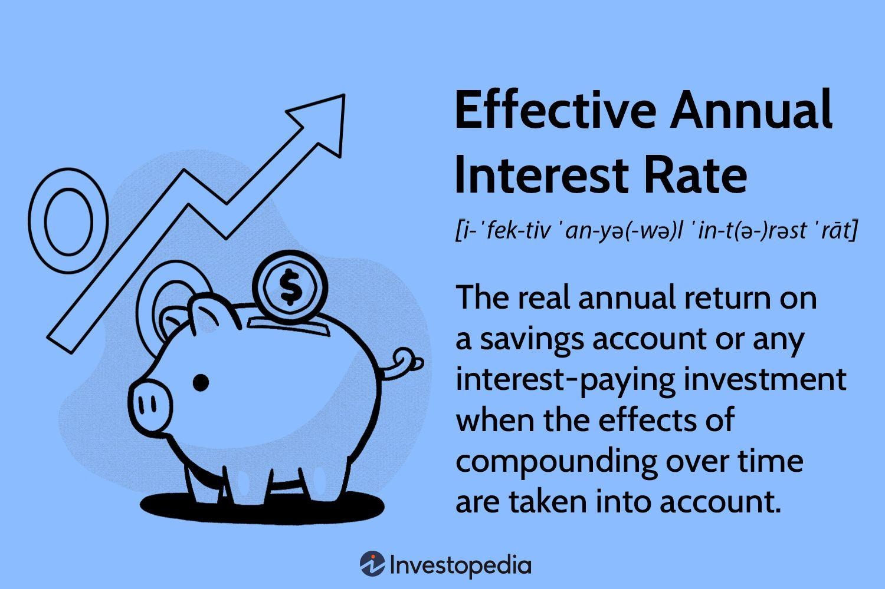

Effective, annual, and stated returns are key financial metrics used to evaluate investment performance. Understanding the distinctions between these types of returns is crucial for investors and traders, particularly in the context of algorithmic trading.

Effective returns refer to the actual annual return an investor experiences as a result of compounding over a period. It is expressed mathematically as:



$$
\text{Effective Annual Return (EAR)} = \left(1 + \frac{r}{n}\right)^n - 1
$$

where $r$ is the nominal rate of interest and $n$ is the number of compounding periods per year. This formula helps convert a nominal interest rate into an effective one, reflecting the true financial return.

Annual return is a broad term often used to denote the year-over-year return on investment. It may be computed simply:

$$
\text{Annual Return} = \frac{\text{Final Value} - \text{Initial Value}}{\text{Initial Value}} \times 100
$$

Stated returns, or nominal returns, refer to the percentage rate without accounting for the effect of compounding. They indicate the periodic [interest rate](/wiki/interest-rate-trading-strategies) that, when not adjusted for compounding, might mislead investors regarding the actual yield of an investment.

Algorithmic trading, an advanced trading method, employs automated pre-programmed trading instructions. This domain leverages both historical data and computational power to facilitate faster and more accurate trades. It's estimated that about 70-80% of U.S. trading [volume](/wiki/volume-trading-strategy) is generated through [algorithmic trading](/wiki/algorithmic-trading) systems. The significance of algorithmic trading lies in its ability to process vast data sets while minimizing human emotions, thereby optimizing trading outcomes.

In trading algorithms, understanding the nuances of different return metrics is indispensable. Algorithms must accurately compute returns to evaluate potential trades effectively, optimize investment strategies, and adjust for risks. Using the right type of return can significantly impact portfolio management, affect decision-making processes, and ultimately influence financial outcomes.

The purpose of this article is to elucidate the concepts of effective, annual, and stated returns, explore their implications in algorithmic trading, and provide practical insights into optimizing trading strategies through precise return utilization. By delving into these elements, the article aims to equip traders and investors with the knowledge needed to refine their algorithmic trading strategies using accurate financial metrics.

## Table of Contents

## Understanding Return on Investment (ROI)

Return on Investment (ROI) is a financial metric widely used to evaluate the efficiency or profitability of an investment or compare the efficiency of several investments. It is typically expressed as a percentage and provides a straightforward way to assess the return relative to the investment’s cost. ROI is calculated using the formula:

$$
\text{ROI} = \left( \frac{\text{Net Profit}}{\text{Cost of Investment}} \right) \times 100
$$

The importance of ROI in trading and investments lies in its simplicity and effectiveness. By quantifying the profitability of an investment, it helps investors make informed decisions and prioritize where to allocate their resources. Understanding ROI is crucial for traders and investors aiming to maximize their gains while minimizing risks.

Various return metrics provide nuanced insights, including effective, annual, and stated returns. Understanding these different returns is essential when evaluating financial products, as they offer diverse perspectives on the growth potential and profitability of investments.

**Effective Return** represents the actual annual return earned or paid on an investment, considering compounding over a specific period. It reflects the true financial outcome derived from compounding and varies depending on the frequency of compounding. The formula to calculate the effective return is:

$$
\text{Effective\ Return} = \left(1 + \frac{r}{n}\right)^{n \times t} - 1
$$

where $r$ is the nominal rate, $n$ is the number of compounding periods per year, and $t$ is the time in years.

**Annual Return**, often referred to as the nominal return, represents the simple interest earned or paid on an investment annually without the effects of compounding. It is a straightforward reflection of what an investor can expect over a year without compounding considerations.

**Stated Return** refers to the rate of return quoted by financial institutions or in financial products, usually not considering the compounding period. This return is also known as the nominal rate and is used to convey the interest rate or yield in basic terms. Often, the stated return does not reflect the actual yield that an investor earns, especially when compounding is frequent.

Evaluating financial products requires a comprehensive understanding of these returns. Effective returns provide a more accurate picture of an investment’s true financial benefits when compared with only annual or stated returns. Investors must discern between these metrics to match their investment expectations accurately. For instance, a bond may advertise a stated return of 5%, but the effective return considering semi-annual compounding might be higher, aligning more closely with the investor's true profit. By evaluating different types of returns, traders can better assess financial products and make strategic choices aligned with their investment goals and risk tolerance. Understanding these metrics is vital for effective portfolio management and optimizing investment outcomes.

## The Difference Between Stated and Effective Annual Return

The stated annual return is a straightforward representation of the interest rate that an investment or financial product is expected to earn over an annual period. This figure doesn't account for compounding that occurs during the investment period, and it is often quoted as the nominal or quoted interest rate. In contrast, the effective annual return takes compounding into account, providing a more accurate reflection of the investment's performance over time. The effective annual return is calculated using the formula:

$$
\text{Effective Annual Return (EAR)} = \left(1 + \frac{r}{n}\right)^n - 1
$$

where $r$ represents the nominal interest rate, and $n$ is the number of compounding periods per year. 

The effective annual return is particularly important for comparing financial products with different compounding periods. For example, a savings account might offer a stated annual interest rate of 6% compounded monthly, while a bond might offer an annual yield of 6% with annual compounding. By calculating the effective annual return for both, one can see which option yields better returns.

### Comparative Analysis
To illustrate the importance of differentiating between stated and effective annual returns, consider two financial products:

1. **Product A**: Offers a stated annual return of 6% compounded monthly.
2. **Product B**: Offers a stated annual return of 6% with annual compounding.

For Product A, using the EAR formula:

$$
\text{EAR}_A = \left(1 + \frac{0.06}{12}\right)^{12} - 1 \approx 0.0617 \, \text{or} \, 6.17\%
$$

For Product B, the EAR is straightforward because there is no additional compounding within the year:

$$
\text{EAR}_B = 6\%
$$

Thus, Product A, due to the effect of monthly compounding, actually provides a higher effective annual return than Product B, even though both advertise a nominal rate of 6%.

### Real-World Examples
Consider a scenario in which an investor is evaluating two potential bank savings accounts. Bank X offers a nominal interest rate of 5% compounded monthly, and Bank Y offers a 5% interest rate compounded annually. At first glance, both banks seem to offer the same rate, but computing the effective annual return reveals a difference:

- **Bank X**: 
  \[ \text{EAR}_X = \left(1 + \frac{0.05}{12}\right)^{12} - 1 \approx 0.0512 \, \text{or} \, 5.12\%
$$

- **Bank Y**: 
  \[ \text{EAR}_Y = 5\%
$$

In this example, the investor would earn more interest on their deposit with Bank X due to the higher effective annual return resulting from more frequent compounding periods. Understanding these differences allows investors to make more informed decisions, leveraging EAR to maximize potential investment returns.

## Role of Algorithmic Trading in Optimizing Returns

Algorithmic trading has transformed the way financial markets operate by allowing trades to be executed at speeds and efficiencies impossible for humans to achieve manually. Algorithms are sets of rules coded to automate trading by scanning for profitable opportunities based on predefined criteria. This approach leverages statistical models and computational resources to make rapid, data-driven decisions. Understanding the different types of returns is critical in the development and optimization of these algorithms, as they play a fundamental role in assessing investment performance and risk.

Algorithms typically incorporate various return metrics in strategy development to evaluate potential trades. The stated return is often used as a preliminary measure of performance, serving as a benchmark that represents the nominal interest rate or profit at the surface level. In contrast, the effective annual return (EAR) accounts for compounding within the period, providing a more accurate depiction of investment performance. In algorithmic strategies, the EAR is particularly valuable for understanding the true impact of compound interest on returns when trades are executed more than once a year or involve reinvestment.

Consider a Python example calculating the effective annual return given a nominal interest rate:

```python
def effective_annual_rate(nominal_rate, compounding_periods):
    return (1 + nominal_rate / compounding_periods) ** compounding_periods - 1

nominal_rate = 0.05  # 5% stated annual return
compounding_periods = 12  # Monthly compounding

ear = effective_annual_rate(nominal_rate, compounding_periods)
print(f"Effective Annual Return: {ear:.2%}")
```

In this code, the function `effective_annual_rate` calculates EAR based on the nominal rate and the frequency of compounding periods. Algorithms using EAR can fine-tune their strategies to exploit precise yield differences that may not be evident from nominal rates alone.

Advantages of algorithmic trading include increased accuracy and speed, reduction in human error, and the capacity to process large volumes of data and execute complex strategies efficiently. Algorithms using effective returns can optimize the timing of buy and sell orders to maximize compounding benefits or manage geometric mean returns effectively.

However, challenges exist such as the need for continuous adjustment of algorithms to adapt to changing market conditions and the complexity of coding and maintaining these systems. Moreover, while algorithmic trading can enhance returns, poor coding, ill-thought-out strategies, or an over-reliance on historical data can lead to substantial financial losses. Hence, it is crucial for developers and traders to build robust systems that incorporate comprehensive testing and risk management measures.

Overall, understanding how different return metrics are embedded into trading strategies allows for more precise financial performance analysis and can lead to a competitive edge in the fast-evolving landscape of algorithmic trading.

## Case Studies and Examples

In the context of algorithmic trading, examining real-world case studies can provide valuable insights into how effective and stated returns impact trading outcomes. One such case study can be drawn from the operations of a quantitative [hedge fund](/wiki/hedge-fund-trading-strategies) that employed algorithmic strategies to optimize portfolio returns.

### Case Study: Quantitative Hedge Fund

The quantitative hedge fund developed an algorithmic trading strategy that leveraged both stated and effective returns in its decision-making processes. The strategy was designed to exploit market inefficiencies by using statistical [arbitrage](/wiki/arbitrage) techniques. The trading algorithms utilized historical data to forecast future price movements and determine potential trade opportunities.

#### Impact of Effective vs. Stated Returns

1. **Stated Returns**:
   Stated returns, often referred to as nominal returns, were used by the fund to benchmark their algorithm's performance against industry standards. The fund defined their stated returns based on annualized percentage gains before accounting for compounding effects. These returns provided an easily comparable metric for assessing short-term performance across different financial products, such as exchange-traded funds (ETFs) and mutual funds.

2. **Effective Returns**:
   Effective returns, considering compound interest, were crucial in the fund's long-term strategy evaluations. Calculated as:
$$
   \text{Effective Annual Return} = \left( 1 + \frac{\text{Stated Return}}{n} \right)^n - 1

$$
   where $n$ is the number of compounding periods per year, effective returns allowed the fund to measure true portfolio growth over time. This metric proved essential for understanding the power of compounding and the resultant impact on net portfolio returns.

#### Trading Outcomes

The case study revealed several important insights:

- The fund observed that relying solely on stated returns could lead to misleading conclusions about trading effectiveness, particularly in scenarios where compounding significantly influenced growth. By integrating effective return calculations, the fund could make more informed decisions on reinvestment strategies and timing.

- Algorithmic adjustments based on discrepancies between stated and effective returns helped the fund fine-tune its strategies. For instance, during volatile market periods, recognizing that effective returns were diverging from stated returns allowed the fund to recalibrate risk management protocols in real time.

### Lessons Learned and Best Practices

1. **Comprehensive Return Analysis**:
   It is crucial to analyze both stated and effective returns to gain a complete picture of investment performance, especially in algorithmic trading contexts where small differences can amplify over numerous trades.

2. **Adaptive Strategy Formulation**:
   The case underscored the importance of flexibility in algorithmic methodologies. Algorithms should be designed to dynamically adjust based on return metrics, ensuring optimization under varying market conditions.

3. **Continuous Data Monitoring**:
   Implementing robust data-monitoring systems to track real-time changes in return metrics can enhance decision-making accuracy and support proactive strategy adjustments.

4. **Compounded Learning**:
   Incorporation of [machine learning](/wiki/machine-learning) models that focus on both stated and effective returns ensured that the algorithms learned from past trade outcomes, improving predictive capabilities.

This detailed analysis highlights the significance of understanding return metrics in algorithmic trading. By leveraging both stated and effective returns, traders can enhance the accuracy and profitability of their strategies.

## Strategies for Traders Using Different Return Metrics

Developing strategies using stated and effective returns requires a comprehensive understanding of both metrics and their implications on trading outcomes. Stated returns often refer to the simple interest or nominal return expressed on a financial product on a yearly basis, without accounting for the effects of compounding. Conversely, the effective annual return (EAR) accommodates the compounding periods within a year, providing a more realistic measure of investment growth.

### Framework for Developing Strategies

1. **Identify Investment Goals:**
   Determine whether your primary objective is income generation, capital appreciation, or risk mitigation. This decision will inform your preference for stated or effective returns. For instance, investments with frequent compounding periods might be better evaluated using the EAR.

2. **Assess Product Characteristics:**
   Understand the products or assets being considered. If an instrument compounds more frequently than annually, the effective return will be crucial in measuring true performance.

3. **Timing and Horizon:**
   Align your strategy with your investment horizon. Short-term strategies may rely more on nominal returns, while long-term approaches require a focus on the effects of compounding captured by effective returns.

4. **Risk Evaluation:**
   Evaluate the risk profile of potential investments. Strategies should incorporate the variability in returns, which can differ significantly between stated and effective rates depending on market conditions and compounding frequencies.

### Tips for Choosing the Right Return Metric

- **Use Stated Return When:** 
  You're dealing with investments that have simple interest and no intermediate compounding periods, making it a straightforward option for calculating expected returns.

- **Opt for Effective Return When:**
  The investment involves multiple compounding periods within the investment term, as this provides a more accurate measure of the return potential.

- **Consider Economic Conditions:**
  In volatile markets, emphasis on effective returns can help assess true growth better, especially for products with variable compounding periods.

### Illustrations of Strategies Leveraging Effective Returns

1. **Compound Investment Strategy:**
   Investors can utilize the power of compounding by re-investing gains to maximize growth. Suppose an investor receives interest payments quarterly; using the formula for effective return:
$$
   \text{EAR} = \left(1 + \frac{i}{n}\right)^n - 1

$$

   where $i$ is the nominal interest rate and $n$ is the number of compounding periods per year, the investor can compare investment vehicles based on their effective returns to ensure optimal growth.

2. **Automated Rebalancing:**
   Algorithmic trading can incorporate effective returns to automate portfolio rebalancing decisions. A Python script example might look like this:

   ```python
   def effective_annual_rate(nominal_rate, compounding_periods):
       return ((1 + nominal_rate / compounding_periods) ** compounding_periods) - 1

   def rebalance_portfolio(portfolio, target_allocation, returns):
       for asset, weight in target_allocation.items():
           target_value = portfolio.total_value * weight
           current_value = portfolio.assets[asset].market_value
           if current_value < target_value:
               portfolio.buy(asset, target_value - current_value)
           else:
               portfolio.sell(asset, current_value - target_value)
       return portfolio
   ```

3. **Risk-Adjusted Strategy:**
   Calculating the Sharpe ratio using effective returns to adjust for risk can guide decisions on asset allocation. By incorporating a more accurate measure of return, traders achieve a clearer picture of risk-adjusted performance.

Strategies rooted in a clear understanding of stated and effective returns can significantly improve traders' ability to align their investments with financial goals, providing a quantitative backbone to decision-making processes in diverse market scenarios.

## Conclusion

In summary, understanding the nuances of return metrics like effective, annual, and stated returns is crucial in the context of algorithmic trading. These metrics offer valuable insights into the real economic gains or losses that traders might experience, beyond what nominal figures may suggest. Effective returns, in particular, account for compounding, providing a more accurate depiction of an investment's profitability over time. Algorithmic trading, which leverages complex algorithms to make automated trading decisions, relies heavily on precise performance metrics to optimize strategies and maximize returns.

Traders are encouraged to apply these insights practically to enhance their trading outcomes. By discerning which return metric aligns best with their trading strategies, they can better assess the risk-return profile of their investments and execute trades more effectively. For example, understanding when to use an effective annual return versus a nominal return can adjust the expectations and align strategies with market realities.

Looking ahead, the evolution of return metrics in trading is likely to be influenced by advancements in computational finance and data analytics. As trading algorithms become more sophisticated, there may be a greater emphasis on integrating multi-dimensional return metrics that combine risk assessments, such as Sharpe ratios or value-at-risk models. Additionally, the rise of [artificial intelligence](/wiki/ai-artificial-intelligence) and machine learning may introduce new paradigms for measuring and predicting returns, potentially leading to the development of proprietary metrics that better capture the nuances of modern financial markets. This ongoing evolution presents both opportunities and challenges, highlighting the need for continuous adaptation and learning in the trading community.

## References & Further Reading

[1]: Bergstra, J., Bardenet, R., Bengio, Y., & Kégl, B. (2011). ["Algorithms for Hyper-Parameter Optimization."](https://dl.acm.org/doi/10.5555/2986459.2986743) Advances in Neural Information Processing Systems 24.

[2]: ["Advances in Financial Machine Learning"](https://www.amazon.com/Advances-Financial-Machine-Learning-Marcos/dp/1119482089) by Marcos Lopez de Prado

[3]: ["Evidence-Based Technical Analysis: Applying the Scientific Method and Statistical Inference to Trading Signals"](https://www.amazon.com/Evidence-Based-Technical-Analysis-Scientific-Statistical/dp/0470008741) by David Aronson

[4]: ["Machine Learning for Algorithmic Trading"](https://github.com/stefan-jansen/machine-learning-for-trading) by Stefan Jansen

[5]: ["Quantitative Trading: How to Build Your Own Algorithmic Trading Business"](https://www.amazon.com/Quantitative-Trading-Build-Algorithmic-Business/dp/1119800064) by Ernest P. Chan