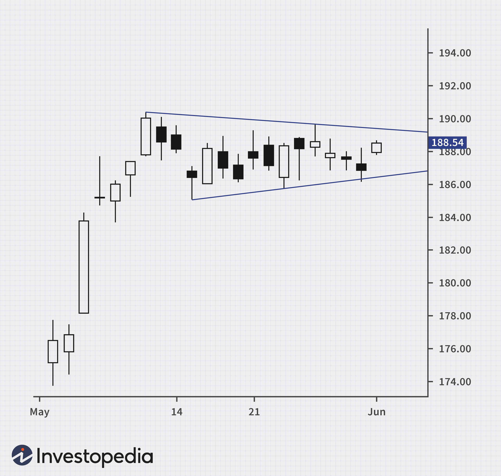

## Table of Contents

## What is a symmetrical triangle pattern in technical analysis?

A symmetrical triangle pattern in technical analysis is a chart pattern that shows price movements getting smaller and smaller over time. It looks like a triangle with two trendlines that come together. One trendline goes up and the other goes down. They meet at a point in the future. This pattern happens when the price keeps going up a little bit and then down a little bit, but each time it goes up or down, it doesn't go as far as before.

Traders watch symmetrical triangles because they can tell them that a big move in the price is coming soon. The price can break out of the triangle and go up or down. If it breaks out to the top, it might mean the price will keep going up. If it breaks out to the bottom, it might mean the price will keep going down. Traders often wait for the price to break out of the triangle before they decide to buy or sell.

## What is a pennant pattern in technical analysis?

A pennant pattern in technical analysis is a small triangle that forms on a chart after a big price move. It looks like a little flag on a pole. The pennant happens when the price goes up or down a lot, then takes a short break and moves sideways in a small triangle shape. This small triangle is the pennant, and the big move before it is the pole.

Traders use pennant patterns to guess what the price might do next. Usually, after the pennant forms, the price breaks out of the triangle and continues in the same direction as the big move before the pennant. If the price went up a lot before the pennant, traders expect it to go up again after the pennant. If it went down a lot, they expect it to go down again. This makes pennants useful for traders who want to join a trend that's already happening.

## How can you identify a symmetrical triangle on a price chart?

To identify a symmetrical triangle on a price chart, you need to look for two trendlines that are coming closer together. One trendline should be drawn along the highs of the price movements, and it should be sloping downward. The other trendline should be drawn along the lows of the price movements, and it should be sloping upward. These two trendlines should meet at some point in the future, forming a triangle shape. The key is that the price keeps swinging up and down, but each swing gets smaller and smaller, until the price is moving in a tighter and tighter range.

Once you see this pattern forming, it's important to wait for the price to break out of the triangle. The [breakout](/wiki/breakout-trading) can happen in either direction, so you need to be ready for the price to go up or down. If the price breaks above the top trendline, it might mean the price will keep going up. If it breaks below the bottom trendline, it might mean the price will keep going down. The breakout is the signal that traders use to decide whether to buy or sell, so watching for it is crucial when you're looking at a symmetrical triangle.

## How can you identify a pennant pattern on a price chart?

To spot a pennant pattern on a price chart, first look for a big move up or down. This big move is called the "pole." After the pole, the price will start to move sideways but in a smaller and smaller range, forming a small triangle. This small triangle is the pennant. The pennant's sides are made by drawing two trendlines that come closer together. One trendline goes along the highs of the price, and the other goes along the lows. The pennant looks like a little flag on the pole.

Once you see the pennant forming, you need to wait for the price to break out of the triangle. The breakout usually happens in the same direction as the pole. If the pole was a big move up, then you expect the price to break out of the pennant and go up again. If the pole was a big move down, then you expect the price to break out of the pennant and go down again. The breakout is the signal that tells traders it's time to buy or sell, so it's important to watch for it when you're looking at a pennant pattern.

## What are the key differences between symmetrical triangles and pennant patterns?

Symmetrical triangles and pennant patterns both look like triangles on a price chart, but they are different in how they form and what they mean. A symmetrical triangle happens when the price moves up and down, but each move gets smaller and smaller. It forms after a time of going sideways and doesn't need a big move before it. The two trendlines of a symmetrical triangle come together, one going up and one going down. Traders watch for the price to break out of the triangle, but it can go up or down. They don't know which way it will go until the breakout happens.

On the other hand, a pennant pattern always comes after a big price move, which is called the pole. The pennant itself is a small triangle that forms right after the pole. The price moves sideways but in a smaller range, making the pennant. The two trendlines of the pennant also come together, but the key difference is that the price usually breaks out of the pennant in the same direction as the pole. If the pole was up, traders expect the price to go up after the pennant. If the pole was down, they expect it to go down. This makes pennants more predictable than symmetrical triangles.

## What are the typical durations for symmetrical triangles and pennant patterns?

Symmetrical triangles can last for different amounts of time. Usually, they take a few weeks to a few months to form. The time it takes depends on how big the price moves are and how long it takes for the price to start moving in a smaller range. Traders need to be patient because symmetrical triangles can take a while to show a clear breakout.

Pennant patterns are usually much shorter than symmetrical triangles. They often last from one to four weeks. Pennants form quickly after a big price move, and the price doesn't take long to start moving sideways in a small triangle. Because pennants are short, traders need to watch them closely to catch the breakout in time.

## How do symmetrical triangles and pennant patterns form in the market?

Symmetrical triangles form in the market when the price starts moving up and down, but each move gets smaller. Imagine the price going up a bit, then down a bit, and each time it goes up or down, it doesn't go as far as before. This makes two lines that come together, one going up and one going down, forming a triangle shape. This happens over a few weeks to a few months. Traders see this pattern and know a big move might be coming soon, but they don't know if the price will go up or down until it breaks out of the triangle.

Pennant patterns form after a big price move, which we call the pole. After the pole, the price starts moving sideways but in a smaller and smaller range. This creates a little triangle that looks like a flag on the pole. The whole thing, from the pole to the pennant, usually takes one to four weeks. Traders watch pennants because the price usually keeps going in the same direction as the pole after the pennant breaks out. So, if the pole was a big move up, they expect the price to go up again after the pennant.

## What are the trading strategies for symmetrical triangles?

When trading symmetrical triangles, the first thing to do is to wait for the price to break out of the triangle. This breakout can happen in either direction, up or down, so traders need to be ready for both. Once the price breaks out, traders can enter a trade in the direction of the breakout. If the price breaks above the top of the triangle, traders might buy, hoping the price will keep going up. If the price breaks below the bottom of the triangle, traders might sell or short, hoping the price will keep going down. It's a good idea to set a stop-loss order just inside the triangle to limit risk if the price moves back the other way.

Another strategy is to look at the [volume](/wiki/volume-trading-strategy) during the breakout. Usually, the volume is low while the symmetrical triangle is forming, but it gets higher when the price breaks out. If the volume goes up a lot during the breakout, it's a stronger signal that the price will keep moving in that direction. Some traders also use other tools, like trend lines or moving averages, to help them decide if the breakout is real or if it might be a fake move. By combining these things, traders can make better decisions about when to enter and [exit](/wiki/exit-strategy) their trades.

## What are the trading strategies for pennant patterns?

When trading pennant patterns, the main thing to do is wait for the price to break out of the pennant. Since pennants usually happen after a big move called the pole, traders expect the price to keep going in the same direction as the pole after the breakout. If the pole was a big move up, traders will buy when the price breaks out of the top of the pennant. If the pole was a big move down, traders will sell or short when the price breaks out of the bottom of the pennant. It's important to set a stop-loss order inside the pennant to protect against the price moving back the other way.

Another strategy is to watch the volume during the breakout. The volume is usually low while the pennant is forming, but it should go up when the price breaks out. A big increase in volume during the breakout is a strong sign that the price will keep moving in that direction. Some traders also use other tools like trend lines or moving averages to help them decide if the breakout is real. By using these things together, traders can make better choices about when to enter and exit their trades.

## How do volume patterns differ in symmetrical triangles versus pennant patterns?

In symmetrical triangles, the volume usually gets smaller as the triangle forms. This means fewer people are trading while the price moves up and down in a smaller range. When the price breaks out of the triangle, the volume should go up a lot. This big increase in volume shows that more people are trading and it's a strong sign that the price will keep moving in the direction of the breakout. If the volume doesn't go up much during the breakout, it might mean the breakout isn't strong and the price could go back into the triangle.

In pennant patterns, the volume also gets smaller while the pennant is forming, just like in symmetrical triangles. But when the price breaks out of the pennant, the volume should go up a lot too. This big increase in volume is important because it shows that more people are trading and it's likely the price will keep going in the same direction as the big move, or pole, that happened before the pennant. The main difference is that with pennants, traders expect the price to move in the same direction as the pole, so the volume increase during the breakout confirms this expectation.

## What are the psychological factors influencing the formation of symmetrical triangles and pennant patterns?

Symmetrical triangles form when people in the market can't decide if the price will go up or down. At first, some think the price will go up, so they buy and the price goes up a bit. Then others think it will go down, so they sell and the price goes down a bit. But each time, the price doesn't go as far up or down as before. This back-and-forth happens because traders are unsure and waiting for a clear sign. The smaller price moves show that people are less sure about what will happen next, and they're waiting to see which way the price will break out.

Pennant patterns form after a big price move, called the pole, which happens because a lot of people suddenly think the price will go up or down. After this big move, the price takes a short break and moves sideways in a smaller range, forming the pennant. This happens because some traders want to take a break and see if the big move will keep going. Others might think the big move was too fast and want to wait for a better price. The pennant forms as people are deciding if the big move was right or if they should change their minds. When the price breaks out of the pennant, it usually goes in the same direction as the pole, showing that the big move was strong enough to keep going.

## How do symmetrical triangles and pennant patterns perform in different market conditions, and what are the success rates of these patterns?

Symmetrical triangles and pennant patterns can work well in different market conditions, but they might work better in some than others. Symmetrical triangles can form in any market, whether it's going up, going down, or staying the same. They show that people are unsure about what will happen next. Because of this, symmetrical triangles can be a bit harder to trade, especially in markets that are moving a lot. But if the price breaks out clearly with a lot of trading, symmetrical triangles can be good for making money. In markets that are quiet and not moving much, symmetrical triangles might not break out as strongly, so they might not be as good to trade.

Pennant patterns usually form in markets that are already moving a lot, either up or down. They happen after a big move, so they show that the market is excited and people want to keep the big move going. Pennant patterns often work better in strong trending markets because the price usually keeps going in the same direction as the big move before the pennant. In markets that are not moving much, pennant patterns might not be as good because the big move might not be strong enough to keep going after the pennant. The success rate for pennant patterns can be higher than for symmetrical triangles because they are more predictable, but it still depends a lot on the market conditions.

## References & Further Reading

[1]: Bergstra, J., Bardenet, R., Bengio, Y., & Kégl, B. (2011). ["Algorithms for Hyper-Parameter Optimization."](https://papers.nips.cc/paper/4443-algorithms-for-hyper-parameter-optimization) Advances in Neural Information Processing Systems 24.

[2]: ["Advances in Financial Machine Learning"](https://www.amazon.com/Advances-Financial-Machine-Learning-Marcos/dp/1119482089) by Marcos Lopez de Prado

[3]: ["Evidence-Based Technical Analysis: Applying the Scientific Method and Statistical Inference to Trading Signals"](https://www.amazon.com/Evidence-Based-Technical-Analysis-Scientific-Statistical/dp/0470008741) by David Aronson

[4]: ["Machine Learning for Algorithmic Trading"](https://github.com/PacktPublishing/Machine-Learning-for-Algorithmic-Trading-Second-Edition) by Stefan Jansen

[5]: ["Quantitative Trading: How to Build Your Own Algorithmic Trading Business"](https://www.amazon.com/Quantitative-Trading-Build-Algorithmic-Business/dp/1119800064) by Ernest P. Chan