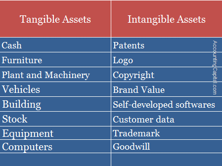

## Table of Contents

## What are tangible assets?

Tangible assets are physical items that you can see and touch. They have a clear value and can be used to help a business make money or to store value. Examples of tangible assets include buildings, machinery, vehicles, and inventory. These assets are important because they can be sold if a business needs money quickly.

Tangible assets are different from intangible assets, which are things like patents, trademarks, and brand recognition. While you can't touch intangible assets, they can still be very valuable to a business. Tangible assets, on the other hand, are often easier to value and sell. This makes them a key part of a company's balance sheet and financial health.

## What are intangible assets?

Intangible assets are things that you can't touch or see, but they still have value. They are important for businesses because they help make money in ways that are not physical. Examples of intangible assets include things like patents, which give a company the right to make or sell a new invention, trademarks, which protect a company's brand name or logo, and copyrights, which protect creative works like books or music. Another example is brand recognition, which is how well people know and trust a company's name.

Even though you can't hold intangible assets in your hand, they can be very valuable. For example, a well-known brand like Coca-Cola can make a lot of money just because people trust and like the brand. Intangible assets can be harder to value than tangible assets because their worth depends on things like how much people like the brand or how much money the patent might make in the future. But they are still an important part of a company's value and can help it grow and succeed.

## Can you give examples of tangible assets?

Tangible assets are things you can touch and see. They are important for businesses because they help make money or store value. Some examples of tangible assets are buildings, like the office where a company works or the store where it sells things. Another example is machinery, like the machines that make products in a factory. Vehicles are also tangible assets, like the trucks a company uses to deliver goods.

Another type of tangible asset is inventory. This is the products a company has ready to sell. For example, a clothing store's inventory might be the shirts and pants on the shelves. Computers and office equipment, like desks and chairs, are also tangible assets. These are things that help a business run every day.

Tangible assets are important because they can be sold if a business needs money quickly. They are different from intangible assets, which you can't touch, like patents or brand names. Tangible assets are often easier to value and sell, making them a key part of a company's financial health.

## Can you give examples of intangible assets?

Intangible assets are things you can't touch but still have value. They help businesses make money in ways that are not physical. Some examples of intangible assets are patents, which give a company the right to make or sell a new invention. Trademarks are another example, and they protect a company's brand name or logo. Copyrights are also intangible assets, and they protect creative works like [books](/wiki/algo-trading-books), music, or movies.

Another important intangible asset is brand recognition. This is how well people know and trust a company's name. For example, a well-known brand like Coca-Cola can make a lot of money just because people trust and like the brand. Intangible assets can be hard to value because their worth depends on things like how much people like the brand or how much money a patent might make in the future. But they are still very important for a company's value and can help it grow and succeed.

## How are tangible assets valued?

Tangible assets are things you can touch and see, like buildings, machines, and inventory. To figure out how much they are worth, people look at what they cost to buy and how much they have been used. For example, if a company bought a machine for $10,000, they might subtract some value each year to show that the machine is getting older and might not work as well. This is called depreciation. The value of the machine goes down over time, but it still has worth because it helps the company make things.

Another way to value tangible assets is to see what similar items are selling for in the market. If another company is selling a similar machine for $8,000, that can help decide what the first company's machine is worth. Sometimes, tangible assets can be sold quickly if a company needs money, so knowing their value is important. This helps companies understand their financial health and make good decisions about buying, selling, or using their assets.

## How are intangible assets valued?

Valuing intangible assets can be tricky because they are things you can't touch, like patents, trademarks, and brand recognition. To figure out their value, people often look at how much money they might make in the future. For example, if a patent helps a company make a new product that will sell well, the patent could be worth a lot of money. Another way to value intangible assets is to see how much it would cost to replace them. If it would be expensive to build a brand from scratch, then the existing brand is valuable.

Sometimes, people use a method called the market approach to value intangible assets. This means looking at what similar intangible assets have sold for recently. If another company sold a similar patent for a certain amount, that can help decide what the first company's patent is worth. Valuing intangible assets is important because they can be a big part of what makes a company successful, even if you can't see or touch them.

## What are the key differences between tangible and intangible assets?

Tangible assets are things you can see and touch, like buildings, machines, and inventory. They are important because they help a business make money or store value. You can easily figure out how much tangible assets are worth by looking at what they cost to buy and how much they have been used. If a company needs money quickly, they can sell these assets. Tangible assets are different from intangible assets because they are physical and easier to value and sell.

Intangible assets are things you can't touch, like patents, trademarks, and brand recognition. They are important because they help a business make money in ways that are not physical. Valuing intangible assets is harder because their worth depends on things like how much money they might make in the future or how much it would cost to replace them. Even though you can't see or touch intangible assets, they can be very valuable and help a company grow and succeed.

## How do tangible and intangible assets impact a company's financial statements?

Tangible assets show up on a company's financial statements in a clear way. They are listed on the balance sheet under assets, often as property, plant, and equipment. These assets are important because they help the company make money. Over time, tangible assets lose value through something called depreciation, which is also shown on the financial statements. This means the value of the asset goes down each year, but it still helps the company. If a company sells a tangible asset, that money shows up on the income statement as a gain or loss, depending on how much the asset was sold for compared to its value on the books.

Intangible assets also show up on the balance sheet, but they are listed separately from tangible assets. They might be things like patents, trademarks, or brand recognition. These assets don't lose value in the same way tangible assets do, but they can still be worth a lot of money. Sometimes, a company has to check if the value of an intangible asset has gone down, which is called impairment. If it has, that change is shown on the financial statements. Intangible assets can help a company make money in ways that are hard to see, like through a strong brand, so they are important even if you can't touch them.

## What are the risks associated with tangible assets?

Tangible assets can be risky because they can get damaged or wear out over time. If a company's machines break down, it might cost a lot of money to fix them or buy new ones. This can hurt the company's profits and make it hard to keep making things. Also, if a company has a lot of money tied up in tangible assets, it might not have enough cash to pay for other things it needs, like salaries or bills.

Another risk is that tangible assets can lose value if the market changes. For example, if a company buys a building and then the real estate market goes down, the building might be worth less than what the company paid for it. This can make it hard to sell the asset if the company needs money quickly. Plus, if a company relies too much on tangible assets, it might not be able to grow or change as easily as companies that have more flexible assets.

## What are the risks associated with intangible assets?

Intangible assets like patents and trademarks can be risky because they might lose value if people stop liking the brand or if the law changes. For example, if a company has a patent for a product but then someone invents something better, the patent might not be worth as much. Also, if people start to think less of a brand, the company's brand recognition can go down, which can hurt how much money the company makes.

Another risk with intangible assets is that they can be hard to protect. If someone copies a company's trademark or uses its patented technology without permission, it can be hard and expensive to stop them. This can mean the company loses money and has to spend a lot on legal fees. So, even though intangible assets can help a company make money, they come with risks that the company needs to watch out for.

## How do businesses manage and protect their tangible assets?

Businesses take good care of their tangible assets to make sure they last a long time and keep working well. They do regular checks and maintenance on things like machines and buildings. This helps stop small problems from turning into big ones that cost a lot to fix. They also keep track of their inventory to make sure nothing gets lost or stolen. If something does get damaged, businesses have insurance to help pay for repairs or replacements.

To protect their tangible assets, businesses use different methods. They might put locks on doors and use security cameras to watch over their buildings and equipment. They also keep important documents safe in fireproof safes or secure online systems. Sometimes, businesses will lease or rent their assets instead of buying them outright. This can help them save money and avoid the risk of the asset losing value over time. By doing these things, businesses can make sure their tangible assets stay valuable and useful.

## How do businesses manage and protect their intangible assets?

Businesses take care of their intangible assets like patents and trademarks by making sure they are legally protected. They do this by registering their patents and trademarks with the right government offices. This helps stop other people from using their ideas or brand without permission. If someone does try to copy their intangible assets, the business can take them to court to protect their rights. They also keep an eye on how well their brand is doing by doing surveys and watching what people say about them online.

To make sure their intangible assets keep making money, businesses often spend a lot on marketing and advertising. This helps keep their brand strong and well-known. They also make sure their employees know how important these assets are and train them to use and protect them properly. By doing these things, businesses can make sure their intangible assets stay valuable and help them succeed.

## What is the understanding of tangible assets?

Tangible assets are physical items with intrinsic value characterized by their material presence and identifiable worth in financial markets. Examples include real estate, machinery, and inventory, all of which can be directly perceived, measured, and typically hold significant market value. These assets serve as collateral in financial transactions due to their concrete nature, offering assurance to lenders and reducing the perceived risk involved in lending activities.

The valuation of tangible assets is generally straightforward, relying on market-based metrics and periodic appraisals to ensure that their assessed value aligns with current economic conditions. This valuation process involves comparing similar asset sales, assessing current replacements costs, and analyzing income-generating potential. For example, Appraisers often use the formula:

$$
\text{Market Value} = (\text{Asset Value}) + (\text{Present Value of Future Income})
$$

While providing a clear picture of an asset's worth, tangible asset valuation must adapt to economic shifts to remain relevant.

Investors often gravitate towards tangible assets due to their perceived stability and potential to generate income through sales or leasing. A property can generate rental income or appreciate over time, making tangible assets a relatively risk-averse investment option. The tangible nature of these assets provides a sense of security, particularly in volatile financial climates.

However, tangible assets come with challenges, including maintenance costs and depreciation. Maintenance is essential to preserve an asset's value and functionality, particularly for machinery and real estate. These ongoing costs can impact profitability and alter perceived investment stability. Depreciation, the gradual reduction in asset value over time due to wear and tear or obsolescence, can also erode returns. Managing these factors involves systematic tracking and budgeting for repairs, utilizing depreciation methods such as the straight-line or declining balance methods. For example, the straight-line depreciation formula is:

$$
\text{Depreciation Expense} = \frac{\text{Cost of Asset} - \text{Salvage Value}}{\text{Useful Life}}
$$

In summary, tangible assets play a crucial role in financial portfolios by offering stability and income potential, tempered by maintenance and depreciation challenges. Understanding these dynamics is vital for investors aiming to leverage tangible assets effectively within their investment strategies.

## References & Further Reading

[1]: Bergstra, J., Bardenet, R., Bengio, Y., & Kégl, B. (2011). ["Algorithms for Hyper-Parameter Optimization."](https://papers.nips.cc/paper/4443-algorithms-for-hyper-parameter-optimization) Advances in Neural Information Processing Systems 24.

[2]: ["Advances in Financial Machine Learning"](https://www.amazon.com/Advances-Financial-Machine-Learning-Marcos/dp/1119482089) by Marcos Lopez de Prado

[3]: ["Evidence-Based Technical Analysis: Applying the Scientific Method and Statistical Inference to Trading Signals"](https://www.amazon.com/Evidence-Based-Technical-Analysis-Scientific-Statistical/dp/0470008741) by David Aronson

[4]: ["Machine Learning for Algorithmic Trading"](https://github.com/stefan-jansen/machine-learning-for-trading) by Stefan Jansen

[5]: ["Quantitative Trading: How to Build Your Own Algorithmic Trading Business"](https://www.amazon.com/Quantitative-Trading-Build-Algorithmic-Business/dp/1119800064) by Ernest P. Chan