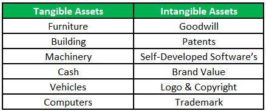

Understanding the different types of assets is fundamental in finance for developing effective investment strategies. This article will compare tangible and intangible assets and explore the role of algorithmic trading in managing these assets. Tangible assets, including real estate and machinery, provide concrete value and stability, making them appealing for investors looking for steady returns and collateral options. In contrast, intangible assets like patents and intellectual property, although lacking physical presence, are crucial for a company's competitive positioning and long-term growth, especially in technology-centric industries.

Algorithmic trading, or algo trading, introduces a sophisticated approach to asset management by utilizing computer algorithms for executing trades. This trading method enhances the decision-making process by incorporating real-time data analysis and removing emotional biases, thereby optimizing investment strategies. By applying algorithmic trading techniques, investors can efficiently manage both tangible and intangible assets, ensuring portfolios are swiftly adjusted to reflect market changes and capitalize on profitable opportunities.

Throughout this article, you will gain insights into the distinguishing features of tangible and intangible assets and understand the profound impact algorithmic trading has on asset management and investment decision-making. By the end, you will be equipped with a thorough understanding of these critical concepts and their practical applications in today's dynamic financial markets.

## Table of Contents

## Understanding Tangible Assets

Tangible assets are physical items with intrinsic value characterized by their material presence and identifiable worth in financial markets. Examples include real estate, machinery, and inventory, all of which can be directly perceived, measured, and typically hold significant market value. These assets serve as collateral in financial transactions due to their concrete nature, offering assurance to lenders and reducing the perceived risk involved in lending activities.

The valuation of tangible assets is generally straightforward, relying on market-based metrics and periodic appraisals to ensure that their assessed value aligns with current economic conditions. This valuation process involves comparing similar asset sales, assessing current replacements costs, and analyzing income-generating potential. For example, Appraisers often use the formula:

$$
\text{Market Value} = (\text{Asset Value}) + (\text{Present Value of Future Income})
$$

While providing a clear picture of an asset's worth, tangible asset valuation must adapt to economic shifts to remain relevant.

Investors often gravitate towards tangible assets due to their perceived stability and potential to generate income through sales or leasing. A property can generate rental income or appreciate over time, making tangible assets a relatively risk-averse investment option. The tangible nature of these assets provides a sense of security, particularly in volatile financial climates.

However, tangible assets come with challenges, including maintenance costs and depreciation. Maintenance is essential to preserve an asset's value and functionality, particularly for machinery and real estate. These ongoing costs can impact profitability and alter perceived investment stability. Depreciation, the gradual reduction in asset value over time due to wear and tear or obsolescence, can also erode returns. Managing these factors involves systematic tracking and budgeting for repairs, utilizing depreciation methods such as the straight-line or declining balance methods. For example, the straight-line depreciation formula is:

$$
\text{Depreciation Expense} = \frac{\text{Cost of Asset} - \text{Salvage Value}}{\text{Useful Life}}
$$

In summary, tangible assets play a crucial role in financial portfolios by offering stability and income potential, tempered by maintenance and depreciation challenges. Understanding these dynamics is vital for investors aiming to leverage tangible assets effectively within their investment strategies.

## Insights into Intangible Assets

Intangible assets represent key components of a company's value, encompassing non-physical elements such as patents, trademarks, goodwill, and intellectual property. These assets often pose challenges in quantification due to their abstract nature, yet they frequently constitute a substantial portion of a company's overall worth, particularly in industries driven by technology and innovation.

Unlike their tangible counterparts, intangible assets do not have a physical form, making their valuation complex and often subjective. Accounting for intangibles involves recognizing these elements on a company's balance sheet, though the lack of physical presence requires alternative valuation methods, such as discounted cash flow analysis, to estimate their potential contribution to future earnings.

Intangible assets provide organizations with competitive advantages by differentiating their products and services in the market. For instance, patented technology can protect inventions from replication, allowing a company to maintain a monopoly over a product or process. Similarly, strong brand recognition achieved through trademarks can lead to customer loyalty, resulting in sustained revenue streams and market share.

The role of intangibles is increasingly critical in fostering long-term growth and profitability. Intellectual property rights, for example, can lead to lucrative licensing agreements and partnerships, enhancing a company's income potential. Furthermore, goodwill—often arising from mergers and acquisitions—can reflect the premium value of synergies and competitive positioning that one company holds over others.

Despite the lack of immediate [liquidity](/wiki/liquidity-risk-premium) often associated with intangible assets, their potential for appreciation and significant revenue generation remains a compelling [factor](/wiki/factor-investing) for investors. This potential is particularly evident in sectors where innovation and brand value are primary drivers of success. An effective management strategy for these assets involves continuously assessing their worth and exploring opportunities for optimization and monetization. 

As intangible assets continue to shape modern economies, understanding their complexities and implications becomes crucial for companies aiming to leverage these non-physical entities for strategic growth.

## Comparative Analysis: Tangible vs. Intangible Assets

Tangible and intangible assets each play unique roles in a company's financial strategy, influencing both short-term liquidity and long-term value appreciation. Tangible assets, such as real estate, machinery, and inventory, offer stability due to their physical presence and established market value. They typically provide liquidity, as these assets can be sold or leased to generate immediate cash flow. However, tangible assets are also subject to depreciation, which reduces their value over time and requires ongoing maintenance to preserve their worth.

Conversely, intangible assets encompass non-physical entities like patents, trademarks, and goodwill. These assets do not depreciate in the traditional sense, although they may experience amortization over their useful life. Instead, intangible assets can appreciate as they enhance a company's competitive position, brand strength, or intellectual capital. This potential for growth makes them attractive in industries driven by innovation and intellectual property, such as technology and pharmaceuticals.

A significant distinction between these asset types lies in their financial statement representation, impacting balance sheets and overall valuation. Tangible assets appear as fixed or current assets and are typically straightforward to value. Intangible assets, on the other hand, may require more subjective valuation methods, often involving discounted cash flow analysis or other financial modeling techniques.

Investment strategies must account for these differences. Tangible assets, with their predictable income streams, are favored by risk-averse investors seeking stability. In contrast, intangible assets offer opportunities for growth and higher returns, albeit with higher risk due to market perception variability and the challenges in accurately predicting their future value.

Both tangible and intangible assets come with distinct risks. Tangible assets can be affected by market [volatility](/wiki/volatility-trading-strategies), changes in demand, and physical deterioration. Intangible assets are subject to shifts in market perception, regulatory changes, and the ever-evolving competitive landscape.

To mitigate these risks and harness the benefits of both asset types, investors should aim for a balanced portfolio that includes a mix of tangible and intangible assets. Such a strategy not only diversifies risk but also capitalizes on the respective strengths of each asset category, optimizing returns in alignment with the investor's financial goals.

## The Role of Algorithmic Trading in Asset Management

Algorithmic trading, commonly referred to as 'algo trading,' employs computer algorithms to automate trading decisions in financial markets. These algorithms are designed to execute trades based on pre-determined criteria, enabling rapid trade execution that enhances the management of tangible and intangible assets. By leveraging this methodology, investors can optimize their strategies through precision and speed that human trading cannot match.

The core advantage of [algorithmic trading](/wiki/algorithmic-trading) lies in its ability to process vast amounts of complex variables and real-time data. This capacity for data analysis offers investors a significant competitive edge by identifying market trends and opportunities swiftly and accurately. For instance, algorithms can analyze price movements, economic indicators, and even social media sentiment to predict market conditions and execute trades before trends fully materialize.

In asset management, the agility of algorithms allows for prompt reactions to market fluctuations. This responsiveness is crucial for capitalizing on favorable conditions that may arise for both types of assets. For tangible assets, this might involve trading based on supply chain updates or geopolitical developments. Conversely, intangible assets, such as intellectual property, can benefit from market shifts related to technological advancements or changes in regulatory environments.

Moreover, algo trading significantly reduces emotional biases that often impair human decision-making. Emotional influences such as fear or greed can lead to inconsistent investment strategies and potential losses. By contrast, algorithmic systems operate methodically, maintaining discipline and consistency regardless of market volatility. This discipline is vital in adhering to long-term investment strategies, ensuring decisions are made based on empirical evidence rather than speculative impulses.

In summary, the integration of algorithmic trading in asset management offers numerous advantages, including rapid trade execution, enhanced data analysis, and reduced emotional biases. These benefits contribute to a more efficient, systematic approach to managing both tangible and intangible assets, ultimately leading to more consistent investment outcomes.

## Integration of Algo Trading with Asset Classes

Algorithmic trading, a sophisticated form of trading driven by algorithms, plays a significant role in the ongoing management of investment portfolios comprising both tangible and intangible assets. The integration of algorithmic trading facilitates enhanced portfolio monitoring and rebalancing, benefiting from its capacity to swiftly execute trades according to predefined criteria. This capability is particularly useful in minimizing the risks posed by market fluctuations, a critical consideration when handling diverse asset classes.

A core advantage of using algorithmic trading lies in its reliance on predictive analytics, which enables proactive rather than reactive trading decisions. Algorithms analyze vast datasets in real time, employing statistical models and [machine learning](/wiki/machine-learning) techniques to predict future market movements. By executing timely trades aligned with these predictions, algorithms help safeguard portfolios against unexpected market shifts, thereby preserving asset value and stabilizing returns.

For tangible assets, which are often prone to valuation swings due to external economic factors, algorithms can be specifically programmed to hedge positions. Hedging strategies might involve derivatives like options and futures, adjusting positions dynamically to offset potential losses in the asset’s market value. For instance, consider a portfolio heavily weighted in real estate—an algorithm could utilize futures contracts to hedge against a predicted downturn in the property market.

Conversely, in the case of intangible assets, algorithmic trading systems can be leveraged to identify and capitalize on growth opportunities. Given the less tangible nature of these assets, such as patents and goodwill, which might not directly impact cash flow immediately, algorithms can focus on spotting undervalued opportunities. They may use methods like sentiment analysis of market news or patent citation trends to assess potential upside.

The strategic integration of algorithmic trading into asset management also fosters improved diversification strategies and asset allocation. By systematically re-evaluating asset correlations and diversification metrics, intelligent algorithms can optimize the mix of asset classes in a portfolio, enhancing performance while mitigating risks. This continual reassessment ensures that the portfolio remains aligned with the investor's objectives and risk tolerance over time.

Ultimately, the synergy between algorithmic trading and asset management presents an opportunity for achieving superior returns through automation-enhanced strategy execution. By maintaining disciplined adherence to strategy parameters and minimizing emotional biases in decision-making, algorithmic trading provides a robust framework for sustained investment performance across varied market conditions. In an era where data-driven insights dominate financial markets, the integration of algorithmic trading with asset classes represents a forward-thinking approach, positioning investors to better navigate the complexities of modern financial landscapes.

## Conclusion

Both tangible and intangible assets are crucial components of a diversified investment portfolio. Understanding their differences is essential for making informed investment decisions that align with individual financial goals. Tangible assets, with their concrete presence and often stable value, provide a sense of security and liquidity. While they may depreciate over time, their physical nature can offer collateral potential and direct income opportunities.

On the other hand, intangible assets, though lacking physical form, frequently embody significant value, especially in sectors driven by innovation and technology. They often hold the potential for substantial appreciation over time, contributing to long-term growth and competitive advantages for businesses.

The emergence of algorithmic trading has significantly transformed asset management, enhancing efficiency through data-driven processes. By integrating algorithms, investors can mitigate emotional biases and make timely decisions, tapping into real-time data to adjust strategies for tangible and intangible assets alike. This approach supports the construction of optimized investment strategies aimed at achieving enhanced returns.

Investors who cultivate a robust understanding of these asset types and leverage algorithmic trading are better equipped to navigate today's dynamic financial landscape. By staying informed and adaptable, one can seize emerging opportunities and effectively manage a diversified portfolio to achieve one's financial objectives.

## References & Further Reading

[1]: Bergstra, J., Bardenet, R., Bengio, Y., & Kégl, B. (2011). ["Algorithms for Hyper-Parameter Optimization."](https://papers.nips.cc/paper/4443-algorithms-for-hyper-parameter-optimization) Advances in Neural Information Processing Systems 24.

[2]: ["Advances in Financial Machine Learning"](https://www.amazon.com/Advances-Financial-Machine-Learning-Marcos/dp/1119482089) by Marcos Lopez de Prado

[3]: ["Evidence-Based Technical Analysis: Applying the Scientific Method and Statistical Inference to Trading Signals"](https://www.amazon.com/Evidence-Based-Technical-Analysis-Scientific-Statistical/dp/0470008741) by David Aronson

[4]: ["Machine Learning for Algorithmic Trading"](https://github.com/stefan-jansen/machine-learning-for-trading) by Stefan Jansen

[5]: ["Quantitative Trading: How to Build Your Own Algorithmic Trading Business"](https://www.amazon.com/Quantitative-Trading-Build-Algorithmic-Business/dp/1119800064) by Ernest P. Chan