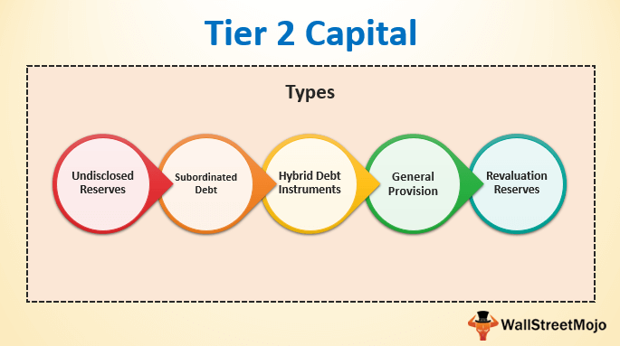

The banking sector operates within a framework of regulations designed to promote financial stability and ensure effective risk management. Among these regulatory measures, capital requirements, particularly Tier 1 and Tier 2 capital, play a pivotal role in the resilience and sustainability of financial institutions. Tier 1 capital, comprising primarily common equity and retained earnings, represents the core financial basis of banks, ensuring they possess the necessary resources to absorb shocks and sustain operations. In contrast, Tier 2 capital includes supplementary financial instruments such as subordinated debt which provide additional layers of security.

This article will investigate the significance of these capital tiers in meeting banking capital requirements. By examining how these capital structures underpin banking operations, the discussion will outline their critical function in safeguarding banks against potential financial disruptions. Furthermore, the interplay between these capital requirements and contemporary strategies such as algorithmic trading will be explored. Algorithmic trading has transformed financial markets by enabling rapid and high-volume transactions, necessitating a nuanced approach to risk and capital management.



Understanding the interrelation between capital requirements and advanced trading methodologies is essential for various stakeholders, including regulators, bankers, and investors, to navigate the complexities of modern financial markets. As the financial sector continues to evolve, a comprehensive grasp of these foundational concepts is indispensable for ensuring the sector's long-term stability and growth.

## Table of Contents

## Understanding Tier 1 and Tier 2 Capital

Tier 1 and Tier 2 capital are fundamental components of a bank's capital structure, each serving distinct roles in measuring financial health and resilience. Tier 1 capital, often referred to as 'core' capital, is the primary source of financial strength and stability for a bank. It is composed of common equity, retained earnings, and certain types of preferred stock. These elements are considered the most secure and readily available financial resources that can absorb losses, keeping the bank solvent during times of financial stress.

Common equity tier 1 (CET1) capital, a subset of Tier 1 capital, is especially critical, comprising the bank's core capital without any deductions, such as goodwill or deferred tax assets. Retained earnings, the cumulative profit that has been reinvested in the bank rather than distributed as dividends, also form an integral part of Tier 1 capital, further supporting the bank's ability to maintain operations and absorb losses.

Tier 2 capital, on the other hand, is considered 'supplementary' capital and includes instruments such as subordinated debt and hybrid instruments. These financial resources are less secure than Tier 1 capital, as they are not as readily available to absorb losses. However, they provide an additional layer of risk mitigation that contributes to a bank's overall financial stability.

The distinction between Tier 1 and Tier 2 capital is crucial for assessing a bank's financial health. Regulatory bodies, including the Basel Committee on Banking Supervision, mandate minimum levels of both capital tiers to safeguard the banking system. Basel III, for example, stipulates higher minimum capital requirements, with an emphasis on increasing the quality and quantity of Tier 1 capital. This framework ensures that banks hold sufficient capital to cover unexpected losses, thus minimizing the risk of bank failures and promoting overall financial stability.

By maintaining a strong capital base, banks can not only comply with regulatory requirements but also instill confidence in stakeholders, including investors, depositors, and regulators. Achieving an optimal balance between Tier 1 and Tier 2 capital is a strategic endeavor that helps banks manage risk, ensure solvency, and protect the interests of all parties involved.

## Banking Capital Requirements

Banking capital requirements are essential regulations that ensure banks maintain adequate capital to absorb losses and protect depositors. These requirements serve as a buffer against financial distress and help promote overall stability within the financial system. By enforcing these standards, regulators aim to prevent bank failures, which can have widespread economic repercussions.

A key component of these regulations is the Basel III framework, a global initiative developed by the Basel Committee on Banking Supervision. Basel III was introduced in response to the deficiencies revealed by the 2007-2008 financial crisis and emphasizes the need for banks to hold higher levels of Tier 1 capital. Tier 1 capital, considered the most secure form of capital, consists of common equity and retained earnings. By prioritizing Tier 1 capital, Basel III enhances the financial resilience and solvency of banks.

Compliance with Basel III and other regulatory frameworks is vital for banks to maintain their operational licenses and instill market confidence. Banks are obligated to regularly evaluate their capital structures to ensure alignment with these evolving standards. This continuous assessment process involves stress testing and scenario analysis to determine capital adequacy in varying economic conditions.

The implementation of these capital requirements involves a meticulous calculation of risk-weighted assets (RWA) and the capital required to cover them. The capital adequacy ratio (CAR), expressed as:

$$
\text{CAR} = \frac{\text{Tier 1 Capital + Tier 2 Capital}}{\text{Risk-Weighted Assets}}
$$

must meet a minimum threshold as outlined by regulatory authorities. A higher CAR indicates a more robust capital position, capable of withstanding financial shocks.

Banks' adherence to capital requirements is scrutinized by regulatory bodies, which impose strict penalties for non-compliance. This regulatory oversight ensures that banks engage in sound risk management practices and remain prepared to face potential financial adversities. By upholding these standards, banking institutions support their long-term sustainability and safeguard systemic stability.

## The Role of Algorithmic Trading in Banking

Algorithmic trading has transformed financial markets by enabling high-speed and high-[volume](/wiki/volume-trading-strategy) trading activities. Through the application of sophisticated algorithms and mathematical models, banks execute trades with precision and at optimal times, significantly enhancing their investment strategies. These algorithms assess multiple market parameters and data points in real time, ensuring that trades are executed under the best possible market conditions.

Banks benefit from [algorithmic trading](/wiki/algorithmic-trading) by enhancing market efficiency and optimizing the use of available resources. This approach minimizes human error and capitalizes on fleeting opportunities in volatile markets. Consequently, the implementation of algorithmic trading enables banks to improve [liquidity](/wiki/liquidity-risk-premium) and reduce transaction costs, giving them a competitive advantage in the financial landscape.

However, the integration of algorithmic trading in banking operations necessitates a comprehensive approach to capital management. With increased market exposure comes increased risk, making it essential for banks to align their capital requirements with these advanced trading strategies. Banks must ensure they have adequate capital reserves to absorb potential losses and meet regulatory standards.

Risk management becomes pivotal as banks strive to balance risk and return in algorithmic trading. They must develop robust systems to predict and mitigate potential risks associated with high-frequency trades to maintain financial stability. By doing so, banks not only protect their capital but also position themselves favorably in the competitive market arena.

Adopting algorithmic trading strategies requires banks to continually refine and adapt their models to capitalize on market shifts. This adaptability is key to sustaining growth and ensuring resilience against the unpredictabilities present in modern financial markets.

## Intersection of Capital Requirements and Algorithmic Trading

The intersection of capital requirements and algorithmic trading emphasizes the importance of robust risk management practices within banking operations. Algorithmic trading influences a bank's risk profile due to its capacity for executing high-speed and high-volume trades, which can introduce significant [volatility](/wiki/volatility-trading-strategies) and market exposure. Consequently, banks must continuously reassess their capital allocations, particularly concerning Tier 1 and Tier 2 capitals, to ensure that their financial resources are adequate for covering the risks associated with algorithmic trading activities.

Algorithmic trading can lead to rapid changes in market positions, affecting a bank's liquidity and capital reserves. As such, maintaining a sufficient capital base is critical. This involves not only meeting regulatory capital requirements set by frameworks like Basel III but also tailoring these requirements to cover potential operational and market risks. This dynamic environment requires effective strategic planning and forecasting to adjust capital structures promptly. 

For instance, a bank employing algorithmic trading might utilize stress testing and scenario analysis to assess the impact of extreme market conditions on their capital adequacy. Through these methods, banks can better predict potential capital shortfalls and undertake precautionary measures to mitigate these risks.

Technological advancements continue to shape how banks manage capital in relation to algorithmic trading. Innovations in data analytics and [machine learning](/wiki/machine-learning) provide banks with more sophisticated tools to model and predict market behaviors. This technological evolution enables banks to optimize their capital management practices through enhanced real-time risk assessment and decision-making processes.

In summary, the intersection of capital requirements and algorithmic trading necessitates a proactive approach in risk management, demanding that banks adapt their capital strategies continuously to balance regulatory compliance and market competitiveness.

## Challenges and Considerations

Aligning complex regulatory requirements with the fast-paced and ever-evolving world of algorithmic trading presents a significant challenge for banks. Regulatory bodies have heightened their scrutiny, pressing financial institutions to adhere to stringent capital requirements while employing advanced trading strategies. This intersection creates a need for banks to continuously innovate in maintaining a delicate balance between regulatory compliance and market competitiveness.

Algorithmic trading, while offering opportunities for efficiency and profit, also introduces heightened risks, particularly in terms of market exposure. This increased exposure necessitates a robust capital framework to ensure that banks can absorb potential market fluctuations and losses. Banks must thus allocate capital prudently, often adjusting their Tier 1 and Tier 2 capital to safeguard against these risks.

Cybersecurity threats further complicate this landscape. The digital nature of algorithmic trading platforms makes them vulnerable to cyber-attacks, posing significant risks not only to individual trades but to the overall stability of a bank’s operations. Effective cybersecurity measures are essential to protect trading platforms and maintain the integrity of banking operations.

Strategic foresight is crucial in navigating these challenges. Banks must develop and maintain robust compliance frameworks that allow them to anticipate and adapt to regulatory changes while optimizing their trading strategies. A proactive approach tailors capital allocation strategies to manage risks effectively, ensuring banks remain resilient in a competitive and regulatory-heavy environment.

To address these complexities, banks might employ advanced data analytics and machine learning models to predict market trends and optimize capital allocation. For instance, Python can be used for developing predictive models:

```python
import numpy as np
from sklearn.model_selection import train_test_split
from sklearn.ensemble import RandomForestClassifier

# Sample data: features and target
features = np.array([...])  # Placeholder for real financial data
target = np.array([...])  # Placeholder for target variable

# Split data into training and test sets
X_train, X_test, y_train, y_test = train_test_split(features, target, test_size=0.3, random_state=42)

# Initialize and train the model
model = RandomForestClassifier(n_estimators=100)
model.fit(X_train, y_train)

# Predict and evaluate
predictions = model.predict(X_test)
# Further analysis can be done to refine trading strategies and capital allocation
```

Such models can aid in optimizing trade execution and managing capital to better align with regulatory requirements without sacrificing competitiveness. The dual capability of these models to adapt to both the algorithmic and regulatory demands exemplifies the innovative approaches required for banking institutions today.

## Conclusion

Tier 1 and Tier 2 capital are integral to banking capital requirements, providing a framework for assessing and maintaining a bank's financial robustness. Tier 1 capital, encompassing core assets like common equity, offers a buffer for absorbing losses and ensuring ongoing operations during financial turbulence. In contrast, Tier 2 capital, consisting of supplementary elements such as subordinated debt, enhances a bank's capacity to weather financial conditions beyond immediate stability concerns. These capital tiers, therefore, ensure banks can fulfill obligations while sustaining operational viability.

Algorithmic trading introduces both opportunities and challenges to financial institutions. It offers pathways to significant growth through enhanced trading efficiency and the potential for higher returns. However, it also demands rigorous risk management and capital oversight. The high-speed and volume nature of algorithmic trading necessitates precise capital allocation to maintain compliance with regulatory mandates and protect against market volatility.

Aligning operational strategies with evolving regulatory standards is paramount for banks striving for sustainability. Regulatory bodies, often guided by frameworks such as Basel III, impose capital adequacy benchmarks that require banks to optimize their capital structures continually.

The financial sector's dynamics urge institutions to remain flexible and responsive. Technological advancements and market fluctuations necessitate a strategic approach to capital management, ensuring that resources are aptly allocated in line with both short-term needs and long-term objectives.

As the financial landscape transforms, a comprehensive understanding of capital requirements and the implications of algorithmic trading is indispensable. This knowledge enables banks to navigate the complexities of modern finance, balancing innovation with the steadfast principles of financial stability and regulatory compliance.

## References & Further Reading

[1]: ["Basel III: A global regulatory framework for more resilient banks and banking systems"](https://www.bis.org/publ/bcbs189.htm) — Bank for International Settlements

[2]: ["Algorithmic Trading and DMA: An Introduction to Direct Access Trading Strategies"](https://www.amazon.com/Algorithmic-Trading-DMA-introduction-strategies/dp/0956399207) by Barry Johnson

[3]: ["Capital Requirements for Banks: A Theoretical and Empirical Examination"](https://www.sciencedirect.com/science/article/pii/S1572308920300711) — Journal of Banking Regulation

[4]: Hull, J. C. (2018). ["Risk Management and Financial Institutions"](https://books.google.com/books/about/Risk_Management_and_Financial_Institutio.html?id=1J1QDwAAQBAJ) — Wiley Finance

[5]: ["The Handbook of International Financial Terms"](https://www.oxfordreference.com/abstract/10.1093/acref/9780198294818.001.0001/acref-9780198294818) by Peter Moles and Nicholas Terry