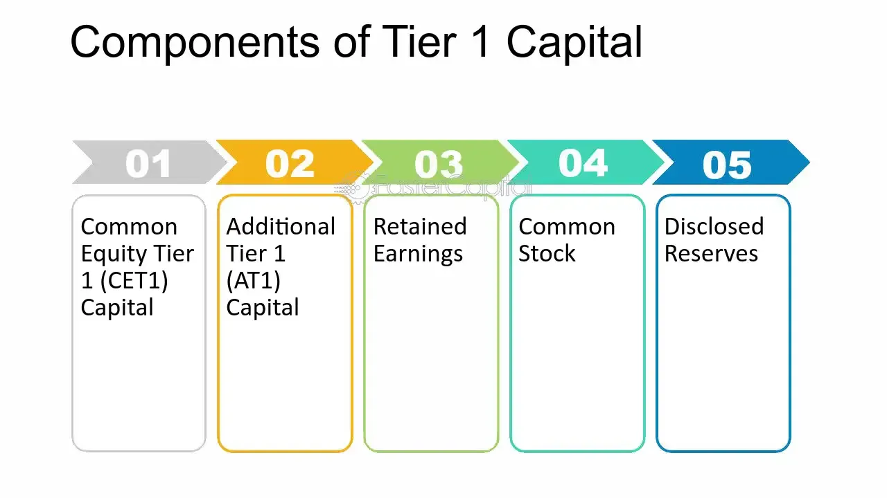

## Table of Contents

## What is Tier 1 capital?

Tier 1 capital is a key measure of a bank's financial strength. It includes the core capital that a bank holds, which is made up of things like common stock, retained earnings, and certain types of preferred stock. This capital is important because it helps banks absorb losses without failing. Regulators look at Tier 1 capital to make sure banks are strong enough to handle tough times.

In simple terms, think of Tier 1 capital as the money a bank has that it can use to keep running if things go wrong. It's like the bank's safety net. The more Tier 1 capital a bank has, the safer it is considered to be. This is why banks and regulators pay close attention to it.

## What is Tier 2 capital?

Tier 2 capital is another layer of a bank's financial strength, but it's considered less secure than Tier 1 capital. It includes items like revaluation reserves, undisclosed reserves, and subordinated term debt. These are funds that can help a bank absorb losses if it gets into trouble, but they are not as reliable or permanent as Tier 1 capital.

Think of Tier 2 capital as a backup safety net. While Tier 1 capital is the main protection, Tier 2 capital provides extra support. Regulators use both Tier 1 and Tier 2 capital to assess how well a bank can handle financial stress, but they focus more on Tier 1 because it's the stronger of the two.

## What are the main components of Tier 1 capital?

Tier 1 capital is made up of the most important parts of a bank's money. The main part is common stock, which is the money people pay to own a piece of the bank. Another big part is retained earnings, which is the money the bank has made over time and kept instead of giving it back to shareholders. Sometimes, certain types of preferred stock can also be included in Tier 1 capital. These are special shares that give owners a fixed dividend.

These parts of Tier 1 capital are important because they are the strongest and most reliable money a bank has. They help the bank stay strong even if it loses money. Regulators like to see a lot of Tier 1 capital because it shows that the bank can handle tough times without failing. It's like the bank's main safety net, making sure it can keep going no matter what happens.

## What are the main components of Tier 2 capital?

Tier 2 capital is the extra money a bank has that helps it stay safe if things go wrong. It includes things like revaluation reserves, which is money from revaluing assets like buildings or land. Another part is undisclosed reserves, which are profits the bank has made but hasn't told anyone about yet. There's also something called subordinated term debt, which is money the bank borrows but has to pay back after other debts if it goes bankrupt.

These parts of Tier 2 capital are not as strong as Tier 1 capital, but they still help the bank. They act like a backup safety net, giving the bank more money to use if it runs into trouble. Regulators look at both Tier 1 and Tier 2 capital to see how safe a bank is, but they focus more on Tier 1 because it's the most reliable. Tier 2 capital is important, but it's more like a second line of defense for the bank.

## How does Tier 1 capital contribute to a bank's financial stability?

Tier 1 capital is like a bank's main safety net. It's made up of things like common stock, which is money people pay to own part of the bank, and retained earnings, which is money the bank has made and kept over time. These are the strongest parts of a bank's money because they can help the bank keep going even if it loses money. When a bank has a lot of Tier 1 capital, it means it has a big cushion to fall back on if things go wrong. This makes the bank more stable and less likely to fail.

Regulators, who are like the people in charge of making sure banks are safe, pay a lot of attention to Tier 1 capital. They want to see that banks have enough of it to handle tough times. If a bank has a lot of Tier 1 capital, it shows that it can take a hit and still keep running. This is important because it helps keep the whole financial system stable. So, Tier 1 capital is a big part of making sure banks are strong and safe.

## How does Tier 2 capital support a bank's operations?

Tier 2 capital acts as a backup safety net for a bank. It includes things like revaluation reserves, which is money from revaluing assets like buildings, and undisclosed reserves, which are profits the bank hasn't told anyone about yet. There's also subordinated term debt, which is money the bank borrows but has to pay back after other debts if it goes bankrupt. These parts of Tier 2 capital help the bank by giving it extra money to use if it runs into trouble.

While Tier 2 capital isn't as strong as Tier 1 capital, it still plays an important role. It helps the bank absorb losses if things go wrong, but it's not as reliable or permanent as Tier 1 capital. Regulators look at both Tier 1 and Tier 2 capital to see how safe a bank is, but they focus more on Tier 1 because it's the most reliable. Tier 2 capital is like a second line of defense, helping to support the bank's operations by providing additional financial support when needed.

## What are the differences between Tier 1 and Tier 2 capital in terms of quality?

Tier 1 capital is like the strongest and most reliable money a bank has. It includes things like common stock, which is money people pay to own a piece of the bank, and retained earnings, which is money the bank has made over time and kept. This kind of money is very important because it helps the bank stay strong even if it loses money. Regulators, who make sure banks are safe, look at Tier 1 capital to see if the bank can handle tough times. It's like the bank's main safety net, making sure it can keep going no matter what happens.

Tier 2 capital, on the other hand, is like a backup safety net. It includes things like revaluation reserves, which is money from revaluing assets like buildings, and undisclosed reserves, which are profits the bank hasn't told anyone about yet. There's also something called subordinated term debt, which is money the bank borrows but has to pay back after other debts if it goes bankrupt. While Tier 2 capital can help the bank if it runs into trouble, it's not as strong or reliable as Tier 1 capital. Regulators still look at Tier 2 capital, but they focus more on Tier 1 because it's the most important for the bank's safety.

## How do regulatory requirements for Tier 1 and Tier 2 capital differ?

Regulatory requirements for Tier 1 capital are stricter because it's the most important money a bank has. Regulators want banks to have a lot of Tier 1 capital to make sure they can handle tough times. They set rules that say banks need to keep a certain amount of Tier 1 capital compared to their risky assets. This is called the Tier 1 capital ratio. If a bank doesn't have enough Tier 1 capital, regulators might make them get more or stop them from doing certain things until they do.

For Tier 2 capital, the rules are a bit less strict. Tier 2 capital is like a backup safety net, so regulators don't focus on it as much as Tier 1 capital. They still want banks to have some Tier 2 capital, but it's not as important for the bank's safety. Regulators might let banks count some of their Tier 2 capital towards their total capital requirements, but it can't be more than a certain amount. This makes sure that banks rely more on the stronger Tier 1 capital to stay safe.

## Can you explain how Tier 1 and Tier 2 capital are used in calculating a bank's capital adequacy ratio?

The capital adequacy ratio is a way to check if a bank has enough money to stay safe. It's like a score that shows how strong a bank is. To find this score, you look at the bank's Tier 1 and Tier 2 capital and compare it to the bank's risky assets. Tier 1 capital, which is the strongest and most reliable money a bank has, is the most important part of this score. It includes things like common stock and retained earnings. Regulators want to see a lot of Tier 1 capital because it means the bank can handle tough times without failing.

Tier 2 capital is like a backup safety net. It includes things like revaluation reserves and subordinated term debt. While it's not as strong as Tier 1 capital, it still helps the bank if it runs into trouble. When calculating the capital adequacy ratio, both Tier 1 and Tier 2 capital are added together, but there's a limit on how much Tier 2 capital can be used. Regulators want banks to rely more on Tier 1 capital because it's the most important for keeping the bank safe. So, the capital adequacy ratio is a way to make sure banks have enough strong money to handle any problems that come up.

## What impact do Tier 1 and Tier 2 capital have on a bank's risk management strategies?

Tier 1 capital is like the strongest money a bank has, and it plays a big role in how a bank manages risk. Because Tier 1 capital includes things like common stock and retained earnings, it's the money that helps the bank stay strong even if it loses money. Banks know that regulators want them to have a lot of Tier 1 capital, so they focus on keeping it high. This means they might be more careful about the risks they take, like lending money to risky businesses or investing in things that could lose value. By having a lot of Tier 1 capital, banks can handle tough times better and make sure they don't fail.

Tier 2 capital is like a backup safety net, and it also affects how banks manage risk. While it's not as strong as Tier 1 capital, it still helps the bank if things go wrong. Tier 2 capital includes things like revaluation reserves and subordinated term debt. Banks use Tier 2 capital to add an extra layer of protection, but they know it's not as reliable as Tier 1 capital. So, they might use Tier 2 capital to take on some risks that they wouldn't with just Tier 1 capital, but they still have to be careful. By balancing both Tier 1 and Tier 2 capital, banks can manage their risks better and make sure they stay safe.

## How have the definitions and requirements for Tier 1 and Tier 2 capital evolved under Basel III?

Under Basel III, the rules for Tier 1 and Tier 2 capital got stricter to make banks safer. Tier 1 capital is now more important than ever. It includes common stock and retained earnings, which are the strongest and most reliable money a bank has. Basel III says banks need to have more Tier 1 capital than before. They also added a new rule called the "Common Equity Tier 1" (CET1) ratio, which looks at just the common stock and retained earnings part of Tier 1 capital. This makes sure banks have a lot of the strongest money to handle tough times.

Tier 2 capital also changed under Basel III, but it's still seen as less important than Tier 1 capital. Tier 2 capital includes things like revaluation reserves and subordinated term debt, which help the bank if it runs into trouble. But Basel III set limits on how much Tier 2 capital banks can use. They can't use more than half of their total capital from Tier 2. This means banks have to focus more on having strong Tier 1 capital to stay safe. The new rules make sure banks have a good balance of both types of capital, but with a big focus on the stronger Tier 1 capital.

## What are the strategic implications for banks in managing their Tier 1 and Tier 2 capital levels?

Managing Tier 1 and Tier 2 capital is really important for banks because it helps them stay strong and safe. Tier 1 capital is like the bank's main safety net, made up of things like common stock and retained earnings. Banks need to keep a lot of Tier 1 capital to make sure they can handle tough times without failing. If a bank doesn't have enough Tier 1 capital, regulators might make them get more or stop them from doing certain things until they do. So, banks might be more careful about the risks they take, like lending money to risky businesses or investing in things that could lose value. By having a lot of Tier 1 capital, banks can make sure they stay safe and strong.

Tier 2 capital is like a backup safety net for banks, and it also affects how they manage their money. It includes things like revaluation reserves and subordinated term debt, which can help the bank if things go wrong. But Tier 2 capital isn't as strong as Tier 1 capital, so banks can't rely on it as much. They might use Tier 2 capital to take on some risks that they wouldn't with just Tier 1 capital, but they still have to be careful. By balancing both Tier 1 and Tier 2 capital, banks can manage their risks better and make sure they stay safe. The key is to have a good mix of both, but with a big focus on the stronger Tier 1 capital.

## What are Banking Capital Requirements?

Banking capital requirements are essential regulations that ensure banks maintain adequate capital to absorb losses and protect depositors. These requirements serve as a buffer against financial distress and help promote overall stability within the financial system. By enforcing these standards, regulators aim to prevent bank failures, which can have widespread economic repercussions.

A key component of these regulations is the Basel III framework, a global initiative developed by the Basel Committee on Banking Supervision. Basel III was introduced in response to the deficiencies revealed by the 2007-2008 financial crisis and emphasizes the need for banks to hold higher levels of Tier 1 capital. Tier 1 capital, considered the most secure form of capital, consists of common equity and retained earnings. By prioritizing Tier 1 capital, Basel III enhances the financial resilience and solvency of banks.

Compliance with Basel III and other regulatory frameworks is vital for banks to maintain their operational licenses and instill market confidence. Banks are obligated to regularly evaluate their capital structures to ensure alignment with these evolving standards. This continuous assessment process involves stress testing and scenario analysis to determine capital adequacy in varying economic conditions.

The implementation of these capital requirements involves a meticulous calculation of risk-weighted assets (RWA) and the capital required to cover them. The capital adequacy ratio (CAR), expressed as:

$$
\text{CAR} = \frac{\text{Tier 1 Capital + Tier 2 Capital}}{\text{Risk-Weighted Assets}}
$$

must meet a minimum threshold as outlined by regulatory authorities. A higher CAR indicates a more robust capital position, capable of withstanding financial shocks.

Banks' adherence to capital requirements is scrutinized by regulatory bodies, which impose strict penalties for non-compliance. This regulatory oversight ensures that banks engage in sound risk management practices and remain prepared to face potential financial adversities. By upholding these standards, banking institutions support their long-term sustainability and safeguard systemic stability.

## References & Further Reading

[1]: ["Basel III: A global regulatory framework for more resilient banks and banking systems"](https://www.bis.org/publ/bcbs189.htm) — Bank for International Settlements

[2]: ["Algorithmic Trading and DMA: An Introduction to Direct Access Trading Strategies"](https://www.amazon.com/Algorithmic-Trading-DMA-introduction-strategies/dp/0956399207) by Barry Johnson

[3]: ["Capital Requirements for Banks: A Theoretical and Empirical Examination"](https://www.sciencedirect.com/science/article/pii/S1572308920300711) — Journal of Banking Regulation

[4]: Hull, J. C. (2018). ["Risk Management and Financial Institutions"](https://books.google.com/books/about/Risk_Management_and_Financial_Institutio.html?id=1J1QDwAAQBAJ) — Wiley Finance

[5]: ["The Handbook of International Financial Terms"](https://www.oxfordreference.com/abstract/10.1093/acref/9780198294818.001.0001/acref-9780198294818) by Peter Moles and Nicholas Terry