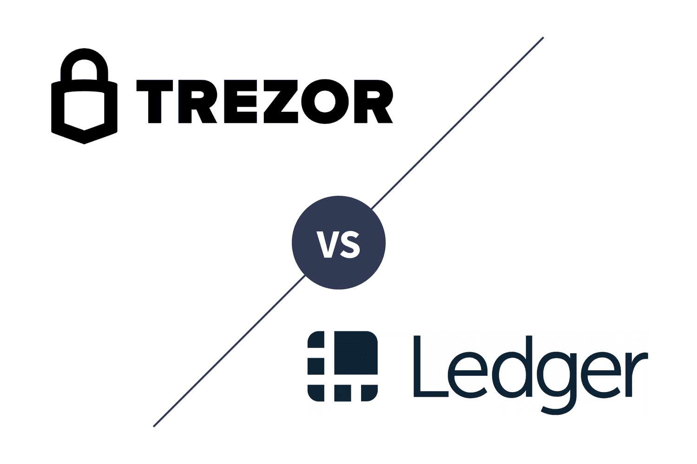

Cryptocurrency trading has emerged as a transformative force in the global financial ecosystem, reshaping investment paradigms and introducing novel trading techniques. This landscape is heavily intertwined with digital security measures, given the decentralized and often anonymous nature of cryptocurrencies. As digital assets grow in popularity, secure storage solutions have become paramount to protect against theft and unauthorized access.

The evolution of crypto storage solutions is marked by advancements in security technologies and shifts in user preferences from online wallets to more secure alternatives. Traditional software wallets, although convenient for quick transactions, often fall short in fortifying assets against security breaches. This has led to a surge in the adoption of hardware wallets, which offer enhanced security by storing private keys offline, away from potential cyber threats.



Simultaneously, the advent of algorithmic trading has revolutionized the way cryptocurrency markets operate. Algorithmic trading facilitates transactions using automated and pre-programmed trading instructions accounting for variables like time, price, and volume. This method offers traders increased precision, speed, and efficiency, minimizing human error and maximizing potential profits. The growing complexity and speed of digital asset markets underscore the importance of coupling algorithmic trading with robust security measures.

In cryptocurrency trading, secure storage solutions are not only necessary but indispensable. The reliance on internet connectivity and digital platforms makes traders vulnerable to hacks and scams. A secure storage system acts as the first line of defense, ensuring that digital assets remain under the user's control even when trading bots and algorithms execute trades. Hence, prioritizing security measures allows traders to leverage innovative trading strategies with reduced risk.

Overall, the intersection of cryptocurrency security and trading techniques presents both challenges and opportunities. As the market continues to evolve, traders must balance the innovation of trading methodologies with the critical need for secure storage to protect their investments effectively.

## Table of Contents

## Understanding Hardware Wallets

Hardware wallets are physical devices designed to provide secure storage solutions for cryptocurrencies. They play a crucial role in cryptocurrency storage by safeguarding private keys, which are essential for authorizing transactions on the blockchain. Unlike software wallets, which store keys on potentially vulnerable devices such as computers or smartphones, hardware wallets isolate private keys within the device, reducing exposure to online threats.

A key advantage of hardware wallets over software wallets is enhanced security. Hardware wallets employ several security measures to protect private keys, including encryption, secure PINs, and in some cases, biometric access. These devices operate in a manner that ensures private keys never leave the hardware wallet, thus mitigating risks associated with malware, phishing, and hacking attempts that commonly target software wallets.

Among the prominent brands offering hardware wallets, Trezor and Ledger stand out due to their widespread use and trusted reputation in the [cryptocurrency](/wiki/cryptocurrency) community. Trezor, developed by SatoshiLabs, is renowned for its open-source firmware, allowing for community verification and enhancements. Features such as Shamir Backup provide an additional layer of security, enabling users to split and store recovery keys in multiple places, reducing the risk of loss or theft.

Ledger, on the other hand, is recognized for integrating a secure element chip, which enhances physical security and protects sensitive information stored on the device. Its mobile app integration allows users to manage their assets and transactions seamlessly across different platforms. Ledger's proprietary technology balances security and user convenience by providing an intuitive interface for both beginners and advanced users.

While Trezor emphasizes transparency through open-source models, Ledger focuses on fortified security with proprietary elements. In summary, each brand offers distinct security features tailored to different user preferences, yet both provide a robust alternative to software wallets, underscoring the pivotal role of hardware wallets in safeguarding digital assets.

## Trezor vs Ledger: A Comparative Analysis

### Trezor vs Ledger: A Comparative Analysis

#### Trezor Hardware Wallets

Trezor hardware wallets are renowned for their stringent security measures and user-friendly experience. One of the primary advantages of Trezor wallets is their use of open-source firmware, which allows for transparency and collective scrutiny by the developer community. This can lead to more rapid identification and correction of potential vulnerabilities, fostering trust in the security of the wallets.

A standout feature of Trezor is the Shamir Backup, a method based on Shamir's Secret Sharing Scheme, which provides an advanced security layer for backing up private keys. This feature allows users to split their backup seed into multiple shares, requiring a subset of these shares for recovery. This process is mathematically represented by the formula:

$$
(k, n)
$$

where $n$ is the total number of shares and $k$ is the minimum number of shares required to reconstruct the seed.

#### Ledger Hardware Wallets

Ledger hardware wallets are distinguished by their incorporation of a Secure Element (SE) chip, which is a specialized hardware component designed to withstand a variety of attacks. The SE chip plays a crucial role in safeguarding the private keys stored within the wallet by ensuring that sensitive data is isolated from external threats.

Additionally, Ledger offers robust mobile app integration through its Ledger Live application. This app allows users to manage their crypto assets conveniently from their mobile devices, providing real-time updates and the ability to execute transactions securely.

#### Key Differences

Security is a major point of differentiation between Trezor and Ledger. While Trezor focuses on open-source adaptability, Ledger emphasizes the protection offered by its proprietary Secure Element technology. This distinction affects user perception and trust, as some users prefer the openness of Trezor's approach, while others place more trust in the hardware-based security of Ledger.

Currency support is another consideration. Both brands offer extensive support for a wide range of cryptocurrencies. However, Ledger typically supports more currencies, which can be a decisive [factor](/wiki/factor-investing) for those dealing with diverse crypto portfolios.

Price is often a deciding factor for potential buyers. Trezor's models, such as the Trezor One, tend to be more economical compared to Ledger's offering, such as the Ledger Nano X, which includes additional functionalities like Bluetooth connectivity for seamless integration with mobile devices.

User experience varies significantly between the two brands. Trezor is often praised for its simplicity and straightforward interface, making it an appealing choice for beginners. Ledger, on the other hand, provides advanced features and customization options that cater to more experienced users seeking greater control over their crypto management.

## Security Aspects in Hardware Wallets

Hardware wallets are crucial devices in the world of cryptocurrency, as they provide robust security measures that protect users' digital assets. A core feature of these wallets is the protection of private keys, which are stored offline within the wallet itself, thus reducing exposure to online threats such as hacking and malware. When a transaction is made, the wallet signs it internally using the private key and then transmits the signed transaction to the blockchain network, ensuring that the private keys never leave the device.

### Open-source vs. Proprietary Security Models

One critical aspect of hardware wallet security is the choice between open-source and proprietary security models. Open-source security models, as employed by Trezor, allow public access to the source code. This transparency enables the broader community to scrutinize the code for vulnerabilities, providing an additional layer of verification that can enhance security. However, open-source models require users to trust that the community continuously reviews and updates the code to mitigate new threats.

In contrast, proprietary security models, as seen in Ledger hardware wallets, involve closed-source firmware. These models often incorporate secure element chips, which are designed to thwart physical attacks and unauthorized access. Proprietary approaches can offer a more controlled environment where updates and security patches are managed centrally by the company. The primary concern with proprietary models is the reliance on the company to perform thorough testing and timely updates to address potential vulnerabilities.

### Notable Security Breaches and Concerns

While hardware wallets are generally secure, there have been instances of security breaches and user concerns that highlight the importance of vigilance. For example, Trezor devices have faced threats like phishing attacks where adversaries attempt to trick users into divulging their recovery seed phrases. Additionally, Ledger experienced a significant data breach in 2020 where customer data such as email addresses and contact information was leaked, increasing users' exposure to phishing attempts.

Both Trezor and Ledger have taken steps to address such issues by improving their security protocols and providing guidelines to users on recognizing potential threats. Nevertheless, these incidents underscore the necessity for continuous enhancement of security features and user education.

In summary, while hardware wallets offer robust security for cryptocurrency storage, differences between open-source and proprietary models present distinct advantages and challenges. Users must stay informed about potential security risks and adhere to best practices to safeguard their digital assets effectively.

## Algo Trading: An Introduction

Algorithmic trading, frequently referred to as algo trading, involves using computer algorithms to automatically make trading decisions, submit orders, and manage portfolios. In cryptocurrencies, this method utilizes the [volatility](/wiki/volatility-trading-strategies) and round-the-clock nature of the crypto markets. Algo trading involves pre-programmed instructions accounting for variables such as timing, price, and [volume](/wiki/volume-trading-strategy), enabling quick and efficient trading without the need for continuous human intervention.

One significant advantage of [algorithmic trading](/wiki/algorithmic-trading) in cryptocurrencies is precision. Algorithms can execute trades with high accuracy by following a set of predefined rules, which minimizes the risks associated with emotional or impulsive decision-making. Speed is another critical benefit, as algorithms can analyze markets and execute trades in milliseconds, far outperforming human capabilities. This rapid analysis and execution capability is crucial in the highly volatile crypto markets, where prices can fluctuate dramatically in a short time.

Typical tools and platforms used in crypto algo trading include a combination of software, APIs, and trading platforms. Language-specific libraries such as Python's `ccxt` are widely used to connect trading algorithms with various exchanges' APIs, allowing for retrieving market data and submitting orders programmatically. Platforms like MetaTrader and TradingView offer functionalities to develop and backtest trading strategies.

Python, due to its simplicity and extensive libraries, is a preferred language for developing crypto trading algorithms. A basic structure of an algorithm for crypto trading might involve fetching the latest cryptocurrency prices, analyzing price patterns or indicators, and placing buy or sell orders based on this analysis. Here is a basic Python example using pseudocode:

```python
import ccxt

# Initialize exchange
exchange = ccxt.binance({
    'apiKey': 'YOUR_API_KEY',
    'secret': 'YOUR_SECRET_KEY'
})

# Fetch current market data
order_book = exchange.fetch_order_book('BTC/USDT')

# Define a simple strategy (e.g., price crossing a certain threshold)
threshold_price = 40000
current_price = order_book['bids'][0][0]

# Execute trade based on strategy
if current_price > threshold_price:
    # Place a buy order
    exchange.create_market_buy_order('BTC/USDT', 1)
```

This pseudo-code is a simplified version of how real-world algorithms can operate, typically incorporating risk management strategies and complex decision-making mechanisms. Overall, algorithmic trading offers a powerful approach to navigating the dynamic and often unpredictable world of cryptocurrency, providing traders with the tools to optimize their strategies and potentially enhance returns while managing risks.

## The Role of Hardware Wallets in Algo Trading

In algorithmic trading, the security of digital assets becomes crucial, given the automation and speed at which transactions occur. Hardware wallets are integral to this setup because they provide a secure way to store private keys, which are essential for authenticating transactions made by trading bots and algorithms. Unlike software wallets, which are susceptible to online attacks and malware, hardware wallets store private keys offline, mitigating the risk of unauthorized access.

Integration between hardware wallets and trading platforms is critical for traders who use algorithms. This integration typically involves connecting a hardware wallet to a trading platform via APIs. APIs allow secure communication and transaction signing without exposing private keys. For instance, a trading bot can send transaction data to the hardware wallet, which then signs the transaction and returns the signed data to the bot for execution. This process ensures that private keys remain secure within the hardware wallet and never leave the device.

Despite the inherent security of hardware wallets, there are still risks involved. A primary concern is the potential physical theft of the wallet. To counter this, users can implement additional security measures such as PIN protection and passphrase encryption. Another risk involves the compromise of APIs used in integration, which could lead to transaction data manipulation. Traders must ensure that both their hardware wallets and APIs are up-to-date with the latest security patches to prevent such vulnerabilities.

Furthermore, users should be aware of phishing attacks, where attackers trick users into revealing their wallet credentials. It is important to use trusted sources for wallet connections and verify the authenticity of the trading platforms integrated with their wallets. By understanding and addressing these risks, traders can secure their algorithmic trading operations, ensuring both performance and safety in the volatile cryptocurrency market.

## Conclusion

In the rapidly evolving world of cryptocurrencies, ensuring the security of digital assets remains a critical priority for investors and traders. Selecting the appropriate hardware wallet is paramount as it provides an essential layer of security by storing private keys offline, significantly reducing vulnerability to cyber threats. With top brands like Trezor and Ledger offering diverse features that cater to different needs, users can find solutions that align with their security preferences and usability requirements.

Algorithmic trading presents substantial potential for enhancing trading strategies through automation, allowing for increased precision and execution speed. By leveraging algorithms, traders can capitalize on market fluctuations more effectively, yet integrating these strategies with secure storage solutions ensures that digital assets remain safe from unauthorized access. This intersection of technology and security highlights the necessity for robust systems that not only meet trading demands but also protect against potential breaches.

Investors are encouraged to adopt a comprehensive perspective by balancing both security measures and trading efficiency. As the digital currency landscape continues to evolve, making informed decisions concerning the safeguarding of cryptocurrencies and the strategies employed in trading can lead to more secure and profitable investment outcomes. By considering both these facets, individuals can optimize their engagement in the cryptocurrency market, fostering an environment where innovative trading techniques and robust security models coexist effectively.

## References & Further Reading

[1]: Antonopoulos, A. M. (2017). ["Mastering Bitcoin: Unlocking Digital Cryptocurrencies"](https://books.google.com/books/about/Mastering_Bitcoin.html?id=IXmrBQAAQBAJ). O'Reilly Media.

[2]: Greenberg, A. (2020). ["Ledger Breach: Personal Data of a Million Cryptocurrency Users Exposed"](https://cryptobriefing.com/ledger-breach-clients-data-leaked/). WIRED.

[3]: Nakamoto, S. (2008). ["Bitcoin: A Peer-to-Peer Electronic Cash System"](https://nakamotoinstitute.org/library/bitcoin/).

[4]: Petrosyan, A. (2021). ["How to Secure Your Cryptocurrency: The Basics of Safeguarding Your Digital Assets"](https://www.coingecko.com/learn/master-guide-to-crypto-security). Forbes.

[5]: Sato, T. (2020). ["Cryptocurrency Security: A Comprehensive Overview"](https://link.springer.com/article/10.1007/s10614-020-10050-0). Semantic Scholar.

[6]: Vigna, P., & Casey, M. J. (2016). ["The Age of Cryptocurrency: How Bitcoin and Digital Money Are Challenging the Global Economic Order"](https://dl.acm.org/doi/10.5555/2717097) St. Martin's Press.